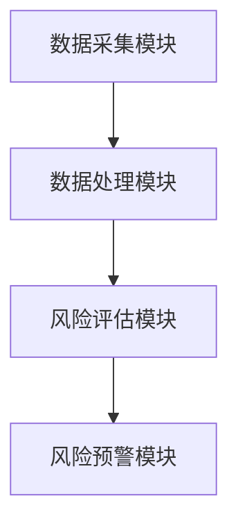
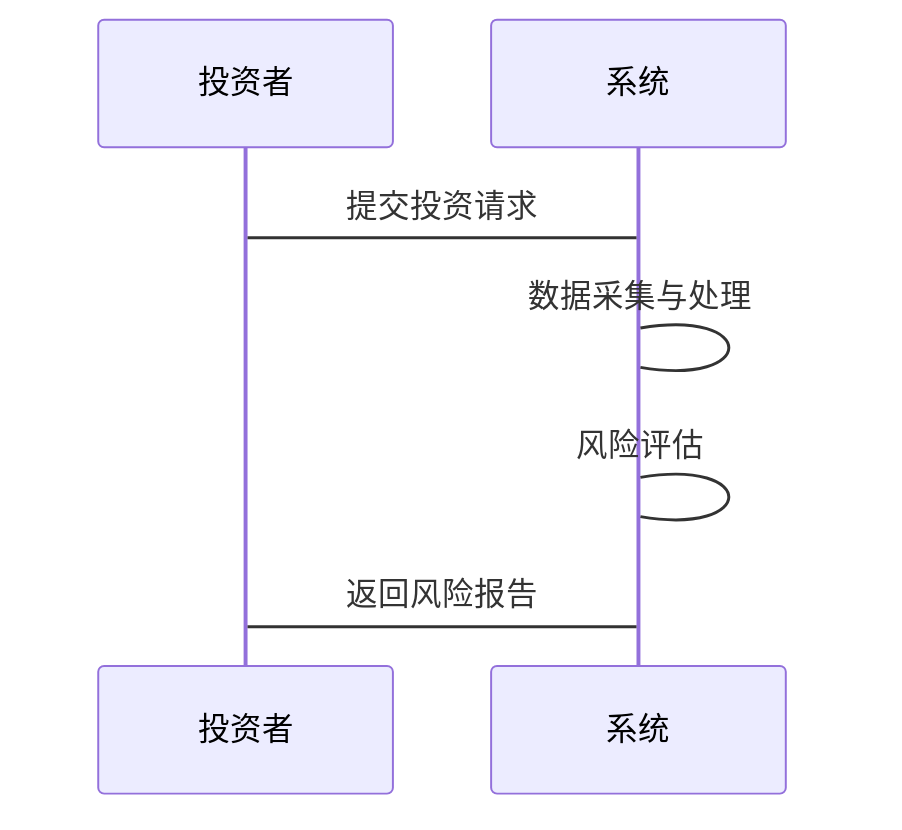

                 


---

# 特价股票投资中的地缘政治风险评估

## 关键词：特价股票投资，地缘政治风险，风险评估，股票价格，投资策略

## 摘要：  
本文深入探讨了在特价股票投资中如何有效评估和管理地缘政治风险。通过分析地缘政治风险的定义、特征及其对股票市场的影响，本文构建了一个基于历史数据和数学模型的风险评估框架，并提出了具体的算法和系统架构设计方案。同时，结合实际案例，本文详细阐述了如何通过量化分析和预警机制优化投资决策，帮助投资者在复杂多变的地缘政治环境中降低风险，实现稳健投资回报。

---

## 第一部分：特价股票投资中的地缘政治风险评估背景与基础

### 第1章：特价股票投资与地缘政治风险概述

#### 1.1 特价股票投资的定义与特点
##### 1.1.1 特价股票的定义
特价股票是指在特定市场条件下，由于市场波动、公司基本面变化或其他外部因素，股票价格低于其内在价值的股票。这类股票通常被认为具有较高的投资潜力，因为其价格可能被市场低估。

##### 1.1.2 特价股票投资的核心特点
- 价格低估：股票价格显著低于其内在价值。
- 市场波动性：通常出现在市场低迷或不确定时期。
- 高风险高回报：投资回报可能较高，但也伴随着较高的市场风险。

##### 1.1.3 特价股票投资的市场定位
特价股票通常出现在中小盘股或周期性行业中，投资者需要具备较高的市场敏感性和分析能力。

#### 1.2 地缘政治风险的定义与特征
##### 1.2.1 地缘政治风险的定义
地缘政治风险是指由于政治冲突、国际关系紧张、政策变化等外部因素，可能导致企业或地区的经济活动受到负面影响的风险。

##### 1.2.2 地缘政治风险的核心特征
- 不确定性：风险的发生往往具有突发性和不可预测性。
- 波动性：风险事件可能导致市场价格的剧烈波动。
- 影响范围广：地缘政治风险可能影响多个行业和市场。

##### 1.2.3 地缘政治风险的分类与影响
地缘政治风险可以分为国家层面（如战争、政变）和区域层面（如贸易摩擦、制裁）。这些风险可能直接影响企业的运营成本、市场准入和利润。

#### 1.3 特价股票投资中的地缘政治风险关联性
##### 1.3.1 地缘政治事件对股市的影响
地缘政治事件可能导致市场恐慌，引发投资者抛售资产，进而导致股价下跌。

##### 1.3.2 特价股票投资与地缘政治风险的互动关系
在地缘政治风险加剧时，投资者可能寻找低估的股票进行抄底，从而推动股价回升。

##### 1.3.3 地缘政治风险在股票投资中的重要性
地缘政治风险是影响股票价格的重要因素之一，尤其是在全球化的市场中，投资者需要密切关注相关风险。

#### 1.4 本章小结
本章介绍了特价股票投资和地缘政治风险的基本概念，并分析了两者之间的关联性。地缘政治风险可能影响投资者的决策，因此在投资策略中需要考虑这一因素。

---

## 第2章：地缘政治风险评估的核心概念与理论基础

### 2.1 地缘政治风险评估的基本原理
#### 2.1.1 风险评估的基本概念
风险评估是指通过分析潜在风险事件的可能性和影响程度，对其可能带来的损失进行量化的过程。

#### 2.1.2 地缘政治风险的评估框架
- 风险识别：识别可能的地缘政治事件。
- 风险量化：评估事件发生的概率和影响程度。
- 风险管理：制定应对策略以降低风险影响。

#### 2.1.3 风险评估的数学模型基础
地缘政治风险评估通常采用概率论和统计学模型。例如，风险概率计算公式如下：

$$ P = \frac{\text{历史发生次数}}{\text{总样本数}} $$

### 2.2 地缘政治风险的关键要素
#### 2.2.1 政治稳定性分析
政治稳定性差的国家或地区更容易发生地缘政治风险事件。

#### 2.2.2 经济依赖性评估
经济高度依赖某一外部力量的国家可能面临更大的地缘政治风险。

#### 2.2.3 地缘战略位置分析
地理位置重要的地区更容易成为地缘政治冲突的焦点。

### 2.3 地缘政治风险与股票投资的关系
#### 2.3.1 地缘政治风险对股票价格的影响机制
地缘政治事件可能导致投资者情绪波动，进而影响股票价格。

#### 2.3.2 特价股票投资中的地缘政治风险溢价
投资者在考虑地缘政治风险时，可能会要求更高的回报率，从而影响股票价格。

#### 2.3.3 地缘政治风险的可量化性
通过历史数据分析和数学模型，地缘政治风险可以被部分量化，从而为投资决策提供依据。

### 2.4 本章小结
本章探讨了地缘政治风险评估的核心概念和理论基础，强调了量化分析的重要性。

---

## 第3章：地缘政治风险评估的数学模型与算法原理

### 3.1 风险评估的基本数学模型
#### 3.1.1 风险概率计算公式
$$ P = \frac{\text{历史发生次数}}{\text{总样本数}} $$

#### 3.1.2 风险影响程度评估公式
$$ I = \text{资产价值} \times \text{风险敞口} $$

#### 3.1.3 风险综合评估模型
$$ R = P \times I $$

### 3.2 地缘政治风险的量化方法
#### 3.2.1 风险评分体系的构建
- 风险评分由多个指标组成，如政治稳定性、经济依赖性等。

#### 3.2.2 风险指数的计算方法
$$ \text{风险指数} = \sum (\text{权重} \times \text{指标值}) $$

#### 3.2.3 风险矩阵的构建与应用
风险矩阵用于分析不同风险事件的可能性和影响程度。

### 3.3 基于历史数据的地缘政治风险预测模型
#### 3.3.1 时间序列分析模型
时间序列分析用于预测未来风险事件的发生频率。

#### 3.3.2 马尔可夫链模型
马尔可夫链模型用于分析风险事件的转移概率。

#### 3.3.3 风险事件发生的概率预测
$$ P(t) = \alpha \times P(t-1) + \beta $$

### 3.4 算法实现与代码示例
#### 3.4.1 数据获取与预处理
使用历史地缘政治事件数据，清洗和归一化处理。

#### 3.4.2 风险评估模型的Python实现
```python
import pandas as pd
from sklearn.metrics import accuracy_score

# 数据加载与预处理
data = pd.read_csv('geopolitical_risk_data.csv')
X = data.drop('label', axis=1)
y = data['label']

# 模型训练
from sklearn.tree import DecisionTreeClassifier
model = DecisionTreeClassifier()
model.fit(X, y)

# 模型预测
predictions = model.predict(X)
print('准确率:', accuracy_score(y, predictions))
```

#### 3.4.3 模型验证与优化
通过交叉验证和网格搜索优化模型参数，提高预测准确率。

### 3.5 本章小结
本章详细介绍了地缘政治风险评估的数学模型和算法原理，展示了如何通过Python代码实现风险预测。

---

## 第4章：特价股票投资中的地缘政治风险数据采集与处理

### 4.1 数据来源与采集方法
#### 4.1.1 历史地缘政治事件数据库
使用公开的历史事件数据，如战争、制裁等。

#### 4.1.2 股票市场数据的获取
从金融数据供应商获取历史股价数据。

#### 4.1.3 数据清洗与预处理
去除缺失值、异常值，标准化数据格式。

### 4.2 地缘政治风险数据的特征提取
#### 4.2.1 时间序列特征提取
提取事件发生的时间特征，分析其周期性。

#### 4.2.2 文本数据的情感分析
通过自然语言处理技术分析新闻标题的情感倾向。

#### 4.2.3 多源数据的融合与分析
将文本、时间序列和经济指标数据进行融合，提高风险评估的准确性。

### 4.3 数据分析与可视化
#### 4.3.1 数据可视化工具的选择
使用Matplotlib和Tableau进行数据可视化。

#### 4.3.2 风险事件的时间分布分析
绘制时间分布图，分析事件的周期性。

#### 4.3.3 风险与股票价格的相关性分析
计算相关系数，评估风险事件与股价波动的相关性。

### 4.4 本章小结
本章详细介绍了地缘政治风险数据的采集与处理方法，为后续分析提供了基础数据支持。

---

## 第5章：地缘政治风险评估的系统架构与实现

### 5.1 系统功能需求分析
#### 5.1.1 风险评估模块
实现风险事件的识别和概率计算。

#### 5.1.2 数据采集与处理模块
负责数据的获取、清洗和预处理。

#### 5.1.3 风险预警模块
根据风险评估结果，触发预警机制。

### 5.2 系统架构设计
#### 5.2.1 分层架构设计
- 数据层：存储原始数据。
- 业务逻辑层：实现数据处理和风险评估。
- 表现层：展示分析结果和预警信息。

#### 5.2.2 系统架构设计（Mermaid图）


#### 5.2.3 系统接口设计
定义RESTful API接口，实现数据传输和模块之间的通信。

#### 5.2.4 系统交互设计（Mermaid图）


### 5.3 本章小结
本章设计了一个完整的地缘政治风险评估系统架构，展示了如何通过模块化设计实现风险评估和预警。

---

## 第6章：项目实战与案例分析

### 6.1 项目背景与目标
以某次地缘政治事件为例，分析其对特定股票的影响。

### 6.2 系统核心实现
#### 6.2.1 环境安装与配置
安装Python、Pandas、Scikit-learn等工具。

#### 6.2.2 核心代码实现
实现数据处理、模型训练和风险评估的代码。

#### 6.2.3 代码解读与分析
详细解释代码的功能和实现逻辑。

### 6.3 实际案例分析
分析某次地缘政治事件对某只股票的影响，验证模型的有效性。

### 6.4 项目小结
总结项目实施过程中的经验与教训，提出改进建议。

---

## 第7章：总结与展望

### 7.1 总结
本章总结了全文的主要内容，强调了地缘政治风险评估在特价股票投资中的重要性。

### 7.2 投资建议
基于模型分析结果，提出具体的投资策略和风险防范建议。

### 7.3 未来展望
展望未来的研究方向，如人工智能在风险评估中的应用，以及多模型融合的可能性。

---

## 参考文献与拓展阅读
- [1] 《风险管理与投资策略》
- [2] 《地缘政治学入门》
- [3] 《股票市场数据分析与建模》

---

## 附录
- Python代码实现示例
- 数据处理与分析工具使用指南

---

通过以上结构，文章详细探讨了特价股票投资中的地缘政治风险评估问题，从理论到实践，为投资者提供了系统的分析方法和实用的工具支持。

