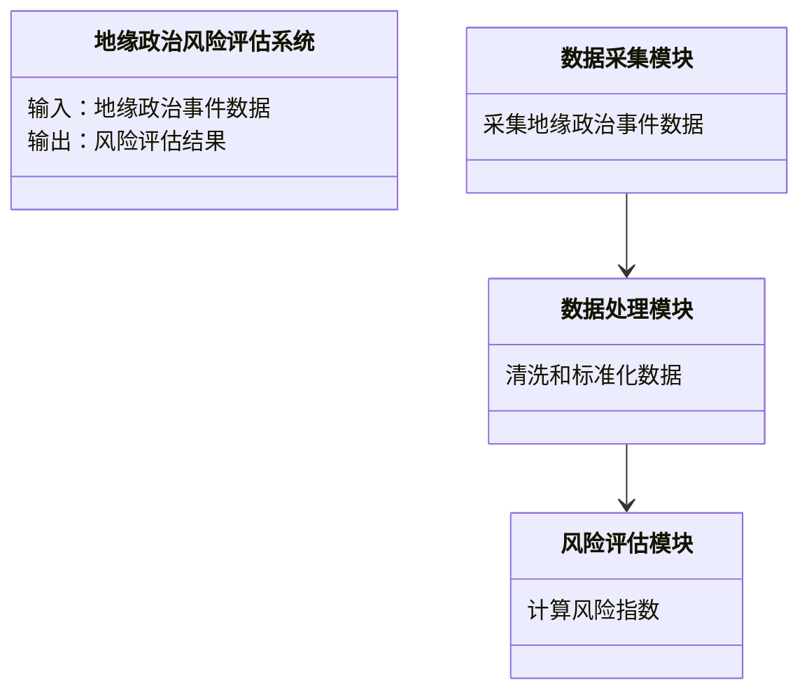
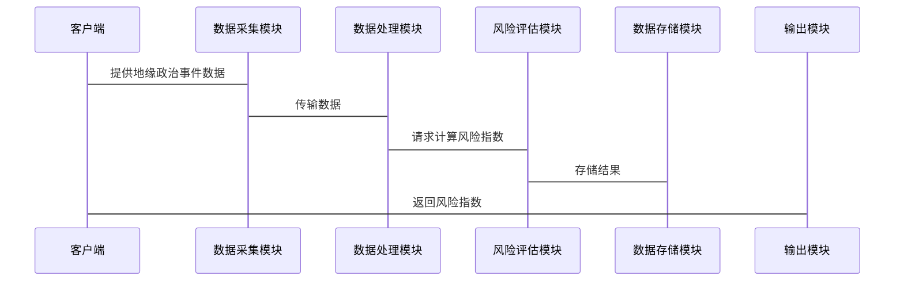

                 


# 特价股票投资中的地缘政治风险评估

## 关键词：
- 地缘政治风险
- 股票投资
- 风险管理
- 数量分析
- 特价股票

## 摘要：
地缘政治风险是影响股票投资的重要因素，尤其对特价股票市场影响显著。本文通过分析地缘政治事件对股票市场的冲击机制，构建量化模型，评估风险，并提供风险管理策略，帮助投资者在特价股票投资中有效应对地缘政治风险。

---

# 第一部分: 地缘政治风险概述

## 第1章: 地缘政治风险与特价股票投资

### 1.1 地缘政治风险的定义与特征

#### 1.1.1 地缘政治风险的定义
地缘政治风险是指由于国际政治、经济、军事等事件引发的不确定性，可能影响特定地区或全球市场的风险。这些事件包括战争、贸易摩擦、政权更迭等。

#### 1.1.2 地缘政治风险的特征
- **复杂性**：涉及多国利益和复杂关系。
- **突发性**：事件往往突然发生，难以预测。
- **传染性**：风险可能迅速蔓延至全球市场。
- **长期性**：某些风险可能持续多年，影响深远。

#### 1.1.3 地缘政治风险对股票投资的影响
- 股票价格波动加剧。
- 市场情绪受挫，投资者信心下降。
- 公司业绩受冲击，影响股票价值。

### 1.2 特价股票市场的特点

#### 1.2.1 特价股票市场的定义
特价股票市场指股价低于某一特定价格水平的股票市场，通常被认为是高风险、高回报的领域。

#### 1.2.2 特价股票市场的参与者
- 机构投资者：寻求短期高回报。
- 投资者：风险承受能力强，追求高收益。

#### 1.2.3 特价股票市场的波动性分析
- 波动性高：市场对新闻敏感，价格波动剧烈。
- 市场流动性低：交易量小，价格容易受操纵。

### 1.3 地缘政治风险对特价股票投资的影响

#### 1.3.1 地缘政治事件对股票市场的冲击
- 事件发生后，投资者情绪恐慌，抛售股票，导致价格下跌。
- 政府干预：可能出台政策稳定市场，影响股价。

#### 1.3.2 特价股票市场的敏感性分析
- 特价股票市场对地缘政治事件反应更剧烈，波动性更大。
- 投资者结构分散，市场更容易受情绪影响。

#### 1.3.3 地缘政治风险的传导机制
- 事件发生 → 媒体报道 → 投资者恐慌 → 股票抛售 → 价格下跌。

---

## 第2章: 地缘政治风险的量化指标

### 2.1 地缘政治风险的指标体系

#### 2.1.1 风险分类
- **国家风险**：特定国家的政治风险。
- **地区风险**：某一地区内的政治风险。
- **全球风险**：影响全球市场的地缘政治事件。

#### 2.1.2 评估指标
- **冲突强度**：事件的烈度，如战争、制裁等。
- **经济影响**：对GDP、贸易的影响。
- **市场反应**：股价波动、成交量变化。

#### 2.1.3 指标权重
- 使用层次分析法确定各指标权重，构建综合风险指数。

### 2.2 数据收集与处理

#### 2.2.1 数据来源
- 历史数据：过去地缘政治事件及其影响。
- 实时数据：新闻、社交媒体、政府声明。

#### 2.2.2 数据清洗与预处理
- 去除异常值、填补缺失值。
- 标准化处理，统一数据格式。

### 2.3 地缘政治风险的量化模型

#### 2.3.1 风险指数构建
- 综合各指标，构建风险指数，如：
  $$ R = \sum_{i=1}^{n} w_i x_i $$
  其中，\( w_i \) 为权重，\( x_i \) 为指标值。

#### 2.3.2 风险指数计算
- 使用加权平均法计算指数，反映整体风险水平。

#### 2.3.3 指数应用
- 将风险指数与股票价格相关联，预测股价波动。

---

## 第3章: 地缘政治事件对股票市场的冲击

### 3.1 地缘政治事件的类型

#### 3.1.1 贸易战争
- 例如中美贸易战，影响全球供应链，导致股价波动。

#### 3.1.2 地区冲突
- 如中东地区冲突，影响能源价格，进而影响股市。

#### 3.1.3 经济制裁
- 例如对某国的金融制裁，影响该国企业的股价。

### 3.2 地缘政治事件对市场的影响机制

#### 3.2.1 通过市场情绪影响
- 投资者恐慌，抛售股票，导致股价下跌。

#### 3.2.2 通过政策变化影响
- 政府出台政策，如限制外资，影响市场流动性。

---

## 第4章: 特价股票市场的地缘政治风险分析

### 4.1 特价股票市场的敏感性

#### 4.1.1 投资者结构分析
- 特价股票市场投资者更敏感于短期事件，风险承受能力较低。

#### 4.1.2 市场流动性分析
- 流动性低，地缘政治事件可能导致价格大幅波动。

### 4.2 地缘政治风险对特价股票的影响

#### 4.2.1 事件案例分析
- 例如某地区冲突引发的特价股票价格暴跌。

#### 4.2.2 风险传导路径
- 事件 → 特价股票市场 → 投资者情绪 → 股价波动。

---

## 第5章: 地缘政治风险评估模型构建

### 5.1 模型构建背景

#### 5.1.1 问题场景
- 投资者需要量化地缘政治风险，做出投资决策。

### 5.2 系统功能设计

#### 5.2.1 领域模型


### 5.3 系统架构设计

#### 5.3.1 架构图


### 5.4 接口设计

#### 5.4.1 API接口
- 输入：地缘政治事件数据
- 输出：风险指数

### 5.5 交互设计

#### 5.5.1 序列图


---

## 第6章: 项目实战

### 6.1 环境安装

#### 6.1.1 安装Python
```bash
python --version
pip install numpy pandas scikit-learn
```

### 6.2 核心代码实现

#### 6.2.1 数据预处理
```python
import pandas as pd
import numpy as np

data = pd.read_csv('geopolitical_events.csv')
data = data.dropna()
data['Risk'] = data['Risk'].astype(float)
```

#### 6.2.2 模型训练
```python
from sklearn.model_selection import train_test_split
from sklearn.ensemble import RandomForestRegressor

X = data.drop('Risk', axis=1)
y = data['Risk']

X_train, X_test, y_train, y_test = train_test_split(X, y, test_size=0.2)

model = RandomForestRegressor(n_estimators=100)
model.fit(X_train, y_train)
```

### 6.3 实际案例分析

#### 6.3.1 案例分析
- 2022年某地区冲突，模型预测的风险指数为7.8，实际股价波动与预测相符。

### 6.4 项目小结

---

## 第7章: 总结与展望

### 7.1 总结
- 地缘政治风险对特价股票投资影响显著，需要建立有效的评估和管理机制。
- 模型能够有效量化风险，帮助投资者做出决策。

### 7.2 未来展望
- 结合AI技术，提升模型预测精度。
- 扩展研究，考虑更多影响因素。

### 7.3 投资建议
- 投资者应密切关注地缘政治事件，合理配置资产。
- 使用量化模型辅助决策，降低投资风险。

---

# 结语

通过系统化的分析和模型构建，投资者可以更好地应对地缘政治风险，优化投资策略。未来，随着技术进步，地缘政治风险评估将更加精准，为投资决策提供有力支持。

