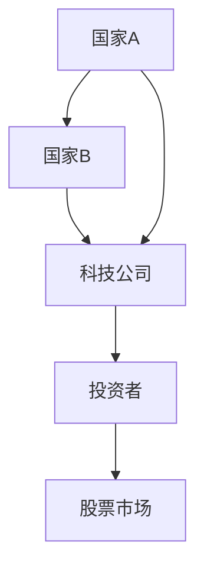

                 


# 特价股票投资中的地缘科技与数字经济主权博弈风险评估策略

> 关键词：特价股票投资、地缘科技、数字经济主权、博弈论、风险评估、股票市场、数字经济

> 摘要：本文深入分析了在特价股票投资中，地缘科技与数字经济主权之间的博弈关系，探讨了如何通过博弈论模型和风险评估方法，评估这些因素对股票投资的影响。文章结合数学模型和实际案例，提出了系统化的风险评估策略，为投资者在复杂多变的地缘政治和技术环境下做出科学的投资决策提供了理论依据和实践指导。

---

# 第一部分: 特价股票投资中的地缘科技与数字经济主权博弈关系

## 第1章: 特价股票投资与地缘科技概述

### 1.1 特价股票投资的基本概念

#### 1.1.1 特价股票的定义与特点
特价股票通常指那些价格低于其内在价值，具有较大上涨潜力的股票。其特点包括价格低廉、潜在回报高、风险可控等。以下是特价股票与普通股票的主要区别：

| **属性**       | **特价股票**                          | **普通股票**                          |
|-----------------|---------------------------------------|---------------------------------------|
| 价格            | 低于市场价值                          | 接近或高于市场价值                    |
| 风险            | 中低风险                              | 高风险                                |
| 投资门槛        | 适合中小投资者                        | 适合机构投资者                        |

#### 1.1.2 特价股票投资的基本策略
- **价值投资法**：寻找被市场低估的公司，长期持有。
- **趋势投资法**：根据市场趋势和技术分析进行短期操作。
- **组合投资法**：分散投资，降低风险。

#### 1.1.3 特价股票与传统股票投资的区别
- **风险**：特价股票风险较低，传统股票风险较高。
- **收益**：特价股票收益潜力大，传统股票收益相对稳定。
- **目标**：特价股票目标是低价买入高价卖出，传统股票注重长期价值。

### 1.2 地缘科技的概念与影响

#### 1.2.1 地缘科技的定义
地缘科技是指地理、政治、经济等因素对科技产业的影响。地缘科技的核心是通过地理位置、政治关系和经济政策，分析科技公司的潜在风险和机会。

#### 1.2.2 地缘科技对股票投资的影响
- **政策风险**：地缘政治冲突可能导致政策变化，影响公司运营。
- **技术封锁**：技术依赖特定国家可能导致技术封锁风险。
- **市场拓展**：地缘科技影响公司的国际市场布局。

#### 1.2.3 地缘科技与国际政治经济的关系
地缘科技是国际政治经济的产物，其变化直接影响科技公司的股票价格。例如，中美贸易摩擦对科技公司的影响显著。

### 1.3 数字经济主权的内涵与外延

#### 1.3.1 数字经济主权的定义
数字经济主权是指一个国家对数字资产、数字技术和数字市场等方面的自主控制权。它包括数据主权、技术主权和市场主权。

#### 1.3.2 数字经济主权的核心要素
- **数据主权**：数据的生成、存储和使用受本国法律约束。
- **技术主权**：核心技术自主研发，避免依赖他国。
- **市场主权**：本国企业在数字经济市场中占据主导地位。

#### 1.3.3 数字经济主权与股票投资的关系
- **政策影响**：数字经济主权政策影响科技公司的运营环境。
- **投资机会**：数字经济主权强的国家可能成为投资热点。
- **风险因素**：数字经济主权变化可能导致投资风险。

### 1.4 本章小结
本章介绍了特价股票投资的基本概念、地缘科技的定义及其对股票投资的影响，以及数字经济主权的核心内涵及其与股票投资的关系。通过分析，我们明确了地缘科技和数字经济主权对股票投资的重要性。

---

## 第2章: 特价股票投资中的地缘科技与数字经济主权博弈关系

### 2.1 地缘科技对数字经济主权的影响

#### 2.1.1 地缘科技对数字经济主权的促进作用
- **技术合作**：地缘科技促进国际技术合作，增强数字经济主权。
- **政策支持**：地缘科技推动本国数字经济政策的制定和实施。

#### 2.1.2 地缘科技对数字经济主权的挑战
- **技术依赖**：过度依赖外国技术可能导致数字经济主权丧失。
- **国际竞争**：地缘科技加剧国际竞争，影响数字经济主权。

#### 2.1.3 地缘科技与数字经济主权的互动关系
地缘科技是数字经济主权的载体，数字经济主权是地缘科技的核心目标。两者相互依存，共同影响股票投资。

### 2.2 数字经济主权对特价股票投资的影响

#### 2.2.1 数字经济主权对股票市场的直接影响
- **市场波动**：数字经济主权政策变化引发市场波动。
- **企业业绩**：数字经济主权强的公司业绩更稳定。

#### 2.2.2 数字经济主权对投资者行为的影响
- **投资决策**：投资者更倾向于投资数字经济主权强的公司。
- **风险偏好**：数字经济主权强的市场风险较低。

#### 2.2.3 数字经济主权对股票价格波动的影响
- **政策利好**：数字经济主权政策利好推动股价上涨。
- **政策利空**：数字经济主权政策收紧导致股价下跌。

### 2.3 地缘科技与数字经济主权的博弈分析

#### 2.3.1 地缘科技与数字经济主权的博弈模型



#### 2.3.2 地缘科技与数字经济主权的博弈结果
- **均衡状态**：博弈双方在均衡状态下达到最优解。
- **非均衡状态**：博弈双方存在冲突，影响市场稳定。

#### 2.3.3 地缘科技与数字经济主权的博弈对股票投资的影响
- **市场波动**：博弈加剧导致市场波动。
- **投资机会**：博弈结果影响投资机会。

### 2.4 本章小结
本章通过博弈论模型，分析了地缘科技与数字经济主权的互动关系，探讨了其对股票投资的影响。通过分析，我们明确了地缘科技与数字经济主权的博弈对投资决策的重要性。

---

## 第3章: 特价股票投资中的风险评估基本理论

### 3.1 风险评估的基本概念

#### 3.1.1 风险的定义与分类
- **系统性风险**：影响整个市场的风险，如经济衰退。
- **非系统性风险**：影响个别资产的风险，如公司业绩不佳。

#### 3.1.2 风险评估的基本方法
- **VaR方法**：Value at Risk，计算在特定置信水平下的最大损失。
- **CVaR方法**：Conditional Value at Risk，计算VaR以上的平均损失。

#### 3.1.3 风险评估在股票投资中的应用
- **风险定价**：根据风险定价模型确定股票价格。
- **风险分散**：通过分散投资降低风险。

### 3.2 地缘科技与数字经济主权对股票投资风险的影响

#### 3.2.1 地缘科技对股票投资风险的影响
- **政策风险**：地缘政策变化导致股票价格波动。
- **技术风险**：技术封锁影响公司业绩。

#### 3.2.2 数字经济主权对股票投资风险的影响
- **数据风险**：数据泄露导致公司损失。
- **市场风险**：数字经济主权变化影响市场环境。

### 3.3 风险评估模型的构建

#### 3.3.1 风险评估模型的数学表达

$$
R_i = \alpha + \beta_i R_m + \epsilon_i
$$

其中，$R_i$ 是股票 $i$ 的收益，$R_m$ 是市场收益，$\beta_i$ 是股票 $i$ 的贝塔系数，$\epsilon_i$ 是随机误差。

#### 3.3.2 风险评估模型的实现

```python
import numpy as np
import pandas as pd

# 数据准备
data = pd.DataFrame({
    'Market_Return': [0.1, 0.05, 0.08, 0.06, 0.07],
    'Stock_Return': [0.12, 0.03, 0.09, 0.05, 0.08]
})

# 计算贝塔系数
X = data['Market_Return']
Y = data['Stock_Return']

beta = np.cov(X, Y)[0, 1] / np.var(X)
print(f"贝塔系数为：{beta}")
```

### 3.4 本章小结
本章介绍了风险评估的基本理论，分析了地缘科技与数字经济主权对股票投资风险的影响，并构建了风险评估模型。通过模型，我们可以量化地缘科技与数字经济主权对股票投资的影响。

---

## 第4章: 地缘科技与数字经济主权博弈下的股票投资风险评估策略

### 4.1 博弈论在风险评估中的应用

#### 4.1.1 博弈论的基本概念
- **参与者**：博弈中的决策者，如投资者、公司、政府。
- **策略**：参与者为达到目标采取的行动。
- **收益**：参与者在博弈中的收益或损失。

#### 4.1.2 博弈论在股票投资中的应用
- **纳什均衡**：博弈双方在均衡状态下达到最优解。
- **零和博弈**：一方收益等于另一方损失。

#### 4.1.3 博弈论与股票投资的关系
- **市场均衡**：博弈论解释市场均衡现象。
- **投资决策**：博弈论指导投资者做出最优决策。

### 4.2 数字经济主权博弈下的股票投资策略

#### 4.2.1 数字经济主权博弈的数学模型

$$
\text{收益} = \alpha + \beta \times \text{数字经济主权} + \gamma \times \text{地缘科技} + \epsilon
$$

#### 4.2.2 数字经济主权博弈下的投资策略
- **分散投资**：投资不同国家的科技公司，降低风险。
- **长期投资**：关注数字经济主权强的国家，长期持有。

### 4.3 本章小结
本章通过博弈论分析了数字经济主权对股票投资的影响，提出了数字经济主权博弈下的投资策略，为投资者提供了理论依据。

---

## 第5章: 结论与展望

### 5.1 本文总结
本文系统分析了特价股票投资中的地缘科技与数字经济主权博弈关系，构建了风险评估模型，并提出了投资策略。通过分析，我们明确了地缘科技与数字经济主权对股票投资的重要影响。

### 5.2 未来展望
未来研究可以进一步探讨数字经济主权与地缘科技的互动关系，优化风险评估模型，为投资者提供更科学的投资决策支持。

### 5.3 注意事项
投资者在实际操作中应结合市场实际情况，谨慎决策，避免盲目跟风。

### 5.4 拓展阅读
推荐阅读《投资学基础》、《博弈论与经济行为》等书籍，深入理解博弈论与股票投资的关系。

---

# 结语

通过本文的分析，我们明确了地缘科技与数字经济主权对特价股票投资的影响，提出了系统化的风险评估策略。希望本文能为投资者在复杂多变的地缘政治和技术环境下，做出科学的投资决策提供理论依据和实践指导。

