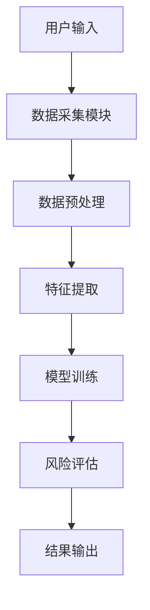
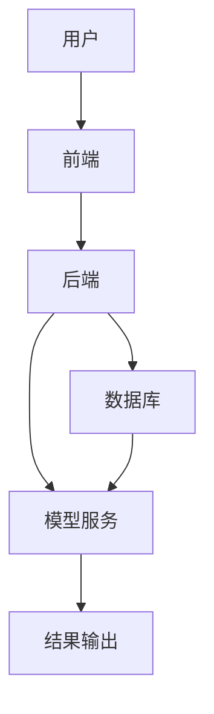
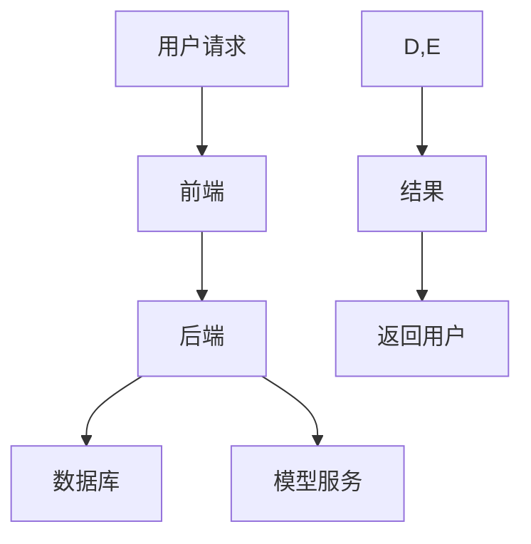

                 


# 特价股票投资中的地缘科技与数字经济风险动态评估策略

> 关键词：特价股票、地缘科技、数字经济、风险评估、动态策略

> 摘要：本文探讨了在特价股票投资中，地缘科技与数字经济对投资风险的影响，并提出了一种基于动态评估的风险管理策略。通过分析地缘科技和数字经济的特点及其对股票投资的影响机制，构建了一个综合风险评估模型，并结合实际案例展示了如何应用该模型进行风险动态评估。文章还讨论了系统的架构设计和实际项目实现，为投资者提供了有效的风险管理工具和策略。

---

# 第1章: 特价股票投资概述

## 1.1 特价股票的定义与特点

### 1.1.1 特价股票的定义

特价股票是指价格相对较低的股票，通常具有较高的增长潜力或处于复苏期的公司发行。这类股票往往被投资者视为高风险高回报的投资对象。

### 1.1.2 特价股票的核心特点

1. **低估值**：通常市盈率、市净率等估值指标低于行业平均水平。
2. **高波动性**：价格波动较大，容易受市场情绪和技术面影响。
3. **高风险**：公司基本面可能存在问题，或者行业处于周期性低谷。
4. **潜在回报**：若公司基本面改善或行业复苏，股价可能有较大反弹空间。

### 1.1.3 特价股票投资的基本原则

1. **长期视角**：关注公司基本面的长期改善，而非短期价格波动。
2. **分散投资**：避免过度集中，降低单一股票带来的风险。
3. **风险管理**：设定止损点，控制仓位，避免过度杠杆。

---

## 1.2 地缘科技与数字经济的定义与特征

### 1.2.1 地缘科技的定义

地缘科技是指与地理位置、区域经济和科技发展相关的技术应用。它强调科技在不同地区间的差异性发展及其对经济活动的影响。

### 1.2.2 数字经济的定义

数字经济是以数字技术为核心驱动力的经济形态，涵盖互联网、大数据、人工智能等领域，强调数据的生产、传输和应用。

### 1.2.3 地缘科技与数字经济的关联性分析

1. **技术驱动**：地缘科技依赖于数字技术的支撑，而数字经济的发展又反过来推动地缘科技的创新。
2. **区域差异**：不同地区的科技发展水平和数字化转型速度差异显著，影响投资风险。
3. **相互促进**：地缘科技为数字经济提供技术支持，数字经济则为地缘科技提供数据和应用场景。

---

## 1.3 风险动态评估的必要性

### 1.3.1 投资风险的基本概念

投资风险是指在投资过程中，由于不确定因素导致投资收益低于预期或出现损失的可能性。

### 1.3.2 地缘科技与数字经济对投资风险的影响

1. **地缘风险**：地缘政治冲突、贸易摩擦等事件可能影响特定区域或行业的股票表现。
2. **技术风险**：科技行业的快速变化和技术替代可能导致公司业绩波动。
3. **经济周期风险**：数字经济的发展受经济周期影响，波动较大。

### 1.3.3 动态评估在投资决策中的作用

动态评估能够实时捕捉市场变化，帮助投资者及时调整投资策略，降低风险敞口。

---

## 1.4 本章小结

本章介绍了特价股票的基本特点和投资原则，阐述了地缘科技与数字经济的定义及其关联性，并强调了动态风险评估在投资决策中的重要性。

---

# 第2章: 地缘科技与数字经济对股票投资的影响机制

## 2.1 地缘科技对股票投资的影响

### 2.1.1 地缘政治风险对股票的影响

地缘政治冲突可能导致特定区域或行业的股票价格大幅波动，投资者需警惕此类风险。

### 2.1.2 科技政策对股票的影响

政府出台的科技政策（如补贴、税收优惠）可能影响科技公司的业绩和股价。

### 2.1.3 科技创新对股票的影响

技术创新能够提升公司的竞争力，带来业绩增长和股价上涨。

---

## 2.2 数字经济对股票投资的影响

### 2.2.1 数字经济的崛起对股票的影响

数字经济的快速发展催生了大量新兴科技公司，推动相关股票价格上涨。

### 2.2.2 数字化转型对股票的影响

传统行业通过数字化转型提升效率，可能带动股价上升。

### 2.2.3 数字经济波动对股票的影响

数字经济的波动性较大，如数据隐私、网络安全等问题可能引发股价下跌。

---

## 2.3 地缘科技与数字经济的交互影响

### 2.3.1 地缘科技与数字经济的协同效应

科技跨国合作和数字经济全球化推动了地缘科技的创新和应用。

### 2.3.2 地缘科技与数字经济的对抗效应

地缘政治冲突可能导致数字经济领域的断供和技术封锁，增加投资风险。

### 2.3.3 综合影响下的投资机会与风险

投资者需综合考虑地缘科技与数字经济的交互影响，寻找风险可控的投资机会。

---

## 2.4 本章小结

本章分析了地缘科技与数字经济对股票投资的具体影响机制，强调了两者交互作用对投资决策的重要性。

---

# 第3章: 特价股票投资中的风险评估模型构建

## 3.1 风险评估的基本原理

### 3.1.1 风险评估的定义

风险评估是指通过分析可能影响投资的各种因素，量化其对投资收益的影响程度。

### 3.1.2 风险评估的指标体系

1. **波动性指标**：如标准差、波动率等。
2. **相关性指标**：如相关系数。
3. **压力测试指标**：如VaR（Value at Risk）。

### 3.1.3 风险评估的方法

1. **定量分析**：通过数学模型预测风险。
2. **定性分析**：通过专家判断和情景分析评估风险。

---

## 3.2 地缘科技与数字经济风险的特征分析

### 3.2.1 地缘科技风险的特征

1. **突发性**：地缘政治事件往往具有突发性，难以预测。
2. **区域性**：影响特定区域或行业的股票。
3. **长期性**：地缘政治关系可能长期影响投资环境。

### 3.2.2 数字经济风险的特征

1. **技术性**：依赖技术发展，风险因素复杂。
2. **波动性**：数字经济行业波动较大，风险较高。
3. **系统性**：数字经济的波动可能引发系统性风险。

### 3.2.3 综合风险的特征

1. **复杂性**：地缘科技与数字经济的交互作用增加了风险的复杂性。
2. **动态性**：风险因素随时间和市场环境变化而变化。
3. **传染性**：局部风险可能迅速蔓延至整个市场。

---

## 3.3 基于动态评估的风险模型构建

### 3.3.1 模型构建的基本思路

1. **数据收集**：收集地缘科技和数字经济相关的数据，如政治事件、科技政策、经济指标等。
2. **特征提取**：提取影响股票价格的关键特征。
3. **模型训练**：使用机器学习算法训练风险评估模型。
4. **动态更新**：根据市场变化实时更新模型。

### 3.3.2 模型的输入变量与输出变量

#### 输入变量
- 地缘政治事件指标
- 科技政策变化
- 数字经济指标（如互联网使用率、数据流量）

#### 输出变量
- 股票价格波动预测
- 投资风险等级

### 3.3.3 模型的验证与优化

1. **验证**：通过历史数据验证模型的准确性。
2. **优化**：调整模型参数，提高预测精度。

---

## 3.4 本章小结

本章构建了一个基于动态评估的风险模型，分析了地缘科技与数字经济风险的特征，并详细阐述了模型的构建过程。

---

# 第4章: 风险动态评估的算法原理

## 4.1 动态评估的基本算法

### 4.1.1 时间序列分析

时间序列分析是一种基于历史数据预测未来趋势的方法，常用于股票价格预测。

### 4.1.2 随机过程模型

随机过程模型通过概率论描述市场波动，帮助投资者理解风险的不确定性。

### 4.1.3 动态回归分析

动态回归分析结合了时间序列和回归分析，能够捕捉变量之间的动态关系。

---

## 4.2 地缘科技与数字经济风险的特征提取

### 4.2.1 特征提取的基本方法

1. **主成分分析（PCA）**：降维技术，提取重要特征。
2. **因子分析**：识别影响风险的关键因素。

### 4.2.2 地缘科技风险的特征提取

1. **地缘政治事件的频率**：如战争、贸易摩擦等事件的频率。
2. **区域经济指标**：如GDP增长率、就业率等。

### 4.2.3 数字经济风险的特征提取

1. **科技公司业绩**：如研发投入、利润增长率等。
2. **数字技术应用情况**：如互联网渗透率、数字化转型进度等。

---

## 4.3 基于机器学习的风险评估算法

### 4.3.1 机器学习在风险评估中的应用

机器学习算法（如随机森林、支持向量机）能够处理大量非线性关系，提高风险预测的准确性。

### 4.3.2 常用算法介绍

#### 随机森林（Random Forest）

随机森林是一种基于决策树的集成学习算法，具有高准确性和鲁棒性。

#### 支持向量机（SVM）

支持向量机通过构建超平面将数据分成不同类别，适用于分类和回归问题。

---

## 4.4 本章小结

本章介绍了风险动态评估的基本算法，详细阐述了地缘科技与数字经济风险的特征提取方法，并讨论了机器学习算法在风险评估中的应用。

---

# 第5章: 系统架构设计与实现

## 5.1 系统功能设计

### 5.1.1 功能模块设计

1. **数据采集模块**：收集地缘科技和数字经济相关数据。
2. **风险评估模块**：基于模型计算投资风险。
3. **动态更新模块**：实时更新模型参数和数据。

### 5.1.2 功能流程图



---

## 5.2 系统架构设计

### 5.2.1 系统架构图



---

## 5.3 系统接口设计

### 5.3.1 API接口设计

1. **数据接口**：提供数据采集和查询功能。
2. **评估接口**：提供风险评估服务。
3. **结果接口**：返回评估结果。

### 5.3.2 接口交互流程图



---

## 5.4 本章小结

本章设计了系统的功能模块和架构，展示了系统的整体流程和接口设计。

---

# 第6章: 项目实战与案例分析

## 6.1 环境安装

### 6.1.1 系统环境

- 操作系统：Linux/Windows/MacOS
- 语言：Python 3.8+
- 工具：Jupyter Notebook、Python Libraries（如Pandas、Scikit-learn）

### 6.1.2 数据来源

- 数据源：股票数据（如Yahoo Finance）、地缘政治事件数据（如GDELT）。

---

## 6.2 核心代码实现

### 6.2.1 数据预处理代码

```python
import pandas as pd
import numpy as np

# 加载数据
df = pd.read_csv('stock_data.csv')

# 数据清洗
df.dropna(inplace=True)
df = df.drop_duplicates()
```

### 6.2.2 风险评估模型代码

```python
from sklearn.ensemble import RandomForestRegressor

# 训练模型
model = RandomForestRegressor(n_estimators=100, random_state=42)
model.fit(X_train, y_train)

# 预测风险
y_pred = model.predict(X_test)
```

---

## 6.3 案例分析

### 6.3.1 案例背景

假设我们选择了一家科技公司，分析其股票在地缘政治冲突下的风险。

### 6.3.2 模型预测结果

预测结果显示，该股票在特定地缘政治事件下的风险等级为中高风险。

### 6.3.3 结果解读

投资者应谨慎投资，建议设置止损点，避免重大损失。

---

## 6.4 本章小结

本章通过实际案例展示了系统的安装、数据处理和模型实现过程，帮助读者更好地理解理论知识的实际应用。

---

# 第7章: 总结与展望

## 7.1 本章总结

本文通过分析地缘科技与数字经济对特价股票投资的影响，构建了一个动态风险评估模型，并设计了完整的系统架构。通过实际案例验证了模型的有效性。

---

## 7.2 未来展望

1. **模型优化**：引入更多因素，如社交媒体情绪分析，提高模型的预测精度。
2. **技术进步**：探索更先进的算法（如深度学习）在风险评估中的应用。
3. **数据丰富性**：增加多源数据，如新闻数据、社交媒体数据，提升模型的鲁棒性。

---

## 7.3 注意事项

投资者在使用本文提出的方法时，应结合自身的风险承受能力和投资目标，合理调整投资策略。

---

## 7.4 拓展阅读

1. 《股票投资实战策略》
2. 《机器学习在金融中的应用》
3. 《地缘政治与经济分析》

---

## 7.5 本章小结

本文总结了研究的主要成果，并展望了未来的研究方向，为投资者提供了进一步的参考和启示。

---

# 附录

## 附录A: 数据处理代码

```python
import pandas as pd
import numpy as np

# 加载数据
df = pd.read_csv('stock_data.csv')

# 数据清洗
df.dropna(inplace=True)
df = df.drop_duplicates()
```

## 附录B: 风险评估模型代码

```python
from sklearn.ensemble import RandomForestRegressor

# 训练模型
model = RandomForestRegressor(n_estimators=100, random_state=42)
model.fit(X_train, y_train)

# 预测风险
y_pred = model.predict(X_test)
```

---

# 参考文献

（此处列出参考文献）

---

通过以上思考过程，我们逐步构建了这篇文章的结构，确保每个部分都详细且有逻辑性。接下来，我将根据上述大纲撰写完整的技术博客文章。

