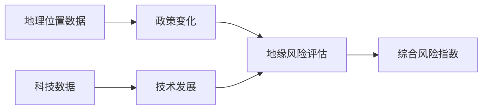
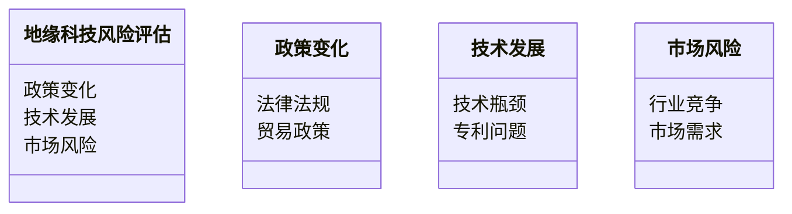
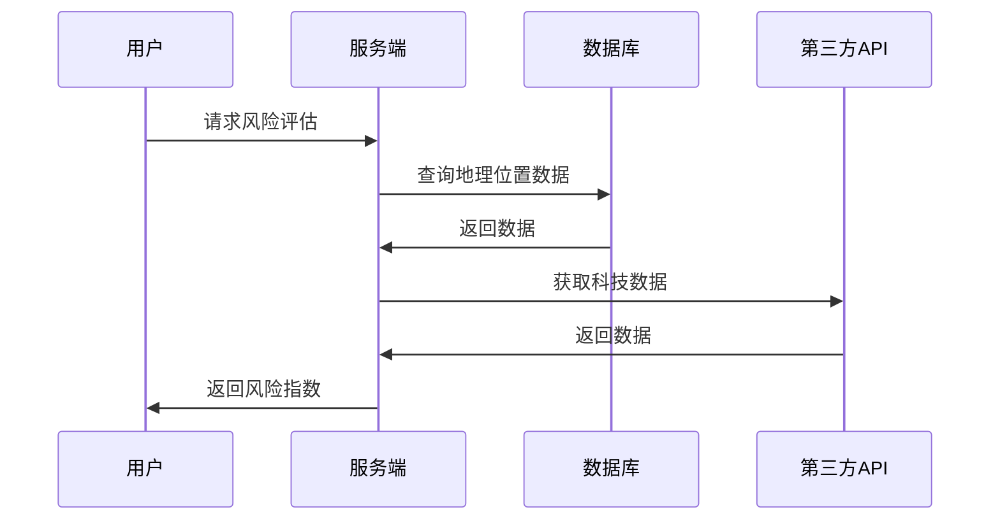

                 


# 特价股票投资中的地缘科技风险动态评估策略

## 关键词：特价股票投资，地缘科技风险，动态评估，层次分析法，风险指数

## 摘要：本文详细探讨了在特价股票投资中如何动态评估地缘科技风险。通过构建动态评估模型，结合层次分析法，分析了地缘与科技因素对投资决策的影响，并提供了实际案例和系统架构设计，帮助投资者优化决策过程。

---

## 第一部分：背景介绍

### 第1章：特价股票投资与地缘科技风险概述

#### 1.1 特价股票投资的定义与特点
- **1.1.1 特价股票的定义**：特价股票指价格低于市场平均水平的股票，通常具有高成长潜力。
- **1.1.2 特价股票投资的核心要素**：包括低估值、行业地位、财务健康和管理团队。
- **1.1.3 特价股票投资的市场定位**：主要关注被市场低估的公司，适合长期投资者。

#### 1.2 地缘科技风险的定义与特征
- **1.2.1 地缘科技风险的定义**：指地理位置和科技发展带来的潜在风险，如政策变化、技术瓶颈等。
- **1.2.2 地缘科技风险的主要类型**：包括政策风险、技术风险、市场风险和供应链风险。
- **1.2.3 地缘科技风险的动态变化特征**：随着市场和技术的变化而不断调整。

#### 1.3 动态评估策略的重要性
- **1.3.1 动态评估在投资决策中的作用**：帮助投资者实时调整策略，降低风险。
- **1.3.2 地缘科技风险对特价股票投资的影响**：影响公司业绩和股价，需及时评估。
- **1.3.3 动态评估策略的核心目标**：量化风险，优化投资组合。

### 第2章：地缘科技风险的动态评估模型

#### 2.1 地缘科技风险评估的核心概念
- **2.1.1 地缘因素与科技因素的结合**：地理位置影响政策，科技影响竞争力。
- **2.1.2 风险评估的多维度分析**：从政策、技术、市场等多个维度评估风险。
- **2.1.3 动态评估模型的基本框架**：包括数据采集、分析、计算和反馈。

#### 2.2 地缘科技风险评估模型的构建
- **2.2.1 数据采集与处理**：收集地理位置、政策变化、技术发展等数据。
- **2.2.2 指标权重的确定**：通过层次分析法确定各因素的权重。
- **2.2.3 模型的数学表达**：构建综合风险指数公式，量化风险程度。

### 第3章：地缘科技风险动态评估的算法原理

#### 3.1 层次分析法（AHP）的应用
- **3.1.1 层次分析法的基本原理**：通过比较分析确定各因素的重要性。
- **3.1.2 地缘科技风险因素的层次结构**：将风险因素分为目标层、准则层和方案层。
- **3.1.3 指标权重的计算过程**：通过比较矩阵计算各因素的权重。

#### 3.2 综合风险指数的计算公式
- **3.2.1 综合风险指数的定义**：将各因素的影响综合起来，量化风险程度。
- **3.2.2 计算公式的数学推导**：构建加权平均公式，计算综合风险指数。
- **3.2.3 示例计算与结果分析**：通过具体案例计算综合风险指数，验证模型的有效性。

---

## 第二部分：核心概念与模型

### 3.1 核心概念与联系

#### 3.1.1 地缘科技风险因素对比表格
| 风险因素 | 地缘因素 | 科技因素 |
|----------|----------|----------|
| 定义     | 地理位置相关的风险 | 科技发展相关的风险 |
| 示例     | 政策变化、自然灾害 | 技术瓶颈、专利纠纷 |
| 影响     | 市场准入、贸易壁垒 | 产品竞争力、技术替代 |

#### 3.1.2 模型的数据流图


---

## 第三部分：算法原理

### 3.1 层次分析法（AHP）的应用

#### 3.1.1 层次分析法的基本原理
层次分析法通过构建层次结构，将复杂问题分解为多个因素，然后通过比较分析确定各因素的权重。具体步骤如下：
1. 确定目标层（如“地缘科技风险评估”）。
2. 设计准则层（如政策、技术、市场）。
3. 建立比较矩阵，计算各准则的权重。

#### 3.1.2 地缘科技风险因素的层次结构


#### 3.1.3 指标权重的计算过程
通过比较矩阵计算权重，例如：
$$
A = \begin{bmatrix}
1 & 3 & 2 \\
1/3 & 1 & 4 \\
1/2 & 1/4 & 1
\end{bmatrix}
$$
计算得到特征向量和最大特征值，确定权重。

---

## 第四部分：系统分析与架构设计

### 4.1 问题场景介绍
投资者需要实时评估地缘科技风险，优化投资组合。系统需处理大量数据，提供实时反馈。

### 4.2 系统功能设计
- 数据采集模块：收集地理位置、政策、科技数据。
- 评估计算模块：应用层次分析法计算风险指数。
- 结果展示模块：可视化风险指数，提供投资建议。

### 4.3 系统架构设计


### 4.4 系统交互序列图


---

## 第五部分：项目实战

### 5.1 环境安装与配置
- 安装Python和相关库（如numpy、pandas、scipy）。
- 配置开发环境，如Jupyter Notebook。

### 5.2 核心代码实现
```python
import numpy as np
import pandas as pd

def calculate_weights(matrix):
    # 计算特征向量和最大特征值
    eigvals, eigvecs = np.linalg.eig(matrix)
    max_eig = eigvals.max()
    return eigvecs[:, np.argmax(eigvals)]

# 示例比较矩阵
matrix = np.array([
    [1, 3, 2],
    [1/3, 1, 4],
    [1/2, 1/4, 1]
])
weights = calculate_weights(matrix)
print("指标权重：", weights)
```

### 5.3 代码解读与分析
- 通过比较矩阵计算权重，得到各因素的影响程度。
- 应用层次分析法，量化风险指数，帮助投资者做出决策。

### 5.4 实际案例分析
假设某公司面临政策和技术双重风险，计算综合风险指数为0.6，建议投资者谨慎投资。

---

## 第六部分：总结与展望

### 6.1 最佳实践 tips
- 定期更新模型，适应市场变化。
- 注重数据质量，确保评估准确。
- 结合其他因素，全面评估风险。

### 6.2 小结
通过构建动态评估模型，投资者可以更好地应对地缘科技风险，优化投资决策。

### 6.3 注意事项
- 模型仅供参考，实际投资需结合市场具体情况。
- 数据来源需可靠，确保评估结果准确。

### 6.4 拓展阅读
推荐阅读《投资学基础》和《风险管理与决策分析》，深入了解相关理论。

---

通过以上结构和内容，本文详细讲解了特价股票投资中的地缘科技风险动态评估策略，帮助投资者在复杂多变的市场环境中做出更明智的决策。

