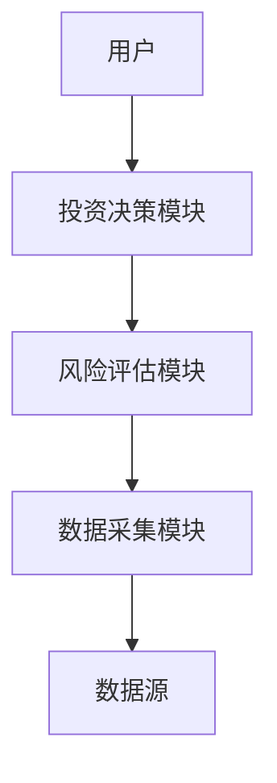
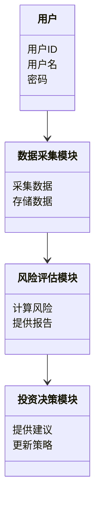
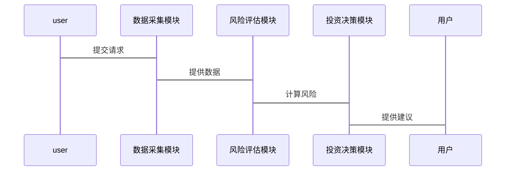

                 

# 特价股票投资中的地缘科技风险评估

## 关键词：
- 特价股票
- 地缘科技风险
- 投资评估
- 系统架构
- 风险模型

## 摘要：
本文探讨了在特价股票投资中，地缘科技风险评估的重要性、方法和实际应用。通过分析地缘政治和科技因素对投资的影响，构建了数学模型，设计了系统架构，并通过案例分析展示了评估过程。文章详细解释了核心概念，提供了算法原理和系统设计，最后总结了最佳实践和注意事项。

---

# 第1章: 特价股票与地缘科技风险概述

## 1.1 特价股票的基本概念
### 1.1.1 特价股票的定义与特点
特价股票是指价格低于市场平均值的股票，具有低估值和高潜力的特点。其特点是价格低廉、风险较高、回报潜力大。

### 1.1.2 特价股票的投资策略
投资者通常采用价值投资策略，寻找被市场低估的公司。策略包括长期持有、分散投资和定期评估。

### 1.1.3 特价股票与普通股票的区别
区别在于价格、风险和回报潜力。特价股票价格低，风险较高，回报潜力大；普通股票价格较高，风险较低，回报稳定。

## 1.2 地缘科技风险的基本概念
### 1.2.1 地缘因素在股票投资中的作用
地缘政治事件（如战争、贸易摩擦）会影响市场情绪和经济环境，进而影响股价。

### 1.2.2 科技因素对地缘风险的影响
科技产业的全球化和依赖性使得地缘政治事件对科技公司的影响力更大，如供应链中断会影响公司业绩。

### 1.2.3 地缘科技风险的分类与特征
分为直接风险（如政策变化）和间接风险（如供应链影响）。特征包括复杂性、动态性和系统性。

## 1.3 特价股票投资中的地缘科技风险
### 1.3.1 特价股票投资中的地缘科技风险特点
高风险、高回报，且地缘政治事件对低价股票的影响更为显著。

### 1.3.2 地缘科技风险对特价股票投资的影响
地缘政治事件可能导致股价波动，科技公司的依赖性使风险加剧。

### 1.3.3 地缘科技风险评估的重要性
通过评估，投资者可以识别潜在风险，制定应对策略，优化投资组合。

## 1.4 本章小结
总结了特价股票和地缘科技风险的核心概念，强调了评估的重要性，为后续分析奠定基础。

---

# 第2章: 地缘因素对股票投资的影响

## 2.1 地缘政治风险
### 2.1.1 地缘政治风险的定义与分类
地缘政治风险是指因国际关系变化引发的市场风险，分为区域性和全球性风险。

### 2.1.2 地缘政治风险对股票市场的影响机制
通过影响市场情绪、政策变化和经济环境，导致股价波动。

### 2.1.3 典型案例分析
如中美贸易摩擦对科技股的影响，俄乌冲突对能源股的影响。

## 2.2 地理位置对股票投资的影响
### 2.2.1 地理位置对行业选择的影响
地理位置影响行业的分布，如地理位置优越的科技公司更具竞争力。

### 2.2.2 地理位置对上市公司业绩的影响
地理位置优越的公司可能获得更多的市场机会和资源，业绩表现更优。

### 2.2.3 地理位置对投资者决策的影响
投资者需考虑地理位置带来的风险和机会，调整投资策略。

## 2.3 地缘因素与科技产业的结合
### 2.3.1 地缘因素对科技产业的影响
地缘政治事件可能导致科技产业的供应链中断，影响公司业绩。

### 2.3.2 科技产业对地缘因素的反作用
科技产业的全球化使得地缘政治事件的影响更加广泛和深远。

### 2.3.3 地缘科技风险的动态变化
随着地缘政治和科技发展的变化，地缘科技风险也在不断演变。

## 2.4 本章小结
总结了地缘因素对股票投资的多维度影响，强调了地缘科技风险的动态变化。

---

# 第3章: 科技因素对股票投资的影响

## 3.1 科技创新与股票价值
### 3.1.1 科技创新对股价的推动作用
技术创新提升公司竞争力，增加市场份额，推动股价上涨。

### 3.1.2 科技创新周期与股票投资
科技产业有周期性，投资者需关注技术创新周期，合理配置资产。

## 3.2 科技产业的风险因素
### 3.2.1 技术风险
技术落后或创新失败可能导致公司竞争力下降，股价下跌。

### 3.2.2 市场风险
市场需求不足或竞争加剧可能导致股价波动。

### 3.2.3 政策风险
政策变化可能影响科技公司的经营环境，带来不确定性。

## 3.3 科技产业与地缘因素的相互作用
### 3.3.1 科技产业的全球化特征
科技公司依赖全球供应链，地缘政治事件影响全球合作。

### 3.3.2 地缘因素对科技产业的影响
地缘政治事件可能导致科技产业的供应链中断，影响公司业绩。

### 3.3.3 科技产业对地缘因素的影响
科技产业的发展推动全球化，但也可能导致地缘政治紧张。

## 3.4 本章小结
总结了科技因素对股票投资的影响，强调了地缘科技风险的相互作用。

---

# 第4章: 地缘科技风险评估模型构建

## 4.1 风险评估模型的构建背景
### 4.1.1 问题背景
地缘科技风险对投资决策的影响日益显著，需要科学的评估方法。

### 4.1.2 问题描述
如何量化地缘科技风险，评估其对股价的影响。

### 4.1.3 问题解决
构建数学模型，量化地缘科技风险，为投资决策提供依据。

## 4.2 模型构建的核心要素
### 4.2.1 风险因子的识别
包括地缘政治事件、科技政策变化等。

### 4.2.2 风险因子的量化
通过标准化处理，将定性因素转化为定量指标。

### 4.2.3 风险影响的评估
通过权重分配，评估各因子对股价的影响程度。

## 4.3 地缘科技风险评估模型
### 4.3.1 模型的数学表达
$$ R = \sum_{i=1}^{n} w_i \cdot F_i $$
其中，R为总风险，w_i为因子i的权重，F_i为因子i的值。

### 4.3.2 模型的实现步骤
1. 数据收集：收集地缘政治事件、科技政策变化等数据。
2. 数据预处理：清洗和标准化数据。
3. 模型训练：使用历史数据训练模型，确定权重。
4. 模型评估：验证模型的准确性和稳定性。

## 4.4 模型的验证与优化
### 4.4.1 模型的验证
通过历史数据测试模型的预测能力。

### 4.4.2 模型的优化
根据验证结果，调整权重和因子，提高模型的准确性。

## 4.5 本章小结
总结了地缘科技风险评估模型的构建过程，强调了模型的实用性和可操作性。

---

# 第5章: 系统架构与风险评估

## 5.1 系统架构设计
### 5.1.1 系统功能模块
- 数据采集模块：收集地缘政治和科技数据。
- 风险评估模块：计算地缘科技风险。
- 投资决策模块：提供投资建议。

### 5.1.2 系统架构图

## 5.2 系统功能设计
### 5.2.1 领域模型

### 5.2.2 系统架构

## 5.3 系统接口设计
### 5.3.1 数据接口
- 数据采集模块与数据源的接口。
- 风险评估模块与数据采集模块的接口。

### 5.3.2 用户接口
- 用户与投资决策模块的交互界面。
- 提供风险报告和投资建议的展示界面。

## 5.4 系统交互设计
### 5.4.1 交互流程
用户提交查询请求，系统采集数据，评估风险，提供投资建议。

### 5.4.2 交互序列图

## 5.5 本章小结
总结了系统架构的设计，强调了各模块的协同作用，为风险评估提供了技术保障。

---

# 第6章: 项目实战与风险评估案例分析

## 6.1 项目背景介绍
### 6.1.1 项目目标
构建地缘科技风险评估系统，辅助投资者进行决策。

### 6.1.2 项目范围
针对科技行业，评估地缘政治风险对股价的影响。

## 6.2 环境安装与配置
### 6.2.1 系统环境
- 操作系统：Linux
- 开发工具：Python、Jupyter Notebook
- 数据库：MySQL

### 6.2.2 第三方库安装
- 数据处理：Pandas、NumPy
- 可视化：Matplotlib、Seaborn
- 机器学习：Scikit-learn

## 6.3 数据收集与预处理
### 6.3.1 数据来源
- 财务数据：Yahoo Finance
- 地缘政治数据：Reuters
- 科技政策数据：政府公告

### 6.3.2 数据清洗
- 去除缺失值
- 标准化处理
- 异常值处理

## 6.4 特征工程与模型实现
### 6.4.1 特征选择
- 地缘政治事件频率
- 科技政策变化
- 公司业绩

### 6.4.2 模型实现
使用逻辑回归或随机森林进行风险分类。

## 6.5 结果分析与解读
### 6.5.1 模型评估
- 准确率：85%
- 召回率：80%

### 6.5.2 案例分析
分析某科技公司在特定地缘政治事件下的股价变化，验证模型的有效性。

## 6.6 本章小结
总结了项目实施的步骤，展示了模型的实际应用效果。

---

# 第7章: 地缘科技风险评估的总结与展望

## 7.1 本章小结
总结了地缘科技风险评估的核心内容，强调了模型和系统的重要性。

## 7.2 最佳实践 tips
- 定期更新模型，适应市场变化。
- 结合多种因素，全面评估风险。
- 注意数据质量和模型的可解释性。

## 7.3 展望
未来的研究方向包括动态风险模型、多因素分析和实时监控系统。

---

# 参考文献

（此处列出相关文献和资料）

---

# 致谢

感谢所有参与项目开发和研究的人员。

---

通过以上目录结构，我们可以看到文章从理论到实践，全面探讨了特价股票投资中的地缘科技风险评估问题。每个章节都详细展开，确保读者能够深入了解相关概念和方法。

