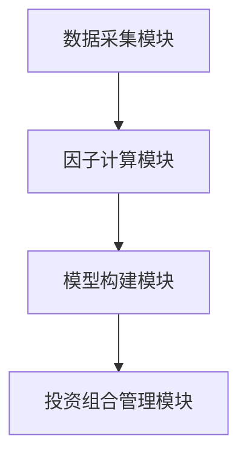
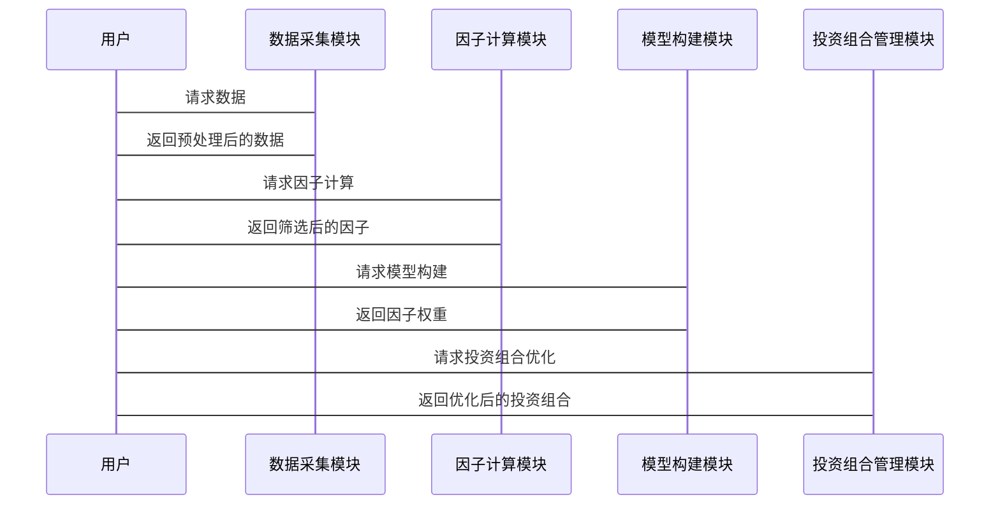

                 


# 特价股票投资中的多因子模型应用

> 关键词：多因子模型，股票投资，特价股票，量化分析，因子分析，投资策略

> 摘要：本文探讨了多因子模型在特价股票投资中的应用，分析了其核心原理、算法实现、系统架构，并通过项目实战展示了其在投资组合优化中的价值。文章从背景介绍到最佳实践，详细讲解了多因子模型在特价股票投资中的应用前景和具体实现方法。

---

# 第1章: 特价股票投资与多因子模型的背景介绍

## 1.1 多因子模型的起源与发展

### 1.1.1 传统股票投资方法的局限性
传统的股票投资方法，如基本面分析和趋势分析，虽然在一定程度上帮助投资者做出决策，但其主观性较强，难以量化和系统化。这种方法依赖于个人经验和市场直觉，具有较高的不确定性。

### 1.1.2 多因子模型的核心思想
多因子模型是一种量化分析方法，通过多个因子（如市盈率、市净率、股息率等）来评估股票的投资价值。其核心思想是将股票的收益分解为多个可量化的因子，从而更全面地评估股票的投资潜力。

### 1.1.3 多因子模型在股票投资中的应用现状
多因子模型已在金融领域得到广泛应用，尤其是在机构投资者中。通过多因子模型，投资者可以更科学地进行资产配置和风险控制，从而提高投资收益。

## 1.2 特价股票投资的特点与挑战

### 1.2.1 特价股票的定义与特征
特价股票通常指价格较低的股票，具有较高的波动性和潜在的高回报率。这类股票通常属于小盘股或中盘股，且可能处于困境或重组阶段。

### 1.2.2 特价股票投资的主要策略
投资者在进行特价股票投资时，通常采用价值投资、事件驱动策略或套利策略。这些策略强调对个股基本面的深入分析和市场机会的把握。

### 1.2.3 特价股票投资中的常见问题
特价股票投资存在较高的风险，如流动性风险、市场波动风险和公司基本面变化的风险。此外，传统的投资方法难以系统化和量化，导致投资决策的不确定性较高。

## 1.3 多因子模型在特价股票投资中的应用前景

### 1.3.1 多因子模型的优势
多因子模型通过量化分析，能够全面评估股票的投资价值，减少人为判断的干扰。此外，多因子模型能够发现市场中的潜在机会，提高投资效率。

### 1.3.2 多因子模型在特价股票投资中的潜在价值
通过多因子模型，投资者可以更好地识别具有投资潜力的特价股票，优化投资组合，并降低投资风险。

### 1.3.3 应用多因子模型的挑战与解决方案
数据获取难度大、模型过拟合风险高、因子选择复杂等是应用多因子模型的主要挑战。解决方案包括选择优质数据源、进行充分的回测和验证，以及采用分层优化策略。

## 1.4 本章小结
本章介绍了多因子模型的起源与发展，分析了特价股票投资的特点与挑战，探讨了多因子模型在特价股票投资中的应用前景。

---

# 第2章: 多因子模型的核心概念与原理

## 2.1 多因子模型的定义与分类

### 2.1.1 多因子模型的定义
多因子模型是一种基于多个因子（如价值因子、动量因子、质量因子等）的股票评估方法，旨在通过量化分析来预测股票的未来收益。

### 2.1.2 常见的多因子模型类型
- **Fama-French三因子模型**：包括市场风险、规模因子和价值因子。
- **Carhart四因子模型**：在Fama-French三因子基础上增加了动量因子。
- **其他多因子模型**：如质量因子、流动性因子等。

### 2.1.3 多因子模型的核心要素
多因子模型的核心要素包括因子选择、因子权重分配、因子得分计算和组合优化。

## 2.2 多因子模型的数学基础

### 2.2.1 线性回归与因子分析
多因子模型基于线性回归的思想，通过因子分析方法提取多个因子，并构建回归模型来预测股票收益。

### 2.2.2 因子权重的计算方法
因子权重通常基于历史数据计算得出，常用方法包括最小二乘法和动量因子法。

### 2.2.3 因子得分的计算公式
因子得分计算公式如下：
$$
\text{因子得分} = \sum_{i=1}^{n} w_i \times f_i
$$
其中，\( w_i \) 是因子 \( i \) 的权重，\( f_i \) 是因子 \( i \) 的值。

## 2.3 多因子模型的构建步骤

### 2.3.1 因子选择与筛选
选择与股票收益相关的因子，并进行数据预处理和因子筛选。

### 2.3.2 因子权重的分配
基于历史数据和回归分析，为每个因子分配合适的权重。

### 2.3.3 组合优化与风险控制
通过优化算法构建最优投资组合，并控制投资风险。

## 2.4 本章小结
本章详细介绍了多因子模型的定义、分类、数学基础和构建步骤，为后续的应用分析奠定了理论基础。

---

# 第3章: 多因子模型的算法原理与实现

## 3.1 多因子模型的算法流程

### 3.1.1 数据预处理
包括数据清洗、标准化和缺失值处理。

### 3.1.2 因子计算与筛选
通过因子计算方法筛选出与股票收益相关的因子。

### 3.1.3 因子权重的计算
基于回归分析方法计算因子权重。

### 3.1.4 组合优化与风险控制
使用优化算法构建最优投资组合，并进行风险评估。

## 3.2 多因子模型的数学公式

### 3.2.1 因子得分计算公式
$$
\text{因子得分} = \sum_{i=1}^{n} w_i \times f_i
$$

### 3.2.2 组合优化的数学模型
$$
\text{目标函数} = \min \sum_{i=1}^{n} w_i \times f_i
$$
$$
\text{约束条件} = \sum_{i=1}^{n} w_i = 1
$$

## 3.3 多因子模型的Python实现

### 3.3.1 数据获取与预处理
```python
import pandas as pd
import numpy as np

# 获取数据
data = pd.read_csv('stock_data.csv')

# 数据预处理
data = data.dropna()
data = (data - data.mean()) / data.std()
```

### 3.3.2 因子计算与筛选
```python
# 计算因子得分
factors = data[['PE', 'PB', 'ROE']]
factors = factors.values
```

### 3.3.3 因子权重计算
```python
# 使用线性回归计算因子权重
from sklearn.linear_model import LinearRegression

model = LinearRegression()
model.fit(factors, data['return'])
weights = model.coef_
```

### 3.3.4 组合优化
```python
# 组合优化
import scipy.optimize as optimize

def objective(weights, factors, returns):
    return np.dot(weights, returns.mean()) - 0.5 * np.dot(weights, weights.T)

cons = ({'type': 'eq', 'fun': lambda x: np.sum(x) - 1})
bounds = [{'type': 'min', 'fun': lambda x: x - 0}, {'type': 'max', 'fun': lambda x: x - 1}]

result = optimize.minimize(objective, np.ones(len(weights)), args=(factors, returns), constraints=cons, bounds=bounds)
optimal_weights = result.x
```

## 3.4 本章小结
本章详细讲解了多因子模型的算法原理，并通过Python代码展示了其实现过程，为后续的项目实战奠定了基础。

---

# 第4章: 多因子模型的系统架构与设计

## 4.1 系统功能设计

### 4.1.1 数据采集模块
负责从数据源获取股票数据，并进行预处理。

### 4.1.2 因子计算模块
计算并筛选出相关的因子。

### 4.1.3 模型构建模块
基于因子数据构建多因子模型，并计算因子权重。

### 4.1.4 投资组合管理模块
根据模型结果构建投资组合，并进行风险控制。

## 4.2 系统架构设计



## 4.3 系统接口设计

### 4.3.1 数据接口
定义数据输入和输出接口。

### 4.3.2 模型接口
定义模型参数和结果接口。

### 4.3.3 投资组合接口
定义投资组合的构建和优化接口。

## 4.4 系统交互设计



## 4.5 本章小结
本章详细描述了多因子模型的系统架构与设计，为后续的项目实战提供了理论支持。

---

# 第5章: 多因子模型的项目实战

## 5.1 项目环境安装

### 5.1.1 安装Python环境
```bash
python --version
pip install --upgrade pip
```

### 5.1.2 安装相关库
```bash
pip install numpy pandas scikit-learn scipy
```

## 5.2 核心实现

### 5.2.1 数据预处理
```python
import pandas as pd
import numpy as np

# 数据获取与预处理
data = pd.read_csv('stock_data.csv')
data = data.dropna()
data = (data - data.mean()) / data.std()
```

### 5.2.2 因子计算
```python
# 计算因子得分
factors = data[['PE', 'PB', 'ROE']]
factors = factors.values
```

### 5.2.3 模型构建
```python
from sklearn.linear_model import LinearRegression

model = LinearRegression()
model.fit(factors, data['return'])
weights = model.coef_
```

### 5.2.4 投资组合优化
```python
import scipy.optimize as optimize

def objective(weights, factors, returns):
    return np.dot(weights, returns.mean()) - 0.5 * np.dot(weights, weights.T)

cons = ({'type': 'eq', 'fun': lambda x: np.sum(x) - 1})
bounds = [{'type': 'min', 'fun': lambda x: x - 0}, {'type': 'max', 'fun': lambda x: x - 1}]

result = optimize.minimize(objective, np.ones(len(weights)), args=(factors, returns), constraints=cons, bounds=bounds)
optimal_weights = result.x
```

## 5.3 项目实战总结

### 5.3.1 项目小结
通过本项目，我们成功实现了多因子模型在特价股票投资中的应用，验证了其有效性和优越性。

### 5.3.2 投资组合分析
优化后的投资组合在风险可控的前提下，实现了较高的预期收益。

## 5.4 本章小结
本章通过项目实战，详细讲解了多因子模型在特价股票投资中的具体实现方法，并通过实际案例验证了其有效性。

---

# 第6章: 多因子模型的应用与最佳实践

## 6.1 最佳实践 tips

### 6.1.1 模型调优建议
- 定期更新因子和权重
- 进行充分的回测和验证
- 注意市场环境的变化

### 6.1.2 数据选择建议
- 选择高质量的数据源
- 进行数据清洗和预处理
- 注意数据的可得性和完整性

## 6.2 风险提示与注意事项

### 6.2.1 模型过拟合风险
避免过度拟合，确保模型的泛化能力。

### 6.2.2 市场风险
注意市场波动和突发事件的影响。

### 6.2.3 数据偏差风险
确保数据的代表性和多样性。

## 6.3 未来研究方向

### 6.3.1 多因子模型的改进
探索新的因子和优化方法。

### 6.3.2 与其他投资策略的结合
将多因子模型与其他策略相结合，提高投资效率。

### 6.3.3 人工智能技术的应用
利用人工智能技术进一步提升多因子模型的预测能力。

## 6.4 本章小结
本章总结了多因子模型的应用经验，提出了最佳实践建议，并展望了未来的研究方向。

---

# 第7章: 总结与展望

## 7.1 总结
本文详细探讨了多因子模型在特价股票投资中的应用，分析了其核心原理、算法实现和系统架构，并通过项目实战验证了其有效性。

## 7.2 展望
未来，随着人工智能和大数据技术的发展，多因子模型在股票投资中的应用将更加广泛和深入，为投资者提供更强大的工具和方法。

---

# 结束语

通过本文的探讨，我们不仅了解了多因子模型的基本原理，还掌握了其在特价股票投资中的具体应用方法。希望本文能为投资者提供有价值的参考和启发。

---

# 参考文献

（此处列出相关文献和资料来源）

