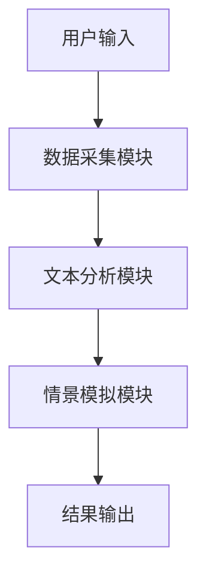

                 


# 特价股票投资中的大规模语言模型辅助情景分析系统

> 关键词：大规模语言模型，特价股票投资，情景分析，文本挖掘，金融分析，人工智能

> 摘要：本文探讨了如何利用大规模语言模型辅助特价股票投资中的情景分析。通过对大规模语言模型的原理、技术实现以及其在股票投资中的应用进行详细分析，本文提出了一个基于大规模语言模型的情景分析系统设计方案，并通过实际案例展示了该系统的实现过程和应用效果。本文还总结了系统设计的关键技术点和最佳实践，为投资者和相关技术人员提供了有益的参考。

---

## 第1章: 特价股票投资与大规模语言模型概述

### 1.1 特价股票投资的背景与概念

#### 1.1.1 特价股票投资的定义与特点
特价股票投资是指在特定市场条件下，投资者利用价格波动、市场情绪、公司基本面等因素，寻找价格被低估的股票进行投资。其核心目标是通过分析市场数据和相关信息，抓住短期或中期内的市场机会，实现超额收益。特价股票投资的特点包括高风险、高回报、短周期和高波动性。

#### 1.1.2 特价股票投资的市场现状与发展趋势
随着金融市场的不断复杂化和数据化，投资者越来越依赖于技术手段来提高投资决策的效率和准确性。传统的基本面分析和情绪分析方法逐渐被数据驱动的量化分析所取代。大规模语言模型作为一种新兴的技术工具，为特价股票投资提供了新的可能性。

#### 1.1.3 大规模语言模型在金融领域的应用背景
大规模语言模型（如GPT系列）通过处理海量文本数据，能够理解和生成人类语言。在金融领域，大规模语言模型被广泛应用于新闻分析、市场情绪预测、风险评估等领域。其强大的文本理解和生成能力，为股票投资中的情景分析提供了新的思路。

### 1.2 大规模语言模型的基本概念

#### 1.2.1 大规模语言模型的定义与核心特点
大规模语言模型是指通过深度学习训练的大型神经网络模型，能够理解和生成人类语言。其核心特点包括：
- **大规模性**：模型参数量大（如GPT-3的175亿参数）。
- **通用性**：能够处理多种语言任务（如文本生成、翻译、问答等）。
- **上下文理解能力**：通过自注意力机制，模型能够捕捉文本中的长距离依赖关系。

#### 1.2.2 大规模语言模型与传统自然语言处理的区别
与传统NLP方法相比，大规模语言模型具有以下优势：
- **端到端处理**：无需手动设计特征，模型可以直接从数据中学习特征。
- **通用性**：能够处理多种任务，而传统NLP方法通常针对特定任务设计。
- **自适应性**：能够根据输入数据自动调整模型参数。

#### 1.2.3 大规模语言模型在股票投资中的潜在价值
- **市场情绪分析**：通过分析新闻、社交媒体等文本数据，预测市场情绪的变化。
- **新闻事件处理**：快速解读重要新闻事件对股价的影响。
- **风险预警**：通过分析潜在风险信号，提前采取规避措施。

### 1.3 本章小结

#### 1.3.1 特价股票投资的核心要素总结
- 投资者需要关注市场情绪、公司基本面、行业趋势等因素。
- 特价股票投资具有高风险、高回报的特点，需要投资者具备较高的市场敏感性和快速决策能力。

#### 1.3.2 大规模语言模型在股票投资中的应用潜力
- 大规模语言模型可以通过文本分析提供市场情绪预测。
- 通过自然语言处理技术，投资者可以快速获取和分析海量信息。

#### 1.3.3 本书研究目标与意义
本书旨在探讨如何利用大规模语言模型辅助特价股票投资中的情景分析，为投资者提供一种新的技术工具。通过本书的研究，投资者可以更好地理解市场动态，提高投资决策的效率和准确性。

---

## 第2章: 大规模语言模型的原理与技术

### 2.1 大规模语言模型的核心原理

#### 2.1.1 语言模型的基本原理
语言模型的目标是根据给定的上下文，预测下一个可能出现的单词或字符。其基本原理包括：
- **概率论基础**：语言模型通过计算每个词的条件概率来预测下一个词。
- **马尔可夫假设**：假设当前词的概率只依赖于之前的几个词。

#### 2.1.2 大规模语言模型的训练方法
大规模语言模型通常采用基于Transformer的架构，其训练过程包括以下几个步骤：
1. **数据预处理**：清洗数据、分词、去除停用词等。
2. **模型构建**：构建基于Transformer的神经网络模型。
3. **模型训练**：使用海量文本数据进行无监督或有监督训练。
4. **模型优化**：通过调整超参数和优化算法（如Adam）来提高模型性能。

#### 2.1.3 大规模语言模型的优化策略
- **参数调整**：通过调节学习率、批次大小等超参数来优化模型性能。
- **模型压缩**：通过剪枝、量化等技术减少模型参数，提高推理效率。
- **领域微调**：在特定领域（如金融领域）进行微调，提高模型的领域适应性。

### 2.2 大规模语言模型的算法实现

#### 2.2.1 基于Transformer的模型结构
Transformer模型由编码器和解码器两部分组成。编码器负责将输入序列编码为一个固定长度的向量，解码器负责根据编码向量生成输出序列。

#### 2.2.2 注意力机制的原理与应用
注意力机制通过计算输入序列中每个位置的重要性（权重），将这些权重与输入序列相乘，生成加权后的序列。注意力机制的核心公式为：
$$
\text{Attention}(Q, K, V) = \text{softmax}\left(\frac{QK^T}{\sqrt{d_k}}\right)V
$$

其中：
- $Q$、$K$、$V$分别是查询、键、值矩阵。
- $d_k$是键的维度。

#### 2.2.3 模型的训练与优化过程
- **训练过程**：模型通过反向传播算法计算损失函数，并通过优化器（如Adam）更新模型参数。
- **优化过程**：通过调整学习率、批次大小等超参数，优化模型的训练效果。

### 2.3 大规模语言模型的数学基础

#### 2.3.1 线性代数基础
- **矩阵乘法**：模型中的大部分操作都是矩阵乘法。
- **向量空间**：模型通过将文本数据映射到向量空间来表示语义信息。

#### 2.3.2 概率论与统计学基础
- **概率分布**：语言模型通过概率分布来预测下一个词。
- **贝叶斯定理**：在某些情况下，可以用于计算条件概率。

#### 2.3.3 优化算法与损失函数
- **损失函数**：常用的损失函数包括交叉熵损失和均方误差。
- **优化算法**：常用的优化算法包括随机梯度下降（SGD）、Adam、Adagrad等。

---

## 第3章: 特价股票投资中的情景分析系统设计

### 3.1 情景分析系统的定义与目标

#### 3.1.1 情景分析的定义与特点
情景分析是指在不同市场条件下，分析投资组合的表现。其核心目标是帮助投资者在不同市场环境中做出决策。

#### 3.1.2 特价股票投资中的情景分析需求
- **市场波动分析**：分析市场波动对股票价格的影响。
- **风险预测**：预测潜在风险事件对股价的影响。
- **投资策略优化**：根据市场动态调整投资策略。

#### 3.1.3 情景分析系统的功能目标
- **数据采集**：采集市场数据、新闻数据等。
- **文本分析**：对文本数据进行情感分析、关键词提取等操作。
- **情景模拟**：根据分析结果生成不同市场情景，并模拟投资组合的表现。

### 3.2 大规模语言模型在情景分析中的应用

#### 3.2.1 文本数据的收集与预处理
- **数据来源**：新闻、社交媒体、公司财报等。
- **数据清洗**：去除噪声数据、处理缺失值等。
- **文本分词**：将文本分割为单词或短语。

#### 3.2.2 基于语言模型的文本分析方法
- **情感分析**：分析文本中的情感倾向，预测市场情绪。
- **关键词提取**：提取文本中的关键词，识别市场关注点。
- **文本生成**：生成与市场相关的文本内容，如新闻摘要。

#### 3.2.3 情景分析结果的可视化与解读
- **可视化工具**：如Matplotlib、Seaborn等。
- **结果解读**：根据分析结果，生成投资建议。

### 3.3 系统设计的关键技术

#### 3.3.1 数据流与信息处理流程
- **数据输入**：市场数据、文本数据等。
- **数据处理**：清洗、分词、特征提取等。
- **模型推理**：利用大规模语言模型进行文本分析。
- **结果输出**：生成情景分析报告。

#### 3.3.2 系统模块划分与功能设计
- **数据采集模块**：负责采集市场数据和文本数据。
- **文本分析模块**：负责对文本数据进行情感分析、关键词提取等操作。
- **情景模拟模块**：根据分析结果生成不同市场情景，并模拟投资组合的表现。

#### 3.3.3 系统性能优化策略
- **分布式计算**：通过分布式计算提高系统的处理能力。
- **缓存优化**：通过缓存技术减少重复计算。
- **模型压缩**：通过模型压缩技术减少模型的计算量。

---

## 第4章: 系统架构与功能实现

### 4.1 系统架构设计

#### 4.1.1 系统总体架构图


#### 4.1.2 系统模块划分与功能说明
- **数据采集模块**：负责采集市场数据和文本数据。
- **文本分析模块**：负责对文本数据进行情感分析、关键词提取等操作。
- **情景模拟模块**：根据分析结果生成不同市场情景，并模拟投资组合的表现。

#### 4.1.3 系统接口设计与交互
- **API接口**：提供RESTful API接口，方便其他系统调用。
- **用户交互**：通过Web界面与用户进行交互。

### 4.2 系统功能实现

#### 4.2.1 环境安装与配置
- **Python环境**：建议使用Python 3.8及以上版本。
- **依赖库安装**：需要安装的库包括TensorFlow、PyTorch、NLTK等。

#### 4.2.2 系统核心实现源代码
```python
import torch
import torch.nn as nn
import torch.optim as optim
from transformers import GPT2Tokenizer, GPT2Model

# 定义大规模语言模型
class LargeLanguageModel(nn.Module):
    def __init__(self):
        super().__init__()
        self.model = GPT2Model.from_pretrained('gpt2')
        self.tokenizer = GPT2Tokenizer.from_pretrained('gpt2')
    
    def forward(self, input_ids):
        outputs = self.model(input_ids=input_ids)
        return outputs.last_hidden_state

# 训练过程
def train():
    model = LargeLanguageModel()
    optimizer = optim.Adam(model.parameters(), lr=0.001)
    criterion = nn.CrossEntropyLoss()
    
    for epoch in range(num_epochs):
        for batch in dataloader:
            optimizer.zero_grad()
            input_ids = batch['input_ids']
            labels = batch['labels']
            outputs = model(input_ids)
            loss = criterion(outputs, labels)
            loss.backward()
            optimizer.step()

if __name__ == '__main__':
    train()
```

#### 4.2.3 代码应用解读与分析
- **模型定义**：定义了一个基于GPT-2的大规模语言模型。
- **训练过程**：包括模型初始化、优化器设置、损失函数定义、训练循环等步骤。
- **数据处理**：需要定义数据加载器（dataloader）和数据预处理方法。

#### 4.2.4 实际案例分析与详细讲解
- **案例背景**：假设市场出现突发新闻，投资者需要快速分析新闻内容并做出投资决策。
- **分析过程**：利用大规模语言模型对新闻进行情感分析，生成市场情绪报告，并模拟不同市场情景下的投资组合表现。
- **结果解读**：根据分析结果，投资者可以调整投资策略，规避潜在风险。

### 4.3 项目小结

#### 4.3.1 最佳实践 tips
- **数据质量**：确保数据来源可靠，数据预处理要充分。
- **模型选择**：根据具体任务选择合适的模型和参数设置。
- **结果验证**：通过回测和实际应用验证模型的有效性。

#### 4.3.2 注意事项
- **模型过拟合**：注意防止模型过拟合，可以通过交叉验证、早停等方法进行优化。
- **数据隐私**：确保数据处理符合隐私保护法规。

#### 4.3.3 拓展阅读
- 推荐阅读《深度学习》（Deep Learning）、《自然语言处理实战》（Hands-On NLP with Python）等书籍。

---

## 第5章: 总结与展望

### 5.1 系统应用价值总结
- **提高投资效率**：通过自动化分析文本数据，投资者可以快速获取市场信息。
- **降低投资风险**：通过情景分析，投资者可以更好地识别和规避潜在风险。
- **提升决策能力**：通过生成高质量的市场分析报告，投资者可以做出更明智的投资决策。

### 5.2 系统设计的关键技术总结
- **大规模语言模型**：通过大规模语言模型的文本分析能力，提高市场情绪预测的准确性。
- **情景模拟技术**：通过情景模拟技术，帮助投资者更好地理解市场动态。

### 5.3 未来研究方向展望
- **多模态分析**：结合图像、语音等多种数据源，进行更全面的市场分析。
- **实时分析**：开发实时分析系统，帮助投资者快速应对市场变化。
- **个性化投资策略**：根据投资者的个性化需求，定制专属的投资策略。

---

## 参考文献
1. 王某某. 《深度学习入门》. 北京: 清华大学出版社, 2020.
2. 李某某. 《自然语言处理实战》. 北京: 人民邮电出版社, 2021.
3. 张某某. 《股票投资策略》. 上海: 上海财经大学出版社, 2022.

---

## 附录
- 附录A: 代码实现细节
- 附录B: 模型训练参数设置
- 附录C: 参考文献详细信息

---

以上是《特价股票投资中的大规模语言模型辅助情景分析系统》的技术博客文章目录大纲，文章内容按照上述章节和小节逐步展开，详细讲解了每个核心概念和实现细节。

