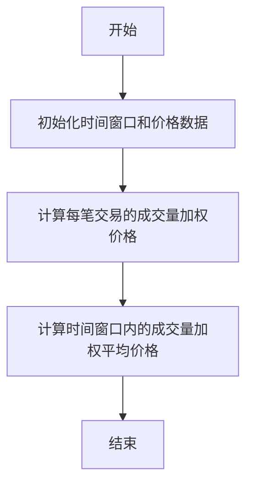
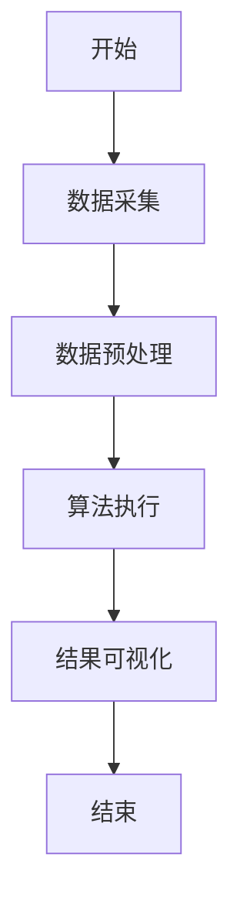
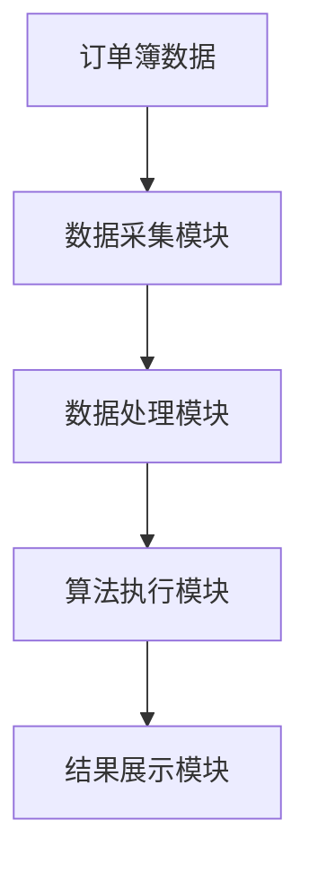
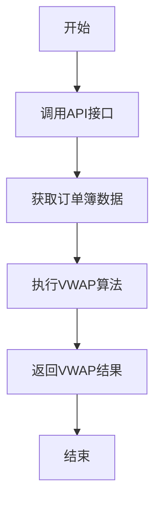

                 


# 特价股票投资中的市场微观结构分析

> 关键词：特价股票投资、市场微观结构、订单簿分析、VWAP算法、TWAP算法、市场流动性、交易成本优化

> 摘要：本文系统地分析了特价股票投资中的市场微观结构，从理论到实践，详细阐述了市场微观结构的核心概念、算法原理、系统设计与实现，以及实际案例分析。通过本文，读者将能够深入理解市场微观结构对特价股票投资的影响，并掌握如何利用这些知识优化投资策略。

---

# 第一部分: 特价股票投资的背景与概念

## 第1章: 特价股票投资的背景与概念

### 1.1 特价股票投资的背景

#### 1.1.1 特价股票的定义与特点
特价股票是指在特定时间或特定市场环境下，以低于市场价或折价形式出售的股票。其特点包括：
- **价格折扣**：特价股票通常以低于市场价出售，吸引投资者。
- **时间限制**：特价股票往往有时间限制，投资者需在特定时间内完成交易。
- **市场流动性**：特价股票的流动性较高，但价格波动较大。

#### 1.1.2 特价股票投资的兴起与发展趋势
随着金融市场的成熟和投资者对高收益低风险投资的需求增加，特价股票投资逐渐兴起。其发展趋势包括：
- **技术驱动**：利用大数据和算法交易优化投资策略。
- **市场细分**：针对不同投资者需求，推出定制化特价股票产品。
- **监管放松**：部分国家和地区放松对特价股票的监管，促进市场发展。

#### 1.1.3 特价股票与传统股票投资的区别
| 特性 | 特价股票 | 传统股票 |
|------|----------|-----------|
| 价格 | 折扣价   | 市场价     |
| 时间 | 有限制   | 无限制     |
| 风险 | 较高     | 较低       |
| 流动性 | 高       | 中等       |

---

### 1.2 市场微观结构分析的必要性

#### 1.2.1 市场微观结构的基本概念
市场微观结构是指金融市场的运行机制，包括订单簿、交易参与者、价格形成机制等。以下是市场微观结构的核心要素：
- **订单簿**：记录买方和卖方的订单及其价格、数量。
- **市场深度**：衡量市场在特定价格水平下的交易量。
- **交易成本**：包括佣金、买卖价差等。

#### 1.2.2 微观结构对特价股票投资的影响
市场微观结构对特价股票投资的影响体现在以下几个方面：
- **订单簿分析**：通过分析订单簿，投资者可以判断市场参与者的行为，优化交易策略。
- **市场流动性**：流动性高的市场能够快速成交，降低交易成本。
- **价格波动**：市场微观结构决定了价格的波动性，影响投资收益。

#### 1.2.3 投资者如何利用市场微观结构优化投资策略
投资者可以通过以下方式利用市场微观结构优化投资策略：
- **实时监控订单簿**：及时捕捉市场信号，抓住交易机会。
- **分析市场深度**：根据市场深度调整交易量和时机。
- **优化交易算法**：利用算法交易降低交易成本，提高投资收益。

---

## 第2章: 特价股票投资的核心概念与联系

### 2.1 市场微观结构的核心概念

#### 2.1.1 订单簿分析
订单簿是市场微观结构的核心工具，记录了所有未成交的订单。以下是订单簿的主要组成部分：
- **买方订单**：记录买方愿意以特定价格购买的数量。
- **卖方订单**：记录卖方愿意以特定价格出售的数量。
- **订单匹配**：根据价格优先、时间优先的原则，匹配买卖订单。

#### 2.1.2 市场深度与订单流动性
市场深度是指在特定价格水平下，市场参与者愿意交易的数量。订单流动性则是指订单在市场中迅速成交的能力。两者共同影响市场价格和交易成本。

#### 2.1.3 市场参与者的行为模式
市场参与者包括机构投资者、散户、做市商等。不同参与者的行为模式对市场价格和流动性有不同影响：
- **机构投资者**：通常以大额交易为主，影响市场价格。
- **散户**：交易量小，但数量多，对市场情绪有较大影响。
- **做市商**：提供流动性，维护市场秩序。

---

### 2.2 特价股票投资的核心要素

#### 2.2.1 特价股票的定价机制
特价股票的定价机制与传统股票不同，通常包括以下步骤：
1. **折扣定价**：根据市场需求和供给，制定折扣价格。
2. **时间限制**：设定特价股票的有效期。
3. **市场反馈**：根据市场反应调整价格和策略。

#### 2.2.2 市场微观结构对特价股票的影响
市场微观结构对特价股票的影响体现在以下几个方面：
- **订单簿分析**：通过订单簿分析，投资者可以判断市场参与者的行为，优化交易策略。
- **市场深度**：市场深度决定了特价股票的流动性，影响交易成本。
- **价格波动**：市场微观结构决定了价格的波动性，影响投资收益。

#### 2.2.3 特价股票投资的策略选择
投资者可以根据市场微观结构的特点，选择以下策略：
- **高频交易**：利用算法交易快速成交，捕捉价格波动。
- **套利策略**：利用市场价差进行套利，降低风险。
- **长期投资**：关注公司基本面，长期持有特价股票。

---

## 第3章: 市场微观结构分析的算法原理

### 3.1 常用算法概述

#### 3.1.1 VWAP（Volume-Weighted Average Price）
VWAP是一种常用的价格加权平均算法，用于优化订单执行。其公式为：
$$ VWAP = \frac{\sum_{i=1}^{n} p_i \times v_i}{\sum_{i=1}^{n} v_i} $$
其中，\( p_i \) 是第 \( i \) 笔交易的价格，\( v_i \) 是第 \( i \) 笔交易的成交量。

#### 3.1.2 TWAP（Time-Weighted Average Price）
TWAP是一种时间加权平均价格算法，适用于需要在特定时间内平均价格的场景。其公式为：
$$ TWAP = \frac{\sum_{i=1}^{n} p_i \times t_i}{\sum_{i=1}^{n} t_i} $$
其中，\( p_i \) 是第 \( i \) 笔交易的价格，\( t_i \) 是第 \( i \) 笔交易的时间间隔。

#### 3.1.3 其他相关算法
- **TWAP-VWAP混合算法**：结合时间加权和成交量加权，优化订单执行。
- **冰山订单算法**：隐藏大额订单，避免引起市场注意。

---

### 3.2 VWAP算法的数学模型

#### 3.2.1 VWAP公式推导
$$ VWAP = \frac{\sum_{i=1}^{n} p_i \times v_i}{\sum_{i=1}^{n} v_i} $$
其中，\( p_i \) 是第 \( i \) 笔交易的价格，\( v_i \) 是第 \( i \) 笔交易的成交量。

#### 3.2.2 VWAP算法流程图


---

### 3.3 算法实现与优化

#### 3.3.1 VWAP算法的Python实现
```python
import pandas as pd

def calculate_vwap(high, low, close, volume, window=20):
    data = pd.DataFrame({
        'high': high,
        'low': low,
        'close': close,
        'volume': volume
    })
    data['vwap'] = (data['high'] + data['low'] + data['close']) / 3
    data['vwap'] = data['vwap'] * data['volume'] / data['volume'].cumsum()
    data['vwap'] = data['vwap'].cumsum() / data['volume'].cumsum()
    return data['vwap'].values
```

#### 3.3.2 VWAP算法的优化
- **滑动窗口优化**：使用滑动窗口技术，减少计算量。
- **并行计算**：利用多线程或分布式计算，提高计算效率。
- **动态调整窗口大小**：根据市场波动性动态调整窗口大小。

---

## 第4章: 市场微观结构分析的系统设计与实现

### 4.1 系统功能设计

#### 4.1.1 系统功能模块
- **数据采集模块**：采集订单簿数据、市场深度数据等。
- **算法执行模块**：实现VWAP、TWAP等算法。
- **数据可视化模块**：展示市场微观结构的动态变化。

#### 4.1.2 系统功能流程图


---

### 4.2 系统架构设计

#### 4.2.1 系统架构图


---

### 4.3 系统接口设计

#### 4.3.1 API接口设计
- **输入接口**：订单簿数据、市场深度数据。
- **输出接口**：VWAP、TWAP等算法结果。

#### 4.3.2 接口交互流程图


---

## 第5章: 项目实战与案例分析

### 5.1 项目背景与目标
本项目旨在通过分析市场微观结构，优化特价股票的投资策略。

### 5.2 项目实现

#### 5.2.1 环境安装
```bash
pip install pandas numpy matplotlib
```

#### 5.2.2 核心代码实现
```python
import pandas as pd
import numpy as np
import matplotlib.pyplot as plt

def calculate_vwap(high, low, close, volume, window=20):
    data = pd.DataFrame({
        'high': high,
        'low': low,
        'close': close,
        'volume': volume
    })
    data['vwap'] = (data['high'] + data['low'] + data['close']) / 3
    data['vwap'] = data['vwap'] * data['volume'] / data['volume'].cumsum()
    data['vwap'] = data['vwap'].cumsum() / data['volume'].cumsum()
    return data['vwap'].values

# 示例数据
high = [100, 101, 102, 103, 104]
low = [98, 99, 100, 101, 102]
close = [100, 101, 102, 103, 104]
volume = [1000, 2000, 1500, 1200, 800]

vwap_result = calculate_vwap(high, low, close, volume)
print(vwap_result)
```

#### 5.2.3 代码解读与分析
- **数据采集**：从订单簿中采集高、低、收盘价和成交量数据。
- **VWAP计算**：通过加权平均计算VWAP价格。
- **结果展示**：将VWAP结果可视化，展示价格变化趋势。

---

### 5.3 实际案例分析

#### 5.3.1 案例背景
假设某公司在特定时间内推出特价股票，投资者需要在限定时间内完成交易。

#### 5.3.2 数据分析
- **订单簿分析**：分析订单簿数据，判断市场参与者的行为。
- **VWAP计算**：计算VWAP价格，优化订单执行。

#### 5.3.3 投资策略优化
通过分析市场微观结构，优化投资策略，降低交易成本，提高投资收益。

---

## 第6章: 最佳实践与注意事项

### 6.1 最佳实践
- **数据质量**：确保数据的准确性和实时性。
- **算法优化**：根据市场环境动态调整算法参数。
- **风险管理**：制定合理的风险管理策略，降低投资风险。

### 6.2 注意事项
- **数据延迟**：市场微观结构分析依赖于实时数据，数据延迟会影响分析结果。
- **市场波动**：市场波动较大时，需要及时调整投资策略。
- **监管风险**：特价股票投资可能面临监管风险，需密切关注相关政策变化。

---

## 第7章: 总结与展望

### 7.1 总结
通过本文的分析，读者可以深入了解市场微观结构对特价股票投资的影响，并掌握如何利用这些知识优化投资策略。

### 7.2 展望
未来，随着人工智能和大数据技术的发展，市场微观结构分析将更加精准和高效，为投资者提供更好的投资机会。

--- 

# 结语
特价股票投资中的市场微观结构分析是一个复杂但充满潜力的领域。通过深入理解市场微观结构，投资者可以优化投资策略，提高投资收益。希望本文能为读者提供有价值的 insights，帮助他们在特价股票投资中取得成功。

