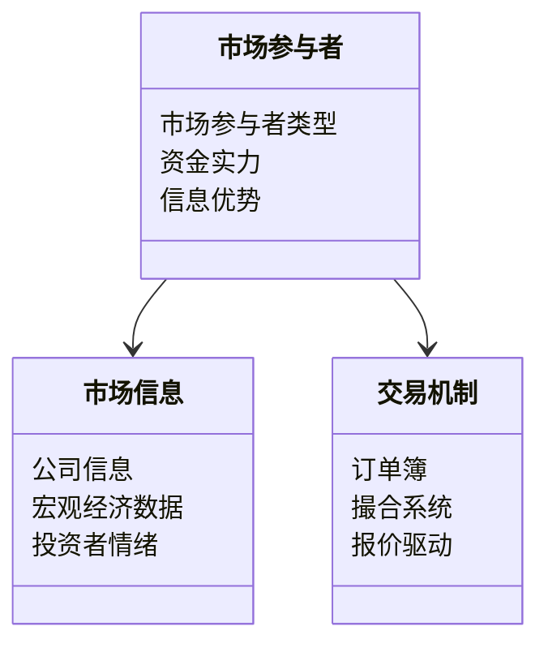
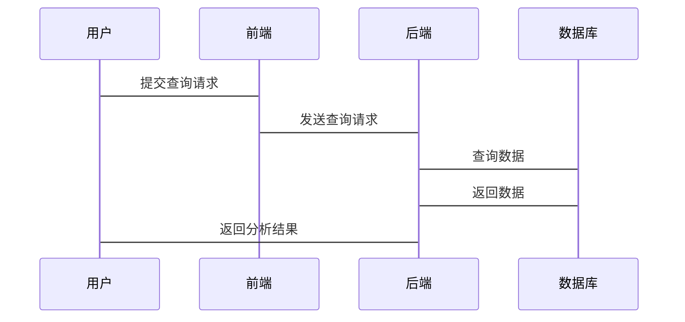

                 


# 第一部分: 特价股票投资中的市场微观结构分析

## 第1章: 特价股票投资的背景与概念

### 1.1 特价股票投资的定义与特点
#### 1.1.1 特价股票的定义
特价股票通常指的是价格相对较低的股票，通常具有较高的波动性和潜在的高回报率。这些股票可能来自小盘股或业绩不佳的公司，但具有长期增值的潜力。

#### 1.1.2 特价股票投资的特点
- **低估值**：特价股票通常被市场低估，具有较高的潜在增值空间。
- **高波动性**：这些股票价格波动较大，投资者需要具备较高的风险承受能力。
- **高风险**：由于公司基本面可能存在问题，投资风险较高。
- **长期潜力**：尽管当前表现不佳，但具备在未来扭亏为盈的潜力。

#### 1.1.3 特价股票与普通股票的区别
- **价格**：特价股票价格较低，普通股票价格较高。
- **波动性**：特价股票波动性较大，普通股票波动性较小。
- **风险**：特价股票风险较高，普通股票风险相对较低。
- **投资策略**：特价股票投资需要更谨慎的选择和长期持有，普通股票投资策略更为多样化。

### 1.2 市场微观结构的基本概念
#### 1.2.1 市场微观结构的定义
市场微观结构是指市场中参与者、交易机制和信息流动的结构和运作方式，是影响市场价格形成的重要因素。

#### 1.2.2 市场微观结构的核心要素
- **市场参与者**：包括机构投资者、个人投资者、做市商等。
- **市场信息**：包括公司财务数据、市场新闻、分析师报告等。
- **交易机制**：包括订单簿、撮合系统、报价驱动等。

#### 1.2.3 市场微观结构与股票价格的关系
市场微观结构通过影响信息流动和交易成本，进而影响股票价格的形成。良好的市场微观结构能够提高市场的流动性和透明度，促进价格的合理形成。

### 1.3 特价股票投资与市场微观结构的关系
#### 1.3.1 特价股票投资的市场环境
特价股票通常在流动性较低的市场中交易，市场参与者较少，信息不对称较为严重。

#### 1.3.2 市场微观结构对特价股票的影响
- **流动性**：流动性较低的市场可能导致特价股票买卖价差较大。
- **信息不对称**：市场参与者之间的信息不对称可能影响特价股票的价格发现。
- **交易成本**：较高的交易成本可能影响投资者的收益。

#### 1.3.3 特价股票投资中的微观结构分析方法
- **订单簿分析**：通过分析订单簿中的买盘和卖盘情况，判断市场的买卖力量。
- **交易量分析**：通过分析交易量的变化，判断市场的趋势和强度。
- **参与者行为分析**：分析不同市场参与者的交易行为，判断市场的潜在动向。

## 第2章: 市场微观结构的核心概念与联系

### 2.1 市场微观结构的核心要素
#### 2.1.1 市场参与者
- **机构投资者**：包括基金、保险公司等，通常具有较大的资金实力和信息优势。
- **个人投资者**：包括散户，通常投资金额较小，信息获取能力较弱。
- **做市商**：负责提供流动性，撮合买卖双方的交易。

#### 2.1.2 市场信息
- **公司信息**：包括财务报表、管理层变动、重大事件等。
- **市场信息**：包括宏观经济数据、行业动态、政策变化等。
- **投资者情绪**：包括市场参与者的心理预期和行为模式。

#### 2.1.3 市场交易机制
- **订单簿**：记录买方和卖方的订单，显示当前市场的买卖价格和数量。
- **撮合系统**：根据订单簿中的订单，自动撮合成交。
- **报价驱动**：交易价格由买方和卖方的报价驱动。

### 2.2 核心概念的原理与特征对比
#### 2.2.1 市场参与者属性对比表
| 市场参与者类型 | 资金实力 | 信息优势 | 交易策略 | 风险承受能力 |
|----------------|----------|----------|----------|--------------|
| 机构投资者     | 强        | 高        | 长期价值投资 | 中            |
| 个人投资者     | 弱        | 低        | 技术交易   | 高            |
| 做市商         | 中        | 中        | 维持流动性 | 低            |

#### 2.2.2 市场信息的特征分析
- **信息不对称**：不同参与者之间信息获取的不平等可能影响市场价格。
- **信息传播速度**：信息传播的速度和广度影响市场的反应速度。
- **信息质量**：信息的准确性和及时性影响市场的价格发现。

#### 2.2.3 交易机制的类型与优缺点
- **订单簿交易**：优点是透明度高，缺点是流动性可能较低。
- **报价驱动交易**：优点是流动性高，缺点是价格可能被操控。
- **撮合交易**：优点是公平性高，缺点是交易成本较高。

### 2.3 市场微观结构的ER实体关系图
```mermaid
er
  actor 市场参与者
  actor 做市商
  actor 机构投资者
  actor 个人投资者
  entity 市场信息
  entity 公司信息
  entity 交易机制
  entity 交易量
  entity 买卖价差
  entity 市场参与者行为
  市场参与者 --> 市场信息
  市场参与者 --> 交易机制
  市场参与者 --> 市场参与者行为
  公司信息 --> 市场信息
  交易量 --> 交易机制
  买卖价差 --> 交易机制
```

## 第3章: 市场微观结构的算法原理

### 3.1 市场微观结构分析的算法选择
#### 3.1.1 订单簿分析算法
- **目标**：分析订单簿中的买卖盘情况，判断市场的买卖力量。
- **步骤**：
  1. 数据采集：获取订单簿数据，包括买盘和卖盘的价格和数量。
  2. 数据处理：计算买盘和卖盘的总量，判断买卖力量的强弱。
  3. 数据分析：比较买盘和卖盘的总量，判断市场的供需关系。

#### 3.1.2 交易策略优化算法
- **目标**：优化交易策略，提高投资收益。
- **步骤**：
  1. 数据采集：获取历史交易数据和市场信息。
  2. 数据分析：分析历史数据，找出价格波动的规律。
  3. 策略制定：制定基于市场微观结构的交易策略，如套利策略、动量策略等。
  4. 策略优化：通过回测和风险评估，优化交易策略。

### 3.2 算法原理的数学模型和公式
#### 3.2.1 买卖价差计算公式
$$买卖价差 = 卖出价 - 买入价$$

#### 3.2.2 交易量分析公式
$$交易量强度 = \frac{交易量}{股票流通量}$$

#### 3.2.3 市场参与者行为分析模型
$$行为分析 = \sum_{i=1}^{n} (行为特征_i \times 权重_i)$$

### 3.3 算法实现与代码示例
#### 3.3.1 订单簿分析算法的Python代码
```python
import pandas as pd

# 假设order_book是包含买盘和卖盘数据的DataFrame
def calculate_buy_sell_volume(order_book):
    buy_volume = order_book['buy'].sum()
    sell_volume = order_book['sell'].sum()
    return buy_volume, sell_volume

# 示例数据
order_book = pd.DataFrame({
    'buy': [100, 200, 300],
    'sell': [150, 250, 350]
})

buy_volume, sell_volume = calculate_buy_sell_volume(order_book)
print("Buy Volume:", buy_volume)
print("Sell Volume:", sell_volume)
```

#### 3.3.2 交易策略优化算法的Python代码
```python
import pandas as pd

# 假设price_data是包含历史价格和交易量的DataFrame
def optimize_trading_strategy(price_data):
    # 计算动量指标
    price_data['momentum'] = price_data['close'].pct_change().cumsum()
    # 选择动量指标较高的交易日
    price_data['signal'] = price_data['momentum'].apply(lambda x: 1 if x > 0 else -1)
    return price_data

# 示例数据
price_data = pd.DataFrame({
    'close': [100, 105, 103, 108, 110]
})

optimized_strategy = optimize_trading_strategy(price_data)
print(optimized_strategy)
```

## 第4章: 市场微观结构的系统分析与架构设计

### 4.1 系统分析与架构设计概述
#### 4.1.1 问题场景介绍
- **目标**：设计一个基于市场微观结构的特价股票投资分析系统。
- **问题**：如何利用市场微观结构分析，提高特价股票投资的收益和风险控制。
- **边界**：系统仅考虑市场微观结构因素，不涉及宏观经济分析。

#### 4.1.2 项目介绍
- **项目目标**：开发一个能够分析市场微观结构，提供投资建议的系统。
- **项目范围**：包括数据采集、分析、策略制定和结果展示。
- **项目背景**：随着市场微观结构的复杂化，投资者需要更专业的工具来进行投资分析。

### 4.2 系统功能设计
#### 4.2.1 领域模型设计


#### 4.2.2 系统架构设计


#### 4.2.3 系统接口设计
- **输入接口**：数据采集接口，接收订单簿数据、市场信息等。
- **输出接口**：结果展示接口，输出分析报告、投资建议等。

#### 4.2.4 系统交互流程图


## 第5章: 市场微观结构的项目实战

### 5.1 环境安装与配置
#### 5.1.1 安装Python和必要的库
- **Python**：安装最新版本的Python。
- **Pandas**：用于数据处理。
- **Matplotlib**：用于数据可视化。
- **Mermaid**：用于流程图绘制。

#### 5.1.2 安装与配置步骤
1. 下载并安装Python。
2. 使用pip安装pandas、numpy、matplotlib。
3. 配置Jupyter Notebook，用于代码开发和测试。

### 5.2 系统核心实现
#### 5.2.1 核心代码实现
```python
import pandas as pd
import matplotlib.pyplot as plt

# 数据采集与处理
def collect_data(ticker):
    # 假设data是包含订单簿数据的DataFrame
    data = pd.DataFrame({
        'buy_price': [90, 91, 92],
        'buy_volume': [100, 200, 300],
        'sell_price': [93, 94, 95],
        'sell_volume': [150, 250, 350]
    })
    return data

# 数据分析与可视化
def analyze_data(data):
    buy_volumes = data['buy_volume'].sum()
    sell_volumes = data['sell_volume'].sum()
    plt.bar(['Buy', 'Sell'], [buy_volumes, sell_volumes])
    plt.title('Buy vs Sell Volume')
    plt.show()

# 策略制定与优化
def optimize_strategy(data):
    # 假设优化策略为买卖价差最小化
    min_diff = min(abs(data['buy_price'] - data['sell_price']))
    return min_diff

# 示例运行
data = collect_data('TSLA')
analyze_data(data)
min_diff = optimize_strategy(data)
print("Minimum price difference:", min_diff)
```

#### 5.2.2 代码功能解读
- **数据采集**：从指定股票代码获取订单簿数据。
- **数据分析**：计算买盘和卖盘的总量，绘制柱状图进行可视化。
- **策略优化**：寻找买卖价差最小的交易机会，降低交易成本。

### 5.3 实际案例分析与详细讲解
#### 5.3.1 案例背景
假设我们选择一只特价股票，代码为AAPL，当前价格为50美元，市场流动性较低，买卖价差较大。

#### 5.3.2 数据分析与结果解读
- **订单簿分析**：买盘总量为500股，卖盘总量为600股，显示卖盘力量略强于买盘。
- **交易量分析**：过去一个月交易量呈下降趋势，显示市场关注度降低。
- **市场参与者行为分析**：大部分交易由个人投资者完成，机构投资者参与度较低。

#### 5.3.3 投资策略制定与优化
- **短期策略**：由于卖盘力量较强，建议暂时观望，等待更好的买入机会。
- **长期策略**：关注公司基本面，寻找潜在的扭亏为盈的机会。

### 5.4 项目小结
通过实际案例分析，我们验证了市场微观结构分析在特价股票投资中的应用。订单簿分析和交易量分析为我们提供了重要的决策依据，帮助我们在复杂的市场环境中制定合理的投资策略。

## 第6章: 市场微观结构的最佳实践与总结

### 6.1 最佳实践
#### 6.1.1 数据来源的选择
- **可靠性**：选择可靠的第三方数据源，如Yahoo Finance、Google Finance等。
- **实时性**：确保数据的实时更新，避免使用过时的数据。

#### 6.1.2 风险管理
- **止损策略**：设定止损点，避免亏损过大。
- **分散投资**：将资金分散投资于多只股票，降低风险。

#### 6.1.3 持续学习
- **市场动态**：密切关注市场动态，及时调整投资策略。
- **技术更新**：学习最新的数据分析技术，提高分析效率。

### 6.2 小结
通过系统的学习和实际案例分析，我们掌握了市场微观结构分析在特价股票投资中的应用方法。从订单簿分析到交易策略优化，每一个步骤都为我们提供了重要的决策支持，帮助我们在复杂的市场环境中实现投资目标。

### 6.3 注意事项
- **数据质量**：确保数据的准确性和完整性，避免因数据问题导致的错误决策。
- **市场变化**：密切关注市场变化，及时调整分析模型和投资策略。
- **法律合规**：遵守相关法律法规，确保投资行为的合法性。

### 6.4 拓展阅读
- **书籍推荐**：《算法交易：利用数学与计算机科学的艺术》
- **在线课程**：Coursera上的《金融市场与投资》
- **博客文章**：QuantInsti的交易策略博客

## 第7章: 项目总结与未来展望

### 7.1 项目总结
通过本项目，我们深入探讨了市场微观结构在特价股票投资中的应用，掌握了订单簿分析、交易策略优化等核心技能。这些技能为我们提供了强大的工具，帮助我们在复杂的市场环境中制定合理的投资策略。

### 7.2 未来展望
随着市场微观结构的复杂化和数据技术的不断发展，特价股票投资分析将更加依赖于先进的数据分析和技术支持。未来，我们可以进一步研究机器学习在市场微观结构分析中的应用，开发更加智能化的投资工具，提高投资效率和收益。

### 7.3 致谢
感谢读者的耐心阅读，感谢合作伙伴的支持，感谢家人和朋友的理解和鼓励。

