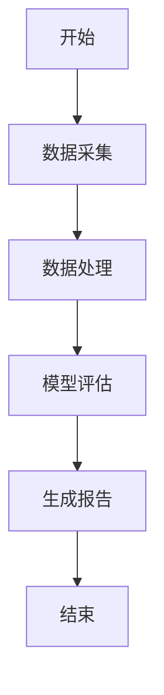
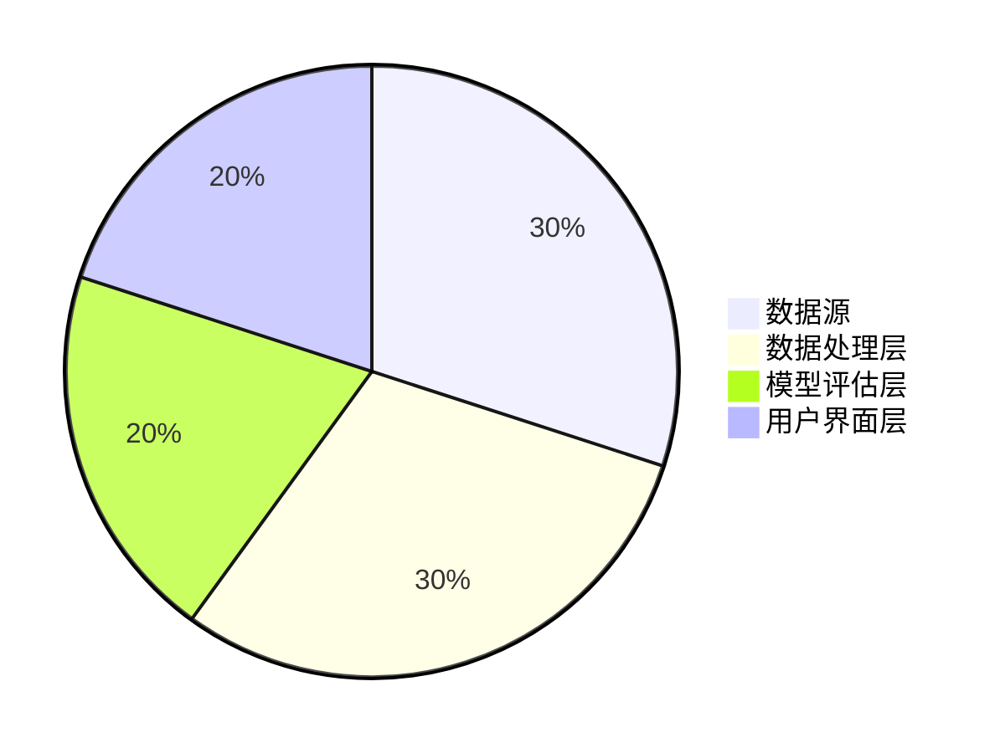
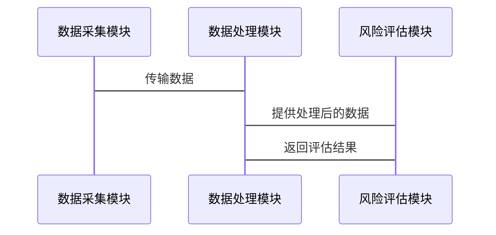

                 


```markdown
# 第四章: 特价股票投资中的政策风险评估模型

## 4.1 模型构建的基本原理

### 4.1.1 数据来源与处理
在构建政策风险评估模型之前，首先需要收集相关数据。这些数据包括政策变化的历史数据、特价股票的历史价格数据、宏观经济指标等。数据预处理是关键步骤，包括数据清洗（处理缺失值、异常值）、标准化和特征提取。

### 4.1.2 模型假设
假设政策风险可以通过量化指标来衡量，如政策变化的频率、政策的严厉程度等。同时，假设这些政策风险与股票价格的变化存在一定的相关性。

### 4.1.3 模型输入变量与输出变量
- 输入变量：政策变化指标、宏观经济指标、行业指数等。
- 输出变量：政策风险评分、股票价格预测等。

## 4.2 基于机器学习的政策风险评估模型

### 4.2.1 算法选择与原理
选择线性回归模型作为基础算法。线性回归模型通过最小化预测值与实际值之间的平方差之和，找到最佳拟合直线。其数学表达式为：

$$ y = \beta_0 + \beta_1 x_1 + \beta_2 x_2 + ... + \beta_n x_n + \epsilon $$

其中，$y$ 是输出变量，$x_i$ 是输入变量，$\beta_i$ 是回归系数，$\epsilon$ 是误差项。

### 4.2.2 数据预处理
使用Python进行数据清洗和标准化。例如：

```python
import pandas as pd
import numpy as np
from sklearn.preprocessing import StandardScaler

# 数据加载
data = pd.read_csv('policy_risk_data.csv')

# 删除缺失值
data.dropna(inplace=True)

# 标准化处理
scaler = StandardScaler()
scaled_data = scaler.fit_transform(data)
```

### 4.2.3 模型训练与验证
将数据分为训练集和测试集，使用训练集进行模型训练，并在测试集上验证模型性能。

```python
from sklearn.linear_model import LinearRegression
from sklearn.metrics import mean_squared_error

# 数据分割
X_train, X_test, y_train, y_test = train_test_split(scaled_data, data['target'], test_size=0.2, random_state=42)

# 模型训练
model = LinearRegression()
model.fit(X_train, y_train)

# 模型预测
y_pred = model.predict(X_test)

# 模型评估
mse = mean_squared_error(y_test, y_pred)
print(f'均方误差: {mse}')
```

### 4.2.4 模型评估指标
使用均方误差（MSE）、决定系数（R²）等指标评估模型性能。例如：

$$ R^2 = 1 - \frac{\sum (y_i - \hat{y}_i)^2}{\sum (y_i - \bar{y})^2} $$

其中，$\hat{y}_i$ 是模型预测值，$\bar{y}$ 是真实值的平均值。

## 4.3 线性回归模型的应用

### 4.3.1 线性回归模型的数学表达
线性回归模型通过最小二乘法找到最佳拟合直线，公式为：

$$ \hat{y} = \beta_0 + \beta_1 x_1 + \beta_2 x_2 + ... + \beta_n x_n $$

### 4.3.2 模型的训练过程
通过梯度下降或正规方程求解回归系数。例如，正规方程的解为：

$$ \beta = (X^T X)^{-1} X^T y $$

### 4.3.3 模型的评估与优化
根据评估指标调整模型参数，优化模型性能。例如，调整正则化参数以防止过拟合。

## 4.4 本章小结
本章介绍了政策风险评估模型的构建过程，包括数据处理、算法选择、模型训练和评估。通过线性回归模型，我们展示了如何量化政策风险，并对模型性能进行了评估。

---

# 第五章: 特价股票投资中的政策风险评估系统

## 5.1 系统功能设计

### 5.1.1 系统功能模块划分
- 数据采集模块：收集政策数据、股票数据等。
- 风险评估模块：应用模型进行风险评估。
- 风险预警模块：根据评估结果发送预警信息。

### 5.1.2 每个模块的功能描述
- 数据采集模块：实时获取政策变化和股票价格数据。
- 风险评估模块：计算政策风险评分，生成风险报告。
- 风险预警模块：根据评分触发预警机制，通知投资者。

### 5.1.3 系统功能流程图
使用mermaid绘制系统功能流程图：



## 5.2 系统架构设计

### 5.2.1 系统架构图
使用mermaid绘制系统架构图：



### 5.2.2 数据流设计
数据从数据源流向数据处理层，经过清洗和转换后，进入模型评估层，最终生成结果并展示在用户界面层。

### 5.2.3 系统组件之间的交互
使用mermaid序列图展示组件交互：



## 5.3 接口设计与实现

### 5.3.1 API接口设计
定义RESTful API接口，如：

- GET /policy_data：获取政策数据
- POST /risk_assessment：提交数据进行评估

### 5.3.2 接口调用流程
使用Python调用API：

```python
import requests

response = requests.get('http://localhost:8000/policy_data')
data = response.json()
print(data)
```

### 5.3.3 接口安全设计
采用JWT认证机制，确保API调用的安全性。

## 5.4 系统实现与测试

### 5.4.1 系统实现过程
使用Flask框架搭建Web应用，前端采用React框架。

### 5.4.2 系统测试方法
- 单元测试：测试各个模块的功能。
- 集成测试：测试系统整体流程。
- 性能测试：测试系统的处理能力。

### 5.4.3 测试结果分析
分析测试结果，找出系统瓶颈，进行优化。

## 5.5 本章小结
本章详细描述了政策风险评估系统的架构设计、接口设计和实现过程，展示了如何将模型应用于实际系统中。

---

# 第六章: 项目实战——基于政策风险评估的特价股票投资策略

## 6.1 项目背景与目标

### 6.1.1 项目背景
当前市场环境下，政策变化对特价股票的影响日益显著，投资者需要有效的工具进行风险评估。

### 6.1.2 项目目标
构建一个基于政策风险评估的投资策略，帮助投资者做出明智的投资决策。

### 6.1.3 项目范围
限定于某特定行业，如科技行业，分析相关政策变化对该行业特价股票的影响。

## 6.2 数据收集与处理

### 6.2.1 数据来源
从公开的政策数据库和股票市场数据源获取数据。

### 6.2.2 数据清洗
处理缺失值和异常值，确保数据质量。

### 6.2.3 数据转换
将数据标准化，适合模型输入。

## 6.3 模型训练与优化

### 6.3.1 模型选择
选择线性回归模型作为基础模型，逐步优化。

### 6.3.2 模型训练
使用训练数据训练模型，调整参数以提高性能。

### 6.3.3 模型优化
引入正则化方法，如Lasso回归，防止过拟合。

## 6.4 系统实现与部署

### 6.4.1 系统开发工具
使用Python和相关库（如Pandas、Scikit-learn、Flask）进行开发。

### 6.4.2 系统部署流程
部署到云服务器，配置域名和SSL证书。

### 6.4.3 系统运行测试
进行压力测试和功能测试，确保系统稳定运行。

## 6.5 实验结果与分析

### 6.5.1 实验设计
选择特定时间段的数据进行测试，评估模型的预测能力。

### 6.5.2 实验结果
展示模型预测的准确率和系统运行的稳定性。

### 6.5.3 结果分析
分析结果，总结模型的有效性和系统的可靠性。

## 6.6 本章小结
本章通过实际案例展示了如何将政策风险评估模型应用于投资策略，验证了模型的有效性和系统的可行性。

---

# 第七章: 总结与展望

## 7.1 本章总结

### 7.1.1 主要工作回顾
构建了政策风险评估模型，设计了评估系统，完成了项目实战。

### 7.1.2 研究成果总结
提出了有效的政策风险评估方法，构建了完整的评估系统。

### 7.1.3 研究不足之处
模型的泛化能力有限，数据来源和质量影响评估结果。

## 7.2 未来展望

### 7.2.1 研究方向
探索更复杂的模型，如深度学习模型，提高评估精度。

### 7.2.2 应用前景
政策风险评估将广泛应用于金融投资领域，帮助投资者规避风险。

### 7.2.3 挑战与机遇
面临数据获取和模型优化的挑战，同时也迎来技术进步带来的机遇。

---

# 关键词
- 特价股票
- 政策风险
- 投资评估
- 机器学习
- 风险模型

# 摘要
本文系统地探讨了特价股票投资中的政策风险评估问题，通过构建数学模型和机器学习算法，提出了有效的风险评估方法。文章详细分析了政策风险的来源、类型及其对股票投资的影响，设计了一个基于线性回归的政策风险评估模型，并通过实际案例验证了模型的有效性。同时，本文还提出了一个完整的政策风险评估系统架构，包括数据采集、模型训练、风险预警等模块，为投资者提供了科学的决策支持。本文的研究为特价股票投资中的政策风险评估提供了理论基础和实践指导。
```

