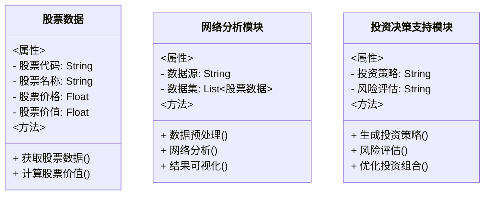
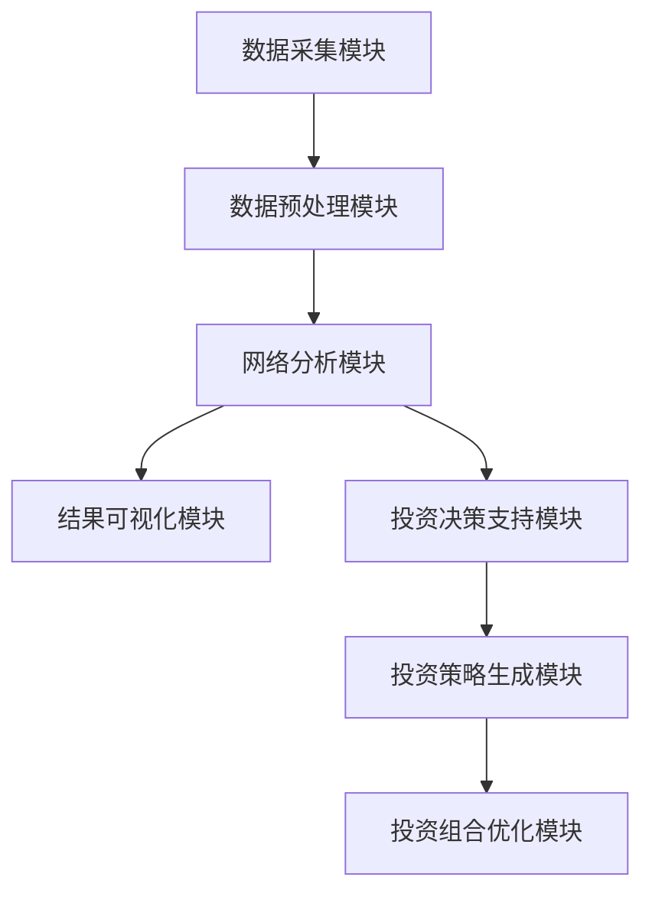
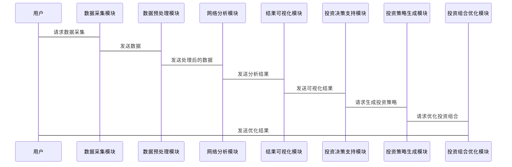

                 


# 特价股票投资中的数字产业价值网络分析方法

---

## 关键词

- 特价股票投资
- 数字产业
- 价值网络
- 网络分析
- 股票价值评估

---

## 摘要

随着数字经济的快速发展，数字产业在经济中的地位日益重要。特价股票投资作为一种追求超额收益的投资策略，其核心在于发现被市场低估的优质股票。然而，传统的股票分析方法往往忽视了数字产业内部复杂的价值网络关系。本文通过分析数字产业中的价值网络结构，提出一种基于网络分析的特价股票投资方法，帮助投资者更好地识别投资机会。文章详细介绍了数字产业价值网络的核心要素、分析框架、算法实现以及系统架构设计，并通过实际案例展示了该方法的应用效果。

---

## 第1章: 特价股票投资的背景与意义

### 1.1 特价股票投资的基本概念

#### 1.1.1 什么是特价股票

特价股票是指市场价格低于其内在价值的股票。这种股票通常被市场低估，具有较大的上涨潜力。投资者通过挖掘这些股票，能够在市场复苏或公司基本面改善时获得超额收益。

#### 1.1.2 特价股票投资的核心目标

特价股票投资的核心目标是通过分析股票的内在价值，识别市场价格低于内在价值的股票。投资者通常关注以下几个方面：

- 公司基本面：收入、利润、资产质量等。
- 市场估值：市盈率、市净率等。
- 市场情绪：投资者情绪对股价的影响。

#### 1.1.3 特价股票与普通股票的区别

特价股票与普通股票的主要区别在于其市场价格与内在价值的偏离程度。特价股票通常具有较高的安全边际，即市场价格远低于其内在价值，而普通股票的价格往往接近或高于其内在价值。

---

### 1.2 数字产业的定义与特征

#### 1.2.1 数字产业的范畴

数字产业是指以数字技术为核心驱动力的产业，包括信息技术、互联网、人工智能、大数据、云计算等领域。数字产业的特点是技术更新快、市场变化频繁，且具有较高的成长性。

#### 1.2.2 数字产业的核心驱动力

数字产业的核心驱动力包括：

- 技术创新：人工智能、大数据、区块链等技术的快速发展推动了数字产业的扩张。
- 数字化转型：传统企业通过数字化转型，将业务流程、商业模式等迁移到数字平台。
- 市场需求：消费者对数字化产品和服务的需求不断增长。

#### 1.2.3 数字产业对经济的影响

数字产业对经济的影响主要体现在以下几个方面：

- 提高生产效率：数字技术的应用可以降低企业的运营成本，提高生产效率。
- 创造新的商业模式：数字产业催生了新的商业模式，例如订阅制、共享经济等。
- 促进经济增长：数字产业通过技术创新和市场扩展，推动经济增长。

---

### 1.3 价值网络分析方法的必要性

#### 1.3.1 价值网络的概念

价值网络是指企业在供应链、合作伙伴、客户等各方之间的价值传递关系。在数字产业中，企业之间的合作往往通过数字平台实现，形成了复杂的网络关系。

#### 1.3.2 数字产业中的价值网络特点

数字产业中的价值网络具有以下特点：

- 网络化：企业之间的合作关系通过数字平台实现，形成了复杂的网络结构。
- 动态化：数字技术的快速更新和市场需求的变化，使得价值网络具有较高的动态性。
- 多维性：价值网络涉及企业的多个维度，包括技术、市场、财务等。

#### 1.3.3 价值网络分析对投资决策的意义

价值网络分析可以帮助投资者更好地理解数字产业中的企业关系，识别潜在的投资机会。具体来说，价值网络分析可以帮助投资者：

- 识别关键企业：通过分析网络中的关键节点，识别对整个网络具有重要影响的企业。
- 评估企业风险：通过分析网络中的依赖关系，评估企业在市场中的风险敞口。
- 发现投资机会：通过分析网络中的潜在合作机会，发现具有成长潜力的企业。

---

## 第2章: 数字产业价值网络的核心要素

### 2.1 数字产业价值网络的构成

#### 2.1.1 产业链的上下游关系

数字产业的产业链通常包括以下几个环节：

- **上游**：提供数字技术的核心组件，例如芯片、服务器、网络设备等。
- **中游**：提供数字平台和服务，例如云服务、大数据分析、人工智能解决方案等。
- **下游**：提供数字化产品和服务，例如智能设备、数字化内容等。

#### 2.1.2 核心企业与配套企业的作用

在数字产业中，核心企业通常是指那些在产业链中处于核心地位的企业，例如科技巨头（如苹果、谷歌、亚马逊等）。配套企业则包括为这些核心企业提供支持的企业，例如软件开发公司、硬件制造商等。

#### 2.1.3 用户需求与市场反馈的双向影响

数字产业中的用户需求和市场反馈对企业的生产和创新活动具有重要的影响。例如，消费者对数字化产品的反馈可以帮助企业优化产品设计，提高用户体验。

---

### 2.2 价值网络分析的核心要素

#### 2.2.1 企业间的合作关系

企业间的合作关系是数字产业价值网络的重要组成部分。例如，一家软件公司可能与一家硬件制造商合作，共同开发智能设备。

#### 2.2.2 资源分配与利益共享

在数字产业中，资源分配和利益共享通常是通过合同或协议实现的。例如，一家科技公司可能与合作伙伴分享技术资源，共同开发新的产品。

#### 2.2.3 技术创新与产业整合

技术创新是数字产业发展的核心驱动力。通过技术创新，企业可以提高产品竞争力，扩大市场份额。同时，产业整合也是数字产业的重要特征，通过并购和重组，企业可以快速扩大规模，增强竞争力。

---

### 2.3 数字产业价值网络的数学模型

#### 2.3.1 网络中心性分析公式

网络中心性分析是用来度量网络中节点的重要程度。常用的网络中心性指标包括：

- **度数中心性**：度数中心性是指一个节点的直接邻居数量。公式为：
  $$ C_d(i) = \frac{\sum_{j=1}^{n} A_{ij}}{n-1} $$
  其中，$A_{ij}$ 是邻接矩阵的元素，$n$ 是网络中的节点总数。

- **接近中心性**：接近中心性是指一个节点到其他节点的平均距离。公式为：
  $$ C_c(i) = \frac{1}{\sum_{j=1}^{n} d_{ij}} $$
  其中，$d_{ij}$ 是节点 $i$ 和节点 $j$ 之间的最短距离。

- **特征向量中心性**：特征向量中心性是通过特征向量分解来度量节点的重要性。公式为：
  $$ A x = \lambda x $$
  其中，$A$ 是邻接矩阵，$x$ 是特征向量，$\lambda$ 是特征值。

---

#### 2.3.2 节点权重计算方法

节点权重计算方法是用来度量网络中节点的重要程度。常用的节点权重计算方法包括：

- **度数权重**：度数权重是指一个节点的度数与其总度数的平均值的比值。公式为：
  $$ w_i = \frac{C_d(i)}{\sum_{j=1}^{n} C_d(j)} $$

- **PageRank算法**：PageRank算法是一种基于概率的节点权重计算方法。公式为：
  $$ PR(i) = \sum_{j=1}^{n} \frac{PR(j)}{OutDegree(j)} \cdot A_{ji} $$

---

#### 2.3.3 网络影响力评估模型

网络影响力评估模型是用来评估网络中节点的影响力。常用的网络影响力评估模型包括：

- **影响力传播模型**：影响力传播模型通过模拟信息在网络中的传播，评估节点的影响力。公式为：
  $$ I_i = \sum_{j=1}^{n} A_{ij} \cdot I_j $$

- **最大影响力选择模型**：最大影响力选择模型通过选择具有最大影响力的节点，评估网络的整体影响力。公式为：
  $$ \max_{i} I_i $$

---

## 第3章: 数字产业价值网络的算法实现

### 3.1 数据预处理与特征提取

#### 3.1.1 数据清洗方法

数据清洗是数据预处理的重要步骤，包括去除重复数据、处理缺失值、删除异常值等。例如，可以通过以下步骤清洗数据：

1. 读取数据集。
2. 检查数据集中的重复数据，去除重复记录。
3. 处理缺失值，例如使用均值、中位数或插值方法填补缺失值。
4. 删除异常值，例如使用Z-score方法或IQR方法。

#### 3.1.2 特征选择策略

特征选择策略是通过选择对目标变量具有较高影响的特征，提高模型的性能。常用的特征选择方法包括：

- **相关性分析**：计算特征与目标变量的相关性，选择相关性较高的特征。
- **主成分分析（PCA）**：通过主成分分析，将高维特征降维，选择对目标变量影响较大的主成分。
- **Lasso回归**：通过Lasso回归，选择对目标变量具有显著影响的特征。

#### 3.1.3 数据标准化与归一化

数据标准化与归一化是数据预处理的重要步骤，通常用于机器学习模型的训练。常用的标准化与归一化方法包括：

- **标准化**：通过标准化，将数据转换为均值为0，标准差为1的分布。公式为：
  $$ x_{\text{std}} = \frac{x - \mu}{\sigma} $$
  其中，$\mu$ 是数据的均值，$\sigma$ 是数据的标准差。

- **归一化**：通过归一化，将数据转换为0-1范围内的分布。公式为：
  $$ x_{\text{norm}} = \frac{x - \min(x)}{\max(x) - \min(x)} $$

---

### 3.2 网络分析算法

#### 3.2.1 基于图论的网络分析

基于图论的网络分析是通过构建网络图，分析网络中的节点关系。常用的图论分析方法包括：

- **邻接矩阵分析**：通过邻接矩阵，分析网络中的边关系。
- **路径分析**：通过分析网络中的路径，评估节点之间的关系。
- **社区检测**：通过社区检测算法，识别网络中的社区结构。

#### 3.2.2 社会网络分析（SNA）方法

社会网络分析（SNA）方法是通过分析社会网络中的关系，评估节点的重要性。常用的SNA方法包括：

- **社会网络矩阵分析**：通过社会网络矩阵，分析网络中的关系。
- **社会网络中心性分析**：通过中心性分析，识别网络中的关键节点。

#### 3.2.3 聚类分析与分类算法

聚类分析与分类算法是通过将数据分为不同的类别，识别网络中的模式。常用的聚类分析方法包括：

- **K-means聚类**：通过K-means算法，将数据分为K个类别。
- **层次聚类**：通过层次聚类，将数据分为层次结构的类别。

---

### 3.3 算法实现的代码示例

#### 3.3.1 使用Python的网络分析库（如NetworkX）

以下是一个使用NetworkX库进行网络分析的代码示例：

```python
import networkx as nx

# 创建一个空图
G = nx.Graph()

# 添加节点
G.add_nodes_from([1, 2, 3, 4])

# 添加边
G.add_edges_from([(1, 2), (2, 3), (3, 4), (4, 1)])

# 计算度数中心性
degree_center = nx.degree_centrality(G)
print("度数中心性：", degree_center)

# 计算接近中心性
closeness_center = nx.closeness_centrality(G)
print("接近中心性：", closeness_center)

# 计算特征向量中心性
eigen_center = nx.eigenvector_centrality(G)
print("特征向量中心性：", eigen_center)
```

---

#### 3.3.2 基于机器学习的网络预测模型

以下是一个基于机器学习的网络预测模型的代码示例：

```python
from sklearn.linear_model import LinearRegression

# 创建数据集
X = [[1, 2], [3, 4], [5, 6], [7, 8]]
y = [2, 3, 4, 5]

# 训练模型
model = LinearRegression()
model.fit(X, y)

# 预测结果
print(model.predict([[9, 10]]))
```

---

## 第4章: 数字产业价值网络的系统架构设计

### 4.1 系统功能模块划分

#### 4.1.1 数据采集模块

数据采集模块负责从数据源获取数据。数据源可以包括公开的股票数据、行业报告、新闻资讯等。以下是数据采集模块的功能：

- 数据源管理：管理数据源的配置，例如数据接口、数据格式等。
- 数据采集：通过API或爬虫等方法，从数据源获取数据。
- 数据存储：将采集到的数据存储到数据库中。

#### 4.1.2 网络分析模块

网络分析模块负责对数据进行网络分析。以下是网络分析模块的功能：

- 数据预处理：对数据进行清洗、特征选择、标准化等处理。
- 网络分析：使用图论算法、社会网络分析方法等，分析数据中的网络关系。
- 结果可视化：将网络分析结果可视化，例如绘制网络图、中心性分析图等。

#### 4.1.3 投资决策支持模块

投资决策支持模块负责根据网络分析结果，提供投资决策支持。以下是投资决策支持模块的功能：

- 投资策略生成：根据网络分析结果，生成投资策略。
- 风险评估：评估投资策略的风险，例如市场风险、行业风险等。
- 投资组合优化：根据投资策略和风险评估结果，优化投资组合。

---

### 4.2 系统功能设计

#### 4.2.1 领域模型设计

以下是一个领域的类图设计：



---

#### 4.2.2 系统架构设计

以下是一个系统的架构图设计：



---

#### 4.2.3 系统接口设计

以下是一个系统的接口设计：



---

## 第5章: 数字产业价值网络的项目实战

### 5.1 环境安装

以下是项目实战的环境安装步骤：

1. 安装Python：建议使用Python 3.8或更高版本。
2. 安装必要的库：例如NetworkX、Matplotlib、Scikit-learn等。
3. 安装Jupyter Notebook：用于数据可视化和代码运行。

---

### 5.2 系统核心实现源代码

#### 5.2.1 数据采集与预处理代码

以下是一个数据采集与预处理的代码示例：

```python
import requests
import pandas as pd

# 数据采集
url = "https://api.example.com/stock_data"
response = requests.get(url)
data = response.json()

# 数据转换为DataFrame
df = pd.DataFrame(data)

# 数据清洗
df.drop_duplicates(inplace=True)
df.dropna(inplace=True)

# 数据存储
df.to_csv("stock_data.csv", index=False)
```

---

#### 5.2.2 网络分析与可视化代码

以下是一个网络分析与可视化的代码示例：

```python
import networkx as nx
import matplotlib.pyplot as plt

# 创建图
G = nx.Graph()

# 添加节点
G.add_nodes_from(df["股票代码"])

# 添加边
for i in range(len(df)):
    for j in range(i+1, len(df)):
        G.add_edge(df["股票代码"][i], df["股票代码"][j])

# 绘制网络图
nx.draw(G, with_labels=True, node_color="red", edge_color="blue")
plt.show()
```

---

### 5.3 代码应用解读与分析

以下是对上述代码的解读与分析：

1. **数据采集与预处理代码**：
   - 使用requests库从API获取数据。
   - 将数据转换为DataFrame，并进行数据清洗。
   - 将处理后的数据存储为CSV文件。

2. **网络分析与可视化代码**：
   - 使用NetworkX库创建一个空图。
   - 添加节点和边，构建网络图。
   - 使用Matplotlib库绘制网络图，并显示结果。

---

### 5.4 实际案例分析和详细讲解剖析

以下是一个实际案例分析：

假设我们有一个包含10只股票的数据集，我们可以通过网络分析方法识别其中的关键节点。例如，通过计算每个股票的度数中心性，我们可以识别出在网络中具有较高影响力的股票。这些股票可能是潜在的投资机会。

---

## 第6章: 数字产业价值网络分析方法的最佳实践

### 6.1 小结

数字产业价值网络分析方法是一种基于网络分析的特价股票投资方法。通过分析数字产业中的价值网络关系，投资者可以更好地识别投资机会，优化投资组合。

---

### 6.2 注意事项

在实际应用中，需要注意以下几点：

- 数据质量：数据的质量直接影响分析结果，因此需要确保数据的准确性和完整性。
- 模型选择：选择合适的网络分析方法和模型，可以提高分析结果的准确性。
- 风险管理：投资有风险，投资者需要做好风险管理，避免过度依赖单一投资策略。

---

### 6.3 拓展阅读

以下是一些拓展阅读资料：

- 《网络科学导论》
- 《社会网络分析方法》
- 《数字产业与经济发展》

---

## 结语

数字产业价值网络分析方法为特价股票投资提供了一种新的思路。通过分析数字产业中的价值网络关系，投资者可以更好地识别投资机会，优化投资组合。未来，随着数字技术的不断发展，数字产业价值网络分析方法将在投资领域发挥越来越重要的作用。

