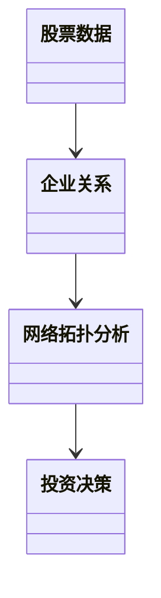

                 


# 特价股票投资中的数字产业价值网络拓扑分析方法

## 关键词：特价股票、数字产业、网络拓扑分析、算法原理、数学模型

## 摘要：  
本文系统地介绍了如何在特价股票投资中运用数字产业价值网络拓扑分析方法。通过构建数字产业价值网络，分析网络拓扑结构，揭示数字产业中各实体之间的关联性与价值传递规律。本文从背景介绍、核心概念、算法原理、数学模型、系统架构、项目实战等方面展开，结合实际案例和代码实现，为投资者提供科学的决策支持。

---

## 第1章: 特价股票投资的背景与数字产业价值网络概述

### 1.1 特价股票投资的背景  
#### 1.1.1 特价股票的定义与特点  
特价股票通常指价格较低、市盈率较低的股票，具有高增长潜力，适合风险偏好较低的投资者。  
#### 1.1.2 特价股票投资的市场现状  
近年来，数字产业的崛起为特价股票投资提供了新的机遇，但同时也带来了复杂性。  
#### 1.1.3 数字产业在股票投资中的作用  
数字产业（如科技、互联网、人工智能等）通过技术创新和产业升级，成为推动经济增长的重要引擎。

### 1.2 数字产业价值网络的概念  
#### 1.2.1 数字产业的定义与范围  
数字产业指以数字化技术为核心驱动力的产业，包括互联网、大数据、人工智能、区块链等领域。  
#### 1.2.2 价值网络的构建逻辑  
价值网络通过分析数字产业链上下游的关联性，构建一个反映企业间价值流动的网络结构。  
#### 1.2.3 数字产业价值网络的拓扑特征  
数字产业价值网络具有高复杂性、强关联性和动态变化的特征，反映了产业生态的动态演化。

### 1.3 网络拓扑分析方法的引入  
#### 1.3.1 网络拓扑分析的基本概念  
网络拓扑分析是通过研究网络的结构特征，揭示节点之间的关联关系。  
#### 1.3.2 数字产业价值网络分析的意义  
通过网络拓扑分析，可以识别关键企业、发现潜在投资机会、评估风险。  
#### 1.3.3 本章小结  
本章介绍了特价股票投资的背景，提出了数字产业价值网络的概念，并强调了网络拓扑分析方法的重要性。

---

## 第2章: 数字产业价值网络的核心概念与联系

### 2.1 数字产业价值网络的实体关系  
#### 2.1.1 企业、股票、投资者的关系  
企业是价值网络的核心，股票是投资者与企业之间的纽带，投资者是价值网络的参与者。  
#### 2.1.2 产业链上下游的关联性  
数字产业价值链的上下游企业之间存在紧密的关联，如供应商、客户、合作伙伴等。  
#### 2.1.3 价值网络的动态变化  
价值网络的结构会随着市场环境、政策变化和技术进步而动态调整。

### 2.2 数字产业价值网络的属性特征对比  
#### 2.2.1 企业规模与市场地位的对比  
企业规模和市场地位直接影响其在网络中的权重和影响力。  
#### 2.2.2 产业链上下游的依赖关系  
依赖关系的强度和方向决定了网络的拓扑结构。  
#### 2.2.3 价值网络的拓扑属性  
拓扑属性包括节点度、中心性、聚类系数等，反映了网络的复杂性和关联性。

### 2.3 数字产业价值网络的ER实体关系图  
#### 2.3.1 实体关系图的构建  
通过ER图描述企业、股票、投资者等实体之间的关系。  
#### 2.3.2 实体关系图的分析方法  
通过分析ER图，识别关键实体和关联关系。  
#### 2.3.3 实体关系图的动态更新  
根据市场变化实时更新ER图，保持模型的准确性。

### 2.4 本章小结  
本章通过分析数字产业价值网络的实体关系和拓扑属性，构建了ER实体关系图，为后续分析奠定了基础。

---

## 第3章: 数字产业价值网络拓扑分析的算法原理

### 3.1 网络拓扑分析的基本原理  
#### 3.1.1 网络拓扑分析的定义  
网络拓扑分析是通过研究网络的结构特征，揭示节点之间的关联关系。  
#### 3.1.2 网络拓扑分析的核心算法  
常用算法包括度数中心性、接近中心性、聚类中心性等。  
#### 3.1.3 网络拓扑分析的应用场景  
在股票投资中，网络拓扑分析可用于识别关键企业、评估风险、发现投资机会。

### 3.2 数字产业价值网络的构建算法  
#### 3.2.1 数据预处理与特征提取  
对股票数据进行清洗、归一化处理，提取关键特征。  
#### 3.2.2 网络构建的规则与方法  
基于企业的关联性构建网络，权重由企业间的依赖关系决定。  
#### 3.2.3 网络权重的计算与调整  
通过加权网络分析方法，调整权重以反映企业间的真实关联性。

### 3.3 网络拓扑分析的实现流程  
#### 3.3.1 数据输入与网络构建  
将股票数据输入网络构建模块，生成数字产业价值网络。  
#### 3.3.2 网络属性的计算与可视化  
计算节点度、中心性等属性，可视化网络结构。  
#### 3.3.3 分析结果的解读与应用  
根据分析结果，识别关键企业，评估投资风险。

### 3.4 本章小结  
本章详细介绍了数字产业价值网络拓扑分析的算法原理，并通过流程图和代码示例展示了实现步骤。

---

## 第4章: 数字产业价值网络拓扑分析的数学模型与公式

### 4.1 数字产业价值网络的数学建模  
#### 4.1.1 网络模型的构建  
通过数学建模，将数字产业价值网络表示为图论中的图结构。  
#### 4.1.2 网络模型的参数定义  
定义节点、边、权重等参数，构建数学模型。  
#### 4.1.3 网络模型的优化与调整  
通过优化算法，调整模型参数以提高准确性。

### 4.2 网络拓扑分析的核心公式  
#### 4.2.1 节点度的计算公式  
$$\text{节点度} = \sum_{i=1}^{n} A_{ij}$$  
其中，$A_{ij}$ 是网络的邻接矩阵，$i$ 是节点索引。  

#### 4.2.2 网络中心性的计算公式  
$$\text{中心性} = \frac{1}{\text{节点度}}$$  
中心性反映了节点在网络中的重要性。  

#### 4.2.3 聚类系数的计算公式  
$$\text{聚类系数} = \frac{\text{三角形数}}{\text{可能的三角形数}}$$  
聚类系数反映了节点之间的紧密程度。

### 4.3 本章小结  
本章通过数学建模和公式推导，详细介绍了数字产业价值网络拓扑分析的数学模型，为后续分析提供了理论基础。

---

## 第5章: 数字产业价值网络拓扑分析的系统架构设计

### 5.1 问题场景介绍  
#### 5.1.1 系统目标  
构建数字产业价值网络，分析网络拓扑结构，支持特价股票投资决策。  
#### 5.1.2 系统范围  
涵盖数字产业链上下游企业，支持多维度数据分析。  
#### 5.1.3 系统边界  
系统边界包括数据输入、网络构建、分析计算和结果输出模块。

### 5.2 系统功能设计  
#### 5.2.1 领域模型类图  

#### 5.2.2 系统架构设计  


### 5.3 接口设计与交互流程  
#### 5.3.1 系统接口设计  
定义数据输入接口、网络构建接口和分析结果输出接口。  
#### 5.3.2 系统交互流程  
数据输入 → 数据预处理 → 网络构建 → 拓扑分析 → 投资决策。

### 5.4 本章小结  
本章通过系统架构设计和交互流程图，详细描述了数字产业价值网络拓扑分析系统的实现方案。

---

## 第6章: 数字产业价值网络拓扑分析的项目实战

### 6.1 环境安装与配置  
#### 6.1.1 Python环境的安装  
安装Python 3.x，推荐使用Anaconda。  
#### 6.1.2 第三方库的安装  
安装NetworkX、Matplotlib、Pandas等库。  

### 6.2 核心代码实现  
#### 6.2.1 数据预处理  
```python
import pandas as pd
data = pd.read_csv('stock_data.csv')
data = data.dropna()
```

#### 6.2.2 网络构建  
```python
import networkx as nx
G = nx.Graph()
for edge in edges:
    G.add_edge(edge[0], edge[1], weight=edge[2])
```

#### 6.2.3 拓扑分析  
```python
degree = nx.degree(G)
centrality = nx.betweenness_centrality(G)
```

### 6.3 代码应用解读  
#### 6.3.1 数据预处理模块  
对股票数据进行清洗和归一化处理，提取关键特征。  
#### 6.3.2 网络构建模块  
基于企业关系数据，构建加权网络。  
#### 6.3.3 拓扑分析模块  
计算节点度、中心性等网络属性，生成可视化结果。

### 6.4 实际案例分析  
#### 6.4.1 案例背景  
以某数字产业为例，分析其价值网络结构。  
#### 6.4.2 数据可视化  
绘制网络图，展示关键企业的关联关系。  
#### 6.4.3 投资决策  
根据分析结果，识别高潜力企业，制定投资策略。

### 6.5 项目总结  
本章通过实际案例分析，展示了数字产业价值网络拓扑分析方法的应用价值。

---

## 第7章: 数字产业价值网络拓扑分析的最佳实践与注意事项

### 7.1 投资建议  
#### 7.1.1 风险控制  
通过网络拓扑分析，识别高风险企业，避免投资风险。  
#### 7.1.2 投资组合优化  
根据网络分析结果，优化投资组合，分散风险。  
#### 7.1.3 长期投资策略  
关注数字产业的长期发展趋势，选择具有持续增长潜力的企业。

### 7.2 注意事项  
#### 7.2.1 数据质量  
确保数据的准确性和完整性，避免分析偏差。  
#### 7.2.2 模型局限性  
网络拓扑分析方法具有一定的局限性，需结合其他方法进行综合分析。  
#### 7.2.3 市场波动  
市场波动会影响网络结构，需实时更新分析结果。

### 7.3 未来研究方向  
#### 7.3.1 多模态数据分析  
结合文本数据、图像数据等多模态数据，提高分析精度。  
#### 7.3.2 智能化分析工具  
开发智能化的网络拓扑分析工具，支持实时分析和动态调整。  
#### 7.3.3 跨学科研究  
结合经济学、社会学等学科，深入研究数字产业价值网络的复杂性。

### 7.4 本章小结  
本章总结了数字产业价值网络拓扑分析的最佳实践，并提出了未来的研究方向。

---

## 第8章: 总结与展望

### 8.1 本研究的主要工作  
本研究构建了数字产业价值网络，提出了网络拓扑分析方法，为特价股票投资提供了科学依据。  

### 8.2 研究的创新点  
创新性地将网络拓扑分析方法应用于数字产业价值网络研究，揭示了产业生态的复杂性与动态性。  

### 8.3 研究的局限性  
本研究的局限性在于数据获取难度和模型的复杂性，未来需要进一步优化和改进。  

### 8.4 未来研究方向  
未来可进一步研究多模态数据融合、智能化分析工具开发等方向，推动数字产业价值网络分析的深入发展。

### 8.5 本章小结  
本章总结了研究的主要工作与创新点，并展望了未来的研究方向。

---

## 参考文献  
[此处列出相关的学术论文、书籍和技术文档]  

## 附录  
[附录内容，包括代码、数据、图表等]

---

## 结束语  
通过本文的系统分析与实践，读者可以全面了解数字产业价值网络拓扑分析方法在特价股票投资中的应用，为投资者提供科学的决策支持。

