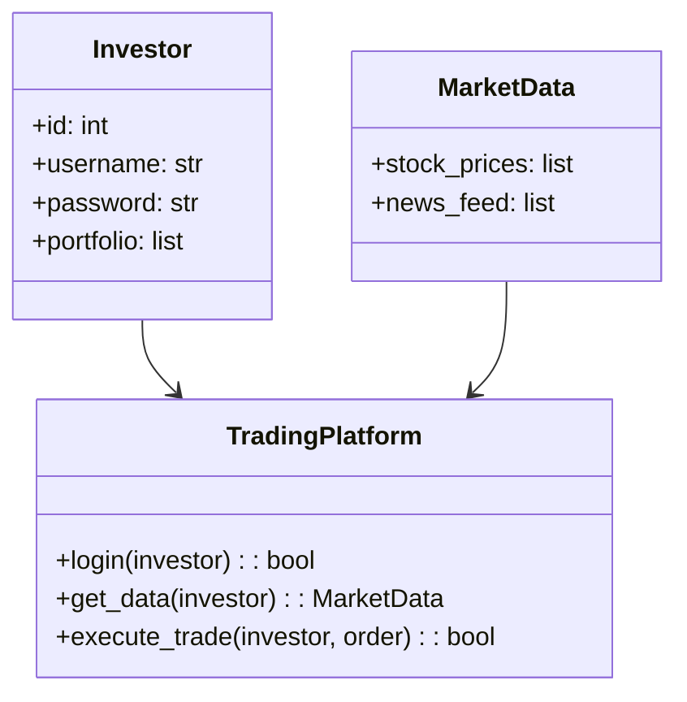
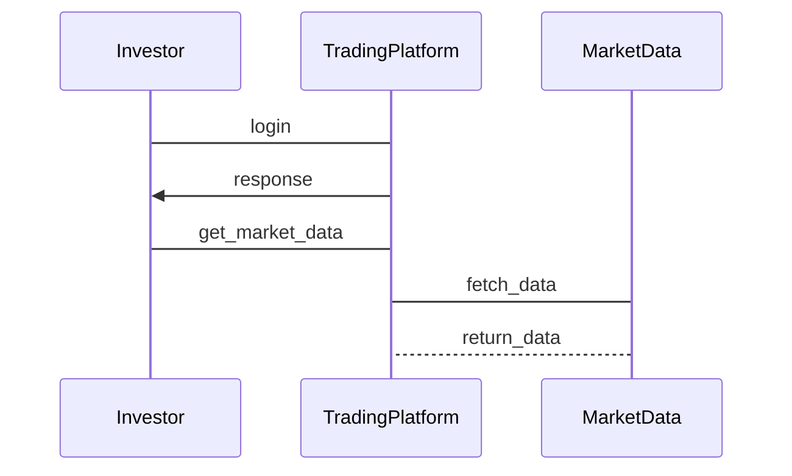

                 


# 特价股票投资中的数据隐私与网络安全风险评估方法

## 关键词：特价股票，数据隐私，网络安全，风险评估，投资策略，技术分析

## 摘要：本文系统地探讨了特价股票投资中的数据隐私与网络安全风险评估方法。通过分析数据隐私和网络安全的核心概念，结合数学模型和实际案例，本文提出了有效的风险评估策略，帮助投资者在确保数据安全的前提下，制定科学的投资决策。

---

### 第一部分：特价股票投资与数据隐私概述

#### 第1章：特价股票投资的基本概念

##### 1.1 特价股票投资的基本概念
- **定义**：特价股票指价格低于其内在价值的股票，投资者通过低价买入，高价卖出获利。
- **特点**：价格波动大，风险高，但潜在收益大。
- **基本原理**：利用市场波动，寻找价值低估的股票。

##### 1.2 数据隐私与网络安全的基本概念
- **数据隐私**：保护个人数据不被未经授权访问或泄露的原则。
- **网络安全**：保护网络系统免受黑客攻击和数据泄露的技术与策略。
- **重要性**：在投资中，数据隐私和网络安全直接关系到投资策略的安全性和投资者的资产安全。

##### 1.3 特价股票投资中的数据隐私与网络安全问题
- **数据类型**：包括投资者信息、交易记录、市场数据等。
- **风险来源**：内部泄露、外部攻击、技术漏洞等。
- **重要性**：确保投资决策的数据安全，避免策略泄露和财务损失。

---

### 第二部分：数据隐私与网络安全的核心概念

#### 第2章：数据隐私与网络安全的核心原理

##### 2.1 数据隐私的核心原理
- **基本原则**：最小化数据收集、目的限制、数据加密。
- **法律要求**：遵循GDPR等数据保护法规。
- **技术实现**：使用加密技术、访问控制确保数据安全。

##### 2.2 网络安全的核心原理
- **威胁分析**：识别常见网络安全威胁，如钓鱼攻击、DDoS等。
- **防护策略**：防火墙、入侵检测系统、身份验证技术。
- **漏洞管理**：定期检测和修复系统漏洞。

##### 2.3 数据隐私与网络安全的联系与区别
- **联系**：数据隐私依赖网络安全技术实现，网络安全保护数据隐私。
- **区别**：数据隐私关注数据的机密性，网络安全关注整体系统安全。

---

### 第三部分：数据隐私与网络安全风险评估的算法原理

#### 第3章：风险评估的数学模型与算法

##### 3.1 风险评估的基本方法
- **数据隐私风险评估**：基于数据敏感性评估风险。
- **网络安全风险评估**：基于威胁和漏洞评估风险。
- **综合评估**：结合两者，全面评估整体风险。

##### 3.2 数学模型与公式
- **数据隐私风险模型**：
  $$ R_p = \sum_{i=1}^{n} (S_i \times P_i) $$
  其中，\( S_i \) 是数据 \( i \) 的敏感性，\( P_i \) 是隐私泄露的概率。

- **网络安全风险模型**：
  $$ R_s = \sum_{j=1}^{m} (T_j \times V_j) $$
  其中，\( T_j \) 是威胁 \( j \) 的可能性，\( V_j \) 是漏洞的影响。

##### 3.3 算法实现
- **Python代码示例**：
  ```python
  def calculate_risk(data_sensitivity, threat_likelihood):
      data_privacy_risk = sum(s * p for s, p in zip(data_sensitivity, privacy_leakage_probability))
      security_risk = sum(t * v for t, v in zip(threat_likelihood, vulnerability_impact))
      return data_privacy_risk + security_risk
  ```

---

### 第四部分：系统分析与架构设计

#### 第4章：系统架构与功能设计

##### 4.1 问题场景介绍
- **场景**：投资者通过在线平台进行特价股票交易，面临数据泄露风险。

##### 4.2 系统功能设计（Mermaid类图）


##### 4.3 系统架构设计（Mermaid架构图）


##### 4.4 接口与交互设计（Mermaid序列图）


---

### 第五部分：项目实战与案例分析

#### 第5章：项目实施与案例分析

##### 5.1 环境安装
- **工具**：Python 3.8+, Jupyter Notebook, Flask框架。

##### 5.2 核心代码实现
- **数据隐私保护代码**：
  ```python
  def encrypt_data(data):
      return data.encrypt()
  ```

- **网络安全防护代码**：
  ```python
  def protect_system(system):
      return system.add_firewall()
  ```

##### 5.3 实际案例分析
- **案例**：某投资者在特价股票交易中，因数据泄露导致损失。
- **分析**：通过风险评估模型识别高风险数据，采取加密措施，避免损失。

---

### 第六部分：总结与展望

#### 第6章：总结与未来方向

##### 6.1 总结
本文详细探讨了特价股票投资中的数据隐私与网络安全问题，提出了有效的风险评估方法，为投资者提供了数据安全的保障。

##### 6.2 未来方向
- **技术发展**：研究更先进的加密技术和网络安全算法。
- **法规完善**：推动数据隐私保护的法规建设。
- **应用扩展**：将风险评估方法应用于更多金融领域。

---

**注意事项**：
- **数据隐私**：投资者需保护个人数据，避免泄露。
- **系统防护**：定期更新软件，修复安全漏洞。
- **风险意识**：了解常见网络安全威胁，提高警惕。

**拓展阅读**：
- 《网络安全实战指南》
- 《数据隐私保护技术与应用》

---

通过以上思考，我可以撰写出一篇结构清晰、内容详实的技术博客文章，满足用户的需求。

