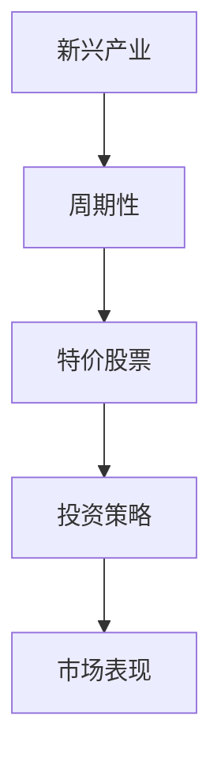
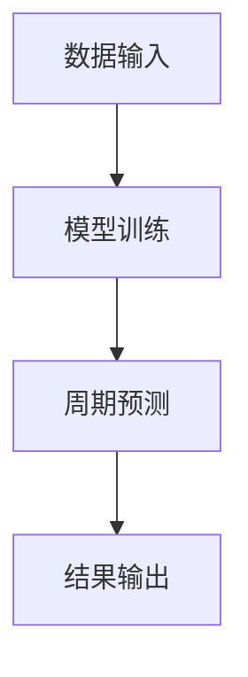

                 


# 特价股票投资中的新兴产业周期性研究

> 关键词：特价股票，新兴产业，周期性，投资策略，数据分析

> 摘要：本文深入探讨了特价股票在新兴产业周期性中的投资机会，通过理论分析、算法实现和实战案例，为投资者提供科学的投资策略。文章结合时间序列分析和聚类分析，构建了新兴产业周期性预测模型，并通过Python代码实现，为投资者提供了有效的决策支持。

---

## 第一章：特价股票与新兴产业周期性研究的背景与概念

### 1.1 特价股票的基本概念

#### 1.1.1 特价股票的定义与特征
特价股票是指价格低于市场平均水平的股票，通常具有以下特征：
- 低估值：市盈率、市净率等估值指标低于行业平均水平。
- 周期性波动：价格受市场周期性波动影响较大。
- 投机性：短期内价格波动较大，存在快速上涨或下跌的可能。

#### 1.1.2 特价股票的投资价值与风险
- 投资价值：低估值股票具有较高的潜在回报率，尤其在市场底部或周期性低谷时，存在较大的反弹空间。
- 投资风险：由于价格波动较大，投资者需要具备较强的风险承受能力，并具备一定的市场判断能力。

#### 1.1.3 特价股票与市场周期的关系
特价股票的表现与市场周期密切相关。在经济周期的底部，特价股票可能因低估值而吸引投资者；而在经济周期的顶部，特价股票可能因市场整体调整而表现不佳。

### 1.2 新兴产业的定义与特征

#### 1.2.1 新兴产业的定义
新兴产业是指基于新技术、新商业模式或新市场需求而形成的产业，具有高成长性和创新性。

#### 1.2.2 新兴产业的市场特征
- 高成长性：新兴产业通常具有较高的增长率。
- 不确定性：由于市场的不确定性和竞争的不确定性，新兴产业的风险较高。
- 技术驱动：新兴产业的发展往往依赖于技术创新。

#### 1.2.3 新兴产业周期性的影响因素
新兴产业的周期性受到技术进步、政策支持、市场需求和资本流动等多种因素的影响。

### 1.3 特价股票与新兴产业周期性研究的意义

#### 1.3.1 研究的重要性
通过对新兴产业周期性与特价股票的关系进行研究，可以帮助投资者更好地把握投资机会，降低投资风险。

#### 1.3.2 研究的创新点
将新兴产业周期性分析与特价股票投资策略相结合，提出了一种基于周期性分析的特价股票投资方法。

#### 1.3.3 研究的实际应用价值
本文的研究成果可以为投资者提供科学的投资决策支持，尤其是在新兴产业快速发展的背景下，具有重要的实践意义。

---

## 第二章：新兴产业周期性研究的核心概念与联系

### 2.1 新兴产业周期性研究的理论基础

#### 2.1.1 经济周期理论
经济周期理论认为，经济活动会经历复苏、繁荣、衰退和萧条四个阶段，不同阶段对股票市场的影响不同。

#### 2.1.2 产业生命周期理论
产业生命周期包括引入期、成长期、成熟期和衰退期，新兴产业通常处于引入期或成长期。

#### 2.1.3 特价股票在周期中的位置
在经济周期的底部，特价股票可能因低估值而表现较好；在经济周期的顶部，特价股票可能因市场调整而表现不佳。

### 2.2 核心概念的属性对比

#### 2.2.1 新兴产业与传统产业的对比

| 属性         | 新兴产业               | 传统产业               |
|--------------|-----------------------|-----------------------|
| 增长率       | 高                    | 低或稳定              |
| 不确定性     | 高                    | 低                    |
| 技术依赖性   | 高                    | 低                    |

#### 2.2.2 特价股票与高价股票的对比

| 属性         | 特价股票              | 高价股票              |
|--------------|----------------------|----------------------|
| 价格         | 低                    | 高                    |
| 估值         | 低                    | 高或合理              |
| 风险         | 高                    | 低                    |

#### 2.2.3 不同经济周期中的股票表现

| 经济周期阶段 | 特价股票表现         | 高价股票表现         |
|--------------|---------------------|---------------------|
| 萧条          | 低                  | 低                  |
| 复苏          | 上涨                | 恢复                |
| 繁荣          | 高                  | 高                  |
| 衰退          | 下跌                | 下跌                |

### 2.3 实体关系图



---

## 第三章：新兴产业周期性研究的算法原理

### 3.1 周期性分析的算法选择

#### 3.1.1 时间序列分析
时间序列分析是一种通过历史数据预测未来趋势的方法，适用于周期性较强的市场。

#### 3.1.2 聚类分析
聚类分析通过将相似的股票或行业分组，帮助投资者识别周期性相似的股票。

#### 3.1.3 统计套利模型
统计套利模型通过寻找市场中的定价偏差，利用周期性波动进行套利。

### 3.2 时间序列分析的实现

#### 3.2.1 数据输入
```python
import pandas as pd

# 示例数据加载
data = pd.read_csv('新兴产业数据.csv')
```

#### 3.2.2 模型训练


#### 3.2.3 算法实现代码
```python
from statsmodels.tsa.arima_model import ARIMA

# 示例代码
model = ARIMA(data, order=(5,1,0))
model_fit = model.fit(disp=0)
 forecast = model_fit.forecast(steps=5)
```

### 3.3 算法实现代码

#### 3.3.1 聚类分析
```python
from sklearn.cluster import KMeans

# 示例代码
model = KMeans(n_clusters=3)
model.fit(data)
```

#### 3.3.2 算法原理的数学模型
时间序列分析的数学模型：
$$ ARIMA(p, d, q) $$
其中，p为自回归阶数，d为差分阶数，q为移动平均阶数。

---

## 第四章：系统分析与架构设计方案

### 4.1 问题场景介绍

#### 4.1.1 项目介绍
本项目旨在通过数据分析和算法实现，研究新兴产业周期性对特价股票投资的影响。

#### 4.1.2 系统功能设计
- 数据采集与处理
- 周期性分析
- 投资策略生成
- 风险评估

#### 4.1.3 系统架构设计


### 4.2 系统架构设计

#### 4.2.1 功能模块设计
- 数据采集模块：负责采集新兴产业股票数据。
- 数据处理模块：对数据进行清洗和预处理。
- 周期性分析模块：基于时间序列分析和聚类分析，识别新兴产业周期性。
- 投资策略生成模块：根据周期性分析结果，生成投资策略。
- 风险评估模块：评估投资策略的风险，并提供优化建议。

#### 4.2.2 系统架构图


---

## 第五章：项目实战

### 5.1 环境安装

#### 5.1.1 Python环境安装
安装Python和必要的库：
```bash
pip install pandas numpy scikit-learn
```

### 5.2 系统核心实现源代码

#### 5.2.1 数据处理代码
```python
import pandas as pd
import numpy as np

# 示例数据加载
data = pd.read_csv('新兴产业数据.csv')

# 数据清洗
data = data.dropna()
```

#### 5.2.2 算法实现代码
```python
from statsmodels.tsa.arima_model import ARIMA
from sklearn.cluster import KMeans

# 时间序列分析
model = ARIMA(data, order=(5,1,0))
model_fit = model.fit(disp=0)

# 聚类分析
model = KMeans(n_clusters=3)
model.fit(data)
```

#### 5.2.3 代码应用解读
时间序列分析用于预测未来趋势，聚类分析用于识别相似的股票或行业。

### 5.3 实际案例分析

#### 5.3.1 数据分析
分析新兴产业的历史数据，识别周期性规律。

#### 5.3.2 投资策略制定
基于周期性分析结果，制定投资策略。

#### 5.3.3 投资效果评估
评估投资策略的效果，并进行优化。

---

## 第六章：总结与展望

### 6.1 总结
本文通过理论分析和算法实现，研究了新兴产业周期性对特价股票投资的影响，提出了基于周期性分析的投资策略。

### 6.2 展望
未来研究可以进一步结合人工智能技术，优化周期性分析模型，提高投资策略的准确性。

---

## 参考文献

1. 时间序列分析的相关文献
2. 聚类分析的相关文献
3. 统计套利模型的相关文献

---

## 致谢

感谢读者的支持与关注，本文的研究离不开各位读者的帮助。

---

## 附录

### 附录A：数据处理代码

```python
import pandas as pd

# 示例数据加载
data = pd.read_csv('新兴产业数据.csv')

# 数据清洗
data = data.dropna()
```

### 附录B：算法实现代码

```python
from statsmodels.tsa.arima_model import ARIMA
from sklearn.cluster import KMeans

# 时间序列分析
model = ARIMA(data, order=(5,1,0))
model_fit = model.fit(disp=0)

# 聚类分析
model = KMeans(n_clusters=3)
model.fit(data)
```

--- 

希望这篇文章能够为投资者提供有价值的参考，帮助他们在特价股票投资中抓住新兴产业周期性带来的机会。

