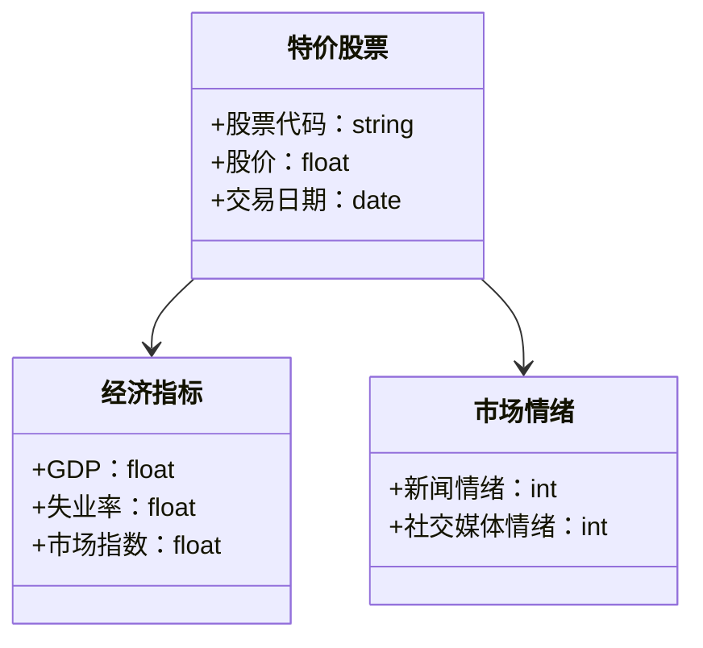
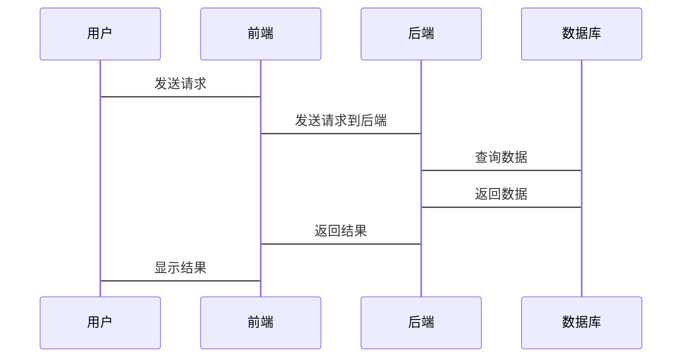

                 


# 特价股票投资中的新兴技术周期性研究

> 关键词：特价股票，周期性研究，新兴技术，人工智能，大数据分析，金融投资

> 摘要：本文旨在探讨新兴技术在特价股票投资周期性研究中的应用，通过分析大数据和人工智能等技术如何帮助投资者识别周期性波动，优化投资策略。文章从背景介绍、技术原理、系统设计到项目实战，系统性地展开研究，结合实际案例，深入分析新兴技术在特价股票投资中的潜力与挑战。

---

## 第一部分: 特价股票投资的背景与概念

### 第1章: 特价股票的定义与特征

#### 1.1 特价股票的定义
##### 1.1.1 特价股票的定义与分类
特价股票是指价格低于面值的股票，通常分为以下几类：
- **优先股**：具有优先分红和优先清偿权。
- **普通股**：代表公司所有权，享有投票权。
- **折价股**：市场价低于账面价值。

##### 1.1.2 特价股票的市场特征
- **低估值**：市场价格低于内在价值。
- **高波动性**：价格波动较大，投资风险较高。
- **周期性**：受市场周期影响显著。

##### 1.1.3 特价股票的投资价值
- **潜在收益**：低价股票可能因价值回归而上涨。
- **高风险**：市场波动可能导致较大损失。

#### 1.2 周期性研究的基本概念
##### 1.2.1 周期性研究的定义
周期性研究是指通过分析历史数据，识别市场波动的周期性规律，预测未来走势。

##### 1.2.2 周期性研究的方法论
- **定量分析**：通过数学模型分析数据。
- **定性分析**：结合市场情绪、政策变化等非数据因素。

##### 1.2.3 周期性研究的边界与外延
- **边界**：仅限于价格波动分析。
- **外延**：可扩展至行业周期、宏观经济周期。

#### 1.3 新兴技术在周期性研究中的作用
##### 1.3.1 新兴技术的定义与分类
- **大数据技术**：数据收集、处理和分析。
- **人工智能技术**：机器学习、自然语言处理。
- **区块链技术**：数据安全与去中心化。

##### 1.3.2 新兴技术对周期性研究的驱动
- **数据驱动**：新兴技术提供海量数据支持。
- **自动化分析**：通过算法自动识别周期性规律。

##### 1.3.3 技术驱动的周期性研究框架
- **数据采集**：从多种来源收集数据。
- **数据清洗**：去除噪声数据。
- **模型构建**：建立周期性预测模型。
- **结果验证**：通过回测验证模型准确性。

---

### 第2章: 特价股票周期性研究的背景与问题

#### 2.1 特价股票周期性研究的背景
##### 2.1.1 特价股票市场的现状
- **市场规模**：全球范围内，特价股票市场活跃。
- **投资者行为**：机构投资者与散户并存。

##### 2.1.2 新兴技术在金融领域的应用现状
- **大数据分析**：广泛应用于金融数据处理。
- **人工智能**：用于金融预测和投资决策。

##### 2.1.3 技术驱动的周期性研究的必要性
- **提高预测准确性**：通过技术手段优化预测模型。
- **降低投资风险**：通过周期性分析规避市场波动。

#### 2.2 特价股票周期性研究的问题
##### 2.2.1 特价股票市场的波动性问题
- **短期波动**：受市场情绪影响较大。
- **长期趋势**：受宏观经济影响显著。

##### 2.2.2 技术应用中的数据质量问题
- **数据缺失**：历史数据不完整。
- **数据偏差**：样本数据存在偏差。

##### 2.2.3 周期性研究的局限性与挑战
- **模型过拟合**：可能导致预测不准。
- **数据隐私**：数据收集与隐私保护的冲突。

#### 2.3 技术驱动的周期性研究的解决方案
##### 2.3.1 技术驱动的周期性研究框架
- **数据驱动**：基于大数据的分析框架。
- **算法优化**：通过机器学习提升预测精度。

##### 2.3.2 技术驱动的周期性研究的优势
- **高效性**：自动化处理大量数据。
- **准确性**：通过算法优化提升预测精度。

##### 2.3.3 技术驱动的周期性研究的实施路径
1. 数据收集与清洗。
2. 模型构建与训练。
3. 模型验证与优化。
4. 投资策略制定与实施。

---

## 第二部分: 新兴技术在周期性研究中的应用

### 第3章: 大数据分析与周期性研究

#### 3.1 大数据分析的基本概念
##### 3.1.1 大数据分析的定义与特点
- **定义**：通过对海量数据的处理和分析，提取有价值的信息。
- **特点**：数据量大、类型多样、处理速度快。

##### 3.1.2 大数据分析的方法论
- **数据挖掘**：从数据中提取模式和规律。
- **数据可视化**：通过图表展示数据特征。

##### 3.1.3 大数据分析的工具与技术
- **工具**：Hadoop、Spark。
- **技术**：分布式计算、并行处理。

#### 3.2 大数据分析在周期性研究中的应用
##### 3.2.1 数据收集与清洗
- **数据来源**：股票价格、市场指数、经济指标。
- **数据清洗**：去除噪声数据，填补缺失值。

##### 3.2.2 数据分析与建模
- **数据分析**：通过统计分析识别周期性特征。
- **建模**：建立时间序列模型，如ARIMA。

##### 3.2.3 数据可视化与结果解读
- **可视化工具**：使用Matplotlib、Tableau。
- **结果解读**：识别周期性波动的规律。

#### 3.3 基于大数据分析的周期性预测模型
##### 3.3.1 数据预处理与特征提取
- **数据预处理**：标准化、归一化。
- **特征提取**：提取影响周期性的重要特征。

##### 3.3.2 周期性预测模型的构建
- **模型选择**：选择适合的算法，如LSTM。
- **模型训练**：通过历史数据训练模型。

##### 3.3.3 模型验证与优化
- **验证方法**：回测、交叉验证。
- **优化策略**：调整参数，提升预测精度。

---

### 第4章: 人工智能与周期性研究

#### 4.1 人工智能的基本概念
##### 4.1.1 人工智能的定义与特点
- **定义**：模拟人类智能的技术。
- **特点**：学习、推理、自适应。

##### 4.1.2 人工智能的核心技术
- **机器学习**：监督学习、无监督学习。
- **自然语言处理**：文本分析、情感分析。

#### 4.2 人工智能在周期性研究中的应用
##### 4.2.1 机器学习在周期性预测中的应用
- **算法选择**：随机森林、支持向量机。
- **特征工程**：提取影响周期性的特征。

##### 4.2.2 自然语言处理在市场情绪分析中的应用
- **情感分析**：分析新闻、社交媒体情绪。
- **文本挖掘**：提取关键词，判断市场趋势。

#### 4.3 人工智能驱动的周期性研究框架
##### 4.3.1 数据预处理
- **数据清洗**：去除噪声数据。
- **特征提取**：提取影响周期性的特征。

##### 4.3.2 模型构建
- **算法选择**：选择适合的机器学习算法。
- **模型训练**：通过历史数据训练模型。

##### 4.3.3 模型优化
- **超参数调整**：通过网格搜索优化模型。
- **模型验证**：通过回测验证模型准确性。

---

### 第5章: 机器学习与周期性研究

#### 5.1 机器学习的基本概念
##### 5.1.1 机器学习的定义与特点
- **定义**：通过数据训练模型，使其能够自主学习。
- **特点**：数据驱动、模型自适应。

##### 5.1.2 机器学习的核心技术
- **监督学习**：分类、回归。
- **无监督学习**：聚类、降维。

#### 5.2 机器学习在周期性研究中的应用
##### 5.2.1 时间序列分析
- **算法选择**：ARIMA、LSTM。
- **模型构建**：通过时间序列数据训练模型。

##### 5.2.2 预测模型的优化
- **超参数调整**：通过网格搜索优化模型。
- **模型验证**：通过回测验证模型准确性。

#### 5.3 基于机器学习的周期性预测框架
##### 5.3.1 数据预处理
- **数据清洗**：去除噪声数据。
- **特征提取**：提取影响周期性的特征。

##### 5.3.2 模型构建
- **算法选择**：选择适合的时间序列算法。
- **模型训练**：通过历史数据训练模型。

##### 5.3.3 模型优化
- **超参数调整**：通过网格搜索优化模型。
- **模型验证**：通过回测验证模型准确性。

---

## 第三部分: 系统分析与架构设计方案

### 第6章: 系统架构设计

#### 6.1 问题场景介绍
- **目标**：构建一个基于新兴技术的特价股票周期性研究系统。
- **用户需求**：投资者需要基于周期性分析的投资策略。

#### 6.2 系统功能设计
##### 6.2.1 领域模型


##### 6.2.2 系统架构设计


##### 6.2.3 系统接口设计


---

## 第四部分: 项目实战

### 第7章: 项目实战

#### 7.1 环境安装
- **工具安装**：安装Python、Jupyter Notebook、Pandas、Scikit-learn。
- **数据获取**：从Yahoo Finance获取历史数据。

#### 7.2 系统核心实现源代码
```python
import pandas as pd
from sklearn.model_selection import train_test_split
from sklearn.linear_model import LinearRegression
from sklearn.metrics import mean_squared_error

# 数据加载
data = pd.read_csv('stock_data.csv')
# 数据预处理
X = data[['GDP', '失业率', '市场指数']]
y = data['股价']
# 数据分割
X_train, X_test, y_train, y_test = train_test_split(X, y, test_size=0.2)
# 模型训练
model = LinearRegression()
model.fit(X_train, y_train)
# 模型预测
y_pred = model.predict(X_test)
# 模型评估
mse = mean_squared_error(y_test, y_pred)
print(f'均方误差: {mse}')
```

#### 7.3 代码应用解读与分析
- **数据加载**：从CSV文件加载数据。
- **数据预处理**：选择影响股价的相关指标。
- **数据分割**：将数据分为训练集和测试集。
- **模型训练**：使用线性回归模型训练。
- **模型预测**：预测测试集的股价。
- **模型评估**：计算均方误差，评估模型性能。

#### 7.4 实际案例分析
- **案例选择**：选择某只特价股票的历史数据。
- **数据分析**：通过模型预测未来股价走势。
- **策略制定**：根据预测结果制定买入或卖出策略。

#### 7.5 项目小结
- **项目成果**：构建了一个基于机器学习的特价股票周期性研究系统。
- **经验总结**：模型性能受数据质量和特征选择的影响较大。

---

## 第五部分: 总结与展望

### 第8章: 总结与展望

#### 8.1 研究总结
- **研究内容**：探讨了新兴技术在特价股票周期性研究中的应用。
- **研究发现**：大数据和人工智能技术能够有效提升周期性预测的准确性。
- **研究意义**：为投资者提供了新的投资策略优化工具。

#### 8.2 未来研究方向
- **技术优化**：进一步优化算法，提升预测精度。
- **数据扩展**：引入更多数据源，丰富分析维度。
- **应用拓展**：将技术应用拓展到更多金融领域。

#### 8.3 注意事项
- **数据隐私**：注意数据收集和使用中的隐私保护。
- **模型风险**：模型预测结果仅供参考，投资需谨慎。

#### 8.4 拓展阅读
- **推荐书籍**：《Python机器学习实战》、《金融数据分析与算法交易》。
- **推荐博客**：关注技术博客，获取最新技术动态。

---

通过本文的系统性分析，我们深入探讨了新兴技术在特价股票周期性研究中的应用，从理论到实践，为投资者提供了新的思路和工具。未来，随着技术的不断发展，特价股票投资将更加依赖于技术驱动的周期性研究，投资者需要不断学习和适应，才能在竞争激烈的市场中获得优势。

