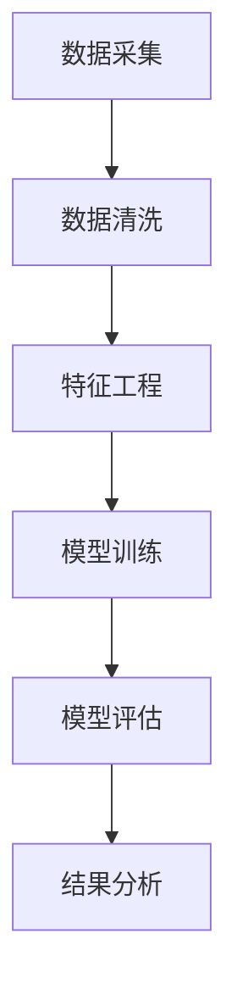
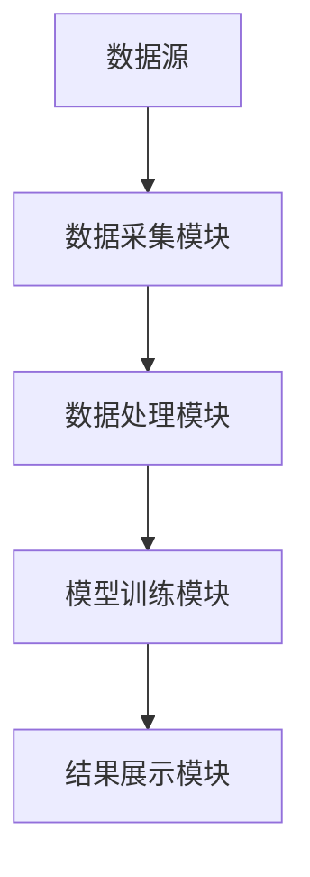

                 


# 特价股票投资中的新兴科技融合指数研究

## 关键词：特价股票投资，新兴科技，股票指数，大数据，人工智能，区块链

## 摘要：本文探讨了在特价股票投资中，如何利用新兴科技如大数据、人工智能和区块链技术，构建和优化股票指数模型。通过分析技术指标、市场情绪和新闻情感，本文提出了基于机器学习的股价预测模型，并结合系统架构设计和项目实战，展示了如何在实际投资中应用这些技术，为投资者提供了科学的投资决策支持。

---

## 第1章: 特价股票投资与新兴科技融合的背景介绍

### 1.1 特价股票投资的背景与现状

#### 1.1.1 特价股票的定义与特点
特价股票是指价格相对较低的股票，通常具有较高的增长潜力。其特点包括低估值、高成长性和高波动性。

#### 1.1.2 特价股票投资的历史发展
从早期的基本面分析到现代的量化投资，特价股票投资经历了从传统到科技驱动的转变。

#### 1.1.3 当前特价股票投资的挑战与机遇
数据爆炸和市场复杂化带来了挑战，而新兴科技则为投资者提供了新的工具和方法。

### 1.2 新兴科技在股票投资中的融合

#### 1.2.1 大数据技术在股票投资中的应用
大数据技术帮助投资者从海量数据中提取有价值的信息，如市场情绪和交易模式。

#### 1.2.2 人工智能技术在股票投资中的应用
AI技术用于预测股价走势和风险评估，提高了投资决策的效率和准确性。

#### 1.2.3 区块链技术在股票投资中的潜在应用
区块链技术提供了透明和安全的交易记录，有助于提升交易效率和信任度。

### 1.3 股票指数研究的核心概念

#### 1.3.1 股票指数的定义与分类
股票指数是衡量市场表现的指标，常见的有标普500和沪深300。

#### 1.3.2 指数研究的意义与方法
指数研究帮助投资者评估市场整体走势，常用方法包括因子分析和回归分析。

#### 1.3.3 指数与股票投资的关系
指数是投资组合表现的基准，影响投资者的资产配置和风险控制。

### 1.4 本章小结
本章介绍了特价股票投资的背景，分析了新兴科技在股票投资中的作用，并探讨了指数研究的核心概念。

---

## 第2章: 特价股票指数构建的核心概念与联系

### 2.1 特价股票指数的定义与构成

#### 2.1.1 特价股票指数的定义
特价股票指数是衡量低价股票整体表现的指标。

#### 2.1.2 特价股票指数的构成要素
包括成分股、权重计算和指数计算方法。

#### 2.1.3 特价股票指数的计算方法
常用的方法有算术平均和几何平均。

### 2.2 新兴科技与指数研究的融合

#### 2.2.1 大数据技术在指数研究中的应用
大数据技术用于数据清洗和特征提取，提升指数研究的准确性。

#### 2.2.2 人工智能技术在指数研究中的应用
AI技术用于预测指数走势和风险评估，优化投资策略。

#### 2.2.3 区块链技术在指数研究中的潜在应用
区块链技术提供了透明的数据记录，确保指数研究的可信度。

### 2.3 指数研究的核心原理与流程

#### 2.3.1 数据采集与处理
包括数据清洗、特征工程和数据预处理。

#### 2.3.2 数据分析与建模
采用因子分析和回归分析，构建预测模型。

#### 2.3.3 模型验证与优化
通过回测和风险评估，优化模型性能。

### 2.4 本章小结
本章详细阐述了特价股票指数的构成，分析了新兴科技在指数研究中的应用，并探讨了研究的核心原理和流程。

---

## 第3章: 特价股票指数研究中的技术分析方法

### 3.1 技术分析的核心概念

#### 3.1.1 技术分析的定义与特点
技术分析通过分析历史价格和交易量预测未来走势。

#### 3.1.2 技术分析的主要方法
包括K线图、均线和成交量分析。

#### 3.1.3 技术分析与股票指数研究的结合
技术分析为指数研究提供了直观的市场信号。

### 3.2 基于新兴科技的技术分析实现

#### 3.2.1 基于大数据的市场情绪分析
使用自然语言处理分析新闻和社交媒体，评估市场情绪。

#### 3.2.2 基于人工智能的股价预测模型
采用机器学习算法，如线性回归和随机森林，预测股价走势。

#### 3.2.3 基于自然语言处理的新闻情感分析
通过NLP技术分析新闻标题和内容，评估市场情绪对指数的影响。

### 3.3 技术分析与指数研究的融合

#### 3.3.1 数据驱动的技术分析
利用大数据和AI技术，提高技术分析的准确性和效率。

#### 3.3.2 技术分析在指数预测中的应用
将技术指标与指数研究相结合，优化投资决策。

### 3.4 本章小结
本章探讨了技术分析的核心概念，分析了新兴科技在技术分析中的应用，并展示了技术分析与指数研究的融合。

---

## 第4章: 基于新兴科技的特价股票指数研究算法原理

### 4.1 算法原理概述

#### 4.1.1 数据预处理
包括数据清洗、特征工程和标准化处理。

#### 4.1.2 特征选择
通过相关性分析和主成分分析，选择关键特征。

#### 4.1.3 模型构建
采用机器学习算法，如线性回归和随机森林，构建预测模型。

### 4.2 算法实现步骤

#### 4.2.1 数据采集与清洗
使用API获取历史数据，并进行数据清洗。

#### 4.2.2 特征工程
提取技术指标和市场情绪特征，构建特征向量。

#### 4.2.3 模型训练
采用训练集和验证集，训练机器学习模型。

#### 4.2.4 模型评估
通过回测和风险指标评估模型性能。

### 4.3 算法流程图（mermaid）



### 4.4 数学公式与详细讲解

#### 4.4.1 线性回归公式
$$y = \beta_0 + \beta_1x + \epsilon$$

其中，$$y$$是目标变量，$$x$$是自变量，$$\beta_0$$和$$\beta_1$$是回归系数，$$\epsilon$$是误差项。

#### 4.4.2 随机森林算法
随机森林通过构建多个决策树，进行投票或平均，提高模型的准确性和鲁棒性。

### 4.5 本章小结
本章详细讲解了基于新兴科技的特价股票指数研究的算法原理，包括数据预处理、特征选择、模型构建和评估。

---

## 第5章: 系统架构设计与实现

### 5.1 系统架构设计

#### 5.1.1 系统功能设计
包括数据采集、特征提取、模型训练和结果展示。

#### 5.1.2 系统架构图（mermaid）



### 5.2 系统实现细节

#### 5.2.1 数据采集模块
使用API获取股票数据，并进行数据清洗和预处理。

#### 5.2.2 数据处理模块
提取技术指标和市场情绪特征，构建特征向量。

#### 5.2.3 模型训练模块
训练机器学习模型，并进行回测和优化。

#### 5.2.4 结果展示模块
可视化模型预测结果和回测报告，帮助投资者做出决策。

### 5.3 本章小结
本章详细描述了系统的架构设计和实现细节，展示了如何将新兴科技应用于特价股票指数研究。

---

## 第6章: 项目实战与案例分析

### 6.1 项目实战

#### 6.1.1 环境安装
安装Python、Pandas、Scikit-learn和TensorFlow等工具。

#### 6.1.2 数据获取与处理
使用Yahoo Finance API获取历史数据，并进行清洗和特征工程。

#### 6.1.3 模型训练
训练线性回归和随机森林模型，进行回测和评估。

#### 6.1.4 结果分析
分析模型预测结果和回测报告，评估模型的性能和可靠性。

### 6.2 代码实现

```python
import pandas as pd
import numpy as np
from sklearn.model_selection import train_test_split
from sklearn.linear_model import LinearRegression
from sklearn.ensemble import RandomForestRegressor
from sklearn.metrics import mean_squared_error

# 数据获取与处理
data = pd.read_csv('stock_data.csv')
data = data.dropna()
X = data[['open', 'high', 'low', 'volume']]
y = data['close']

# 数据分割
X_train, X_test, y_train, y_test = train_test_split(X, y, test_size=0.2)

# 线性回归模型
lr_model = LinearRegression()
lr_model.fit(X_train, y_train)
lr_prediction = lr_model.predict(X_test)
lr_rmse = mean_squared_error(y_test, lr_prediction)

# 随机森林模型
rf_model = RandomForestRegressor()
rf_model.fit(X_train, y_train)
rf_prediction = rf_model.predict(X_test)
rf_rmse = mean_squared_error(y_test, rf_prediction)

print(f'Linear Regression RMSE: {lr_rmse}')
print(f'Random Forest RMSE: {rf_rmse}')
```

### 6.3 案例分析
通过实际案例分析，展示了模型在特价股票指数研究中的应用效果。

### 6.4 本章小结
本章通过项目实战和案例分析，展示了如何在实际投资中应用新兴科技进行特价股票指数研究。

---

## 第7章: 总结与展望

### 7.1 总结

#### 7.1.1 核心内容回顾
本文探讨了新兴科技在特价股票指数研究中的应用，提出了基于机器学习的预测模型。

#### 7.1.2 实践意义
为投资者提供了科学的投资决策支持，提高了投资效率和准确性。

### 7.2 展望

#### 7.2.1 技术进步带来的新机会
随着AI和大数据技术的不断发展，特价股票指数研究将更加精准和高效。

#### 7.2.2 投资者行为的变化
科技的应用将改变投资者的行为模式，推动投资策略的创新。

### 7.3 最佳实践 tips

#### 7.3.1 投资者注意事项
投资者应关注技术进步带来的投资机会，合理配置资产，分散风险。

#### 7.3.2 未来研究方向
未来的研究可以进一步探索AI和区块链技术的结合，提升指数研究的准确性和可信度。

### 7.4 本章小结
本章总结了全文的核心内容，展望了未来的研究方向，并提出了投资者应注意的问题。

---

## 结语

通过本文的探讨，我们可以看到，新兴科技在特价股票指数研究中的应用前景广阔。未来，随着技术的不断进步，投资者将能够利用更强大的工具和方法，做出更加科学和高效的投资决策。

