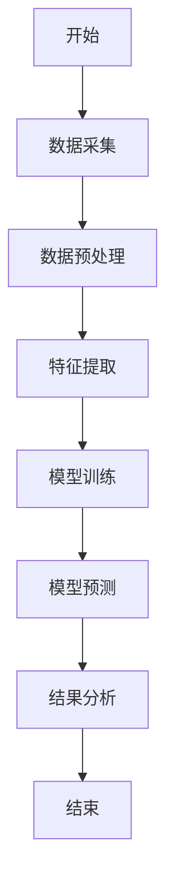
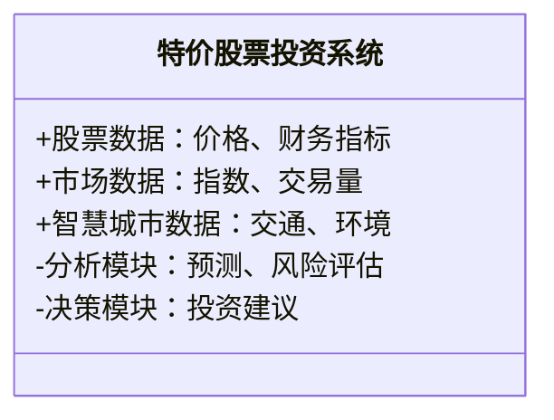
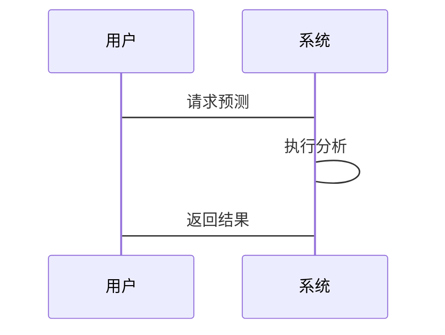

                 


# 特价股票投资中的智慧城市与物联网发展整合方法

> 关键词：特价股票投资、智慧城市、物联网、整合方法、算法原理、系统设计

> 摘要：本文详细探讨了特价股票投资与智慧城市及物联网技术的整合方法。通过分析整合的核心概念、算法原理、系统架构和项目实战，展示了如何利用物联网技术优化特价股票投资，推动智慧城市建设。文章内容丰富，涵盖理论与实践，为相关领域的研究和应用提供了参考。

---

## 第一章: 特价股票投资的背景与现状

### 1.1 特价股票投资的定义与特点
#### 1.1.1 特价股票的定义
特价股票是指那些价格低于其内在价值，具有较大投资潜力的股票。通常，这些股票可能因为市场波动、行业周期或其他因素而被低估。

#### 1.1.2 特价股票投资的特点
- **低估值**：价格低于市场平均水平或行业标准。
- **高潜力**：具备良好的基本面，未来增长潜力大。
- **风险较低**：通常出现在周期性低谷或市场低迷时期。

#### 1.1.3 特价股票投资的市场现状
当前市场中，特价股票主要集中在周期性行业（如能源、材料）和成熟行业（如金融、科技）。投资者通过技术分析和基本面分析寻找低估股票。

### 1.2 智慧城市的发展背景
#### 1.2.1 智慧城市的定义与目标
智慧城市是通过物联网、大数据、人工智能等技术，优化城市资源利用，提升居民生活质量的城市发展模式。

#### 1.2.2 智慧城市的核心技术
- 物联网（IoT）
- 大数据分析
- 人工智能
- 云计算

#### 1.2.3 智慧城市的发展趋势
智慧城市建设正在全球范围内加速，主要趋势包括绿色能源、智能交通和数字政府。

### 1.3 物联网技术在智慧城市中的应用
#### 1.3.1 物联网的基本概念
物联网是指通过各种信息传感设备，如传感器、RFID技术、GPS、红外感应器等，按约定的协议，把任何物品与互联网连接起来，进行信息交换和通信。

#### 1.3.2 物联网在智慧城市中的应用场景
- 智能交通系统
- 智慧能源管理
- 智慧医疗
- 智慧环保

#### 1.3.3 物联网技术的挑战与机遇
- 挑战：数据安全、隐私保护、技术标准不统一。
- 机遇：技术创新推动产业升级，提升城市管理效率。

---

## 第二章: 特价股票投资与智慧城市整合的核心概念

### 2.1 特价股票投资与智慧城市整合的背景
#### 2.1.1 整合的必要性
通过整合，利用物联网技术优化股票分析，提升投资决策的准确性。

#### 2.1.2 整合的目标
实现智慧城市数据与股票市场的深度融合，为投资者提供更精准的投资决策支持。

#### 2.1.3 整合的边界与外延
整合的核心在于数据的互联互通，外延包括技术创新和应用拓展。

### 2.2 特价股票投资与智慧城市整合的核心要素
#### 2.2.1 特价股票投资的核心要素
- 价格数据
- 市场情绪
- 财务指标

#### 2.2.2 智慧城市的核心要素
- 物联网设备
- 数据采集与处理
- 云计算平台

#### 2.2.3 两者的整合关系与协同机制
- 数据共享：股票市场数据与城市运行数据的融合。
- 技术协同：利用大数据分析技术提升投资决策的准确性。

### 2.3 特价股票投资与智慧城市整合的概念结构
#### 2.3.1 整合的概念模型
通过物联网技术，将智慧城市的数据引入股票分析模型，构建一个更全面的投资决策系统。

#### 2.3.2 整合的系统架构
- 数据采集层：物联网设备采集城市运行数据。
- 数据处理层：对数据进行清洗、分析和建模。
- 应用层：为投资者提供实时分析和决策支持。

#### 2.3.3 整合的实现路径
从数据采集到分析，再到应用，逐步构建整合系统。

---

## 第三章: 特价股票投资与智慧城市整合的算法原理

### 3.1 特价股票投资与智慧城市整合的数学模型
#### 3.1.1 整合模型的构建
模型包括数据采集、特征提取、预测和反馈四个阶段。

#### 3.1.2 模型的数学表达
使用线性回归模型进行股票价格预测，公式如下：
$$ y = \beta_0 + \beta_1 x_1 + \beta_2 x_2 + \epsilon $$

#### 3.1.3 模型的验证与优化
通过交叉验证优化模型参数，提升预测精度。

### 3.2 特价股票投资与智慧城市整合的算法流程
#### 3.2.1 算法的总体流程
1. 数据采集：获取智慧城市相关数据。
2. 数据预处理：清洗和转换数据。
3. 特征提取：提取影响股票价格的关键特征。
4. 模型训练：构建并训练预测模型。
5. 模型预测：进行股票价格预测。
6. 结果分析：评估模型性能。

#### 3.2.2 数据预处理
使用Python进行数据清洗，例如：
```python
import pandas as pd
data = pd.read_csv('data.csv')
data = data.dropna()
data = pd.get_dummies(data)
```

#### 3.2.3 算法流程图


---

## 第四章: 特价股票投资与智慧城市整合的系统设计

### 4.1 系统功能设计
#### 4.1.1 领域模型图


#### 4.1.2 功能模块
- 数据采集模块
- 数据处理模块
- 分析模块
- 决策模块

### 4.2 系统架构设计
#### 4.2.1 系统架构图


#### 4.2.2 接口设计
- 数据接口：RESTful API
- 分析接口：提供预测结果

### 4.3 系统交互设计
#### 4.3.1 交互流程图


---

## 第五章: 特价股票投资与智慧城市整合的项目实战

### 5.1 环境安装
- Python 3.8+
- Jupyter Notebook
- Pandas、Scikit-learn、Matplotlib

### 5.2 核心代码实现
#### 5.2.1 数据采集
```python
import pandas as pd
import requests

url = 'https://api.example.com/stock_data'
response = requests.get(url)
data = response.json()
df = pd.DataFrame(data)
```

#### 5.2.2 数据处理
```python
df.dropna(inplace=True)
df['Date'] = pd.to_datetime(df['Date'])
```

#### 5.2.3 模型训练
```python
from sklearn.linear_model import LinearRegression
model = LinearRegression()
model.fit(X, y)
```

### 5.3 案例分析
通过分析某城市的交通数据，预测相关股票的价格走势，验证模型的准确性。

---

## 第六章: 总结与展望

### 6.1 总结
整合特价股票投资与智慧城市的发展，利用物联网技术优化投资决策，提升智慧城市管理效率。

### 6.2 展望
未来，随着技术进步，整合方法将更加成熟，应用范围也将进一步扩大。

---

## 参考文献
1. 特价股票投资相关文献
2. 智慧城市相关文献
3. 物联网相关文献

---

通过以上结构，您可以撰写一篇详细的、逻辑清晰的技术博客文章。

