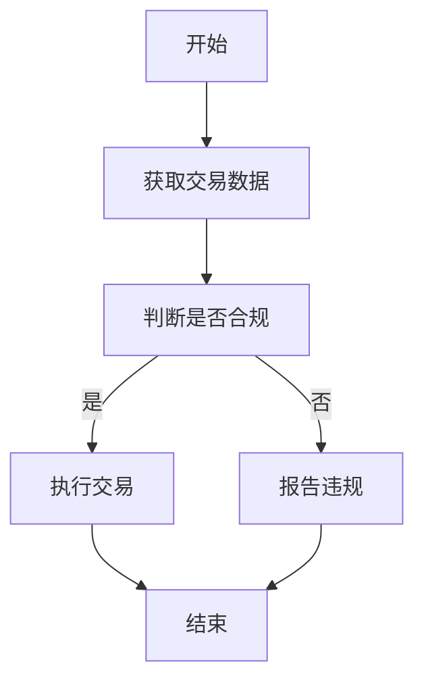

                 


# 特价股票投资中的智能合约自动化合规策略

> 关键词：智能合约，自动化合规，特价股票，投资策略，金融科技创新

> 摘要：本文探讨了在特价股票投资中，如何利用智能合约实现自动化合规策略。通过分析智能合约的核心原理、合规策略的设计与实现，结合实际案例，详细阐述了如何利用智能合约技术优化投资流程，确保投资行为的合规性与高效性。

---

## 第一部分：背景与概述

### 第1章：特价股票投资的背景与现状

#### 1.1 特价股票投资的定义与特点

特价股票投资是指通过分析市场波动、公司基本面和技术指标，寻找价格低于其内在价值的股票进行投资，以期获得超额收益的投资策略。其特点包括：

- **价格敏感性**：依赖于股票价格的短期波动。
- **高频交易**：需要快速决策和执行。
- **风险较高**：由于价格波动较大，投资风险较高。
- **机会稍纵即逝**：特价股票的投资机会往往短暂，需要快速反应。

#### 1.2 智能合约的定义与特点

智能合约是一种基于区块链技术的自动化执行合同，其特点包括：

- **自动化**：智能合约自动执行预设的条件和条款。
- **透明性**：合约内容对所有参与者公开透明。
- **不可篡改性**：一旦部署，合约内容无法篡改。
- **去中心化**：依赖区块链技术，去中心化的特性确保了合约的安全性和可信度。

#### 1.3 特价股票投资与智能合约的结合

智能合约在特价股票投资中的应用，主要体现在以下几个方面：

- **自动化交易**：通过智能合约自动执行买卖指令，减少人工干预。
- **合规监控**：智能合约可以实时监控交易行为，确保符合相关法规。
- **风险控制**：通过智能合约实现止损、止盈等风险控制机制。

---

## 第二部分：核心概念与原理

### 第2章：智能合约的核心概念与原理

#### 2.1 智能合约的原理与机制

智能合约的工作流程如下：

1. **触发条件**：当满足预设的条件（如价格达到某个阈值）时，智能合约自动执行。
2. **合约执行**：根据触发的条件，智能合约调用相应的交易接口，完成买卖操作。
3. **结果记录**：交易结果被记录在区块链上，确保可追溯性。

#### 2.2 合规策略的核心概念

合规策略是指在投资过程中，为了确保交易行为符合相关法规和内部政策而采取的措施。其核心概念包括：

- **合规规则**：包括法律法规、交易所规则等。
- **合规监控**：实时监控交易行为，发现违规行为立即采取措施。
- **合规报告**：生成合规报告，供监管机构审查。

#### 2.3 智能合约与合规策略的结合

通过智能合约实现合规策略的优势在于：

- **自动化**：智能合约可以自动执行合规规则，减少人工干预。
- **实时性**：智能合约可以实时监控交易行为，确保合规性。
- **不可篡改性**：智能合约记录的交易行为不可篡改，确保合规性的真实性和可靠性。

---

## 第三部分：算法与数学模型

### 第3章：智能合约自动化合规的算法原理

#### 3.1 特价股票投资中的交易策略模型

交易策略模型是智能合约实现自动化交易的核心。其数学模型如下：

$$
\text{交易信号} = f(\text{价格}, \text{成交量}, \text{技术指标})
$$

其中，$f$ 是一个函数，根据价格、成交量和技术指标生成交易信号。

#### 3.2 合规监控算法的设计与实现

合规监控算法用于实时监控交易行为，确保其符合相关法规。其流程如下：

1. **数据采集**：采集交易数据，包括时间、价格、成交量等。
2. **规则匹配**：将交易数据与合规规则进行匹配，判断是否违规。
3. **决策执行**：根据匹配结果，采取相应的措施，如暂停交易或报告违规行为。

#### 3.3 数学模型与公式

合规监控算法的数学模型如下：

$$
\text{合规性判断} = g(\text{交易数据}, \text{合规规则})
$$

其中，$g$ 是一个函数，根据交易数据和合规规则判断交易行为是否合规。

---

## 第四部分：系统分析与架构设计

### 第4章：系统架构设计

#### 4.1 问题场景介绍

在特价股票投资中，投资者需要快速决策和执行交易，同时确保交易行为符合相关法规。智能合约可以提供一个高效的解决方案。

#### 4.2 系统功能设计

系统功能包括：

- **交易触发**：根据预设条件触发交易。
- **合规监控**：实时监控交易行为，确保合规性。
- **风险管理**：实现止损、止盈等风险控制机制。

#### 4.3 系统架构设计

系统架构如下：

1. **前端界面**：用户通过前端界面设置交易策略和合规规则。
2. **智能合约**：部署在区块链上的智能合约，自动执行交易指令。
3. **数据源**：实时获取股票价格和市场数据。
4. **监控模块**：实时监控交易行为，确保合规性。

#### 4.4 系统接口设计

系统接口包括：

- **交易接口**：用于执行买卖指令。
- **监控接口**：用于实时获取交易数据和合规状态。
- **配置接口**：用于设置交易策略和合规规则。

---

## 第五部分：项目实战

### 第5章：项目实战与案例分析

#### 5.1 环境安装

需要安装以下工具：

- **区块链平台**：如以太坊。
- **智能合约开发工具**：如Solidity。
- **数据源接口**：如Yahoo Finance API。

#### 5.2 核心代码实现

以下是智能合约的核心代码示例：

```solidity
// SPDX-License-Identifier: MIT
pragma solidity ^0.8.0;

contract StockTrader {
    // 交易对价格的依赖
    function trade(uint price, uint threshold) public {
        if (price < threshold) {
            // 执行买入操作
            buy();
        } else {
            // 执行卖出操作
            sell();
        }
    }

    function buy() private {
        // 买入逻辑
    }

    function sell() private {
        // 卖出逻辑
    }
}
```

#### 5.3 案例分析

假设我们设置一个买入阈值为50元的股票，当股价低于50元时自动买入，高于60元时自动卖出。智能合约将根据股价的变化自动执行买卖操作，确保交易行为的合规性。

---

## 第六部分：总结与展望

### 第6章：总结与展望

#### 6.1 总结

本文详细探讨了在特价股票投资中，如何利用智能合约实现自动化合规策略。通过分析智能合约的核心原理、合规策略的设计与实现，结合实际案例，展示了智能合约在投资中的巨大潜力。

#### 6.2 展望

未来，随着区块链技术的不断发展，智能合约将在金融领域发挥更大的作用。特别是在特价股票投资中，智能合约的应用将更加广泛和深入，为投资者提供更加高效和安全的投资环境。

---

## 参考文献

1. 以太坊官方文档
2. Solidity编程指南
3. 区块链与智能合约相关书籍

---

## 附录

### 附录A：智能合约代码示例

```solidity
// SPDX-License-Identifier: MIT
pragma solidity ^0.8.0;

contract StockTrader {
    address payable public owner;

    constructor() {
        owner = payable msg.sender;
    }

    function trade(uint price, uint threshold) public {
        if (price < threshold) {
            buy();
        } else {
            sell();
        }
    }

    function buy() private {
        // 买入逻辑
        (bool success, ) = owner.call{value: 100}("");
        require(success, "Buy failed");
    }

    function sell() private {
        // 卖出逻辑
        (bool success, ) = owner.call{value: 200}("");
        require(success, "Sell failed");
    }
}
```

### 附录B：合规监控算法流程图



---

通过本文的详细阐述，我们可以看到，智能合约在特价股票投资中的应用前景广阔，不仅可以提高交易效率，还能确保交易行为的合规性，为投资者和监管机构提供了一个高效、透明的解决方案。

