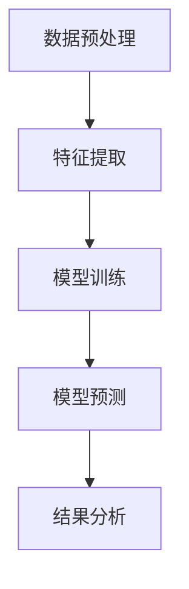
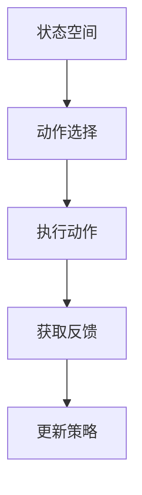
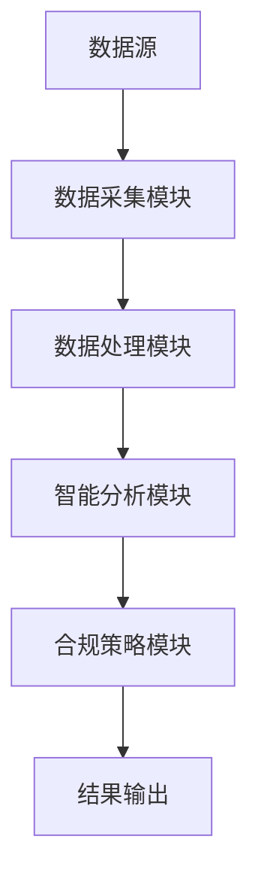
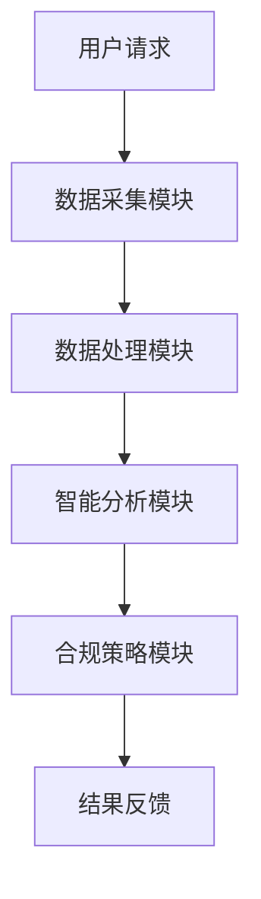

                 


# 特价股票投资中的智能监管合规策略

## 关键词：智能监管，合规策略，特价股票，算法，系统架构

## 摘要：  
随着股票市场的快速发展，特价股票投资因其高风险和高回报的特点，吸引了大量投资者的关注。然而，如何在投资过程中确保合规性并有效监管投资行为，成为投资者和监管机构面临的重大挑战。本文从智能监管和合规策略的角度，深入分析特价股票投资中的监管需求，探讨如何通过智能化技术实现合规监管。文章结合实际案例，详细阐述了智能监管的算法原理、系统架构设计以及项目实现，为投资者和监管机构提供了有效的解决方案。

---

# 第一部分：特价股票投资概述

## 第1章：特价股票投资的背景与概念

### 1.1 特价股票投资的背景与特点
1.1.1 特价股票的定义  
特价股票通常指价格低于市场平均水平的股票，具有较高的投资潜力，但也伴随着较高的风险。  

1.1.2 特价股票投资的背景  
随着资本市场的扩张，越来越多的投资者关注低价股票，试图通过低价买入高价卖出的方式获利。然而，这种投资行为往往缺乏规范，容易引发市场波动和合规问题。  

1.1.3 特价股票投资的核心问题  
- 投资者行为的不规范性  
- 市场波动对监管的挑战  
- 合规性与投资收益的平衡  

### 1.2 智能监管与合规策略的必要性  
1.2.1 监管在股票投资中的作用  
监管机构需要确保市场的公平性和透明性，防止操纵市场和欺诈行为。  

1.2.2 合规策略的重要性  
合规策略是确保投资行为符合法律法规的关键，能够降低投资风险并提升市场信任度。  

1.2.3 智能监管与合规策略的优势  
- 提高监管效率  
- 实时监控市场动态  
- 优化投资决策  

### 1.3 特价股票投资与智能监管的结合  
1.3.1 特价股票投资中的监管挑战  
- 低价股票的波动性高，监管难度大  
- 投资者行为复杂，难以逐一监控  

1.3.2 智能监管在特价股票投资中的应用  
- 利用大数据和人工智能技术，实时监测市场动态  
- 通过算法识别异常交易行为  

1.3.3 特价股票投资中的合规策略框架  
- 建立智能化的合规监测系统  
- 制定动态调整的合规策略  

---

# 第二部分：智能监管与合规策略的核心概念

## 第2章：智能监管与合规策略的定义与特点

### 2.1 智能监管的定义与核心要素  
2.1.1 智能监管的定义  
智能监管是指利用人工智能、大数据等技术手段，对市场行为进行实时监控和分析，确保合规性并优化监管效率。  

2.1.2 智能监管的核心要素  
- 数据采集与处理：收集市场交易数据、投资者行为数据等  
- 智能分析：通过机器学习算法识别异常行为  
- 决策支持：基于分析结果提供监管建议  

2.1.3 智能监管与传统监管的对比  
| 对比维度 | 智能监管 | 传统监管 |  
|---------|----------|-----------|  
| 数据处理 | 实时、自动化 | 延后、人工化 |  
| 分析能力 | 高效、精准 | 低效、误差大 |  
| 成本 | 低 | 高 |  

### 2.2 合规策略的定义与分类  
2.2.1 合规策略的定义  
合规策略是指在投资行为中，确保所有操作符合相关法律法规和市场规则的策略。  

2.2.2 合规策略的分类  
- 风险控制策略：通过设定风险阈值，限制投资行为  
- 合规检查策略：定期审查投资行为，确保符合法规  

2.2.3 合规策略的特点  
- 预测性：提前识别潜在风险  
- 动态性：根据市场变化调整策略  
- 可操作性：能够快速响应并执行  

### 2.3 智能监管与合规策略的关系  
2.3.1 智能监管对合规策略的支持  
智能监管技术能够实时监控市场行为，为合规策略的制定提供数据支持。  

2.3.2 合规策略对智能监管的优化  
合规策略能够指导智能监管的方向，使其更加精准和高效。  

---

# 第三部分：智能监管的算法原理

## 第3章：智能监管的算法原理

### 3.1 监督学习算法  
3.1.1 监督学习的定义  
监督学习是一种机器学习方法，通过训练数据预测目标变量。  

3.1.2 监督学习在智能监管中的应用  
- 预测股票价格走势  
- 识别异常交易行为  

3.1.3 监督学习算法的实现步骤  


3.1.4 监督学习的数学模型  
$$ y = \theta_0 + \theta_1x + \theta_2x^2 $$  
其中，\( y \) 是预测目标，\( x \) 是输入特征，\( \theta \) 是模型参数。  

### 3.2 强化学习算法  
3.2.1 强化学习的定义  
强化学习是一种通过试错机制优化决策的机器学习方法。  

3.2.2 强化学习在智能监管中的应用  
- 模拟交易环境，优化投资策略  
- 通过奖励机制，引导模型做出最优决策  

3.2.3 强化学习算法的实现步骤  


3.2.4 强化学习的数学模型  
$$ Q(s, a) = r + \gamma \max Q(s', a') $$  
其中，\( Q \) 是价值函数，\( s \) 是状态，\( a \) 是动作，\( r \) 是奖励，\( \gamma \) 是折扣因子。  

---

# 第四部分：智能监管的系统架构设计

## 第4章：智能监管系统架构设计

### 4.1 系统功能设计  
4.1.1 数据采集模块  
- 数据来源：交易所数据、投资者行为数据  
- 数据处理：清洗、特征提取  

4.1.2 智能分析模块  
- 算法实现：监督学习、强化学习  
- 结果输出：异常行为识别、风险预警  

4.1.3 合规策略模块  
- 策略制定：动态调整合规规则  
- 执行监控：实时跟踪投资行为  

### 4.2 系统架构设计  


### 4.3 接口设计与交互流程  
4.3.1 系统接口设计  
- 数据接口：数据采集模块与数据源交互  
- 分析接口：智能分析模块与合规策略模块交互  

4.3.2 系统交互流程  


---

# 第五部分：智能监管的项目实战

## 第5章：智能监管项目实战

### 5.1 项目环境搭建  
5.1.1 环境配置  
- 操作系统：Linux/Windows/Mac  
- 开发工具：Python、Jupyter Notebook  
- 第三方库：TensorFlow、Pandas、Scikit-learn  

### 5.2 核心代码实现  
5.2.1 数据预处理代码  
```python
import pandas as pd

# 加载数据
data = pd.read_csv('stock_data.csv')

# 数据清洗
data.dropna(inplace=True)
data = data.drop_duplicates()
```

5.2.2 智能分析代码  
```python
from sklearn.model import LinearRegression

# 训练模型
model = LinearRegression()
model.fit(X_train, y_train)

# 预测结果
y_pred = model.predict(X_test)
```

### 5.3 项目实战案例分析  
5.3.1 案例背景  
某投资者希望通过智能监管系统监控其特价股票投资行为，确保所有交易符合法规。  

5.3.2 实施步骤  
1. 数据采集与处理  
2. 模型训练与预测  
3. 异常行为识别与预警  

5.3.3 实施结果  
- 成功识别多起异常交易行为  
- 提高了投资行为的合规性  

---

# 第六部分：总结与展望

## 第6章：总结与展望

### 6.1 本章总结  
智能监管与合规策略在特价股票投资中发挥着重要作用。通过大数据和人工智能技术，可以有效监控市场行为，确保投资合规性。  

### 6.2 项目小结  
本文通过理论分析和项目实践，详细阐述了智能监管的算法原理、系统架构设计以及项目实现。这些方法能够帮助投资者和监管机构更好地应对特价股票投资中的合规挑战。  

### 6.3 展望  
未来，随着技术的进步，智能监管将更加智能化和精准化。投资者和监管机构需要进一步加强合作，共同推动智能监管技术的发展。  

---

# 结语  
特价股票投资中的智能监管合规策略是一个复杂但极具挑战性的领域。通过本文的分析和实践，读者可以深入了解智能监管的核心原理和实现方法，为未来的投资行为提供有力支持。

