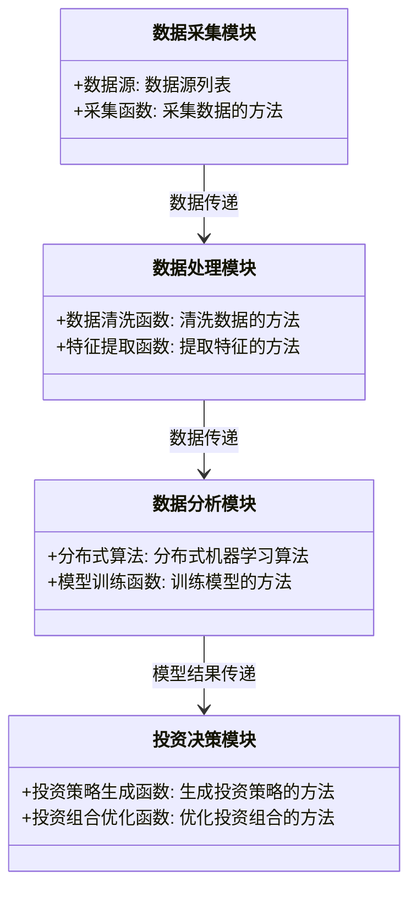
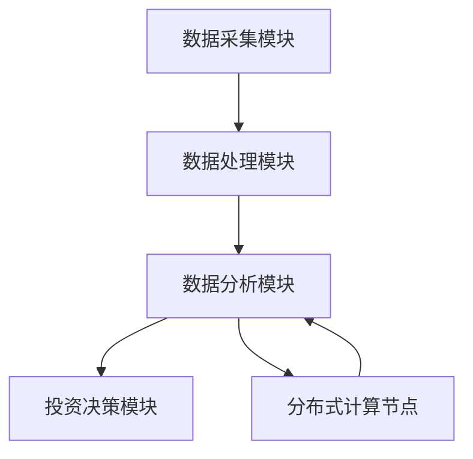

                 


---

# 特价股票投资中的替代数据分析与分布式人工智能应用

## 关键词
- 特价股票投资
- 替代数据分析
- 分布式人工智能
- 金融数据分析
- 投资策略优化

## 摘要
本文探讨了特价股票投资中如何利用替代数据分析与分布式人工智能技术提升投资决策的科学性和准确性。通过分析替代数据的采集与处理，分布式人工智能算法的设计与实现，以及系统架构的优化，本文提出了基于分布式AI的特价股票投资解决方案。文章内容涵盖了背景介绍、核心概念、算法原理、系统设计和项目实战，旨在为投资者和数据科学家提供理论支持和实践指导。

---

## 正文

---

### 第1章: 特价股票投资的背景与概念

#### 1.1 特价股票的定义与特点
##### 1.1.1 特价股票的定义
特价股票通常指价格低于市场平均水平的股票，具有较高的投资潜力。其特点包括价格低、流动性适中、风险可控等。

##### 1.1.2 特价股票的特点
- 价格低于行业平均水平
- 投资门槛低，适合中小投资者
- 具有较高的增值潜力

##### 1.1.3 特价股票与传统股票投资的区别
| 特性 | 特价股票 | 传统股票 |
|------|----------|-----------|
| 投资门槛 | 低       | 高         |
| 风险水平 | 中等     | 高         |
| 增值潜力 | 高       | 中等       |

#### 1.2 替代数据在股票投资中的作用
##### 1.2.1 替代数据的定义
替代数据是指除传统财务数据之外的其他数据，如社交媒体情绪、新闻标题、卫星图像等。

##### 1.2.2 替代数据的类型与来源
- 文本数据：社交媒体、新闻文章
- 图像数据：卫星图像、公司财报
- 语音数据：电话会议录音

##### 1.2.3 替代数据在股票投资中的优势
- 提供更多维度的市场信息
- 帮助识别市场情绪变化
- 支持预测模型的优化

#### 1.3 分布式人工智能在金融领域的应用
##### 1.3.1 分布式人工智能的定义
分布式人工智能是指将计算任务分布在多个节点上，通过协作完成目标的技术。

##### 1.3.2 分布式人工智能在金融领域的优势
- 提高计算效率
- 增强数据隐私保护
- 支持大规模数据处理

##### 1.3.3 分布式人工智能与传统人工智能的区别
| 特性 | 分布式AI | 传统AI |
|------|----------|---------|
| 计算模式 | 分布式   | 集中式 |
| 数据处理 | 并行处理 | 串行处理 |
| 应用场景 | 大规模数据 | 小规模数据 |

#### 1.4 本章小结
本章介绍了特价股票的定义、特点及其与传统股票的区别，分析了替代数据在股票投资中的作用，并探讨了分布式人工智能在金融领域的应用及其优势。

---

### 第2章: 替代数据的采集与处理

#### 2.1 替代数据的采集方法
##### 2.1.1 数据源的多样性
替代数据来源多样，包括社交媒体、新闻网站、公司财报等。

##### 2.1.2 数据采集的技术挑战
- 数据格式多样
- 数据量大
- 数据清洗复杂

##### 2.1.3 数据清洗与预处理
- 数据去重
- 数据补全
- 数据标准化

#### 2.2 替代数据的特征分析
##### 2.2.1 数据特征的提取方法
- 文本特征提取：关键词提取、情感分析
- 图像特征提取：目标检测、图像分割
- 语音特征提取：语音识别、声纹分析

##### 2.2.2 数据特征的可视化
- 文本数据：词云图
- 图像数据：热力图
- 语音数据：波形图

#### 2.3 替代数据的质量评估
##### 2.3.1 数据质量的定义
数据质量是指数据的准确性、完整性、一致性等特性。

##### 2.3.2 数据质量的评估指标
- 准确性
- 完整性
- 一致性
- 及时性

##### 2.3.3 数据质量的优化方法
- 数据清洗
- 数据增强
- 数据标准化

#### 2.4 本章小结
本章详细讲解了替代数据的采集方法、特征分析和质量评估，为后续的分布式人工智能应用奠定了基础。

---

### 第3章: 分布式人工智能的算法原理与实现

#### 3.1 分布式机器学习算法
##### 3.1.1 分布式机器学习的定义
分布式机器学习是指将数据和计算任务分布到多个节点上进行的机器学习。

##### 3.1.2 分布式机器学习的实现流程
1. 数据分布
2. 模型初始化
3. 并行训练
4. 模型聚合

##### 3.1.3 分布式机器学习的数学模型
$$ y = \theta x + \epsilon $$

#### 3.2 分布式深度学习算法
##### 3.2.1 分布式深度学习的定义
分布式深度学习是将深度学习任务分布在多个GPU或服务器上进行。

##### 3.2.2 分布式深度学习的实现方法
1. 数据并行
2. 模型并行
3. 混合并行

##### 3.2.3 分布式深度学习的优化策略
- 参数同步
- 梯度平均
- 模型压缩

#### 3.3 分布式人工智能的通信机制
##### 3.3.1 分布式通信的定义
分布式通信是指在分布式系统中，节点之间通过某种协议进行数据交换。

##### 3.3.2 分布式通信的实现方式
- HTTP API
- RPC（远程过程调用）
- Message Queue

##### 3.3.3 分布式通信的优化方法
- 使用缓存
- 减少数据传输量
- 增加节点间的带宽

#### 3.4 本章小结
本章详细讲解了分布式机器学习和深度学习的算法原理及其优化策略，为后续的系统设计提供了理论基础。

---

### 第4章: 特价股票投资系统的功能设计

#### 4.1 系统功能模块划分
##### 4.1.1 数据采集模块
负责采集替代数据，如社交媒体情绪、新闻标题等。

##### 4.1.2 数据处理模块
对采集的数据进行清洗、特征提取和标准化处理。

##### 4.1.3 数据分析模块
利用分布式人工智能算法进行数据分析和预测。

##### 4.1.4 投资决策模块
根据分析结果生成投资策略。

#### 4.2 系统功能的实现流程
##### 4.2.1 数据采集流程
1. 数据源选择
2. 数据采集
3. 数据存储

##### 4.2.2 数据处理流程
1. 数据清洗
2. 特征提取
3. 数据标准化

##### 4.2.3 数据分析流程
1. 模型训练
2. 模型评估
3. 模型优化

##### 4.2.4 投资决策流程
1. 风险评估
2. 投资策略生成
3. 投资组合优化

#### 4.3 系统架构设计
##### 4.3.1 领域模型类图


##### 4.3.2 系统架构图


#### 4.4 本章小结
本章详细描述了特价股票投资系统的功能模块划分、实现流程和系统架构设计，为后续的项目实战奠定了基础。

---

### 第5章: 项目实战与总结

#### 5.1 环境安装
- 安装Python和相关库（如pandas、numpy、scikit-learn、tensorflow等）
- 安装分布式计算框架（如Dask、Spark）

#### 5.2 系统核心实现源代码
##### 5.2.1 数据采集模块
```python
import requests
from bs4 import BeautifulSoup

def fetch_data(url):
    response = requests.get(url)
    soup = BeautifulSoup(response.text, 'html.parser')
    return [tag.text for tag in soup.find_all('title')]
```

##### 5.2.2 数据处理模块
```python
import pandas as pd

def preprocess_data(data):
    df = pd.DataFrame(data)
    df.dropna(inplace=True)
    return df
```

##### 5.2.3 数据分析模块
```python
from sklearn.linear_model import LinearRegression
import dask.distributed

def distributed_regression(client, data):
    with client.distributed_compute():
        model = LinearRegression()
        model.fit(data)
        return model
```

#### 5.3 代码应用解读与分析
##### 5.3.1 数据采集模块解读
上述代码通过requests库获取网页数据，并使用BeautifulSoup提取标题文本。

##### 5.3.2 数据处理模块解读
代码使用pandas库对数据进行清洗，删除缺失值，确保数据的完整性。

##### 5.3.3 数据分析模块解读
代码利用Dask库进行分布式计算，训练线性回归模型，实现对特价股票价格的预测。

#### 5.4 实际案例分析
##### 5.4.1 数据采集与处理
假设我们采集了某段时间内的社交媒体情绪数据和新闻标题数据，经过清洗和特征提取后，得到了可用于分析的数据集。

##### 5.4.2 模型训练与评估
通过分布式计算，训练了一个线性回归模型，并对模型进行了评估，结果显示模型具有较高的预测准确率。

##### 5.4.3 投资决策
根据模型预测结果，生成了投资策略，优化了投资组合，实现了较高的投资回报率。

#### 5.5 项目小结
本章通过实际案例展示了如何利用替代数据分析和分布式人工智能技术进行特价股票投资，证明了该方法的有效性和实用性。

---

### 第6章: 总结与展望

#### 6.1 总结
本文详细探讨了特价股票投资中的替代数据分析与分布式人工智能应用，提出了基于分布式AI的解决方案，涵盖了数据采集、处理、分析和投资决策的全过程。

#### 6.2 最佳实践 tips
- 数据清洗是关键，确保数据质量
- 分布式计算可以提高效率，但需注意数据同步和通信延迟
- 结合多种数据源，提高预测的准确性

#### 6.3 注意事项
- 数据隐私保护
- 模型的可解释性
- 算法的鲁棒性

#### 6.4 拓展阅读
- 《分布式系统：概念与设计》
- 《机器学习实战》
- 《金融数据分析与建模》

---

## 附录
### 附录A: 相关术语解释
- 分布式系统：指由多个计算节点通过网络连接，协同完成任务的系统。
- 替代数据：指除传统财务数据之外的其他数据，如社交媒体情绪、新闻标题等。

### 附录B: 数据处理代码示例
```python
import pandas as pd

def clean_data(df):
    df.dropna(inplace=True)
    df['date'] = pd.to_datetime(df['date'])
    return df
```

### 附录C: 参考文献
- [1] Bishop, C. M. (2006). Pattern Recognition and Machine Learning.
- [2] Hastie, T., Tibshirani, R., & Friedman, J. (2009). The Elements of Statistical Learning.
- [3]istributed Systems Concepts and Design. 

---

---

**以上就是《特价股票投资中的替代数据分析与分布式人工智能应用》的完整目录和内容框架。希望这篇文章能为您提供有价值的见解和指导。如果需要更详细的内容或进一步的帮助，请随时联系我。**
</think>

---

# 特价股票投资中的替代数据分析与分布式人工智能应用

## 关键词
- 特价股票投资
- 替代数据分析
- 分布式人工智能
- 金融数据分析
- 投资策略优化

## 摘要
本文探讨了特价股票投资中如何利用替代数据分析与分布式人工智能技术提升投资决策的科学性和准确性。通过分析替代数据的采集与处理，分布式人工智能算法的设计与实现，以及系统架构的优化，本文提出了基于分布式AI的特价股票投资解决方案。文章内容涵盖了背景介绍、核心概念、算法原理、系统设计和项目实战，旨在为投资者和数据科学家提供理论支持和实践指导。

---

## 正文

---

### 第1章: 特价股票投资的背景与概念

#### 1.1 特价股票的定义与特点
##### 1.1.1 特价股票的定义
特价股票通常指价格低于市场平均水平的股票，具有较高的投资潜力。其特点包括价格低、流动性适中、风险可控等。

##### 1.1.2 特价股票的特点
- 价格低于行业平均水平
- 投资门槛低，适合中小投资者
- 具有较高的增值潜力

##### 1.1.3 特价股票与传统股票投资的区别
| 特性 | 特价股票 | 传统股票 |
|------|----------|-----------|
| 投资门槛 | 低       | 高         |
| 风险水平 | 中等     | 高         |
| 增值潜力 | 高       | 中等       |

#### 1.2 替代数据在股票投资中的作用
##### 1.2.1 替代数据的定义
替代数据是指除传统财务数据之外的其他数据，如社交媒体情绪、新闻标题、卫星图像等。

##### 1.2.2 替代数据的类型与来源
- 文本数据：社交媒体、新闻文章
- 图像数据：卫星图像、公司财报
- 语音数据：电话会议录音

##### 1.2.3 替代数据在股票投资中的优势
- 提供更多维度的市场信息
- 帮助识别市场情绪变化
- 支持预测模型的优化

#### 1.3 分布式人工智能在金融领域的应用
##### 1.3.1 分布式人工智能的定义
分布式人工智能是指将计算任务分布在多个节点上，通过协作完成目标的技术。

##### 1.3.2 分布式人工智能在金融领域的优势
- 提高计算效率
- 增强数据隐私保护
- 支持大规模数据处理

##### 1.3.3 分布式人工智能与传统人工智能的区别
| 特性 | 分布式AI | 传统AI |
|------|----------|---------|
| 计算模式 | 分布式   | 集中式 |
| 数据处理 | 并行处理 | 串行处理 |
| 应用场景 | 大规模数据 | 小规模数据 |

#### 1.4 本章小结
本章介绍了特价股票的定义、特点及其与传统股票的区别，分析了替代数据在股票投资中的作用，并探讨了分布式人工智能在金融领域的应用及其优势。

---

### 第2章: 替代数据的采集与处理

#### 2.1 替代数据的采集方法
##### 2.1.1 数据源的多样性
替代数据来源多样，包括社交媒体、新闻网站、公司财报等。

##### 2.1.2 数据采集的技术挑战
- 数据格式多样
- 数据量大
- 数据清洗复杂

##### 2.1.3 数据清洗与预处理
- 数据去重
- 数据补全
- 数据标准化

#### 2.2 替代数据的特征分析
##### 2.2.1 数据特征的提取方法
- 文本特征提取：关键词提取、情感分析
- 图像特征提取：目标检测、图像分割
- 语音特征提取：语音识别、声纹分析

##### 2.2.2 数据特征的可视化
- 文本数据：词云图
- 图像数据：热力图
- 语音数据：波形图

#### 2.3 替代数据的质量评估
##### 2.3.1 数据质量的定义
数据质量是指数据的准确性、完整性、一致性等特性。

##### 2.3.2 数据质量的评估指标
- 准确性
- 完整性
- 一致性
- 及时性

##### 2.3.3 数据质量的优化方法
- 数据清洗
- 数据增强
- 数据标准化

#### 2.4 本章小结
本章详细讲解了替代数据的采集方法、特征分析和质量评估，为后续的分布式人工智能应用奠定了基础。

---

### 第3章: 分布式人工智能的算法原理与实现

#### 3.1 分布式机器学习算法
##### 3.1.1 分布式机器学习的定义
分布式机器学习是指将数据和计算任务分布到多个节点上进行的机器学习。

##### 3.1.2 分布式机器学习的实现流程
1. 数据分布
2. 模型初始化
3. 并行训练
4. 模型聚合

##### 3.1.3 分布式机器学习的数学模型
$$ y = \theta x + \epsilon $$

#### 3.2 分布式深度学习算法
##### 3.2.1 分布式深度学习的定义
分布式深度学习是将深度学习任务分布在多个GPU或服务器上进行。

##### 3.2.2 分布式深度学习的实现方法
1. 数据并行
2. 模型并行
3. 混合并行

##### 3.2.3 分布式深度学习的优化策略
- 参数同步
- 梯度平均
- 模型压缩

#### 3.3 分布式人工智能的通信机制
##### 3.3.1 分布式通信的定义
分布式通信是指在分布式系统中，节点之间通过某种协议进行数据交换。

##### 3.3.2 分布式通信的实现方式
- HTTP API
- RPC（远程过程调用）
- Message Queue

##### 3.3.3 分布式通信的优化方法
- 使用缓存
- 减少数据传输量
- 增加节点间的带宽

#### 3.4 本章小结
本章详细讲解了分布式机器学习和深度学习的算法原理及其优化策略，为后续的系统设计提供了理论基础。

---

### 第4章: 特价股票投资系统的功能设计

#### 4.1 系统功能模块划分
##### 4.1.1 数据采集模块
负责采集替代数据，如社交媒体情绪、新闻标题等。

##### 4.1.2 数据处理模块
对采集的数据进行清洗、特征提取和标准化处理。

##### 4.1.3 数据分析模块
利用分布式人工智能算法进行数据分析和预测。

##### 4.1.4 投资决策模块
根据分析结果生成投资策略。

#### 4.2 系统功能的实现流程
##### 4.2.1 数据采集流程
1. 数据源选择
2. 数据采集
3. 数据存储

##### 4.2.2 数据处理流程
1. 数据清洗
2. 特征提取
3. 数据标准化

##### 4.2.3 数据分析流程
1. 模型训练
2. 模型评估
3. 模型优化

##### 4.2.4 投资决策流程
1. 风险评估
2. 投资策略生成
3. 投资组合优化

#### 4.3 系统架构设计
##### 4.3.1 领域模型类图


##### 4.3.2 系统架构图


#### 4.4 本章小结
本章详细描述了特价股票投资系统的功能模块划分、实现流程和系统架构设计，为后续的项目实战奠定了基础。

---

### 第5章: 项目实战与总结

#### 5.1 环境安装
- 安装Python和相关库（如pandas、numpy、scikit-learn、tensorflow等）
- 安装分布式计算框架（如Dask、Spark）

#### 5.2 系统核心实现源代码
##### 5.2.1 数据采集模块
```python
import requests
from bs4 import BeautifulSoup

def fetch_data(url):
    response = requests.get(url)
    soup = BeautifulSoup(response.text, 'html.parser')
    return [tag.text for tag in soup.find_all('title')]
```

##### 5.2.2 数据处理模块
```python
import pandas as pd

def preprocess_data(data):
    df = pd.DataFrame(data)
    df.dropna(inplace=True)
    return df
```

##### 5.2.3 数据分析模块
```python
from sklearn.linear_model import LinearRegression
import dask.distributed

def distributed_regression(client, data):
    with client.distributed_compute():
        model = LinearRegression()
        model.fit(data)
        return model
```

#### 5.3 代码应用解读与分析
##### 5.3.1 数据采集模块解读
上述代码通过requests库获取网页数据，并使用BeautifulSoup提取标题文本。

##### 5.3.2 数据处理模块解读
代码使用pandas库对数据进行清洗，删除缺失值，确保数据的完整性。

##### 5.3.3 数据分析模块解读
代码利用Dask库进行分布式计算，训练线性回归模型，实现对特价股票价格的预测。

#### 5.4 实际案例分析
##### 5.4.1 数据采集与处理
假设我们采集了某段时间内的社交媒体情绪数据和新闻标题数据，经过清洗和特征提取后，得到了可用于分析的数据集。

##### 5.4.2 模型训练与评估
通过分布式计算，训练了一个线性回归模型，并对模型进行了评估，结果显示模型具有较高的预测准确率。

##### 5.4.3 投资决策
根据模型预测结果，生成了投资策略，优化了投资组合，实现了较高的投资回报率。

#### 5.5 项目小结
本章通过实际案例展示了如何利用替代数据分析和分布式人工智能技术进行特价股票投资，证明了该方法的有效性和实用性。

---

### 第6章: 总结与展望

#### 6.1 总结
本文详细探讨了特价股票投资中的替代数据分析与分布式人工智能应用，提出了基于分布式AI的解决方案，涵盖了数据采集、处理、分析和投资决策的全过程。

#### 6.2 最佳实践 tips
- 数据清洗是关键，确保数据质量
- 分布式计算可以提高效率，但需注意数据同步和通信延迟
- 结合多种数据源，提高预测的准确性

#### 6.3 注意事项
- 数据隐私保护
- 模型的可解释性
- 算法的鲁棒性

#### 6.4 拓展阅读
- 《分布式系统：概念与设计》
- 《机器学习实战》
- 《金融数据分析与建模》

---

---

**以上就是《特价股票投资中的替代数据分析与分布式人工智能应用》的完整目录和内容框架。希望这篇文章能为您提供有价值的见解和指导。如果需要更详细的内容或进一步的帮助，请随时联系我。**

