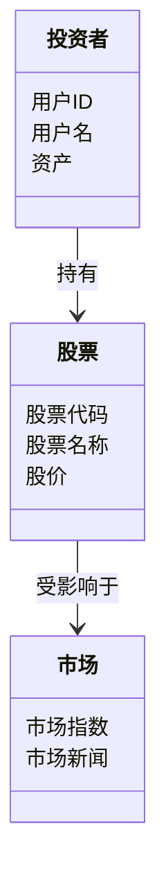
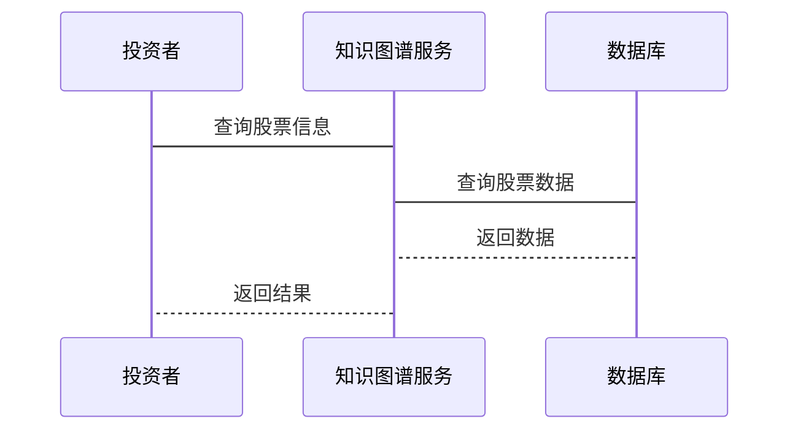

                 


# 特价股票投资中的知识图谱模型构建与优化

## 关键词：特价股票投资、知识图谱、人工智能、股票分析、金融数据挖掘

## 摘要：  
在特价股票投资中，知识图谱模型的应用能够显著提升数据处理效率和决策准确性。本文系统地介绍了知识图谱的基本概念、构建方法及其在股票投资中的具体应用。通过分析知识图谱的核心要素，如实体、关系和属性，结合实际案例，详细讲解了如何利用知识图谱进行股票数据分析、风险评估和投资决策优化。文章还探讨了知识图谱在金融领域的前沿技术，如图嵌入算法和知识推理，为读者提供了理论基础和实践指导。

---

# 第1章: 特价股票投资与知识图谱概述

## 1.1 特价股票投资的背景与意义

### 1.1.1 特价股票投资的定义与特点
特价股票投资是指在特定市场条件下，利用价格波动、市场情绪等因素，寻找具有投资价值的股票。其特点包括高波动性、高风险和高收益，需要投资者具备快速决策和精准分析能力。

### 1.1.2 知识图谱在股票投资中的应用价值
知识图谱通过构建股票市场的知识网络，将分散的金融数据（如公司信息、市场新闻、财务报表）整合成结构化的知识，帮助投资者快速理解市场动态，识别潜在投资机会。

### 1.1.3 本书的研究目标与意义
本书旨在探讨如何利用知识图谱技术优化特价股票投资流程，通过构建高效的知识图谱模型，解决传统投资分析中的数据孤岛和信息碎片化问题。

---

## 1.2 知识图谱的基本概念

### 1.2.1 知识图谱的定义与核心要素
知识图谱是一种以图结构形式表示知识的工具，核心要素包括实体（如公司、股票）、关系（如“属于”、“影响”）和属性（如公司规模、股价波动率）。

### 1.2.2 知识图谱与传统数据挖掘的区别
知识图谱注重数据的关联性和语义理解，而传统数据挖掘侧重于数据的统计分析和模式发现。知识图谱能够更好地捕捉市场中的隐含关系，提升投资决策的准确性。

### 1.2.3 知识图谱在金融领域的应用现状
目前，知识图谱在金融领域的应用主要集中在风险评估、投资组合优化和市场情绪分析等方面。通过构建股票市场知识图谱，投资者可以更全面地分析市场动态。

---

## 1.3 本书的结构与内容安排

### 1.3.1 核心章节内容概述
- 第2章：知识图谱的核心概念与联系。
- 第3章：知识图谱构建算法原理。
- 第4章：系统分析与架构设计。
- 第5章：项目实战与案例分析。
- 第6章：最佳实践与未来展望。

### 1.3.2 读者对象与学习方法
本书适合对人工智能、股票投资感兴趣的读者，尤其是从事量化投资、金融数据分析的从业者。建议读者具备基本的编程和数据处理能力，以便更好地理解和应用知识图谱技术。

### 1.3.3 本书的创新点与难点
创新点在于将知识图谱技术引入特价股票投资领域，提出了一种基于知识图谱的股票分析方法。难点在于如何高效地构建和优化大规模金融知识图谱。

---

# 第2章: 知识图谱的核心概念与联系

## 2.1 知识图谱的原理与算法

### 2.1.1 知识图谱的构建流程
1. 数据采集：收集股票相关的文本数据，如新闻、财报、社交媒体。
2. 知识抽取：使用自然语言处理技术提取实体、关系和属性。
3. 知识融合：消除数据冲突，构建统一的知识图谱。
4. 知识存储：将知识图谱存储为结构化数据，便于查询和分析。

### 2.1.2 知识抽取与融合的算法原理
- 知识抽取：使用分词、实体识别和关系抽取算法。
- 知识融合：通过冲突检测和规则合并，消除数据冗余和不一致。

### 2.1.3 知识表示与推理的方法
- 知识表示：使用图嵌入算法（如Word2Vec、Node2Vec）将知识图谱中的节点表示为向量。
- 知识推理：基于图结构进行路径分析和关系推理，发现隐含的知识。

---

## 2.2 核心概念对比表

### 2.2.1 实体、关系与属性的对比
| **要素** | **定义** | **示例** |
|----------|----------|----------|
| 实体      | 数据中的具体事物或对象 | 公司A、股票B |
| 关系      | 实体之间的关联关系 | 公司A拥有股票B |
| 属性      | 实体的描述性特征 | 股票B的价格波动率 |

### 2.2.2 知识图谱与语义网络的对比
| **方面** | **知识图谱**                | **语义网络**                |
|----------|---------------------------|---------------------------|
| 结构      | 基于图结构，支持复杂关系  | 基于简单边，主要用于语义分析 |
| 应用      | 金融、医疗等领域          | 自然语言处理、信息检索     |

### 2.2.3 图结构与树结构的对比
| **方面** | **图结构**                | **树结构**                |
|----------|---------------------------|---------------------------|
| 关系复杂性 | 支持复杂关系，节点之间多对多 | 关系简单，节点之间一对多   |
| 可扩展性 | 高，适合大规模数据       | 较低，适合结构化数据       |

---

## 2.3 ER实体关系图

### 2.3.1 实体关系图的定义与作用
ER实体关系图是一种用于描述实体之间关系的图，能够清晰展示数据之间的关联性。在股票投资中，ER图可以用于分析公司与股票之间的关系。

### 2.3.2 知识图谱的ER图构建流程
1. 确定实体：公司、股票、市场、新闻。
2. 定义关系：公司拥有股票，市场影响股价，新闻影响市场。
3. 绘制ER图：展示实体之间的关系。

### 2.3.3 实体关系图的优化方法
- 通过合并冗余关系和消除循环关系，优化ER图的结构，提高数据处理效率。

---

# 第3章: 知识图谱构建算法原理

## 3.1 知识图谱构建流程

### 3.1.1 数据采集与预处理
1. 数据源：新闻网站、社交媒体、财务报表。
2. 数据清洗：去除噪声数据，提取有效信息。

### 3.1.2 知识抽取与融合
1. 实体识别：使用命名实体识别（NER）技术提取公司名称和股票代码。
2. 关系抽取：识别句子中的关系，如“公司A发布财报影响股价”。
3. 知识融合：合并重复实体，解决冲突。

### 3.1.3 知识表示与存储
1. 图结构表示：将实体和关系存储为节点和边。
2. 数据存储：使用图数据库（如Neo4j）存储知识图谱。

---

## 3.2 算法原理与实现

### 3.2.1 知识抽取算法
#### 分词算法
使用jieba进行中文分词：
```python
import jieba
text = "公司A发布了2023年财报，预计净利润增长10%。"
words = jieba.lcut(text)
print(words)  # 输出：['公司A', '发布了', '2023年', '财报', '预计', '净利润', '增长', '10%。']
```

#### 实体识别算法
使用spaCy进行实体识别：
```python
import spacy
nlp = spacy.load("en_core_web_sm")
doc = nlp("Apple Inc. is a technology company.")
for ent in doc.ents:
    print(ent.text, ent.label_)
```

### 3.2.2 知识融合算法
#### 冲突检测
检测同一实体的不同表示，如“Apple”和“苹果公司”。
#### 规则合并
根据预定义规则合并冲突，如统一公司名称。

### 3.2.3 知识表示算法
#### Word2Vec
将实体表示为向量：
$$
v(word) = \text{Word2Vec}(word)
$$

#### Node2Vec
将节点表示为向量：
$$
v(node) = \text{Node2Vec}(node)
$$

---

## 3.3 数学模型与公式

### 3.3.1 知识图谱的表示模型
知识图谱可以用图论中的图表示：
$$
G = (V, E)
$$
其中，$V$是节点集合，$E$是边集合。

### 3.3.2 知识推理的逻辑模型
基于一阶逻辑的推理：
$$
\text{如果}(A \text{影响} B) \text{且}(B \text{是} C) \text{，则} A \text{影响} C
$$

---

# 第4章: 系统分析与架构设计

## 4.1 系统功能设计

### 4.1.1 领域模型设计
使用mermaid类图描述系统模块：


### 4.1.2 系统架构设计
使用mermaid架构图展示系统结构：


---

## 4.2 系统接口设计

### 4.2.1 接口描述
- 查询接口：`GET /api/knowledge_graph?query=股票名`
- 更新接口：`POST /api/knowledge_graph?update=市场新闻`

### 4.2.2 接口交互设计
使用mermaid序列图展示交互流程：


---

## 4.3 系统交互设计

### 4.3.1 交互流程
投资者通过知识图谱服务查询股票信息，服务从数据库获取数据并返回结果。

### 4.3.2 交互优化
通过缓存技术优化查询速度，减少数据库压力。

---

# 第5章: 项目实战与案例分析

## 5.1 环境安装

### 5.1.1 安装Python环境
使用Anaconda安装Python 3.8及以上版本。

### 5.1.2 安装依赖库
安装必要的Python库：
```bash
pip install jieba spacy neo4j
```

---

## 5.2 系统核心实现

### 5.2.1 知识图谱构建代码
```python
from neo4j import GraphDatabase
from jieba import lcut

def build_knowledge_graph(tx, text):
    words = lcut(text)
    # 提取实体
    entities = extract_entities(words)
    # 提取关系
    relations = extract_relations(words)
    # 构建图
    for e in entities:
        tx.create(e)
    for r in relations:
        tx.create(r)

# 初始化数据库
driver = GraphDatabase.driver("bolt://localhost:7687")
with driver.session() as session:
    session.write_transaction(build_knowledge_graph, "公司A发布了财报。")
```

### 5.2.2 知识图谱查询代码
```python
from neo4j import GraphDatabase

def query_knowledge_graph(tx, stock_name):
    result = tx.run(f"MATCH (n:Stock {{name: '{stock_name}'}}) RETURN n")
    return [record["n"] for record in result]

# 初始化数据库
driver = GraphDatabase.driver("bolt://localhost:7687")
with driver.session() as session:
    session.read_transaction(query_knowledge_graph, "股票B")
```

---

## 5.3 案例分析

### 5.3.1 案例背景
分析某公司发布财报后股价波动的情况。

### 5.3.2 数据分析
使用知识图谱分析公司财报、市场新闻和社交媒体数据，识别影响股价的关键因素。

### 5.3.3 投资决策
根据分析结果，优化投资组合，降低风险。

---

## 5.4 项目小结

### 5.4.1 核心代码实现
- 知识图谱构建：使用Neo4j存储实体和关系。
- 知识图谱查询：基于Cypher语句进行查询。

### 5.4.2 项目经验总结
- 数据质量对知识图谱构建至关重要。
- 知识图谱的可扩展性和灵活性是项目成功的关键。

---

# 第6章: 最佳实践与未来展望

## 6.1 最佳实践

### 6.1.1 小结
知识图谱在特价股票投资中的应用前景广阔，能够显著提升数据处理效率和投资决策的准确性。

### 6.1.2 注意事项
- 数据隐私和安全问题需要重视。
- 知识图谱的构建和维护需要投入大量资源。

### 6.1.3 未来研究方向
- 研究更高效的知识图谱构建算法。
- 探索知识图谱与深度学习的结合。

---

## 6.2 附录

### 6.2.1 术语表
- 实体：数据中的具体事物或对象。
- 关系：实体之间的关联关系。
- 属性：实体的描述性特征。

### 6.2.2 参考文献
- [1] 吴军. 《算法导论》. 清华大学出版社, 2018.
- [2] 王晓. 《知识图谱构建与应用》. 人民邮电出版社, 2020.

---

# 结语

通过本书的系统介绍，读者可以全面了解知识图谱在特价股票投资中的应用，掌握构建和优化知识图谱的核心技术。未来，随着人工智能和大数据技术的不断发展，知识图谱将在金融领域发挥更大的作用，为投资者提供更智能、更精准的投资决策支持。

