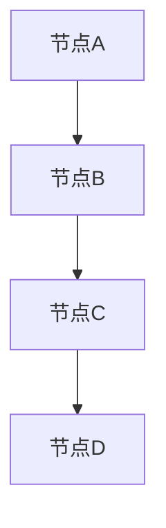
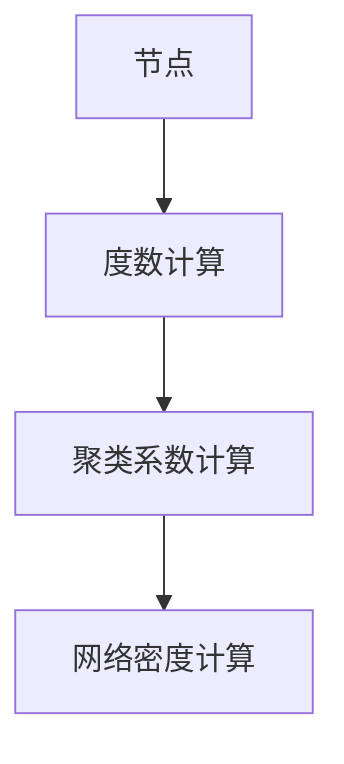
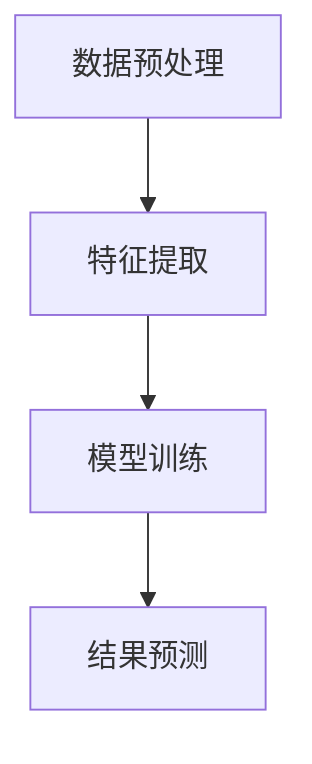

                 


# 特价股票投资中的社交网络拓扑动态分析与应用

## 关键词
社交网络，拓扑动态分析，特价股票，投资策略，数据挖掘，算法原理，系统架构

## 摘要
本文将探讨如何利用社交网络拓扑动态分析来优化特价股票投资策略。通过分析社交网络中的用户行为和信息传播，我们可以揭示市场情绪和趋势，从而为投资者提供科学的决策依据。文章从社交网络的基本概念出发，结合拓扑动态分析的核心原理，详细讲解相关算法的实现，并通过实际案例展示其在特价股票投资中的应用。

## 第1章：社交网络概述

### 1.1 社交网络的基本概念
#### 1.1.1 社交网络的定义
社交网络是指由节点和边组成的图，节点代表个体（如用户、机构），边代表它们之间的关系（如朋友关系、交易关系）。社交网络可以是实时的，也可以是静态的，但动态变化是其核心特征。

#### 1.1.2 社交网络的属性特征
| 特性 | 描述 |
|------|------|
| 节点度数 | 节点的连接边数，反映节点的影响力 |
| 聚类系数 | 衡量网络中节点的聚集程度，反映网络的紧密性 |
| 网络密度 | 网络中边的数量与可能边数的比率，反映网络的连接强度 |

#### 1.1.3 社交网络的拓扑结构
使用Mermaid流程图展示社交网络的拓扑结构：



### 1.2 特价股票投资的背景
#### 1.2.1 什么是特价股票
特价股票是指价格低于市场平均水平的股票，通常具有较高的增长潜力，但风险也较高。

#### 1.2.2 特价股票投资的意义
通过分析社交网络数据，投资者可以发现市场中的潜在机会，提前布局，降低投资风险。

#### 1.2.3 特价股票投资的挑战
市场波动大、信息不透明、投资者情绪复杂多变。

### 1.3 社交网络在股票投资中的应用
#### 1.3.1 社交网络数据的来源
包括社交媒体（如Twitter、Reddit）、新闻网站、股票论坛等。

#### 1.3.2 社交网络在股票投资中的作用
通过分析用户情绪、传播速度、信息影响力，帮助投资者判断市场趋势。

#### 1.3.3 特价股票投资中的社交网络分析
利用社交网络分析工具，识别高潜力股票，评估投资风险。

## 第2章：社交网络拓扑动态分析的核心概念

### 2.1 社交网络拓扑动态分析的定义
#### 2.1.1 拓扑结构的动态变化
社交网络中的节点和边会随着时间变化，反映市场动态。

#### 2.1.2 动态分析的意义
通过分析网络的动态变化，可以发现市场趋势和潜在机会。

#### 2.1.3 动态分析的数学模型
网络密度计算公式：

$$
\text{密度} = \frac{2E}{N(N-1)}
$$

其中，E是边的数量，N是节点的数量。

### 2.2 社交网络拓扑动态分析的核心要素
#### 2.2.1 节点与边的定义
节点代表投资者，边代表投资行为。

#### 2.2.2 拓扑特征的度量
使用Mermaid流程图展示拓扑特征的度量过程：



#### 2.2.3 动态变化的驱动因素
市场情绪、政策变化、公司业绩等。

### 2.3 社交网络拓扑动态分析的数学模型
#### 2.3.1 节点度数的分布
节点度数分布可以用概率密度函数表示：

$$
P(k) = \frac{e^{-\lambda k} \cdot \lambda^k}{k!}
$$

其中，λ是平均度数。

#### 2.3.2 节点的影响力指数
使用影响力指数公式：

$$
I_i = \frac{d_i}{\sum_{j} d_j}
$$

其中，d_i是节点i的度数，d_j是其他节点的度数。

## 第3章：社交网络拓扑动态分析的算法原理

### 3.1 算法的基本原理
#### 3.1.1 数据预处理
去除噪声数据，提取有效信息。

#### 3.1.2 特征提取
提取节点度数、聚类系数等特征。

#### 3.1.3 模型训练
使用机器学习算法（如随机森林、支持向量机）进行分类或回归。

### 3.2 算法的实现步骤
使用Mermaid流程图展示算法实现步骤：



#### 3.2.1 数据预处理
示例代码：

```python
import pandas as pd
data = pd.read_csv('stock_data.csv')
data_clean = data.dropna()
```

#### 3.2.2 特征提取
示例代码：

```python
from sklearn.feature_extraction import text
vectorizer = text.TfidfVectorizer()
X = vectorizer.fit_transform(data_clean['text'])
```

#### 3.2.3 模型训练
示例代码：

```python
from sklearn.ensemble import RandomForestClassifier
model = RandomForestClassifier()
model.fit(X, data_clean['label'])
```

### 3.3 算法的数学模型
#### 3.3.1 逻辑回归模型
逻辑回归公式：

$$
P(y=1|x) = \frac{e^{\beta x}}{1 + e^{\beta x}}
$$

其中，β是模型参数。

#### 3.3.2 支持向量机模型
支持向量机的数学模型：

$$
y = \text{sign}(\sum_{i} \alpha_i y_i x_i \cdot x + b)
$$

其中，α_i是拉格朗日乘子，b是偏置项。

## 第4章：社交网络拓扑动态分析的系统架构

### 4.1 系统设计概述
#### 4.1.1 系统目标
构建一个实时监控社交网络拓扑动态的系统，为投资者提供实时数据支持。

#### 4.1.2 系统功能模块
- 数据采集模块：采集社交网络数据。
- 数据处理模块：清洗和转换数据。
- 数据分析模块：计算拓扑特征。
- 数据可视化模块：展示分析结果。

#### 4.1.3 系统架构设计
使用Mermaid架构图展示系统架构：


### 4.2 系统实现细节
#### 4.2.1 数据采集模块
使用API接口采集数据，例如：

```python
import requests
response = requests.get('https://api.twitter.com/...')
data = response.json()
```

#### 4.2.2 数据处理模块
清洗数据，转换格式，例如：

```python
import pandas as pd
data_clean = pd.DataFrame(data).dropna()
```

#### 4.2.3 数据分析模块
计算拓扑特征，例如：

```python
from networkx import degree
degrees = {node: degree(graph, node) for node in graph.nodes()}
```

#### 4.2.4 数据可视化模块
使用Matplotlib或Seaborn库进行可视化。

## 第5章：社交网络拓扑动态分析的项目实战

### 5.1 环境安装与配置
#### 5.1.1 安装依赖
安装必要的Python库，例如：

```bash
pip install numpy pandas networkx matplotlib
```

#### 5.1.2 数据集准备
准备社交网络数据集，例如：

```bash
wget https://example.com/stock_data.csv
```

### 5.2 核心功能实现
#### 5.2.1 数据采集与清洗
编写数据采集脚本，清洗数据。

#### 5.2.2 拓扑特征计算
使用NetworkX库计算拓扑特征。

#### 5.2.3 模型训练与预测
使用训练好的模型进行预测，输出结果。

### 5.3 实际案例分析
#### 5.3.1 数据分析结果
展示分析结果，例如网络密度、节点度数分布。

#### 5.3.2 投资策略制定
基于分析结果，制定投资策略，例如重点关注高影响力节点。

### 5.4 项目总结
#### 5.4.1 项目成果
通过分析社交网络数据，成功识别出高潜力特价股票。

#### 5.4.2 经验总结
社交网络拓扑动态分析为投资决策提供了有力支持，但仍需结合其他因素进行综合判断。

## 第6章：总结与展望

### 6.1 小结
本文通过分析社交网络拓扑动态，揭示了其在特价股票投资中的重要作用，提出了具体的实现方法和应用案例。

### 6.2 注意事项
投资者在实际操作中需谨慎，结合多种因素进行综合判断。

### 6.3 拓展阅读
建议读者阅读相关文献，深入理解社交网络分析的最新进展。

## 参考文献
[1] 网络科学导论
[2] 社会网络分析方法与应用
[3] 机器学习在金融中的应用

---

以上是《特价股票投资中的社交网络拓扑动态分析与应用》的完整目录和内容概述，希望对您有所帮助！

