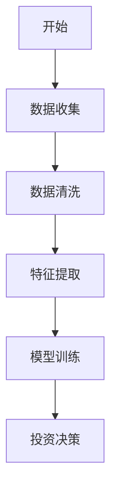
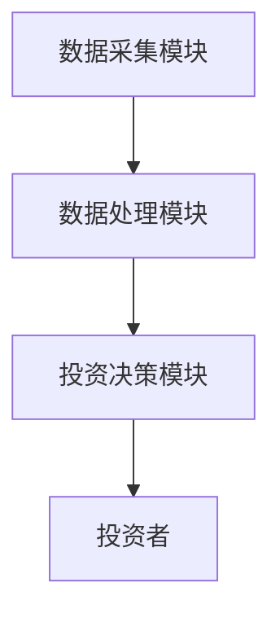

                 


# 特价股票投资中的社会责任投资因素考量

> 关键词：社会责任投资，特价股票，ESG评分，投资策略，风险管理

> 摘要：本文探讨了在特价股票投资中引入社会责任投资（SRI）因素的重要性。通过分析SRI的核心概念、评估指标和算法原理，本文提出了将ESG评分体系应用于特价股票筛选的方法，并结合实际案例，展示了如何通过系统架构和算法优化来实现社会责任投资与特价股票投资的结合。文章最后总结了最佳实践策略和风险管理措施。

---

## 正文

### 第一部分: 特价股票投资中的社会责任投资背景与概念

#### 第1章: 特价股票与社会责任投资的定义与背景

##### 1.1 特价股票的定义与特点
- **1.1.1 特价股票的定义**  
  特价股票是指市盈率、市净率等估值指标低于行业平均水平的股票，通常被认为具有较高的投资价值。
  
- **1.1.2 特价股票的特点**  
  - 价格较低，适合资金有限的投资者。  
  - 市场风险较低，但回报潜力较高。  
  - 可能隐藏在业绩不佳或暂时被市场忽视的公司中。

- **1.1.3 特价股票的投资价值**  
  特价股票通常被视为价值投资的首选，但其潜在风险较高，需结合公司基本面进行分析。

##### 1.2 社会责任投资的核心概念
- **1.2.1 社会责任投资的定义**  
  社会责任投资（SRI）是指在投资决策中考虑环境（Environmental）、社会（Social）和治理（Governance）因素的投资策略。

- **1.2.2 社会责任投资的三大支柱**  
  - **环境（E）**：关注公司在环境保护方面的表现，如碳排放、能源使用效率等。  
  - **社会（S）**：关注公司在员工权益、社会责任等方面的表现。  
  - **治理（G）**：关注公司的治理结构，如董事会构成、高管薪酬、内部控制等。

- **1.2.3 社会责任投资的全球发展趋势**  
  随着全球对可持续发展的关注增加，SRI的投资规模逐年增长，已成为全球投资的重要趋势。

##### 1.3 特价股票与社会责任投资的结合
- **1.3.1 特价股票与社会责任投资的契合点**  
  特价股票的低估值与SRI的长期价值理念相结合，为投资者提供了在追求收益的同时关注社会责任的机会。

- **1.3.2 特价股票社会责任投资的市场现状**  
  当前，SRI在发达国家市场较为成熟，但在新兴市场仍处于发展阶段。

- **1.3.3 特价股票社会责任投资的未来趋势**  
  随着ESG评分体系的完善和投资者对可持续发展的关注增加，SRI在特价股票投资中的应用将更加广泛。

#### 第2章: 特价股票社会责任投资的核心概念与联系

##### 2.1 社会责任投资的核心原理
- **2.1.1 ESG评分体系**  
  ESG评分体系是SRI的核心工具，通过量化公司在环境、社会和治理方面的表现，为投资者提供决策依据。

- **2.1.2 社会责任投资的评估指标**  
  - 环境指标：碳排放、能源使用效率等。  
  - 社会指标：员工权益、社区贡献等。  
  - 治理指标：董事会构成、高管薪酬、内部控制等。

- **2.1.3 社会责任投资的决策模型**  
  基于ESG评分的多因素分析模型，结合公司基本面和市场风险进行投资决策。

##### 2.2 特价股票与社会责任投资的属性特征对比
- **2.2.1 特价股票与非社会责任股票的对比**  
  - 投资价值：特价股票价格低，非社会责任股票价格高。  
  - 风险偏好：特价股票风险较高，非社会责任股票风险较低。

- **2.2.2 社会责任投资与传统投资的对比**  
  - 投资目标：社会责任投资注重长期价值，传统投资注重短期收益。  
  - 风险管理：社会责任投资注重风险管理，传统投资注重收益最大化。

- **2.2.3 特价股票社会责任投资的特殊性**  
  - 价格低，但社会责任评分高。  
  - 风险高，但长期回报潜力大。

##### 2.3 实体关系图与流程图
- **2.3.1 实体关系图（ER图）**  
  使用Mermaid绘制的ER图展示了投资者、证券交易所、上市公司和社会责任评估机构之间的关系。

```
```mermaid
erd
  投资者 ----> 证券交易所
  证券交易所 ----> 上市公司
  上市公司 ----> 社会责任评估机构
  社会责任评估机构 ----> ESG评分
```

- **2.3.2 流程图（Mermaid）**  
  下图展示了从数据收集到投资决策的流程。

```


---

### 第二部分: 特价股票社会责任投资的算法原理

#### 第3章: 特价股票社会责任投资的算法原理

##### 3.1 多因素分析模型
- **3.1.1 模型概述**  
  多因素分析模型基于ESG评分和公司基本面数据，结合市场风险因素，评估公司的综合价值。

- **3.1.2 模型输入与输出**  
  - **输入**：公司基本面数据、ESG评分、市场风险指标。  
  - **输出**：综合评分、投资建议。

- **3.1.3 模型的数学公式**  
  综合评分公式如下：

  $$ ESG\_score = \alpha \cdot E + \beta \cdot S + \gamma \cdot G $$

  其中，$E$、$S$、$G$分别代表环境、社会和治理评分，$\alpha$、$\beta$、$\gamma$为对应的权重系数。

##### 3.2 算法流程图
- **3.2.1 流程图（Mermaid）**  
  下图展示了算法的执行流程。

```


---

### 第三部分: 特价股票社会责任投资的系统分析与架构设计

#### 第4章: 特价股票社会责任投资的系统架构设计

##### 4.1 系统功能设计
- **4.1.1 数据采集模块**  
  - 从证券交易所获取上市公司数据。  
  - 收集公司基本面数据、ESG评分和市场风险指标。

- **4.1.2 数据处理模块**  
  - 数据清洗：去除异常值、填充缺失值。  
  - 特征提取：提取关键特征，如市盈率、市净率、ESG评分等。

- **4.1.3 投资决策模块**  
  - 基于多因素分析模型生成投资建议。  
  - 输出综合评分和投资策略。

##### 4.2 系统架构设计
- **4.2.1 模块化设计**  
  - 数据采集模块：负责数据的获取和初步处理。  
  - 数据处理模块：负责数据的清洗和特征提取。  
  - 投资决策模块：负责模型训练和投资建议生成。

- **4.2.2 系统交互设计**  
  使用Mermaid绘制的系统交互图展示了各模块之间的协作关系。

```


---

### 第四部分: 特价股票社会责任投资的项目实战

#### 第5章: 特价股票社会责任投资的项目实战

##### 5.1 项目环境与工具安装
- **5.1.1 环境配置**  
  - 操作系统：Windows 10 或 macOS Monterey。  
  - 开发工具：Jupyter Notebook 或 PyCharm。  
  - 依赖库：Pandas、NumPy、Scikit-learn、Matplotlib。

##### 5.2 系统核心实现源代码
- **5.2.1 数据处理代码**  
  ```python
  import pandas as pd
  import numpy as np

  # 数据加载
  df = pd.read_csv('stock_data.csv')

  # 数据清洗
  df = df.dropna()
  df = df.replace({np.nan: 0})

  # 特征提取
  features = ['市盈率', '市净率', 'ESG评分']
  X = df[features]
  y = df['投资建议']
  ```

- **5.2.2 模型训练代码**  
  ```python
  from sklearn.linear_model import LinearRegression

  model = LinearRegression()
  model.fit(X, y)

  # 模型预测
  predictions = model.predict(X)
  ```

##### 5.3 代码应用解读与分析
- **5.3.1 数据处理解读**  
  数据清洗和特征提取是确保模型准确性的基础。通过去除缺失值和异常值，可以提高模型的预测能力。

- **5.3.2 模型训练解读**  
  线性回归模型用于预测投资建议，其中ESG评分、市盈率和市净率是关键特征。

##### 5.4 实际案例分析
- **5.4.1 案例背景**  
  某上市公司基本面良好，但因行业低迷导致股价被低估。

- **5.4.2 模型应用**  
  通过模型计算出该公司ESG评分为85分，市盈率为10，市净率为2，预测其投资建议为“买入”。

##### 5.5 项目小结
- 本项目通过将ESG评分体系应用于特价股票筛选，展示了如何在投资决策中考虑社会责任因素。

---

### 第五部分: 特价股票社会责任投资的最佳实践

#### 第6章: 特价股票社会责任投资的最佳实践

##### 6.1 小结
- 本文探讨了将社会责任投资引入特价股票投资的可行性与必要性。  
- 通过多因素分析模型和系统架构设计，展示了如何在实际投资中应用ESG评分体系。

##### 6.2 注意事项
- **数据来源**：确保数据的准确性和时效性。  
- **模型优化**：根据市场变化不断优化模型参数。  
- **风险管理**：制定有效的风险管理策略，降低投资风险。

##### 6.3 拓展阅读
- 推荐阅读《可持续投资：理论与实践》和《ESG投资指南》。

---

通过以上分析，我们可以看出，将社会责任投资引入特价股票投资不仅能够提高投资的可持续性，还能为投资者带来长期的收益。希望本文的分析对投资者在特价股票投资中考虑社会责任因素有所启发。

--- 

**本文完**

