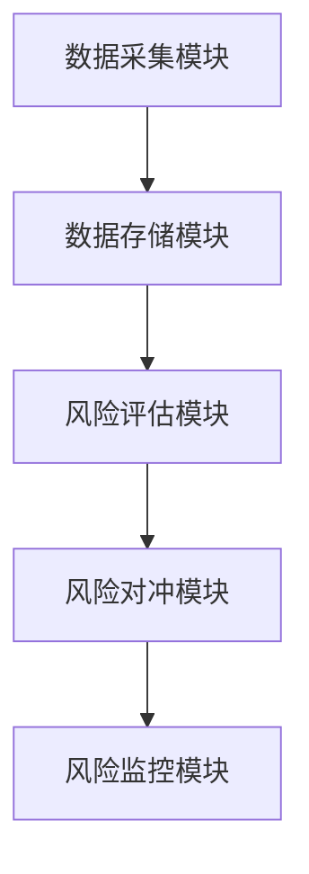
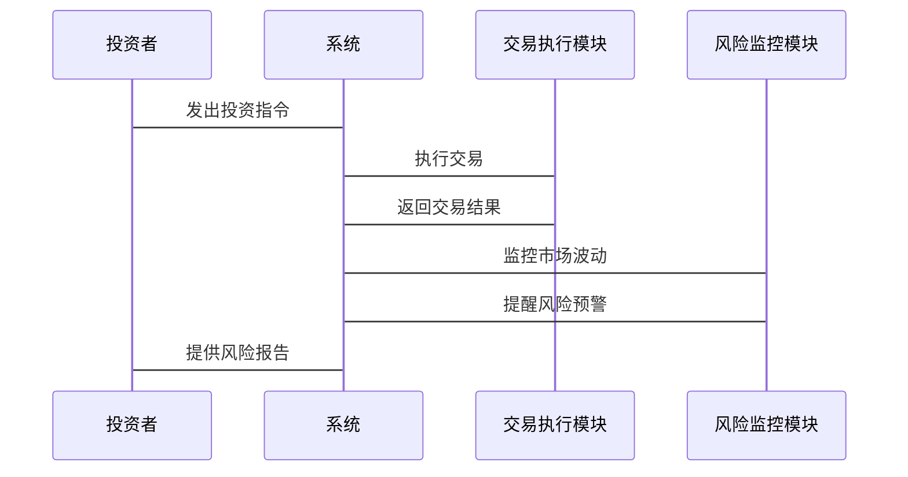

                 


# 特价股票投资中的系统性风险管理

## 关键词：特价股票、系统性风险管理、风险管理、量化分析、算法原理

## 摘要：  
特价股票投资是一种在特定市场环境下寻找低估股票进行投资的策略，而系统性风险管理则是保障投资者在面对系统性风险时能够有效规避损失的重要手段。本文将从系统性风险管理的理论基础、量化分析方法、算法实现、系统架构设计以及实际案例分析等方面，详细探讨如何在特价股票投资中构建有效的系统性风险管理框架。通过本文的分析，读者将能够掌握系统性风险管理的核心概念、量化方法和实际应用，从而在特价股票投资中规避系统性风险，实现稳健投资。

---

# 第1章: 特价股票投资概述

## 1.1 特价股票的定义与特点

### 1.1.1 特价股票的定义  
特价股票是指在特定市场环境下，由于市场波动、公司基本面变化或其他外部因素影响，导致股票价格被市场低估，从而为投资者提供买入机会的股票。这类股票通常具有较高的安全边际，能够在未来市场恢复时带来超额收益。

### 1.1.2 特价股票的核心特点  
- **价格低估**：股票价格低于其内在价值。  
- **市场关注度低**：往往被市场忽视或低估。  
- **周期性机会**：通常出现在市场低迷或行业低谷时期。  
- **高波动性**：价格波动较大，既可能带来超额收益，也可能引发较大损失。  

### 1.1.3 特价股票与普通股票的区别  
| 特性         | 特价股票               | 普通股票             |  
|--------------|------------------------|----------------------|  
| 价格         | 低于内在价值           | 反映市场公允价值     |  
| 市场关注度     | 较低                   | 较高                 |  
| 投资风险       | 高波动性，系统性风险较高 | 风险分散，波动性较低 |  
| 投资机会       | 周期性出现             | 长期稳定             |  

---

## 1.2 特价股票投资的背景与现状

### 1.2.1 特价股票投资的背景  
特价股票投资的背景与市场周期密切相关。通常在市场下跌、经济低迷或行业低谷时，许多优质股票会被市场低估，从而为投资者提供买入机会。近年来，全球市场的波动性增加，尤其是2008年金融危机和2020年新冠疫情的影响，使得特价股票投资成为许多投资者关注的焦点。

### 1.2.2 特价股票投资的现状  
当前，随着量化投资和算法交易的兴起，越来越多的投资者开始关注特价股票的投资机会。机构投资者和个人投资者都在利用大数据分析和量化模型，寻找市场中的低估股票。然而，特价股票投资也伴随着较高的系统性风险，因此如何有效管理这些风险成为投资者关注的核心问题。

### 1.2.3 特价股票投资的未来趋势  
未来，随着人工智能和大数据技术的进一步发展，特价股票投资将更加依赖于量化分析和系统性风险管理。投资者将更多地依赖于算法交易和自动化系统来捕捉市场机会，同时通过系统性风险管理工具来规避整体市场波动带来的风险。

---

## 1.3 系统性风险管理的重要性

### 1.3.1 系统性风险管理的定义  
系统性风险管理是指在整体市场或系统层面，识别、评估和控制那些可能影响整个市场的风险。与非系统性风险（即特定于某只股票或行业的风险）不同，系统性风险具有广泛性和相关性，影响整个市场的波动。

### 1.3.2 系统性风险管理的核心要素  
- **风险识别**：识别可能影响市场的系统性风险因素。  
- **风险评估**：量化系统性风险的影响程度。  
- **风险控制**：通过 diversification、对冲或其他手段来降低系统性风险的影响。  

### 1.3.3 系统性风险管理与非系统性风险管理的区别  

| 特性         | 系统性风险管理           | 非系统性风险管理         |  
|--------------|--------------------------|--------------------------|  
| 影响范围       | 影响整个市场或系统       | 影响特定资产或行业       |  
| 可分散性       | 不可分散                 | 可分散                   |  
| 来源           | 宏观经济波动、政策变化等  | 公司业绩、行业竞争等     |  

---

# 第2章: 特价股票投资中的系统性风险分析

## 2.1 系统性风险的来源

### 2.1.1 宏观经济因素  
宏观经济因素是系统性风险的主要来源之一，包括：  
- 经济周期波动：经济衰退或复苏会影响整体市场的表现。  
- 利率变化：利率上升会增加企业的融资成本，影响股市表现。  
- 汇率波动：汇率变化会影响出口型企业的发展，进而影响股市。  

### 2.1.2 市场波动因素  
市场波动因素包括：  
- 市场恐慌情绪：投资者的恐慌情绪会导致市场大幅波动。  
- 杠杆效应：高杠杆交易会放大市场的波动性。  
- 羊群效应：投资者的跟风行为会导致市场短期大幅波动。  

### 2.1.3 政策法规因素  
政策法规因素包括：  
- 财政政策：政府的财政刺激或紧缩政策会影响市场。  
- 货币政策：央行的加息或降息政策会影响市场流动性。  
- 监管政策：新的监管政策可能对特定行业或市场产生重大影响。  

---

## 2.2 系统性风险的特征

### 2.2.1 风险的普遍性  
系统性风险影响整个市场，而非特定资产或行业。  

### 2.2.2 风险的相关性  
系统性风险在不同资产之间具有高度相关性，市场波动会同时影响多种资产。  

### 2.2.3 风险的不可分散性  
与非系统性风险不同，系统性风险无法通过分散投资来消除，因为其影响范围广泛且相关性高。  

---

## 2.3 系统性风险的量化与度量

### 2.3.1 风险值（VaR）的定义与计算  
风险值（Value at Risk，VaR）是一种常用的系统性风险量化工具，表示在一定置信水平下，投资组合可能遭受的最大损失。  
**公式**：  
$$ VaR = \text{投资组合价值} \times \text{风险系数} \times \text{标准差} $$  

### 2.3.2 系统性风险的数学模型  
系统性风险可以通过多元回归模型或因子模型进行量化。例如，使用市场因子（如市场指数）来解释股票收益的波动。  
**公式**：  
$$ R_i = \alpha_i + \beta_i R_m + \epsilon_i $$  
其中，$R_i$ 是股票 i 的收益，$R_m$ 是市场收益，$\beta_i$ 是股票 i 的贝塔系数，$\epsilon_i$ 是残差项。  

### 2.3.3 系统性风险的度量方法  
- **VaR方法**：基于历史数据或蒙特卡洛模拟计算VaR。  
- **CVaR方法**：条件风险值，衡量在VaR水平下的平均损失。  
- **贝塔系数法**：通过贝塔系数衡量股票相对于市场的系统性风险。  

---

# 第3章: 系统性风险管理的核心概念与联系

## 3.1 系统性风险管理的核心原理

### 3.1.1 系统性风险管理的理论基础  
系统性风险管理的理论基础包括现代资产组合理论（MPT）和资本资产定价模型（CAPM）。  

### 3.1.2 系统性风险管理的实施步骤  
1. 识别系统性风险来源。  
2. 量化系统性风险的影响。  
3. 设计风险对冲策略。  
4. 实施风险监控和调整。  

### 3.1.3 系统性风险管理的关键要素  
- 风险识别：准确识别系统性风险来源。  
- 风险量化：使用VaR、CVaR等工具量化风险。  
- 风险对冲：通过期货、期权等工具对冲系统性风险。  

---

## 3.2 核心概念对比表

| 特性         | 系统性风险管理           | 非系统性风险管理         |  
|--------------|--------------------------|--------------------------|  
| 影响范围       | 整个市场或系统           | 特定资产或行业           |  
| 可分散性       | 不可分散                 | 可分散                   |  
| 来源           | 宏观经济、政策变化等     | 公司业绩、行业竞争等     |  

---

## 3.3 系统性风险管理的ER实体关系图

```mermaid
er
actor 系统性风险管理
  --> 实体 系统性风险
  --> 实体 风险来源
  --> 实体 风险影响
```

---

# 第4章: 系统性风险管理的算法原理

## 4.1 系统性风险管理的算法概述

### 4.1.1 算法的定义与特点  
系统性风险管理算法是一种通过量化模型和对冲策略，降低整体市场波动对投资组合影响的算法。

### 4.1.2 算法的核心思想  
通过识别和对冲系统性风险因子，降低投资组合的系统性风险敞口。

---

## 4.2 算法原理的数学模型

### 4.2.1 算法的数学模型  
系统性风险管理算法通常基于因子模型，例如Fama-French三因子模型。  
**公式**：  
$$ R_i = \alpha + \beta_1 R_m + \beta_2 Size + \beta_3 Value + \epsilon $$  

### 4.2.2 算法的公式推导  
通过回归分析，计算每只股票的贝塔系数，进而构建对冲策略。  

### 4.2.3 算法的数学表达式  
$$ \text{对冲比例} = \frac{\beta_i}{\beta_{market}} \times \text{市场头寸} $$  

---

## 4.3 算法的实现与优化

### 4.3.1 算法的实现步骤  
1. 数据收集：收集历史市场数据和股票数据。  
2. 因子分析：构建因子模型，提取系统性风险因子。  
3. 风险对冲：通过期货或期权对冲系统性风险。  
4. 监控与调整：实时监控市场波动，动态调整对冲策略。  

### 4.3.2 算法的优化方法  
- 使用机器学习模型（如随机森林）优化因子选择。  
- 引入动量策略或均值回归策略，增强对冲效果。  

---

## 4.4 算法的Python实现

### 4.4.1 数据预处理与因子构建  
```python
import pandas as pd
import numpy as np

# 数据预处理
df = pd.read_csv('stock_data.csv')
df['Return'] = df['Close'].pct_change()
df = df.dropna()
```

### 4.4.2 因子回归与贝塔系数计算  
```python
from sklearn.linear_model import LinearRegression

# 构建因子模型
X = df[['Market_Return']]
y = df['Return']
model = LinearRegression()
model.fit(X, y)
beta = model.coef_[0]
```

### 4.4.3 风险对冲策略  
```python
# 计算对冲比例
market_beta = beta
hedge_ratio = beta / market_beta * market_position
```

---

## 4.5 算法的性能评估

### 4.5.1 回测与分析  
通过回测验证算法的有效性，计算夏普比率、最大回撤等指标。  

### 4.5.2 算法的优缺点  
- 优点：能够有效对冲系统性风险，降低整体波动性。  
- 缺点：需要频繁调整对冲头寸，交易成本较高。  

---

# 第5章: 系统性风险管理的系统分析与架构设计

## 5.1 系统分析与设计概述

### 5.1.1 问题场景介绍  
本文将设计一个基于系统性风险管理的特价股票投资系统，目标是通过实时监控市场波动，自动调整投资组合，规避系统性风险。

### 5.1.2 项目介绍  
本项目将构建一个实时风险管理系统，包括数据采集、风险评估、风险对冲和风险监控四个模块。

---

## 5.2 系统功能设计

### 5.2.1 数据采集模块  
- 采集市场数据、股票数据和宏观经济数据。  

### 5.2.2 风险评估模块  
- 计算VaR、CVaR等系统性风险指标。  

### 5.2.3 风险对冲模块  
- 通过算法生成对冲策略，降低系统性风险敞口。  

### 5.2.4 风险监控模块  
- 实时监控市场波动，动态调整对冲策略。  

---

## 5.3 系统架构设计

### 5.3.1 系统架构图  


### 5.3.2 关键模块设计  
- 数据采集模块：使用API接口实时获取市场数据。  
- 风险评估模块：基于因子模型计算系统性风险指标。  
- 风险对冲模块：生成对冲策略并执行交易指令。  
- 风险监控模块：实时监控系统性风险，调整对冲策略。  

---

## 5.4 系统接口设计

### 5.4.1 数据接口  
- 数据源：股票数据API、宏观经济数据API。  

### 5.4.2 对冲接口  
- 对冲工具：期货、期权等金融衍生品。  

---

## 5.5 系统交互流程图



---

# 第6章: 系统性风险管理的项目实战

## 6.1 环境安装与配置

### 6.1.1 环境要求  
- Python 3.8+  
- 数据处理库：Pandas、NumPy  
- 图形化工具：Matplotlib、Seaborn  
- 交易执行接口：Interactive Brokers、Alpaca  

### 6.1.2 安装步骤  
```bash
pip install pandas numpy matplotlib ibapi
```

---

## 6.2 系统核心实现

### 6.2.1 数据采集与处理  
```python
import pandas as pd
import numpy as np

# 数据采集
df = pd.read_csv('stock_data.csv')

# 数据处理
df['Return'] = df['Close'].pct_change()
df = df.dropna()
```

### 6.2.2 风险评估与对冲  
```python
from sklearn.linear_model import LinearRegression

# 计算贝塔系数
X = df[['Market_Return']]
y = df['Return']
model = LinearRegression()
model.fit(X, y)
beta = model.coef_[0]

# 计算对冲比例
market_beta = beta
hedge_ratio = beta / market_beta * market_position
```

### 6.2.3 系统交互与监控  
```python
# 实时监控
import time

while True:
    current_return = get_current_return()
    if current_return > VaR:
        send_alert()
    time.sleep(60)
```

---

## 6.3 项目小结

### 6.3.1 核心代码总结  
- 数据采集与处理：使用Pandas和NumPy处理股票数据。  
- 风险评估与对冲：基于线性回归模型计算贝塔系数，生成对冲策略。  
- 系统监控：实时监控市场波动，动态调整对冲策略。  

### 6.3.2 实际案例分析  
通过实际案例分析，验证系统性风险管理算法的有效性，计算回测收益和最大回撤等指标。

---

# 第7章: 系统性风险管理的最佳实践与总结

## 7.1 最佳实践 tips

### 7.1.1 风险管理的核心  
系统性风险管理是投资组合管理的核心，必须贯穿投资的全过程。

### 7.1.2 技术与策略结合  
通过技术手段（如算法交易）与投资策略结合，提高风险管理的效率和效果。

### 7.1.3 持续优化  
根据市场变化和投资目标，持续优化风险管理模型和策略。

---

## 7.2 小结

通过本文的分析，我们全面探讨了特价股票投资中的系统性风险管理问题，从理论基础到算法实现，再到系统设计和实际案例，为投资者提供了系统的解决方案。系统性风险管理是保障投资收益的重要手段，必须引起投资者的高度重视。

---

## 7.3 注意事项

- 系统性风险管理需要结合市场实际情况进行调整。  
- 风险对冲策略需要根据市场变化动态调整。  
- 投资者应具备一定的市场经验和风险管理能力。  

---

## 7.4 拓展阅读

- 《投资学》（原书第11版）——罗斯  
- 《风险管理与金融创新》——麦肯齐  

---

# 结语  
通过本文的系统性分析，投资者可以更好地理解特价股票投资中的系统性风险管理，并能够在实际投资中应用这些方法和工具，实现稳健的投资收益。

