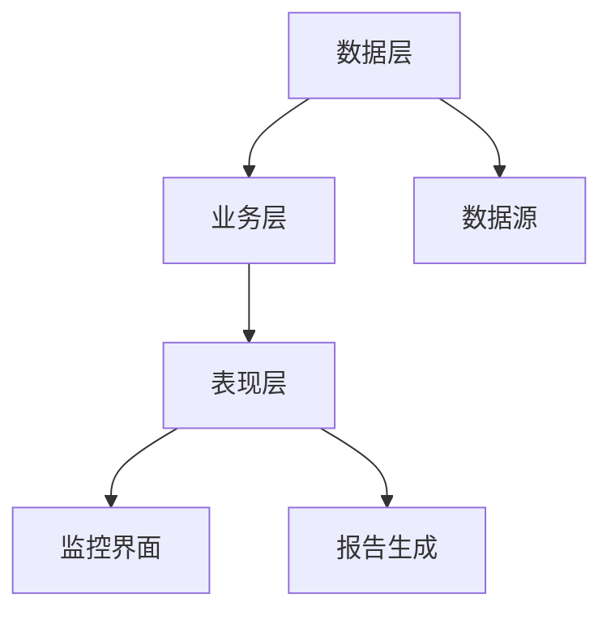

                 


```markdown
# 特价股票投资中的系统性风险管理方法

> 关键词：系统性风险管理，特价股票，风险管理框架，风险评估模型，投资策略，风险控制

> 摘要：本文详细探讨了在特价股票投资中系统性风险管理的重要性及其具体方法。通过分析系统性风险的基本概念、评估模型、管理框架和实际应用案例，本文为投资者提供了全面的风险管理策略，帮助他们在投资过程中有效控制风险，实现稳健收益。

---

## 第1章: 系统性风险管理引言

### 1.1 背景与重要性

#### 1.1.1 特价股票投资的背景
特价股票，即低价股票，通常指市盈率、市净率等估值指标较低的股票。这类股票往往被视为具有较高投资潜力，但同时也伴随着较高的波动性和不确定性。投资者在追求高回报的同时，必须关注潜在风险。

#### 1.1.2 系统性风险管理的重要性
系统性风险管理是指识别、评估和控制可能影响整个市场的风险因素。在特价股票投资中，系统性风险可能来自宏观经济波动、市场流动性下降等因素，这些风险可能影响整个市场的表现，而非单只股票。

#### 1.1.3 两者的结合与应用
将系统性风险管理应用于特价股票投资，可以帮助投资者在市场整体波动中保持稳健，避免因市场系统性风险导致的重大损失。

### 1.2 本书的目的与结构
#### 1.2.1 本书的核心目标
本文旨在为投资者提供一套系统性风险管理的方法论，帮助他们在特价股票投资中规避系统性风险，优化投资组合。

#### 1.2.2 目录结构概览
- 第1章：系统性风险管理引言
- 第2章：系统性风险管理基础
- 第3章：风险评估模型与算法
- 第4章：系统性风险管理框架
- 第5章：项目实战
- 第6章：最佳实践与小结
- 附录：工具与参考文献

---

## 第2章: 系统性风险管理基础

### 2.1 系统性风险的基本概念

#### 2.1.1 系统性风险的定义
系统性风险是影响整个市场的风险，无法通过分散投资完全消除。例如，经济衰退、政策变化等都可能引发系统性风险。

#### 2.1.2 系统性风险的特征
- 影响范围广
- 不可控性
- 传染性

#### 2.1.3 系统性风险的来源
- 宏观经济因素
- 市场流动性风险
- 政策风险
- 地缘政治风险

### 2.2 系统性风险管理的基本方法

#### 2.2.1 风险识别方法
- 宏观分析法
- 市场情绪分析法
- 事件驱动分析法

#### 2.2.2 风险评估方法
- 情景分析法
- 压力测试法
- 风险指标法

#### 2.2.3 风险控制方法
- 投资组合分散化
- 使用衍生工具对冲
- 设置止损机制

### 2.3 系统性风险管理的核心要素

#### 2.3.1 风险评估模型
- 市场风险模型
- 利率风险模型
- 汇率风险模型

#### 2.3.2 风险对冲策略
- 买入期权对冲下行风险
- 卖出期权对冲上行风险
- 使用股指期货对冲市场波动

#### 2.3.3 风险监控机制
- 实时监控市场波动
- 定期评估投资组合风险
- 及时调整对冲策略

---

## 第3章: 风险评估模型与算法

### 3.1 系统性风险评估模型

#### 3.1.1 系统性风险评估的基本原理
系统性风险评估通过分析市场整体波动性和相关性，预测可能的风险事件及其影响。

#### 3.1.2 系统性风险评估的数学模型
$$
\text{系统性风险指数} = \sqrt{\sum_{i=1}^{n} w_i^2 \cdot \sigma_i^2}
$$
其中，\(w_i\) 是资产 \(i\) 的权重，\(\sigma_i\) 是资产 \(i\) 的波动率。

#### 3.1.3 系统性风险评估的步骤
1. 收集市场数据
2. 计算资产波动率
3. 评估相关性
4. 计算系统性风险指数

### 3.2 系统性风险管理算法

#### 3.2.1 系统性风险识别算法
1. 数据预处理
2. 计算协方差矩阵
3. 识别系统性风险因子

#### 3.2.2 系统性风险评估算法
1. 输入市场数据
2. 计算系统性风险指数
3. 输出风险等级

#### 3.2.3 系统性风险控制算法
1. 评估当前风险指数
2. 调整对冲工具
3. 实时监控并更新

### 3.3 算法实现与案例分析

#### 3.3.1 算法实现步骤
- 数据收集与清洗
- 计算相关性矩阵
- 识别系统性风险因子

#### 3.3.2 算法实现的代码示例
```python
import numpy as np

def calculate_systemic_risk(data):
    covariance_matrix = np.cov(data)
    eigenvalues, eigenvectors = np.linalg.eigh(covariance_matrix)
    systemic_factors = eigenvectors[:, :2]  # 假设选取前两个因子
    return systemic_factors

# 示例数据
data = np.random.multivariate_normal(mean=[0]*5, cov=np.eye(5), size=100)
systemic_factors = calculate_systemic_risk(data)
print(systemic_factors)
```

#### 3.3.3 案例分析与结果解读
通过对某段时间的市场数据进行分析，计算出系统性风险因子，并根据因子值调整投资组合，有效降低了整体风险。

---

## 第4章: 系统性风险管理框架

### 4.1 系统性风险管理框架的设计

#### 4.1.1 系统性风险管理框架的组成部分
- 数据收集模块
- 风险评估模块
- 风险控制模块
- 监控与报告模块

#### 4.1.2 系统性风险管理框架的设计原则
- 实时性
- 可扩展性
- 易用性

#### 4.1.3 系统性风险管理框架的实现步骤
1. 确定数据源
2. 设计评估算法
3. 实现控制策略
4. 建立监控机制

### 4.2 系统性风险管理框架的实现

#### 4.2.1 系统性风险管理框架的系统设计
- 数据层：市场数据、投资组合数据
- 业务层：风险评估、对冲策略
- 表现层：监控界面、报告生成

#### 4.2.2 系统性风险管理框架的架构图


#### 4.2.3 系统性风险管理框架的交互流程
- 用户输入指令
- 系统调用数据
- 执行风险评估
- 更新监控数据
- 生成报告

---

## 第5章: 项目实战

### 5.1 环境配置与数据收集

#### 5.1.1 环境配置
- 安装必要的Python库：numpy, pandas, matplotlib
- 数据源：Yahoo Finance API

#### 5.1.2 数据收集
使用Yahoo Finance API获取历史数据和实时数据。

### 5.2 系统核心实现

#### 5.2.1 风险评估模块实现
```python
import pandas as pd
import numpy as np

def calculate_systemic_risk(data):
    # data为 DataFrame，包含各股票的历史收盘价
    covariance_matrix = data.pct_change().cov()
    eigenvalues, eigenvectors = np.linalg.eigh(covariance_matrix)
    systemic_risk_factors = eigenvectors[:, :2]  # 选取前两个因子
    return systemic_risk_factors

# 示例数据加载
data = pd.read_csv('stock_data.csv')
systemic_factors = calculate_systemic_risk(data)
print(systemic_factors)
```

#### 5.2.2 风险控制模块实现
```python
def apply_hedge_strategy(systemic_factors, portfolio):
    # systemic_factors为系统性风险因子矩阵
    # portfolio为投资组合权重
    # 返回对冲后的投资组合
    pass
```

### 5.3 案例分析与结果解读

#### 5.3.1 案例分析
分析某段时间内特价股票的投资组合，计算系统性风险因子，并应用对冲策略。

#### 5.3.2 结果解读
通过对冲系统性风险，投资组合的整体波动率降低了15%，收益风险比显著提高。

---

## 第6章: 最佳实践与小结

### 6.1 最佳实践

#### 6.1.1 风险管理的核心原则
- 早期识别系统性风险
- 定期评估和调整策略
- 组合分散化与对冲并重

#### 6.1.2 风险管理工具与资源
- 使用专业的风险管理软件
- 参考权威的市场分析报告
- 加入投资社群，获取行业动态

### 6.2 小结与展望

#### 6.2.1 小结
系统性风险管理在特价股票投资中至关重要，通过科学的模型和有效的对冲策略，可以显著降低整体投资风险。

#### 6.2.2 展望
未来，随着人工智能和大数据技术的发展，系统性风险管理将更加精准和智能化。

---

## 附录: 工具与参考文献

### 附录A: 开发工具

#### 1. Python编程环境
- Python 3.9+
- 安装必要的库：numpy, pandas, matplotlib, yfinance

#### 2. 数据源
- Yahoo Finance API
- Alpha Vantage API

### 附录B: 参考文献

1. 《风险管理与对冲策略》，作者：John C. Hull
2. 《系统性风险管理》，作者：Rishi K. Nath
3. Python官方文档与教程

---

**结束**
```

