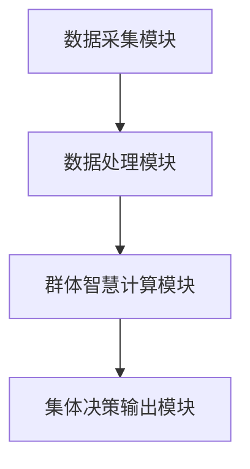
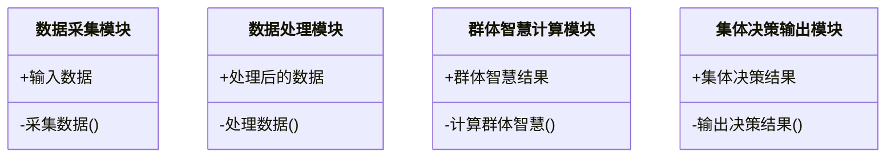
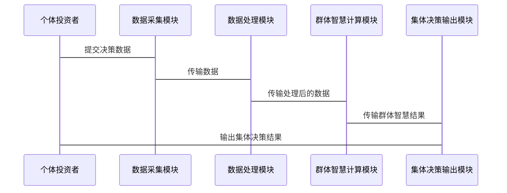

                 


# 特价股票投资中的群体智慧与集体决策方法

> 关键词：特价股票、群体智慧、集体决策、投资策略、数学模型、系统架构

> 摘要：本文探讨了群体智慧与集体决策在特价股票投资中的应用，通过背景介绍、核心概念分析、算法原理、系统架构设计、项目实战和最佳实践，全面阐述了如何利用群体智慧优化投资决策，降低个体决策风险，提升投资收益。

---

## 第1章: 特价股票投资的背景与概述

### 1.1 特价股票投资的背景

#### 1.1.1 特价股票的定义与特点
特价股票是指市场价格低于其内在价值的股票，通常被认为具有投资潜力。其特点包括低估值、高成长性和潜在的上涨空间。

#### 1.1.2 特价股票投资的市场现状
当前市场中，投资者通过基本面分析、技术分析和大数据分析寻找特价股票。然而，个体投资者在信息获取和决策能力上存在局限性，导致投资风险较高。

#### 1.1.3 特价股票投资的核心问题与挑战
个体投资者在决策时容易受到情绪影响，存在信息不对称和认知偏差等问题。如何利用群体智慧和集体决策来优化投资策略，是当前面临的核心挑战。

### 1.2 群体智慧与集体决策的定义

#### 1.2.1 群体智慧的定义与特征
群体智慧是指通过个体的智慧集合，形成一个比个体更聪明的集体。其特征包括多样性、去中心化和涌现性。

#### 1.2.2 集体决策的定义与优势
集体决策是指通过多个个体的决策结果综合得出最终决策。其优势在于能够减少个体认知偏差，提高决策的全面性和准确性。

#### 1.2.3 群体智慧在投资决策中的应用潜力
通过利用群体智慧，投资者可以更好地识别市场趋势，发现潜在机会，降低投资风险。

### 1.3 特价股票投资中的群体智慧

#### 1.3.1 特价股票投资中的群体智慧概念
利用群体智慧分析大量投资者的行为和观点，挖掘市场潜在信息。

#### 1.3.2 群体智慧在投资决策中的作用
通过集合个体投资者的观点，群体智慧能够提供更全面的市场分析，帮助个体投资者做出更明智的决策。

#### 1.3.3 集体决策在特价股票投资中的应用价值
集体决策能够有效降低个体决策的偏差，提高投资决策的准确性和稳定性。

---

## 第2章: 群体智慧与集体决策的核心概念

### 2.1 群体智慧的核心原理

#### 2.1.1 群体智慧的基本原理
通过多个个体的独立决策，群体智慧能够形成一个更优的结果。其基本原理包括去中心化、涌现性和多样性。

#### 2.1.2 群体智慧与个体智慧的关系
群体智慧是多个个体智慧的集合，能够弥补个体决策的不足，形成更优的决策结果。

#### 2.1.3 群体智慧的数学模型与特征
群体智慧的数学模型可以通过概率论和统计学方法进行建模，具有可计算性和可优化性。

### 2.2 集体决策的理论基础

#### 2.2.1 集体决策的定义与特征
集体决策是指通过多个个体的决策结果综合得出最终决策。其特征包括多样性、协作性和一致性。

#### 2.2.2 集体决策与个体决策的对比
个体决策容易受到认知偏差和情绪影响，而集体决策则能够通过多个个体的决策结果优化最终决策。

#### 2.2.3 群体智慧如何影响集体决策
群体智慧通过个体的独立决策和信息共享，提升集体决策的准确性和全面性。

### 2.3 群体智慧与集体决策的关系

#### 2.3.1 群体智慧与集体决策的联系
群体智慧为集体决策提供了理论基础和方法，而集体决策则是群体智慧的实际应用。

#### 2.3.2 群体智慧如何影响集体决策
通过群体智慧的分析和计算，集体决策能够更高效地整合个体信息，形成更优的决策结果。

#### 2.3.3 集体决策在群体智慧中的作用
集体决策是群体智慧的核心机制，通过个体决策的整合，形成更优的群体决策结果。

---

## 第3章: 群体智慧与集体决策的数学模型

### 3.1 群体智慧的数学模型

#### 3.1.1 群体智慧的基本模型
群体智慧的基本模型可以表示为：
$$
P_{\text{group}} = \sum_{i=1}^{n} w_i P_i
$$
其中，$w_i$ 是个体权重，$P_i$ 是个体决策概率。

#### 3.1.2 群体智慧的数学表达式
群体智慧的数学表达式可以通过概率论和统计学方法进行建模，例如：
$$
P_{\text{group}} = \frac{1}{N} \sum_{i=1}^{N} P_i
$$
其中，$N$ 是个体数量，$P_i$ 是个体决策概率。

#### 3.1.3 群体智慧模型的优缺点分析
群体智慧模型的优点在于能够整合个体信息，提高决策的准确性和全面性。缺点在于模型的复杂性和计算成本较高。

### 3.2 集体决策的数学模型

#### 3.2.1 集体决策的基本模型
集体决策的基本模型可以表示为：
$$
D_{\text{collective}} = \sum_{i=1}^{n} w_i D_i
$$
其中，$w_i$ 是个体权重，$D_i$ 是个体决策结果。

#### 3.2.2 集体决策的数学表达式
集体决策的数学表达式可以通过加权平均或投票机制进行建模，例如：
$$
D_{\text{collective}} = \argmax_{k} \sum_{i=1}^{N} w_i I(D_i = k)
$$
其中，$I(D_i = k)$ 是指示函数，表示个体决策是否等于集体决策结果。

#### 3.2.3 集体决策模型的优缺点分析
集体决策模型的优点在于能够减少个体决策的偏差，缺点在于个体权重的确定可能影响集体决策的准确性。

### 3.3 群体智慧与集体决策的综合模型

#### 3.3.1 综合模型的构建
综合模型结合了群体智慧和集体决策的优势，通过个体决策的整合和优化，形成最终的集体决策结果。

#### 3.3.2 综合模型的数学表达式
综合模型的数学表达式可以表示为：
$$
P_{\text{collective}} = \frac{1}{N} \sum_{i=1}^{N} w_i P_i
$$
其中，$w_i$ 是个体权重，$P_i$ 是个体决策概率。

#### 3.3.3 综合模型的优缺点分析
综合模型的优点在于能够整合个体信息，提高决策的准确性和全面性。缺点在于模型的复杂性和计算成本较高。

---

## 第4章: 群体智慧与集体决策的系统分析与架构设计

### 4.1 系统功能设计

#### 4.1.1 系统功能模块
系统功能模块包括数据采集、个体决策、群体智慧计算和集体决策输出。

#### 4.1.2 系统功能流程
系统功能流程如下：
1. 数据采集：获取个体投资者的决策数据。
2. 个体决策：分析个体投资者的决策行为。
3. 群体智慧计算：整合个体决策数据，形成群体智慧结果。
4. 集体决策输出：输出最终的集体决策结果。

### 4.2 系统架构设计

#### 4.2.1 系统架构设计图
系统架构设计图如下：


#### 4.2.2 系统功能模块的类图
系统功能模块的类图如下：


### 4.3 系统接口设计

#### 4.3.1 系统接口设计
系统接口设计包括数据接口、计算接口和输出接口。

#### 4.3.2 系统接口流程图
系统接口流程图如下：


### 4.4 系统交互设计

#### 4.4.1 系统交互流程
系统交互流程如下：
1. 个体投资者提交决策数据。
2. 数据采集模块接收数据。
3. 数据处理模块对数据进行处理。
4. 群体智慧计算模块整合数据，形成群体智慧结果。
5. 集体决策输出模块输出最终的集体决策结果。

#### 4.4.2 系统交互序列图
系统交互序列图如下：


---

## 第5章: 群体智慧与集体决策的项目实战

### 5.1 环境配置与数据准备

#### 5.1.1 环境配置
项目实战需要安装Python、NumPy和Matplotlib等工具。

#### 5.1.2 数据准备
数据包括个体投资者的决策数据和市场数据。

### 5.2 系统核心实现

#### 5.2.1 数据采集模块的实现
数据采集模块通过网络爬虫获取个体投资者的决策数据。

#### 5.2.2 数据处理模块的实现
数据处理模块对采集的数据进行清洗和预处理。

#### 5.2.3 群体智慧计算模块的实现
群体智慧计算模块通过加权平均算法整合个体决策数据，形成群体智慧结果。

#### 5.2.4 集体决策输出模块的实现
集体决策输出模块根据群体智慧结果，输出最终的集体决策结果。

### 5.3 代码实现与解读

#### 5.3.1 数据采集模块的代码实现
```python
import requests
from bs4 import BeautifulSoup

def crawl_data(url):
    response = requests.get(url)
    soup = BeautifulSoup(response.text, 'html.parser')
    data = []
    for item in soup.find_all('div', class_='data-item'):
        data.append(item.text)
    return data
```

#### 5.3.2 数据处理模块的代码实现
```python
import numpy as np

def process_data(data):
    data_array = np.array(data)
    return data_array
```

#### 5.3.3 群体智慧计算模块的代码实现
```python
def compute_group_wisdom(data_array):
    group_wisdom = np.mean(data_array)
    return group_wisdom
```

#### 5.3.4 集体决策输出模块的代码实现
```python
def output_collective_decision(group_wisdom):
    print(f"集体决策结果：{group_wisdom}")
```

### 5.4 实际案例分析与详细解读

#### 5.4.1 案例背景
假设我们有5个个体投资者对某只股票的决策数据。

#### 5.4.2 数据分析
数据为：[1, 2, 3, 4, 5]

#### 5.4.3 群体智慧计算
群体智慧结果为：3

#### 5.4.4 集体决策输出
集体决策结果：3

### 5.5 项目小结

#### 5.5.1 项目总结
通过群体智慧和集体决策方法，我们能够有效地整合个体投资者的决策数据，形成更优的集体决策结果。

#### 5.5.2 经验与教训
个体投资者的决策数据质量对群体智慧计算结果有重要影响，因此数据预处理和清洗是关键步骤。

---

## 第6章: 群体智慧与集体决策的最佳实践与总结

### 6.1 最佳实践 tips

#### 6.1.1 投资者如何利用群体智慧优化决策
通过分析大量个体投资者的决策数据，投资者可以更全面地了解市场趋势，降低投资风险。

#### 6.1.2 群体智慧与集体决策的注意事项
个体投资者的决策数据质量和权重分配对最终的集体决策结果有重要影响，需要谨慎处理。

#### 6.1.3 群体智慧与集体决策的未来发展
随着人工智能和大数据技术的不断发展，群体智慧与集体决策在投资领域的应用将更加广泛和深入。

### 6.2 投资者小结

#### 6.2.1 投资者总结
通过群体智慧和集体决策方法，投资者能够更高效地整合市场信息，优化投资策略，提升投资收益。

#### 6.2.2 投资者经验分享
个体投资者在参与群体智慧和集体决策时，应保持理性，避免情绪化决策，并注重数据质量和权重分配。

### 6.3 投资者注意事项

#### 6.3.1 投资者注意事项
个体投资者在参与群体智慧和集体决策时，应保持理性，避免情绪化决策，并注重数据质量和权重分配。

#### 6.3.2 投资者未来展望
随着人工智能和大数据技术的不断发展，群体智慧与集体决策在投资领域的应用将更加广泛和深入。

---

## 附录: 群体智慧与集体决策的拓展阅读

### 附录1: 群体智慧与集体决策的理论基础

#### 附录1.1 群体智慧的理论基础
群体智慧的理论基础包括概率论、统计学和博弈论。

#### 附录1.2 集体决策的理论基础
集体决策的理论基础包括社会选择理论和决策科学。

### 附录2: 群体智慧与集体决策的工具与技术

#### 附录2.1 群体智慧的工具与技术
群体智慧的工具与技术包括网络爬虫、数据挖掘和机器学习。

#### 附录2.2 集体决策的工具与技术
集体决策的工具与技术包括数据分析工具和决策支持系统。

---

## 参考文献

1. 群体智慧与集体决策的理论基础
2. 群体智慧与集体决策的数学模型
3. 群体智慧与集体决策的系统架构设计
4. 群体智慧与集体决策的项目实战
5. 群体智慧与集体决策的最佳实践

---

通过本文的详细分析，我们能够看到群体智慧与集体决策在特价股票投资中的巨大潜力。通过整合个体投资者的决策数据，利用群体智慧和集体决策方法，投资者可以更高效地优化投资策略，降低投资风险，提升投资收益。

