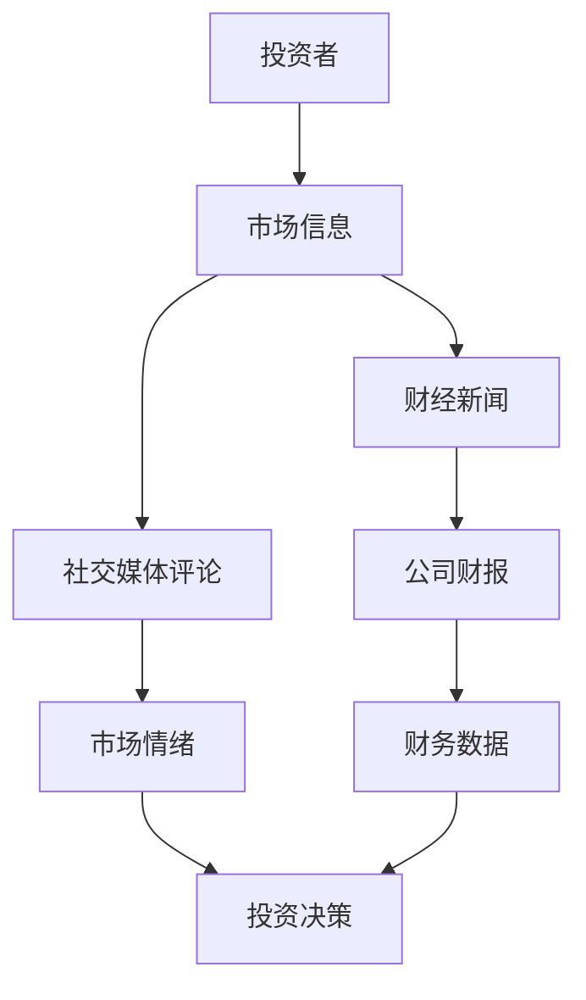
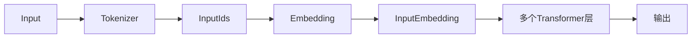
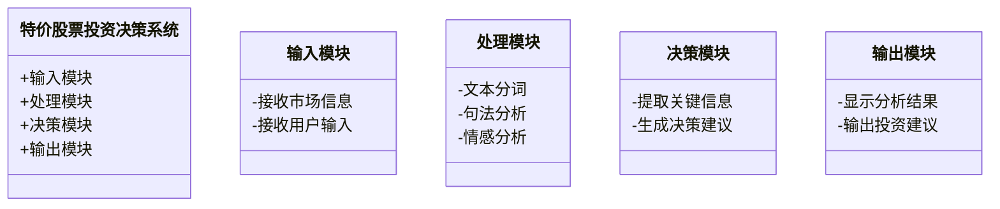

                 


# 特价股票投资中的自然语言理解辅助决策系统

> **关键词**：特价股票、自然语言理解、股票投资、决策系统、自然语言处理、文本挖掘、机器学习  
> **摘要**：本文探讨了如何利用自然语言理解（NLU）技术辅助特价股票投资决策。通过分析市场信息和投资者情绪，结合自然语言处理（NLP）技术，构建一个智能辅助决策系统，帮助投资者提高投资效率和准确性。文章详细介绍了系统的设计、实现和应用，展示了自然语言理解在股票投资中的巨大潜力。

---

## 第1章：背景介绍

### 1.1 特价股票投资的背景

#### 1.1.1 特价股票的定义与特点
- **定义**：特价股票是指价格低于正常市场价的股票，通常因市场波动、公司业绩不佳或行业环境变化导致。
- **特点**：
  - 价格波动大，风险与机会并存。
  - 投资门槛低，适合中小投资者。
  - 数据量大，信息分散，难以快速提取有效信息。

#### 1.1.2 自然语言处理的背景
- **定义**：自然语言处理（NLP）是计算机科学与人工智能的交叉领域，旨在让计算机能够理解、分析和生成人类语言。
- **技术发展**：
  - 基于规则的NLP（传统方法）。
  - 统计学习方法（如TF-IDF、Word2Vec）。
  - 深度学习方法（如BERT、GPT）。
- **在金融领域的应用**：
  - 情感分析：分析市场情绪。
  - 实体识别：提取公司名称、金额等信息。
  - 文本摘要：简化长文本信息。

#### 1.1.3 问题的提出与解决
- **问题背景**：股票市场信息繁杂，投资者难以快速获取和分析关键信息。
- **问题描述**：
  - 数据量大，信息分散，难以高效处理。
  - 市场情绪复杂，难以准确捕捉。
  - 缺乏有效的工具辅助决策。
- **解决方案**：利用NLU技术，构建一个智能辅助决策系统，自动分析市场信息，提供投资建议。

---

## 第2章：核心概念与联系

### 2.1 自然语言理解的原理

#### 2.1.1 分词与句法分析
- **分词**：将连续的文本分割成有意义的词语或短语。
  - 示例：将“中国银行今天发布了新财报”分割为“中国银行”、“今天”、“发布了”、“新财报”。
- **句法分析**：分析句子的语法结构，识别主语、谓语等。
  - 示例：在“中国银行今天发布了新财报”中，“中国银行”是主语，“发布了”是谓语。

#### 2.1.2 语义理解与情感分析
- **语义理解**：理解文本的含义，提取关键信息。
  - 示例：从新闻中提取“中国银行”、“新财报”、“利润增长”等信息。
- **情感分析**：判断文本中的情感倾向（正面、负面、中性）。
  - 示例：分析社交媒体上的评论，判断市场情绪。

#### 2.1.3 实体识别与关系抽取
- **实体识别**：识别文本中的具体实体，如人名、地名、公司名等。
  - 示例：从新闻中提取“中国银行”、“财报”、“利润”等实体。
- **关系抽取**：识别实体之间的关系。
  - 示例：从“中国银行发布了新财报，利润增长10%”中抽取“中国银行”与“利润增长”的关系。

### 2.2 比较不同模型的特点

#### 2.2.1 常见模型对比

| 模型        | 基础原理           | 优点                     | 缺点                     |
|-------------|--------------------|--------------------------|--------------------------|
| TF-IDF      | 统计词频和逆文档频率 | 简单易实现               | 无法捕捉语义关系         |
| Word2Vec    | 通过上下文预测词向量 | 捕捉词语语义关系           | 需要大量文本数据         |
| BERT        | 基于Transformer的预训练模型 | 捕捉全局语义关系，效果优秀 | 需要较高的计算资源       |

#### 2.2.2 实体关系图



---

## 第3章：算法原理讲解

### 3.1 BERT模型的结构与训练过程

#### 3.1.1 BERT模型的结构



#### 3.1.2 损失函数与优化器

- **损失函数**：交叉熵损失函数。
  $$ \text{Loss} = -\sum_{i=1}^{n} y_i \log(p_i) + (1 - y_i)\log(1 - p_i) $$
- **优化器**：Adam优化器。
  $$ \text{Adam} = \text{Momentum} + \text{RMSProp} $$

#### 3.1.3 微调模型实现

```python
from transformers import BertTokenizer, BertModel
import torch

# 加载预训练模型和分词器
tokenizer = BertTokenizer.from_pretrained('bert-base-chinese')
model = BertModel.from_pretrained('bert-base-chinese')

# 微调模型
model.train()
optimizer = torch.optim.Adam(model.parameters(), lr=1e-5)
criterion = torch.nn.CrossEntropyLoss()

# 训练循环
for epoch in range(num_epochs):
    for batch in train_loader:
        inputs, labels = batch
        outputs = model(inputs)
        loss = criterion(outputs, labels)
        loss.backward()
        optimizer.step()
        optimizer.zero_grad()
```

---

## 第4章：系统分析与架构设计

### 4.1 项目背景与目标

#### 4.1.1 项目背景
- 项目目标：构建一个基于NLU的股票投资辅助决策系统。
- 项目意义：提升投资效率，降低信息处理成本。

### 4.2 系统功能设计

#### 4.2.1 领域模型



### 4.3 系统架构设计

#### 4.3.1 分层架构


---

## 第5章：项目实战

### 5.1 环境安装与配置

```bash
pip install numpy pandas scikit-learn transformers
```

### 5.2 核心代码实现

#### 5.2.1 数据预处理

```python
import pandas as pd
from transformers import BertTokenizer

# 加载数据
data = pd.read_csv('stock_news.csv')

# 分词处理
tokenizer = BertTokenizer.from_pretrained('bert-base-chinese')
inputs = data['text'].apply(lambda x: tokenizer.encode(x, add_special_tokens=True))
```

#### 5.2.2 模型训练与预测

```python
model = BertForSequenceClassification.from_pretrained('bert-base-chinese', num_labels=3)
optimizer = torch.optim.Adam(model.parameters(), lr=2e-5)
criterion = torch.nn.CrossEntropyLoss()

# 训练循环
for epoch in range(num_epochs):
    for batch in train_loader:
        inputs, labels = batch
        outputs = model(inputs)
        loss = criterion(outputs, labels)
        loss.backward()
        optimizer.step()
        optimizer.zero_grad()
```

#### 5.2.3 结果分析

```python
from transformers import pipeline

# 初始化摘要器
summarizer = pipeline("summarization", model="facebook/bart-large-cnn")

# 生成摘要
summary = summarizer(text, max_length=100, min_length=50, do_sample=False)
print(summary[0]['summary_text'])
```

---

## 第6章：最佳实践与小结

### 6.1 最佳实践

- **数据质量**：确保数据来源可靠，清洗数据。
- **模型可解释性**：选择适合业务需求的模型，避免过于复杂的模型。
- **持续优化**：定期更新模型，适应市场变化。

### 6.2 小结

本文详细介绍了如何利用自然语言理解技术辅助特价股票投资决策，构建了一个智能辅助决策系统。通过分析市场信息和投资者情绪，帮助投资者提高投资效率和准确性。

---

## 第7章：附录

### 7.1 参考文献

- [1] 周志华.《机器学习实战》
- [2] 刘明.《自然语言处理入门》
- [3] TensorFlow官方文档
- [4] PyTorch官方文档

### 7.2 推荐工具包

- **NLP工具**：spaCy、NLTK、jieba。
- **深度学习框架**：TensorFlow、PyTorch。
- **预训练模型**：BERT、GPT。

---

通过本文的介绍，读者可以了解自然语言理解在特价股票投资中的应用，掌握构建智能辅助决策系统的方法。未来，随着NLP技术的不断发展，特价股票投资将更加智能化和高效化。

