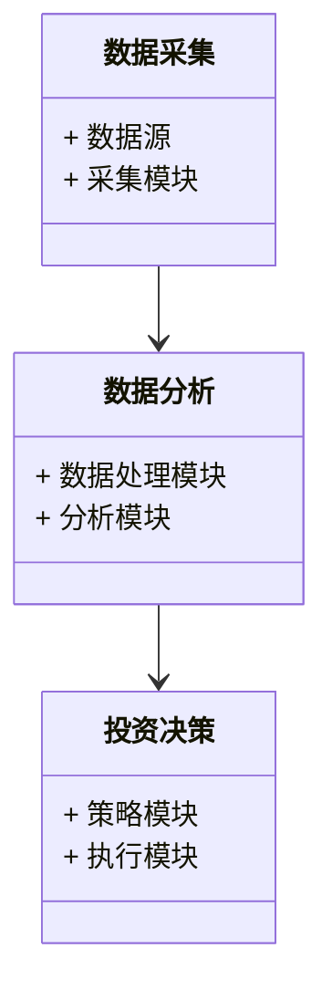
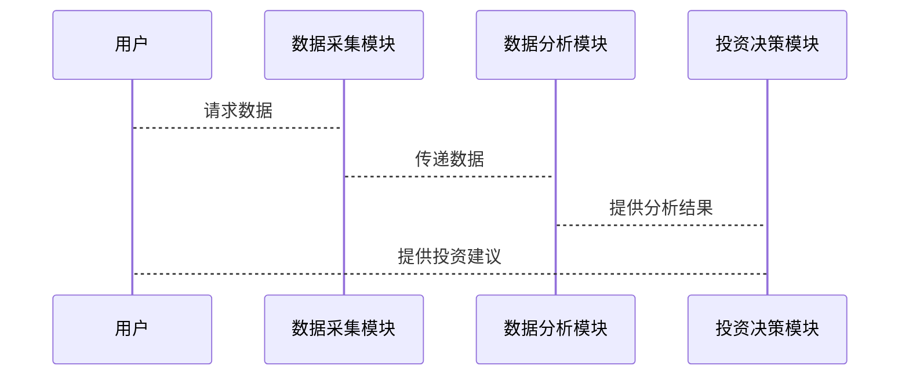

                 


# 特价股票投资中的行业周期性考虑

## 关键词：特价股票，行业周期，股票投资，周期性分析，技术分析，量化模型

## 摘要：特价股票作为投资领域的重要标的，其价值往往与行业周期性密切相关。本文通过分析行业周期的基本概念、特价股票的特点及其在不同周期阶段的投资策略，结合技术分析和量化模型，帮助投资者更好地识别行业周期拐点，优化投资组合。文章还提供了实际案例分析和系统架构设计，为投资者在特价股票投资中考虑行业周期性提供了系统化的指导。

---

# 第一章：特价股票与行业周期性概述

## 1.1 特价股票的基本概念

### 1.1.1 特价股票的定义与特点
特价股票是指市场价格显著低于其内在价值的股票。其特点包括：
- **低估性**：市场价格低于内在价值。
- **周期性**：通常出现在行业周期的低谷阶段。
- **高波动性**：价格波动较大，存在较大的上涨空间。

### 1.1.2 特价股票的投资价值分析
特价股票的投资价值主要体现在：
- **估值修复**：市场对低估股票的重新评估可能导致价格上涨。
- **行业复苏**：行业周期性复苏时，特价股票可能迎来反弹。
- **风险溢价**：在高风险环境下，特价股票可能提供更高的风险补偿。

### 1.1.3 特价股票与市场周期的关系
市场周期分为复苏、扩张、滞胀和衰退阶段。在衰退阶段，特价股票往往表现不佳，但在复苏和扩张阶段，特价股票可能带来超额收益。

---

## 1.2 行业周期的基本概念

### 1.2.1 行业周期的定义与分类
行业周期是指行业内企业整体经营状况随时间变化的周期性波动。行业周期通常分为四个阶段：
1. **复苏阶段**：行业从低谷开始复苏，需求逐步回升。
2. **扩张阶段**：行业需求增长迅速，企业盈利提高。
3. **滞胀阶段**：行业需求增长放缓，但成本上升，企业利润下降。
4. **衰退阶段**：行业需求急剧下降，企业盈利大幅下滑。

### 1.2.2 行业周期对股票投资的影响
行业周期对股票投资的影响主要体现在：
- **行业周期与股票价格的关系**：行业周期的波动直接影响股票价格。
- **行业周期与投资策略的关系**：投资者需要根据行业周期选择合适的投资策略。

### 1.2.3 行业周期与经济周期的关系
行业周期与经济周期密切相关，但并非完全一致。某些行业（如科技行业）可能在经济衰退时仍保持增长，而其他行业（如周期性行业）则会受到经济周期的严重影响。

---

## 1.3 特价股票与行业周期的关系

### 1.3.1 特价股票在不同行业周期中的表现
在不同行业周期中，特价股票的表现有所不同：
- **衰退阶段**：特价股票价格可能继续下跌，但具备估值优势。
- **复苏阶段**：特价股票价格开始回升，投资机会增加。
- **扩张阶段**：特价股票价格可能被市场高估，投资风险增加。
- **滞胀阶段**：特价股票价格波动较大，投资需谨慎。

### 1.3.2 特价股票投资中的周期性机会
投资者可以通过以下方式利用行业周期性：
- **周期性行业的选择**：选择那些在复苏和扩张阶段具有高增长潜力的行业。
- **周期性股票的估值**：利用行业周期分析，选择低估的特价股票。

### 1.3.3 特价股票投资中的周期性风险
投资者需要注意以下周期性风险：
- **行业周期波动**：行业周期波动可能导致股票价格大幅波动。
- **市场周期性风险**：市场整体波动可能影响特价股票的表现。

---

# 第二章：行业周期分析方法

## 2.1 行业周期分析的框架

### 2.1.1 行业生命周期模型
行业生命周期模型将行业分为四个阶段：引入期、成长期、成熟期和衰退期。投资者需要根据行业所处的阶段制定相应的投资策略。

### 2.1.2 行业周期的量化指标
常用的行业周期量化指标包括：
- **行业PE（市盈率）**：衡量行业整体估值水平。
- **行业收入增长率**：反映行业需求增长情况。
- **行业利润 margin**：衡量行业盈利能力。

### 2.1.3 行业周期的阶段划分
根据行业生命周期模型，投资者可以将行业分为不同的阶段，并制定相应的投资策略。

---

## 2.2 行业周期分析的工具与方法

### 2.2.1 技术分析工具在行业周期分析中的应用
技术分析工具可以帮助投资者识别行业周期拐点。常用的技术指标包括：
- **移动平均线（MA）**：用于识别价格趋势。
- **相对强弱指数（RSI）**：用于识别超买超卖信号。
- **MACD指标**：用于识别价格趋势和趋势强度。

### 2.2.2 基本面分析方法在行业周期分析中的应用
基本面分析方法可以帮助投资者评估行业的盈利能力和发展前景。常用的方法包括：
- **财务报表分析**：分析企业的财务状况和盈利能力。
- **行业研究报告**：了解行业的发展趋势和竞争格局。

### 2.2.3 行业指数与市场情绪分析
行业指数可以反映行业整体表现，市场情绪分析可以帮助投资者判断市场的乐观或悲观情绪。

---

## 2.3 特价股票投资中的行业周期策略

### 2.3.1 周期性行业的选择标准
投资者应选择那些在复苏和扩张阶段具有高增长潜力的行业。具体标准包括：
- **行业PE**：低于行业平均水平。
- **行业收入增长率**：高于行业平均水平。
- **行业利润 margin**：稳定或增长。

### 2.3.2 特价股票的估值方法
常用的特价股票估值方法包括：
- **市盈率法（PE）**：计算股票的市盈率，并与行业平均水平进行比较。
- **市净率法（PB）**：计算股票的市净率，并与行业平均水平进行比较。
- **现金流折现法（DCF）**：通过现金流折现计算股票的内在价值。

### 2.3.3 行业周期拐点的识别与投资时机
投资者可以通过以下方式识别行业周期拐点：
- **技术指标**：如MACD、RSI等指标的背离和交叉。
- **行业数据**：如行业收入增长率、利润 margin 等数据的变化。
- **市场情绪**：如市场情绪指标的波动和变化。

---

# 第三章：特价股票投资中的技术分析与量化模型

## 3.1 技术分析在行业周期分析中的应用

### 3.1.1 技术指标在行业周期分析中的应用
技术指标可以帮助投资者识别行业周期拐点。常用的指标包括：
- **移动平均线（MA）**：用于识别价格趋势。
- **相对强弱指数（RSI）**：用于识别超买超卖信号。
- **MACD指标**：用于识别价格趋势和趋势强度。

### 3.1.2 技术图表在行业周期分析中的应用
技术图表可以帮助投资者直观地观察行业周期变化。常用的图表包括：
- **K线图**：显示股票价格的开盘价、收盘价、最高价和最低价。
- **趋势线**：显示价格趋势和支撑阻力位。
- **成交量图**：显示成交量和价格变化的关系。

### 3.1.3 技术分析与行业周期拐点的识别
技术分析可以帮助投资者识别行业周期拐点。例如，当价格突破关键阻力位时，可能意味着行业周期进入新的阶段。

---

## 3.2 量化模型在特价股票投资中的应用

### 3.2.1 量化模型的构建与优化
量化模型的构建需要考虑以下因素：
- **数据来源**：选择可靠的市场数据源。
- **模型目标**：明确模型的投资目标和风险偏好。
- **模型参数**：选择合适的参数和指标。

### 3.2.2 量化模型在行业周期分析中的应用
量化模型可以帮助投资者自动识别行业周期拐点。例如，可以通过算法交易模型自动执行买卖决策。

### 3.2.3 量化模型在特价股票投资中的应用
量化模型可以用于特价股票的投资决策。例如，可以通过量化模型筛选出低估的特价股票。

---

## 3.3 特价股票投资中的算法与数学模型

### 3.3.1 行业周期分析的数学模型
行业周期分析的数学模型可以用于量化行业周期的变化。例如，可以使用时间序列分析模型预测行业周期的变化趋势。

### 3.3.2 特价股票估值的数学模型
特价股票估值的数学模型可以用于计算股票的内在价值。例如，可以使用DCF模型计算股票的内在价值。

### 3.3.3 特价股票投资组合优化的数学模型
投资组合优化的数学模型可以用于优化特价股票的投资组合。例如，可以使用均值-方差优化模型优化投资组合的风险和收益。

---

# 第四章：特价股票投资中的系统架构与实现

## 4.1 系统功能设计

### 4.1.1 问题场景介绍
投资者需要一个系统来帮助他们进行特价股票投资中的行业周期性分析。

### 4.1.2 系统功能设计
系统功能设计包括：
- **数据采集**：采集行业周期相关数据。
- **数据分析**：分析行业周期变化。
- **投资决策**：基于分析结果制定投资策略。

### 4.1.3 系统功能设计的 Mermaid 类图


---

## 4.2 系统架构设计

### 4.2.1 系统架构设计的 Mermaid 架构图


### 4.2.2 系统接口设计
系统接口设计包括：
- **数据接口**：与数据源进行数据交互。
- **用户接口**：与用户进行交互。

### 4.2.3 系统交互设计的 Mermaid 序列图


---

## 4.3 项目实战

### 4.3.1 环境安装
需要安装以下工具：
- **Python**：用于数据分析和量化建模。
- **Pandas**：用于数据处理。
- **Matplotlib**：用于数据可视化。

### 4.3.2 系统核心实现源代码
以下是系统核心实现的Python代码示例：
```python
import pandas as pd
import matplotlib.pyplot as plt

# 数据采集模块
def collect_data():
    # 从数据源采集数据
    pass

# 数据分析模块
def analyze_data(data):
    # 对数据进行分析
    pass

# 投资决策模块
def make_decision(data):
    # 基于分析结果制定投资策略
    pass

# 主函数
def main():
    data = collect_data()
    result = analyze_data(data)
    decision = make_decision(result)
    print(decision)

if __name__ == "__main__":
    main()
```

---

## 4.3.3 代码应用解读与分析
代码示例展示了如何通过Python进行数据分析和量化建模。投资者可以根据实际需求进行扩展和优化。

---

## 4.3.4 实际案例分析和详细讲解剖析
通过实际案例分析，投资者可以更好地理解如何将理论应用于实际投资中。

---

## 4.3.5 项目小结
项目小结总结了项目的主要成果和经验教训，为未来的投资决策提供了参考。

---

# 第五章：最佳实践与总结

## 5.1 最佳实践 tips
- **持续学习**：保持对行业周期变化的关注。
- **风险控制**：合理配置资产，避免过度集中。
- **动态调整**：根据市场变化及时调整投资策略。

## 5.2 小结
本文详细介绍了特价股票投资中的行业周期性考虑，包括行业周期分析方法、技术分析与量化模型的应用、系统架构与实现等内容。

## 5.3 注意事项
投资者在进行特价股票投资时，需要注意以下事项：
- **市场风险**：市场波动可能影响股票价格。
- **行业风险**：行业周期变化可能影响股票收益。
- **操作风险**：投资决策需要谨慎，避免盲目跟风。

## 5.4 拓展阅读
推荐以下拓展阅读资料：
- 《股票投资实战策略》
- 《量化投资：从入门到精通》
- 《行业分析与投资策略》

---

# 结语
通过本文的系统分析和实践指导，投资者可以更好地理解特价股票投资中的行业周期性考虑，并将其应用于实际投资中，从而提高投资收益和风险管理能力。

