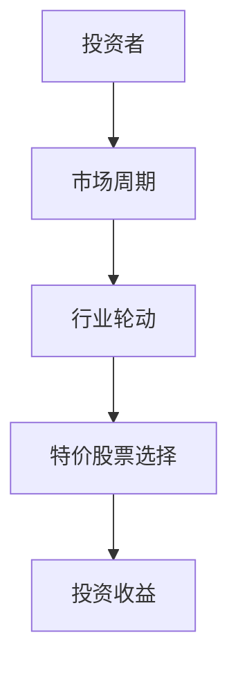
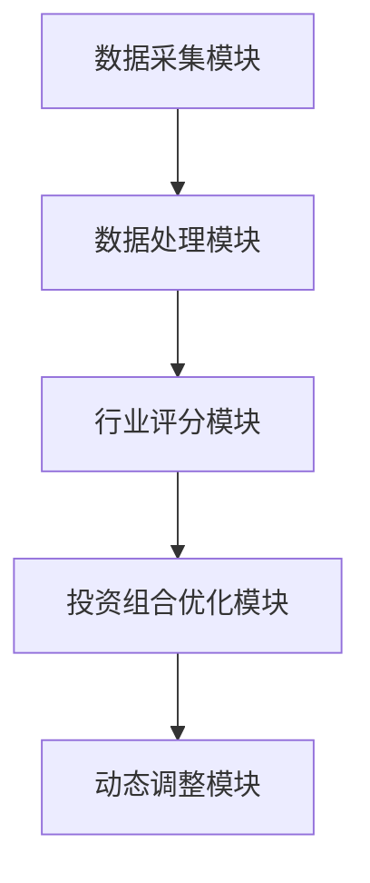

                 


# 特价股票投资中的行业轮动策略研究

**关键词**: 特价股票, 行业轮动策略, 股票投资, 投资策略, 市场分析

**摘要**: 本文深入探讨了特价股票投资中的行业轮动策略，从理论基础、数学模型、算法原理到系统架构，结合实际案例分析和风险控制，全面解析了如何利用行业轮动策略在特价股票投资中实现超额收益。文章旨在为投资者提供一套科学、系统的投资策略，并通过详细的技术分析和实战案例，帮助读者理解如何在复杂多变的市场环境中优化投资组合。

---

# 第一部分: 特价股票投资中的行业轮动策略概述

## 第1章: 特价股票与行业轮动策略的背景介绍

### 1.1 特价股票的定义与特点

#### 1.1.1 特价股票的定义
特价股票指的是那些市场价格显著低于其内在价值的股票。通常，这类股票可能由于市场波动、行业周期性或公司特定因素而导致其价格被低估。特价股票的核心在于其价格与价值之间的不匹配，为投资者提供了潜在的收益机会。

#### 1.1.2 特价股票的核心属性特征
| 属性 | 特征描述 |
|------|----------|
| 价格低估 | 市盈率、市净率等指标低于行业平均水平 |
| 市场流动性 | 交易量可能较低，但流动性仍足够 |
| 估值修复潜力 | 公司基本面良好，未来有增长潜力 |
| 行业分布 | 主要集中在周期性较强的行业，如制造业、能源业等 |

#### 1.1.3 特价股票与普通股票的区别
- **价值驱动**：特价股票的投资价值主要来源于其价格的修复潜力，而普通股票的投资价值可能更多依赖于公司的盈利能力或行业地位。
- **风险偏好**：投资特价股票通常需要承担更高的市场风险，因为其价格波动较大，而普通股票的风险相对较低。
- **投资策略**：特价股票的投资策略更注重市场周期和估值分析，而普通股票的投资策略更注重公司基本面和长期增长潜力。

### 1.2 行业轮动策略的定义与特点

#### 1.2.1 行业轮动策略的定义
行业轮动策略是一种动态调整投资组合中行业权重的策略，旨在通过识别不同行业在不同市场周期中的表现差异，从而在不同行业间进行切换，以获取超额收益。

#### 1.2.2 行业轮动策略的核心要素
- **市场周期分析**：根据宏观经济指标（如GDP增长率、利率水平、通胀预期等）判断当前市场所处的周期阶段。
- **行业基本面分析**：分析各行业的财务状况、增长潜力和竞争优势。
- **市场情绪分析**：通过投资者情绪指标（如VIX指数、资金流向等）判断市场情绪对行业轮动的影响。

#### 1.2.3 行业轮动策略与普通投资策略的对比
| 对比维度 | 行业轮动策略 | 普通投资策略 |
|----------|--------------|--------------|
| 战略目标 | 通过行业切换获取超额收益 | 通过个股选择获取长期收益 |
| 调整频率 | 高频调整，适应市场变化 | 低频调整，注重长期持有 |
| 风险控制 | 通过行业分散化降低风险 | 通过个股筛选降低风险 |

### 1.3 特价股票与行业轮动策略的结合

#### 1.3.1 特价股票投资的背景与现状
- **背景**：随着市场的波动，许多股票可能出现价格被低估的情况，尤其是周期性行业中的股票。投资者通过识别这些特价股票，可以在市场回升时获得超额收益。
- **现状**：行业轮动策略在股票投资中越来越受到重视，尤其是在市场波动加剧的情况下，通过行业轮动策略优化投资组合成为一种趋势。

#### 1.3.2 行业轮动策略在特价股票投资中的应用
- **行业选择**：根据市场周期和行业基本面，选择具有低估潜力的行业。
- **股票筛选**：在选定的行业中，筛选出价格被低估的特价股票。
- **动态调整**：根据市场变化，定期调整投资组合中的行业权重和个股选择。

#### 1.3.3 特价股票行业轮动策略的核心目标
- **短期收益最大化**：通过识别市场周期中的优势行业，迅速调整投资组合，获取短期超额收益。
- **长期价值投资**：通过行业轮动策略，结合特价股票的估值修复潜力，实现长期稳健收益。

---

## 第2章: 特价股票行业轮动策略的核心概念与联系

### 2.1 特价股票行业轮动策略的核心概念

#### 2.1.1 特价股票的市场周期分析
- **市场周期**：市场周期通常分为复苏期、增长期、成熟期和衰退期。在不同的市场周期中，不同行业的表现会有所不同。
- **行业轮动与市场周期的关系**：在复苏期，通常制造业和能源业表现较好；在增长期，科技和消费行业表现较好；在成熟期，金融和公用事业表现较好；在衰退期，防御性行业如医疗和公用事业表现较好。

#### 2.1.2 行业轮动的驱动因素
| 驱动因素 | 影响分析 |
|----------|----------|
| 经济指标 | GDP增长率、利率水平、通胀预期等 |
| 行业基本面 | 行业盈利能力、成长潜力、竞争优势等 |
| 市场情绪 | 投资者情绪、资金流向、市场波动性等 |

#### 2.1.3 特价股票与行业轮动的关联性分析
- **关联性**：行业轮动策略的核心是通过市场周期和行业基本面的分析，选择具有低估潜力的行业和个股。特价股票作为价格被低估的股票，通常是行业轮动策略中的重要组成部分。
- **互补性**：行业轮动策略通过动态调整行业权重，帮助投资者在市场变化中优化投资组合；特价股票作为优质标的，为投资者提供了实现超额收益的潜力。

### 2.2 行业轮动策略的核心原理

#### 2.2.1 市场周期对行业轮动的影响
- **市场周期与行业轮动的关系**：不同市场周期中，不同行业的表现差异显著。通过识别市场周期的变化，投资者可以及时调整行业配置，抓住优势行业的投资机会。
- **行业轮动策略的数学模型**：行业轮动策略的核心是通过数学模型和算法，对市场周期和行业基本面进行量化分析，从而实现动态调整。

#### 2.2.2 行业基本面分析与市场情绪分析
- **行业基本面分析**：通过分析行业的财务状况、增长潜力和竞争优势，判断行业的投资价值。
- **市场情绪分析**：通过投资者情绪指标（如VIX指数、资金流向等）判断市场情绪对行业轮动的影响。
- **情绪指标与行业轮动的结合**：当市场情绪乐观时，投资者倾向于投资成长性行业；当市场情绪悲观时，投资者倾向于投资防御性行业。

#### 2.2.3 行业轮动策略的数学模型与公式
- **行业轮动模型**：基于市场周期和行业基本面的量化分析，构建行业轮动策略的数学模型。
- **行业权重调整公式**：
  $$ w_i = \frac{score_i}{\sum_{j=1}^{n} score_j} $$
  其中，$w_i$ 表示第i个行业的权重，$score_i$ 表示第i个行业的评分。

### 2.3 特价股票行业轮动策略的实体关系图



---

## 第3章: 特价股票行业轮动策略的算法与数学模型

### 3.1 特价股票行业轮动策略的算法流程

#### 3.1.1 数据采集与预处理
- **数据来源**：包括股票价格数据、行业基本面数据、宏观经济指标等。
- **数据清洗**：对数据进行缺失值处理、异常值处理等预处理步骤。
- **数据标准化**：对数据进行标准化处理，确保不同数据源的可比性。

#### 3.1.2 行业评分与排序
- **行业评分标准**：根据行业基本面和市场情绪，对各个行业进行评分。
- **行业排序**：根据评分结果，对行业进行排序，确定优势行业和劣势行业。

#### 3.1.3 动态调整与投资组合优化
- **动态调整策略**：根据市场变化，定期调整投资组合中的行业权重和个股选择。
- **投资组合优化**：通过优化算法，确定最优的投资组合配置。

### 3.2 行业轮动策略的数学模型与公式

#### 3.2.1 基于市场周期的行业轮动模型
- **市场周期的量化指标**：通过宏观经济指标构建市场周期的量化指标。
- **行业轮动模型**：基于市场周期的量化指标，构建行业轮动策略的数学模型。

#### 3.2.2 基于行业基本面的评分系统
- **评分标准**：根据行业基本面指标（如ROE、净利润增长率等）对行业进行评分。
- **评分权重**：根据市场环境动态调整评分指标的权重。

#### 3.2.3 行业权重调整公式
$$ w_i = \frac{score_i}{\sum_{j=1}^{n} score_j} $$
其中，$w_i$ 表示第i个行业的权重，$score_i$ 表示第i个行业的评分。

### 3.3 行业轮动策略的算法实现

#### 3.3.1 算法步骤
1. **数据采集**：获取相关数据，包括股票价格、行业基本面数据、宏观经济指标等。
2. **数据预处理**：清洗和标准化数据。
3. **行业评分**：根据评分标准，对各个行业进行评分。
4. **行业排序**：根据评分结果，对行业进行排序。
5. **权重计算**：根据评分结果，计算各个行业的权重。
6. **投资组合优化**：根据权重配置，优化投资组合。
7. **动态调整**：根据市场变化，定期调整投资组合。

#### 3.3.2 Python实现示例

```python
import pandas as pd
import numpy as np

# 假设我们有一个行业评分数据框，columns为行业名称，index为时间
# scores = pd.DataFrame(index=time_index, columns=industry_names)

def calculate_weights(scores):
    # 计算每个行业的评分
    industry_scores = scores.values
    # 计算评分的总和
    total_score = np.sum(industry_scores, axis=1)
    # 计算权重
    weights = industry_scores / total_score[:, np.newaxis]
    return weights

# 示例数据
time_index = pd.date_range('2020-01-01', '2020-12-31', freq='Q')
industry_names = ['制造业', '科技业', '消费业', '能源业']
scores = pd.DataFrame({
    '制造业': [80, 70, 60, 90],
    '科技业': [70, 80, 90, 80],
    '消费业': [60, 70, 80, 90],
    '能源业': [90, 80, 70, 60]
}, index=time_index)

weights = calculate_weights(scores)
print(weights)
```

---

## 第4章: 特价股票行业轮动策略的系统架构与实现

### 4.1 系统架构设计

#### 4.1.1 系统功能模块
- **数据采集模块**：负责采集股票价格、行业基本面数据、宏观经济指标等。
- **数据处理模块**：对采集到的数据进行清洗、标准化和预处理。
- **行业评分模块**：根据评分标准，对各个行业进行评分。
- **投资组合优化模块**：根据评分结果，优化投资组合配置。
- **动态调整模块**：根据市场变化，定期调整投资组合。

#### 4.1.2 系统架构图



---

## 第5章: 特价股票行业轮动策略的实战案例与分析

### 5.1 特价股票行业轮动策略的实战案例

#### 5.1.1 案例背景
- **市场周期**：假设当前市场处于复苏期，制造业和能源业表现较好。
- **行业选择**：选择制造业和能源业作为重点投资对象。
- **股票筛选**：在制造业和能源业中，筛选出价格被低估的特价股票。

#### 5.1.2 投资组合构建
- **投资组合配置**：
  - 制造业：权重60%
  - 能源业：权重40%

#### 5.1.3 投资效果分析
- **投资收益**：假设投资组合在接下来的三个月内收益率为15%。
- **风险控制**：通过行业分散化，降低了投资组合的整体风险。

### 5.2 特价股票行业轮动策略的优化与调整

#### 5.2.1 动态调整策略
- **定期评估**：每月评估市场周期和行业基本面，调整投资组合。
- **灵活应对**：根据市场变化，及时调整行业配置和个股选择。

#### 5.2.2 风险控制策略
- **止损设置**：设置止损点，避免重大损失。
- **行业分散化**：通过投资多个行业，降低投资组合的整体风险。

---

## 第6章: 特价股票行业轮动策略的风险控制与优化

### 6.1 风险控制策略

#### 6.1.1 市场风险
- **市场波动**：行业轮动策略需要应对市场的短期波动，通过动态调整投资组合降低风险。
- **行业选择风险**：选择错误的行业可能导致投资亏损。

#### 6.1.2 投资组合风险
- **集中度过高**：过度集中于某一行业可能导致投资组合的波动性增加。
- **流动性风险**：部分行业流动性较低，可能导致难以及时变现。

### 6.2 行业轮动策略的优化

#### 6.2.1 动态调整优化
- **动态调整频率**：根据市场变化调整动态调整的频率，避免过度调整或调整不足。
- **调整幅度控制**：控制每次调整的幅度，避免对投资组合造成过大冲击。

#### 6.2.2 多因子模型优化
- **多因子分析**：引入更多的因子（如价值因子、动量因子等）进行多因子分析，提高行业轮动策略的有效性。
- **因子权重优化**：根据市场环境动态调整因子权重，提高策略的适应性。

### 6.3 风险控制的数学模型

#### 6.3.1 风险评估模型
$$ risk = \sqrt{\sum_{i=1}^{n} w_i^2 \sigma_i^2} $$
其中，$w_i$ 表示第i个行业的权重，$\sigma_i^2$ 表示第i个行业的方差。

#### 6.3.2 风险控制策略
- **风险分散化**：通过投资多个行业降低投资组合的方差。
- **风险对冲**：通过股指期货等工具对冲系统性风险。

---

## 第7章: 特价股票行业轮动策略的总结与展望

### 7.1 总结
- **核心总结**：通过行业轮动策略，投资者可以在不同市场周期中动态调整行业配置，抓住优势行业的投资机会，实现超额收益。
- **策略优势**：行业轮动策略结合了市场周期分析和行业基本面分析，能够有效应对市场的波动，提高投资收益。

### 7.2 展望
- **未来研究方向**：未来可以进一步研究多因子模型在行业轮动策略中的应用，探索更有效的行业轮动策略。
- **技术发展**：随着人工智能和大数据技术的发展，可以利用机器学习算法优化行业轮动策略，提高策略的预测能力和适应性。

---

**附录**: 特价股票行业轮动策略的Python代码实现

```python
import pandas as pd
import numpy as np
import matplotlib.pyplot as plt

# 示例数据
time_index = pd.date_range('2020-01-01', '2020-12-31', freq='Q')
industry_names = ['制造业', '科技业', '消费业', '能源业']
scores = pd.DataFrame({
    '制造业': [80, 70, 60, 90],
    '科技业': [70, 80, 90, 80],
    '消费业': [60, 70, 80, 90],
    '能源业': [90, 80, 70, 60]
}, index=time_index)

def calculate_weights(scores):
    industry_scores = scores.values
    total_score = np.sum(industry_scores, axis=1)
    weights = industry_scores / total_score[:, np.newaxis]
    return weights

weights = calculate_weights(scores)
print("行业权重:", weights)

# 绘制权重分布图
plt.figure(figsize=(10, 6))
for industry in industry_names:
    plt.plot(weights[industry], label=industry)
plt.xlabel('时间')
plt.ylabel('权重')
plt.legend()
plt.show()
```

---

通过以上目录大纲和内容规划，我们可以看到，这篇文章从理论到实践，从策略到系统，全面探讨了特价股票投资中的行业轮动策略。通过详细的分析和实战案例，为投资者提供了科学、系统的投资策略。

