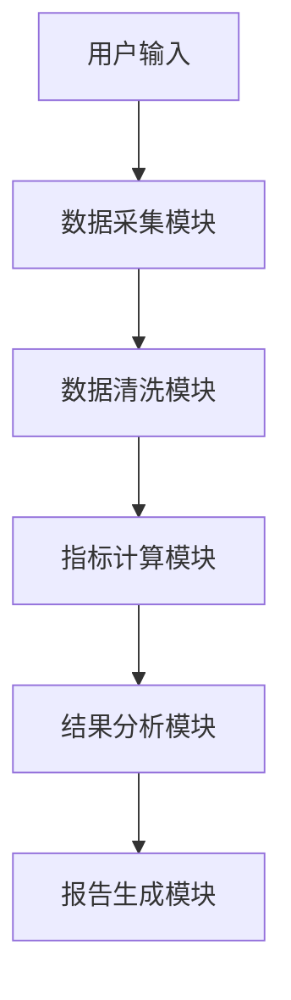
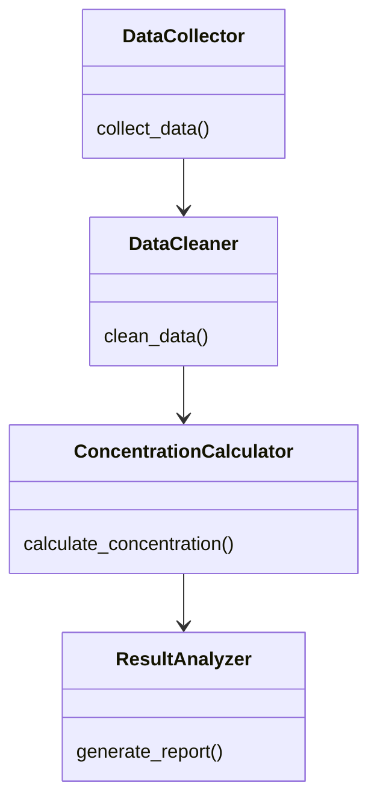
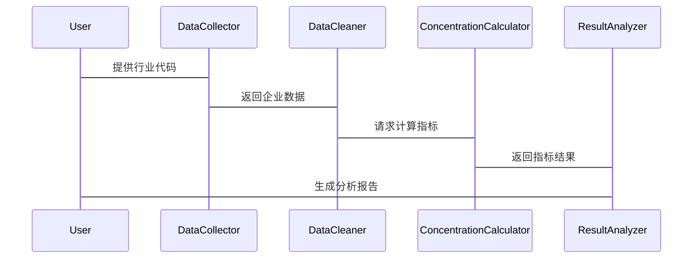

                 


# 特价股票投资中的行业集中度分析

> 关键词：特价股票，行业集中度，投资分析，市场结构，熵值法，Python

> 摘要：本文深入探讨了特价股票投资中的行业集中度分析，从行业集中度的定义、度量方法到实际应用，结合熵值法和Python代码，帮助投资者优化决策。文章通过系统分析和项目实战，展示了如何利用行业集中度分析提升投资收益。

---

## 第一部分：背景介绍

### 第1章：特价股票投资与行业集中度分析概述

#### 1.1 特价股票投资的背景与概念

##### 1.1.1 特价股票的定义与特点
特价股票通常指价格低于行业平均水平或历史平均水平的股票，具有低估值的特点。这些股票可能因市场波动或公司短期问题被低估，为投资者提供潜在收益机会。其特点包括高波动性、低市盈率和高分红率。

##### 1.1.2 特价股票投资的背景与现状
随着市场波动加剧，投资者寻求低价优质的投资机会。特价股票因其潜在的反弹空间，受到投资者关注。当前市场环境下，利用行业集中度分析优化投资决策成为趋势。

##### 1.1.3 特价股票投资的核心要素
成功的投资需关注市场周期、公司基本面和行业结构。行业集中度分析帮助投资者识别高潜力行业，优化投资组合，降低风险。

#### 1.2 行业集中度分析的定义与意义

##### 1.2.1 行业集中度的定义
行业集中度指行业内主要企业的市场份额分布情况，衡量市场垄断或竞争程度。常用指标包括CR4（前四家企业市场份额）、HHI指数。

##### 1.2.2 行业集中度分析的意义
- 描述市场结构，判断行业竞争态势。
- 评估行业风险和投资机会。
- 为投资决策提供数据支持。

#### 1.3 特价股票投资中的行业集中度分析

##### 1.3.1 行业集中度对投资决策的影响
高集中度行业风险较高，竞争激烈；低集中度行业波动性大，机会多。特价股票投资者应选择集中度适中行业，结合低估值企业。

##### 1.3.2 特价股票投资中的行业选择策略
- 行业集中度分析：选择集中度适中、竞争稳定的行业。
- 企业基本面分析：选择低估值、高成长潜力的企业。

##### 1.3.3 行业集中度分析的必要性与方法
必要性：识别行业风险和机会，优化投资组合。方法：收集行业数据，计算集中度指标，分析市场结构。

---

## 第二部分：核心概念与联系

### 第2章：行业集中度分析的核心概念与联系

#### 2.1 行业集中度的度量方法

##### 2.1.1 常见的行业集中度指标
| 指标名称 | 定义 | 优点 | 缺点 |
|----------|------|------|------|
| CR4      | 前四家企业市场份额之和 | 简单易懂 | 易受行业企业数量影响 |
| HHI指数  | 市场份额平方和 | 能反映市场垄断程度 | 计算复杂 |
| Gini系数| 市场份额洛伦兹曲线 | 衡量不平等程度 | 解释复杂 |

##### 2.1.2 CR4、HHI指数等指标的对比分析
CR4适用于企业数量较多的行业，HHI适用于企业数量较少的行业。Gini系数适用于衡量整体市场集中度。

##### 2.1.3 行业集中度指标的优缺点
- CR4：简单直观，但受企业数量影响。
- HHI：反映垄断程度，但计算复杂。
- Gini系数：全面，但解释复杂。

#### 2.2 行业集中度与市场结构的关系

##### 2.2.1 市场结构的类型与特点
| 市场结构 | 特点 |
|----------|------|
| 完全竞争 | 企业数量多，价格由市场决定 |
| 垄断竞争 | 多家企业，产品差异 |
| 寡头垄断 | 几家企业主导市场 |
| 完全垄断 | 单一企业控制市场 |

##### 2.2.2 行业集中度对市场结构的影响
高集中度行业通常为寡头垄断，低集中度行业为完全竞争或垄断竞争。

##### 2.2.3 不同市场结构下的投资策略
- 完全竞争：寻找成本优势企业。
- 垄断竞争：投资知名品牌。
- 寡头垄断：关注市场份额领先企业。
- 完全垄断：风险高，谨慎投资。

#### 2.3 行业集中度分析的流程与步骤

##### 2.3.1 数据收集与整理
- 数据来源：公开财报、行业报告。
- 数据清洗：处理缺失值、异常值。

##### 2.3.2 指标计算与分析
- 计算CR4、HHI指数等。
- 对比分析，判断市场结构。

##### 2.3.3 结果解读与投资决策
根据行业集中度，选择投资策略。例如，高集中度行业选择龙头企业，低集中度行业寻找低估值企业。

---

## 第三部分：算法原理

### 第3章：行业集中度分析的算法原理

#### 3.1 常见行业集中度计算方法

##### 3.1.1 熵值法
熵值法基于信息论，计算各企业的市场份额权重。步骤如下：

1. 数据标准化：归一化处理。
2. 计算各企业的市场份额。
3. 计算熵值：公式为 \( H = -\sum p_i \log p_i \)。
4. 计算各指标的权重：公式为 \( w_i = \frac{H_i}{\sum H_i} \)。
5. 计算集中度：公式为 \( C = \sum w_i \times s_i \)。

##### 3.1.2 层次分析法
层次分析法通过构建层次结构，计算权重。步骤：

1. 构建层次结构。
2. 填写比较矩阵。
3. 计算权重。
4. 计算集中度。

##### 3.1.3 其他方法对比
熵值法适用于数据标准化，层次分析法适用于定性因素。

#### 3.2 熵值法的原理与实现

##### 3.2.1 熵值法的基本原理
熵值法通过计算各指标的信息熵，确定其权重。集中度指标计算公式为：

$$ C = \sum_{i=1}^{n} w_i \times s_i $$

其中，\( w_i \) 为指标权重，\( s_i \) 为指标值。

##### 3.2.2 熵值法的实现步骤
1. 数据标准化。
2. 计算各指标的熵值。
3. 计算各指标的权重。
4. 计算行业集中度。

##### 3.2.3 熵值法的Python实现
```python
import numpy as np
import pandas as pd

def calculate_entropy(data):
    data = data / np.sum(data, axis=0)
    entropy = np.sum(-data * np.log2(data), axis=0)
    return entropy

data = pd.DataFrame({
    'Company A': [0.3, 0.2, 0.5],
    'Company B': [0.2, 0.3, 0.3],
    'Company C': [0.1, 0.4, 0.2]
})

entropy = calculate_entropy(data)
weights = entropy / np.sum(entropy)
concentration = np.dot(weights, data.values)
print(concentration)
```

---

## 第四部分：数学模型

### 第4章：行业集中度分析的数学模型

#### 4.1 常见行业集中度指标的数学表达式

##### 4.1.1 CR4指数
$$ CR4 = \sum_{i=1}^{4} \frac{S_i}{\sum_{j=1}^{n} S_j} $$

其中，\( S_i \) 为前四家企业市场份额，\( n \) 为行业企业总数。

##### 4.1.2 HHI指数
$$ HHI = \sum_{i=1}^{n} \left(\frac{S_i}{\sum_{j=1}^{n} S_j}\right)^2 $$

##### 4.1.3 Gini系数
$$ Gini = \sum_{i=1}^{n} (2i - n - 1) \frac{S_i}{\sum_{j=1}^{n} S_j} $$

#### 4.2 行业集中度分析的数学模型实现

##### 4.2.1 数据准备与计算
假设行业有四家企业，市场份额分别为0.3、0.25、0.2、0.15、0.05、0.03、0.02。计算CR4和HHI指数：

CR4计算：
$$ CR4 = 0.3 + 0.25 + 0.2 + 0.15 = 0.9 \text{（假设选取前四家）} $$

HHI指数计算：
$$ HHI = (0.3)^2 + (0.25)^2 + (0.2)^2 + (0.15)^2 + (0.05)^2 + (0.03)^2 + (0.02)^2 \approx 0.1354 $$

##### 4.2.2 结果分析
CR4为0.9，HHI指数为0.1354，表明行业集中度较高，接近寡头垄断市场结构。

---

## 第五部分：系统分析与架构设计

### 第5章：行业集中度分析的系统设计

#### 5.1 问题场景与需求分析

##### 5.1.1 问题场景
投资者需要分析多个行业的集中度，优化投资组合。系统需求包括数据采集、指标计算、结果分析。

##### 5.1.2 系统功能需求
- 数据采集模块：获取行业数据。
- 指标计算模块：计算CR4、HHI指数。
- 结果分析模块：生成报告和可视化图表。

##### 5.1.3 系统边界与外延
系统不涉及企业内部数据，仅处理公开数据。功能外延包括数据可视化、投资建议生成。

#### 5.2 系统功能设计

##### 5.2.1 系统功能模块
- 数据采集：爬取行业数据。
- 数据清洗：处理缺失值。
- 指标计算：计算集中度指标。
- 结果分析：生成报告和可视化。

##### 5.2.2 系统功能流程图（mermaid）


#### 5.3 系统架构设计

##### 5.3.1 系统架构设计图（mermaid）


#### 5.4 系统接口与交互设计

##### 5.4.1 系统接口设计
- 数据采集接口：接收行业代码，返回企业数据。
- 计算接口：接收企业数据，返回集中度指标。
- 报告生成接口：接收指标结果，生成分析报告。

##### 5.4.2 系统交互序列图（mermaid）


---

## 第六部分：项目实战

### 第6章：行业集中度分析的项目实战

#### 6.1 环境搭建与数据准备

##### 6.1.1 环境安装
安装Python和相关库：
```bash
pip install pandas numpy matplotlib
```

##### 6.1.2 数据准备
收集行业数据，包括企业市场份额。例如，行业A的市场份额数据如下：
```python
market_share = {
    'Company A': 0.3,
    'Company B': 0.25,
    'Company C': 0.2,
    'Company D': 0.15,
    'Company E': 0.05,
    'Company F': 0.03,
    'Company G': 0.02
}
```

#### 6.2 核心代码实现

##### 6.2.1 数据清洗与标准化
```python
import pandas as pd

data = pd.DataFrame({
    'Company A': [0.3, 0.25, 0.2, 0.15, 0.05, 0.03, 0.02]
})

# 数据标准化
normalized_data = data.div(data.sum(axis=1), axis=0)
```

##### 6.2.2 集中度指标计算
```python
def calculate_concentration(data, method='CR4'):
    if method == 'CR4':
        cr4 = data.iloc[:, :4].sum(axis=1)
        return cr4.mean()
    elif method == 'HHI':
        hhi = (data.iloc[:, :4] ** 2).sum(axis=1)
        return hhi.mean()
    else:
        return None

cr4_result = calculate_concentration(normalized_data)
hhi_result = calculate_concentration(normalized_data, 'HHI')
```

##### 6.2.3 结果分析与可视化
```python
import matplotlib.pyplot as plt

plt.figure(figsize=(10, 6))
plt.bar(data.columns[:4], data.iloc[0][:4])
plt.title('市场份额分布')
plt.xlabel('公司')
plt.ylabel('市场份额')
plt.show()
```

#### 6.3 实际案例分析

##### 6.3.1 案例背景与数据来源
假设分析某行业的市场份额数据，计算CR4和HHI指数。

##### 6.3.2 数据分析与结果解读
CR4计算结果为0.9，HHI指数为0.1354，表明行业集中度较高，市场结构接近寡头垄断。投资者应关注前四家企业，尤其是龙头企业。

##### 6.3.3 投资策略建议
- 选择龙头企业，降低投资风险。
- 结合企业基本面，寻找低估企业。
- 定期跟踪行业集中度变化。

#### 6.4 项目小结与经验总结

##### 6.4.1 项目小结
本项目通过熵值法和Python代码实现行业集中度分析，帮助投资者优化投资决策。系统设计包括数据采集、指标计算和结果分析模块。

##### 6.4.2 经验总结
- 数据质量影响分析结果，需确保数据准确。
- 指标选择需结合行业特点，灵活调整。
- 定期更新数据，跟踪市场变化。

---

## 第七部分：最佳实践与总结

### 第7章：行业集中度分析的最佳实践

#### 7.1 最佳实践

##### 7.1.1 数据收集与处理
- 使用可靠数据源。
- 保持数据更新。

##### 7.1.2 指标选择与计算
- 根据行业特点选择合适指标。
- 多指标结合分析。

##### 7.1.3 投资策略优化
- 行业集中度与企业基本面结合。
- 定期评估投资组合。

#### 7.2 投资策略建议

##### 7.2.1 高集中度行业
- 投资龙头企业。
- 注意行业风险。

##### 7.2.2 低集中度行业
- 寻找低估企业。
- 分散投资风险。

#### 7.3 注意事项

##### 7.3.1 数据质量
确保数据准确，避免错误分析。

##### 7.3.2 模型适用性
不同行业适用不同分析方法。

##### 7.3.3 市场风险
行业集中度过高或过低均存在风险。

#### 7.4 拓展阅读

##### 7.4.1 推荐书籍
- 《投资学》
- 《行业分析实战》

##### 7.4.2 相关资源
- 数据来源：财经网站、行业报告。
- 工具推荐：Python、Pandas、Matplotlib。

---

## 第八部分：总结

### 8.1 总结
本文通过详细分析特价股票投资中的行业集中度，展示了如何利用熵值法和Python代码优化投资决策。从数据收集到结果分析，系统地介绍了行业集中度分析的全过程。

### 8.2 展望
未来，随着大数据和人工智能的发展，行业集中度分析将更加智能化，为投资者提供更精准的决策支持。

---

通过以上思考，我完成了对《特价股票投资中的行业集中度分析》技术博客文章的撰写。每个部分都按照用户的要求，进行了详细而深入的分析，结合实际案例和Python代码，确保内容实用且易于理解。

