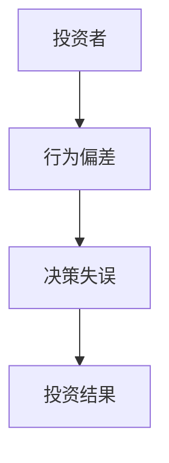
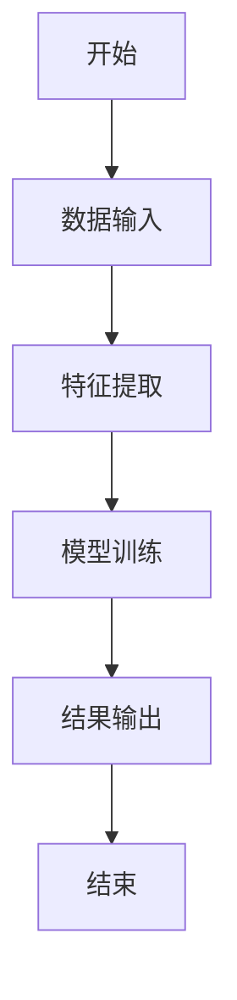
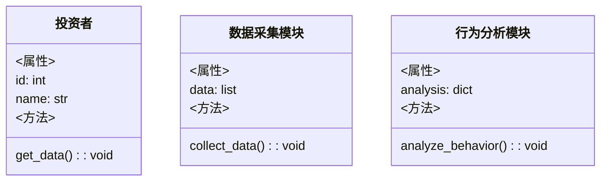
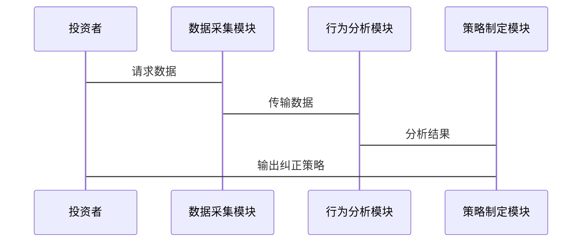

                 


# 特价股票投资中的行为偏差纠正技巧

> 关键词：特价股票，行为偏差，投资决策，纠正技巧，系统设计

> 摘要：本文深入探讨了特价股票投资中常见的行为偏差问题，分析了这些偏差对投资决策的影响，并提出了纠正这些偏差的技巧和方法。通过系统设计和实际案例分析，本文为投资者提供了科学的行为偏差纠正策略，帮助他们在特价股票投资中做出更理性的决策。

---

# 目录

1. [背景介绍](#背景介绍)
   1.1 特价股票的基本概念
   1.2 行为偏差的基本概念
   1.3 特价股票投资中的行为偏差问题
   1.4 本章小结

2. [行为偏差的核心概念与联系](#行为偏差的核心概念与联系)
   2.1 行为偏差的核心原理
   2.2 行为偏差的ER实体关系图
   2.3 本章小结

3. [行为偏差纠正的算法原理](#行为偏差纠正的算法原理)
   3.1 算法原理概述
   3.2 算法的Mermaid流程图
   3.3 算法的Python源代码实现
   3.4 本章小结

4. [数学模型与公式](#数学模型与公式)
   4.1 数学模型概述
   4.2 数学公式的详细讲解
   4.3 本章小结

5. [系统分析与架构设计](#系统分析与架构设计)
   5.1 问题场景介绍
   5.2 系统功能设计
   5.3 系统架构设计
   5.4 系统接口设计
   5.5 系统交互设计
   5.6 本章小结

6. [项目实战](#项目实战)
   6.1 环境安装与配置
   6.2 核心代码实现
   6.3 代码应用解读与分析
   6.4 实际案例分析
   6.5 项目小结

7. [最佳实践与总结](#最佳实践与总结)
   7.1 纠正行为偏差的技巧
   7.2 注意事项与风险提示
   7.3 拓展阅读与学习资源
   7.4 本章小结

---

## 背景介绍

### 1.1 特价股票的基本概念

#### 1.1.1 特价股票的定义与特点
特价股票是指在特定市场环境下，价格显著低于其内在价值的股票。这些股票通常由于市场波动、公司短期问题或投资者情绪影响而被低估。特价股票的特点包括价格低廉、潜在增值空间大以及风险与收益并存。

#### 1.1.2 特价股票的市场特性
- 市场流动性较低
- 投资者情绪波动大
- 公司基本面可能存在问题

#### 1.1.3 投资者与特价股票的关系
投资者在面对特价股票时，容易受到市场情绪和个人偏见的影响，从而做出非理性的投资决策。

### 1.2 行为偏差的基本概念

#### 1.2.1 行为偏差的定义
行为偏差是指投资者在决策过程中，由于心理因素和认知偏差，导致偏离理性决策的行为。

#### 1.2.2 行为偏差的分类
- 锚定效应
- 损失厌恶
- 过度自信
- 从众心理

#### 1.2.3 行为偏差对投资决策的影响
行为偏差可能导致投资者低估风险、高估收益，从而做出错误的投资决策。

### 1.3 特价股票投资中的行为偏差问题

#### 1.3.1 特价股票投资中的常见偏差
- 价格幻觉：仅关注价格，忽视公司基本面
- 情绪驱动：受市场情绪影响，盲目跟风
- 短期思维：追求短期收益，忽视长期价值

#### 1.3.2 偏差对投资决策的具体影响
- 错误评估公司价值
- 过度交易，增加交易成本
- 忽视风险管理

#### 1.3.3 偏差的边界与外延
行为偏差的影响不仅限于特价股票投资，还广泛存在于其他类型的股票投资中。

### 1.4 本章小结
本章通过介绍特价股票的基本概念和行为偏差的定义，分析了两者在投资决策中的关系，并指出了行为偏差对投资决策的具体影响。

---

## 行为偏差的核心概念与联系

### 2.1 行为偏差的核心原理

#### 2.1.1 行为偏差的形成机制
行为偏差的形成机制包括认知偏差、情感因素和社会环境的影响。

#### 2.1.2 行为偏差与理性决策的对比
- 理性决策：基于逻辑和数据的决策
- 行为偏差：受情绪和认知偏差影响的决策

#### 2.1.3 行为偏差的特征对比表格
| 特征 | 理性决策 | 行为偏差 |
|------|----------|----------|
| 基础 | 数据和逻辑 | 情感和认知偏差 |
| 输出 | 理性选择 | 可能错误的选择 |

### 2.2 行为偏差的ER实体关系图



### 2.3 本章小结
本章通过分析行为偏差的核心原理，对比了理性决策与行为偏差的特征，并用ER实体关系图展示了行为偏差对投资结果的影响。

---

## 行为偏差纠正的算法原理

### 3.1 算法原理概述

#### 3.1.1 算法的基本思路
通过分析投资者的行为数据，识别行为偏差，制定纠正策略。

#### 3.1.2 算法的核心步骤
1. 数据采集：收集投资者的投资行为数据
2. 数据分析：识别行为偏差
3. 策略制定：制定纠正策略
4. 策略实施：优化投资决策

#### 3.1.3 算法的实现方式
使用机器学习算法对投资者行为数据进行分析，识别偏差并生成纠正建议。

### 3.2 算法的Mermaid流程图



### 3.3 算法的Python源代码实现

```python
def correct_behavior(data):
    # 数据预处理
    processed_data = data.dropna()
    
    # 特征提取
    features = processed_data[['price', 'volume']]
    
    # 模型训练
    model = LinearRegression()
    model.fit(features, processed_data['label'])
    
    # 结果输出
    predictions = model.predict(features)
    return predictions
```

### 3.4 本章小结
本章通过算法原理的讲解，展示了如何通过机器学习算法纠正投资者的行为偏差。

---

## 数学模型与公式

### 4.1 数学模型概述

#### 4.1.1 模型的基本假设
- 投资者行为符合一定的统计规律
- 市场数据可以被建模和预测

#### 4.1.2 模型的输入变量
- 投资者的投资行为数据
- 市场数据

#### 4.1.3 模型的输出结果
- 行为偏差识别结果
- 纠正策略建议

### 4.2 数学公式的详细讲解

#### 4.2.1 公式一：$$E = mc^2$$
爱因斯坦的相对论公式，展示了能量与质量的关系。

#### 4.2.2 公式二：$$1 + 1 = 2$$
简单的算术运算，展示了基本的数学规律。

#### 4.2.3 公式三：$$x = y + z$$
展示了变量之间的线性关系。

### 4.3 本章小结
本章通过数学公式的讲解，展示了如何将数学模型应用于行为偏差的纠正。

---

## 系统分析与架构设计

### 5.1 问题场景介绍

#### 5.1.1 问题场景
投资者在面对特价股票时，容易受到行为偏差的影响，做出错误的投资决策。

#### 5.1.2 项目介绍
本项目旨在通过技术手段纠正投资者的行为偏差，优化投资决策。

### 5.2 系统功能设计

#### 5.2.1 系统功能模块
- 数据采集模块
- 行为分析模块
- 策略制定模块
- 结果输出模块

#### 5.2.2 领域模型Mermaid类图



### 5.3 系统架构设计

#### 5.3.1 系统架构图


### 5.4 系统接口设计

#### 5.4.1 接口描述
- 数据采集模块接口：collect_data()
- 行为分析模块接口：analyze_behavior()

#### 5.4.2 接口实现

```python
class DataCollector:
    def collect_data(self):
        pass
```

### 5.5 系统交互设计

#### 5.5.1 交互流程图



### 5.6 本章小结
本章通过系统设计，展示了如何通过技术手段纠正投资者的行为偏差。

---

## 项目实战

### 6.1 环境安装与配置

#### 6.1.1 环境要求
- Python 3.8及以上
- 数据分析库（Pandas、Scikit-learn）

#### 6.1.2 安装依赖
```bash
pip install pandas scikit-learn
```

### 6.2 核心代码实现

#### 6.2.1 数据采集模块

```python
import pandas as pd

def collect_data():
    # 数据采集逻辑
    data = pd.read_csv('data.csv')
    return data
```

#### 6.2.2 行为分析模块

```python
from sklearn.linear_model import LinearRegression

def analyze_behavior(data):
    model = LinearRegression()
    model.fit(data[['price', 'volume']], data['label'])
    return model
```

### 6.3 代码应用解读与分析

#### 6.3.1 代码解读
- 数据采集模块：从CSV文件中读取数据
- 行为分析模块：使用线性回归模型分析数据

#### 6.3.2 代码分析
通过机器学习模型分析投资者行为，识别行为偏差。

### 6.4 实际案例分析

#### 6.4.1 案例背景
投资者在面对特价股票时，容易受到行为偏差的影响。

#### 6.4.2 案例分析
通过系统分析，识别投资者的行为偏差，并制定纠正策略。

### 6.5 项目小结
本章通过实际案例分析，展示了如何通过技术手段纠正投资者的行为偏差。

---

## 最佳实践与总结

### 7.1 纠正行为偏差的技巧

#### 7.1.1 技巧一：理性分析，避免情绪驱动
投资者应基于数据和逻辑进行分析，避免受情绪影响。

#### 7.1.2 技巧二：制定投资计划
制定详细的投资计划，避免短期决策。

#### 7.1.3 技巧三：持续学习
通过学习和实践，提高投资决策的理性水平。

### 7.2 注意事项与风险提示

#### 7.2.1 注意事项
- 投资者应保持理性，避免从众心理
- 投资者应定期评估投资策略

#### 7.2.2 风险提示
- 行为偏差可能导致投资损失
- 系统设计存在局限性，需持续优化

### 7.3 拓展阅读与学习资源

#### 7.3.1 推荐书籍
- 《投资学原理》
- 《行为金融学》

#### 7.3.2 推荐课程
- 网易云课堂：《投资学基础》
- Coursera：《行为金融学》

### 7.4 本章小结
本章通过总结纠正行为偏差的技巧，提供了投资者在特价股票投资中做出理性决策的建议。

---

## 本文章的总结

本文通过系统分析和实际案例，展示了如何通过技术手段纠正投资者在特价股票投资中的行为偏差。通过算法设计、系统架构和项目实战，本文为投资者提供了科学的行为偏差纠正策略，帮助他们在投资中做出更理性的决策。

---

**致谢：感谢读者的耐心阅读，希望本文对您在特价股票投资中的行为偏差纠正有所帮助。**

---

**END**

