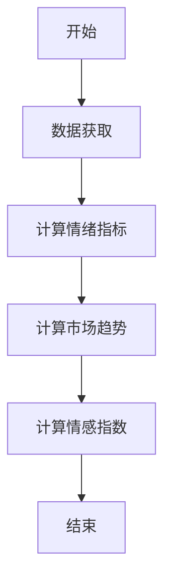
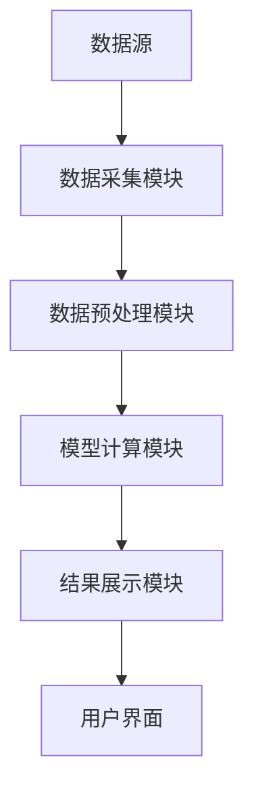

                 


# 特价股票投资中的行为金融学陷阱

---

## 关键词：行为金融学、特价股票、投资陷阱、心理偏差、数学模型、算法实现、系统设计

---

## 摘要：  
本文深入探讨了行为金融学在特价股票投资中的潜在陷阱，分析了投资者的心理偏差、行为模式及其对投资决策的影响。通过结合数学模型和算法，本文揭示了如何识别和规避这些行为陷阱，帮助投资者做出更理性、更科学的投资决策。文章还提供了具体的项目实战案例和系统架构设计，为读者提供了从理论到实践的全面指导。

---

## 第1章：引言

### 1.1 行为金融学概述  
行为金融学是研究投资者心理和行为偏差对金融市场影响的学科。与传统金融学不同，行为金融学强调人类认知和情感在投资决策中的作用。  

### 1.2 特价股票投资的背景  
特价股票通常指价格低于市场平均水平的股票，具有高波动性和高风险的特点。投资者在追求低价股票的过程中，容易受到情绪和认知偏差的影响，导致非理性决策。  

### 1.3 行为金融学与投资陷阱  
投资者在面对特价股票时，常常会陷入各种行为陷阱，如过度自信、从众心理和损失厌恶等。这些偏差可能导致投资决策失误，甚至造成重大损失。  

---

## 第2章：行为金融学基础

### 2.1 心理账户与决策偏见  
#### 2.1.1 心理账户的定义  
心理账户是投资者将资金分配到不同“账户”中进行管理的一种心理现象，可能导致资金分配不合理。  

#### 2.1.2 常见决策偏见  
- **过度自信**：投资者倾向于高估自己的能力，忽视市场的不确定性。  
- **从众心理**：投资者跟随市场趋势，盲目跟风。  
- **损失厌恶**：投资者对损失的厌恶程度远高于对收益的追求。  

### 2.2 基于行为金融学的决策模型  
#### 2.2.1 Kahneman-Tversky模型  
Kahneman和Tversky提出的行为决策模型考虑了概率权重和参考点效应，揭示了人类在不确定环境中的决策偏差。  

#### 2.2.2 情感指数模型  
情感指数模型通过分析市场情绪波动，预测股票价格的变化。  

---

## 第3章：行为偏差与投资陷阱

### 3.1 行为偏差对特价股票投资的影响  
#### 3.1.1 羊群效应  
投资者盲目跟随市场趋势，导致股票价格偏离实际价值。  

#### 3.1.2 情绪驱动的决策  
投资者在恐慌或贪婪情绪的驱使下，做出非理性投资决策。  

### 3.2 投资陷阱的具体表现  
#### 3.2.1 过度交易  
投资者频繁交易，导致交易成本增加，投资收益下降。  

#### 3.2.2 价格幻觉  
投资者过度关注股票价格的短期波动，忽视长期价值。  

---

## 第4章：数学模型与算法

### 4.1 基于行为金融学的数学模型  
#### 4.1.1 prospect theory的应用  
prospect theory通过概率权重函数和价值函数，解释了投资者在风险和收益面前的决策偏好。  

#### 4.1.2 情感指数模型的数学公式  
$$S = \alpha \cdot \text{情绪指标} + \beta \cdot \text{市场趋势}$$  

### 4.2 算法实现  
#### 4.2.1 情感指数计算流程图  


#### 4.2.2 情感指数计算代码  
```python
import pandas as pd

def calculate_emotion_index(data):
    # 计算情绪指标
    emotion_metric = data['情绪指标'].mean()
    # 计算市场趋势
    market_trend = data['市场趋势'].mean()
    # 计算情感指数
    emotion_index = emotion_metric * 0.5 + market_trend * 0.5
    return emotion_index

# 示例数据
data = pd.DataFrame({
    '情绪指标': [0.8, 0.6, 0.7],
    '市场趋势': [1.2, 1.0, 1.1]
})

result = calculate_emotion_index(data)
print("情感指数:", result)
```

---

## 第5章：系统分析与架构设计

### 5.1 系统功能设计  
#### 5.1.1 系统目标  
构建一个基于行为金融学的股票投资系统，帮助投资者识别和规避行为陷阱。  

#### 5.1.2 功能模块  
- **数据采集模块**：收集市场数据和投资者情绪数据。  
- **模型计算模块**：应用行为金融学模型进行分析。  
- **结果展示模块**：输出投资建议和风险提示。  

### 5.2 系统架构设计  


---

## 第6章：项目实战

### 6.1 环境安装  
#### 6.1.1 需要的工具  
- Python  
- pandas  
- matplotlib  

### 6.2 核心实现代码  
```python
import pandas as pd
import matplotlib.pyplot as plt

def main():
    # 数据加载
    data = pd.read_csv('stock_data.csv')
    # 计算情感指数
    emotion_index = calculate_emotion_index(data)
    # 可视化
    plt.plot(emotion_index, label='情感指数')
    plt.xlabel('时间')
    plt.ylabel('指数值')
    plt.legend()
    plt.show()

if __name__ == '__main__':
    main()
```

### 6.3 案例分析  
#### 6.3.1 数据来源  
使用某段时间的股票数据和市场情绪数据进行分析。  

#### 6.3.2 结果解读  
通过情感指数模型，识别市场情绪波动对股票价格的影响。  

---

## 第7章：最佳实践与总结

### 7.1 投资建议  
- 保持理性，避免情绪化决策。  
- 定期复盘，反思投资策略。  

### 7.2 注意事项  
- 选择合适的工具和模型，避免过度复杂化。  
- 考虑市场环境的变化，及时调整策略。  

### 7.3 拓展阅读  
推荐相关书籍和论文，深入学习行为金融学理论。  

---

## 结语  
行为金融学为我们揭示了投资者心理偏差对投资决策的影响。通过理解这些行为陷阱，我们可以更好地制定投资策略，避免非理性决策，实现长期稳健的投资收益。

