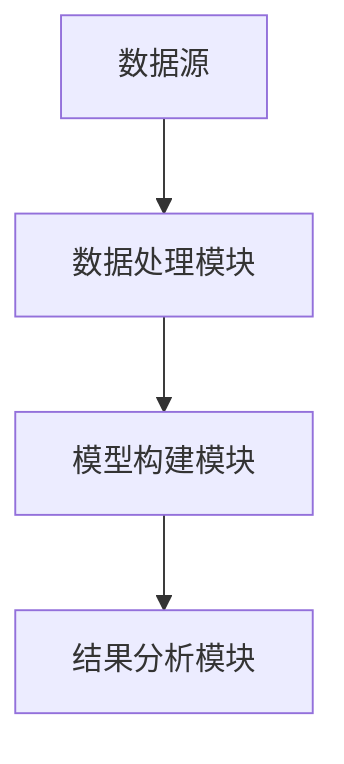
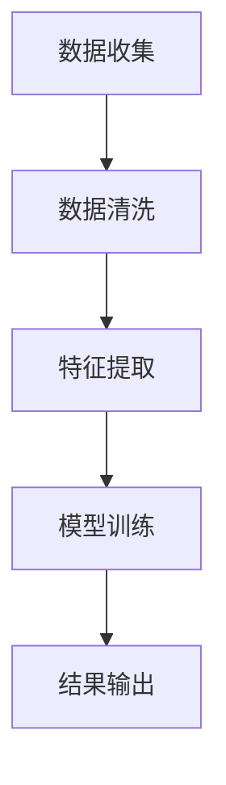

                 


# 特价股票投资中的质量因子分析

## 关键词：特价股票，质量因子，股票投资，价值分析，投资策略

## 摘要：  
特价股票投资中的质量因子分析是一种通过评估股票的质量因素来判断其投资价值的方法。本文将详细探讨质量因子的定义、分类及其在股票投资中的应用，分析质量因子与股票价值之间的关系，并结合实际案例，展示如何通过质量因子分析来制定有效的投资策略。文章从理论基础到实际操作，全面解析质量因子分析的核心算法和系统设计，为投资者提供科学的决策支持。

---

# 第1章：特价股票与质量因子概述

## 1.1 特价股票的概念与特点

### 1.1.1 特价股票的定义  
特价股票是指市场价格相对较低，具有较高的投资潜力的股票。这些股票通常被市场低估，具有较大的增值空间。

### 1.1.2 特价股票的市场表现  
特价股票往往出现在熊市或市场低迷时期，其价格波动较大，但具有较高的反弹潜力。

### 1.1.3 特价股票的投资价值  
投资特价股票的关键在于识别其潜在的价值，通过质量因子分析筛选出具有长期增长潜力的股票。

---

## 1.2 质量因子分析的背景

### 1.2.1 质量因子的定义  
质量因子是指能够反映股票内在质量的关键指标，包括市盈率（P/E）、市净率（P/B）、股息率等。

### 1.2.2 质量因子在股票投资中的作用  
质量因子能够帮助投资者评估股票的价值，识别具有长期增长潜力的优质股票。

### 1.2.3 质量因子分析的必要性  
通过质量因子分析，投资者可以避免盲目跟风，降低投资风险，提高投资收益。

---

# 第2章：质量因子的定义与分类

## 2.1 质量因子的定义

### 2.1.1 质量因子的内涵  
质量因子是衡量股票质量的关键指标，能够反映企业的盈利能力、成长性和稳定性。

### 2.1.2 质量因子的外延  
质量因子不仅包括财务指标，还包括市场表现、行业地位等多方面因素。

## 2.2 质量因子的分类

### 2.2.1 市盈率（P/E）因子  
市盈率是股票价格与每股收益的比值，用于衡量股票的投资价值。

### 2.2.2 市净率（P/B）因子  
市净率是股票价格与每股净资产的比值，用于评估股票的内在价值。

### 2.2.3 股息率因子  
股息率是股票的年度股息与股票价格的比率，反映股票的分红能力。

### 2.2.4 其他质量因子  
包括ROE（净资产收益率）、营业收入增长率等。

---

# 第3章：质量因子与股票价值的关系

## 3.1 质量因子对股票价值的影响

### 3.1.1 质量因子如何影响股票价格  
高质量因子的股票通常具有较高的市场估值，能够吸引更多的投资者。

### 3.1.2 质量因子与股票风险的关系  
高质量因子的股票通常具有较低的投资风险，能够为投资者提供稳定的收益。

## 3.2 质量因子分析的边界与外延

### 3.2.1 质量因子分析的适用范围  
适用于价值投资策略，帮助投资者筛选具有长期增长潜力的股票。

### 3.2.2 质量因子分析的局限性  
质量因子分析无法预测市场的短期波动，存在一定的局限性。

---

# 第4章：价值投资理论与质量因子分析

## 4.1 价值投资理论概述

### 4.1.1 价值投资的核心理念  
价值投资强调以低于内在价值的价格买入股票，长期持有，获得超额收益。

### 4.1.2 价值投资与质量因子分析的联系  
质量因子分析是价值投资的重要工具，帮助投资者识别具有长期投资价值的股票。

## 4.2 现代投资组合理论与质量因子分析

### 4.2.1 现代投资组合理论的基本原理  
通过分散投资降低风险，优化投资组合的收益与风险比。

### 4.2.2 质量因子分析在投资组合中的应用  
通过质量因子分析筛选出优质股票，构建优化的投资组合。

---

# 第5章：质量因子分析的算法原理

## 5.1 多因子模型

### 5.1.1 多因子模型的定义  
多因子模型是一种基于多个质量因子的股票筛选方法，能够综合评估股票的投资价值。

### 5.1.2 多因子模型的构建步骤  
1. 确定质量因子；  
2. 数据收集与预处理；  
3. 建立回归模型；  
4. 评估模型的优劣；  
5. 应用模型进行股票筛选。

## 5.2 回归分析在质量因子分析中的应用

### 5.2.1 线性回归模型  
通过线性回归分析，确定各质量因子对股票收益的影响程度。

### 5.2.2 逻辑回归模型  
用于分类分析，筛选出具有高投资价值的股票。

---

## 5.3 数学模型与公式

### 5.3.1 多因子模型的数学表达式  
$$ R_i = \alpha + \beta_1 F_1 + \beta_2 F_2 + ... + \beta_n F_n + \epsilon $$  

### 5.3.2 回归分析的数学表达式  
$$ Y = \beta_0 + \beta_1 X + \epsilon $$  

---

# 第6章：质量因子分析的系统设计

## 6.1 系统需求分析

### 6.1.1 系统目标  
构建一个能够自动筛选高质量股票的分析系统。

### 6.1.2 系统功能需求  
- 数据收集模块；  
- 数据处理模块；  
- 模型构建模块；  
- 结果分析模块。

## 6.2 系统架构设计

### 6.2.1 系统架构图  


### 6.2.2 数据流图  


---

## 6.3 系统实现

### 6.3.1 数据收集模块  
负责收集股票的历史数据，包括价格、成交量、财务指标等。

### 6.3.2 数据处理模块  
对收集到的数据进行清洗、转换和标准化处理。

### 6.3.3 模型构建模块  
基于处理后的数据，构建多因子回归模型，筛选出高质量因子。

### 6.3.4 结果分析模块  
对模型的输出结果进行解读，生成投资建议。

---

# 第7章：质量因子分析的实战应用

## 7.1 数据收集与预处理

### 7.1.1 数据来源  
从金融数据平台获取股票的历史数据。

### 7.1.2 数据清洗与转换  
对缺失值进行填充，对异常值进行处理。

## 7.2 模型实现与结果分析

### 7.2.1 模型实现步骤  
1. 数据预处理；  
2. 特征选择；  
3. 模型训练；  
4. 模型评估；  
5. 结果分析。

### 7.2.2 模型结果解读  
通过回归系数的大小，评估各质量因子对股票收益的影响程度。

## 7.3 实际案例分析

### 7.3.1 案例背景  
以某行业内的几只股票为例，进行质量因子分析。

### 7.3.2 案例分析  
通过模型筛选出具有较高投资价值的股票，制定投资策略。

---

# 项目实战

## 7.4 代码实现

### 7.4.1 数据收集与处理  
```python
import pandas as pd
import numpy as np

# 数据收集
data = pd.read_csv('stock_data.csv')

# 数据清洗
data.dropna(inplace=True)
data = data[~data['volume'].isin([0])]
data['price'] = data['close']
```

### 7.4.2 模型构建  
```python
from sklearn.linear_model import LinearRegression

# 特征选择
features = ['P/E', 'P/B', 'dividend_yield']
target = 'return'

model = LinearRegression()
model.fit(data[features], data[target])
```

### 7.4.3 结果分析  
```python
coefficients = pd.DataFrame({'feature': features, 'coefficient': model.coef_})
print(coefficients)
```

---

# 总结

通过质量因子分析，投资者可以更科学地筛选出具有长期投资价值的股票，制定有效的投资策略。本文详细介绍了质量因子的定义、分类及其在股票投资中的应用，结合实际案例，展示了如何通过质量因子分析实现投资收益的最大化。

