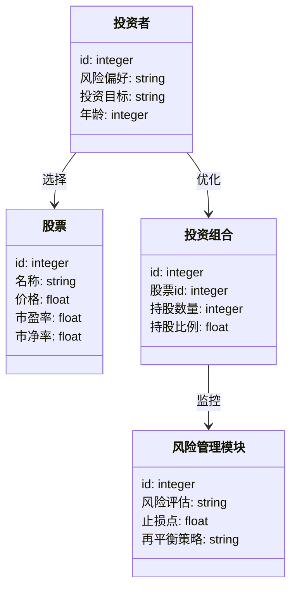
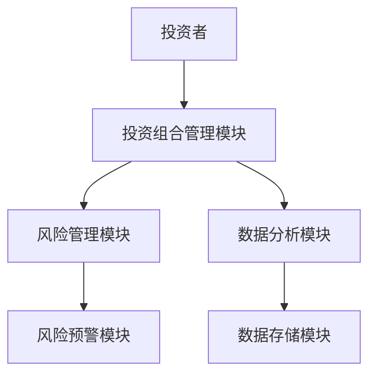

                 


# 特价股票投资中的跨代际投资策略与风险管理

---

## 关键词

- 特价股票投资
- 跨代际投资
- 风险管理
- 技术分析
- 基本面分析

---

## 摘要

本文探讨了在特价股票投资中，跨代际投资策略与风险管理的重要性。通过分析不同代际投资者的风险偏好和投资目标，结合特价股票的特点，提出了基于技术分析和基本面分析的投资策略，并结合系统架构设计和实际案例，详细阐述了如何在跨代际框架下进行有效的风险管理，以实现长期稳健的投资回报。

---

## 第1章：引言

### 1.1 背景介绍

#### 1.1.1 特价股票投资的背景

在当前金融市场中，特价股票作为一种高波动性、高风险的投资品种，吸引了众多投资者的关注。特价股票通常指那些价格远低于市场平均水平的股票，可能因公司困境、行业衰退或市场情绪影响而被低估。投资者通过挖掘这些股票的价值，试图在市场反弹时获得超额收益。

#### 1.1.2 跨代际投资的必要性

随着社会的发展，不同代际的投资者在风险偏好、投资目标和生命周期需求上存在显著差异。跨代际投资策略需要考虑不同年龄段投资者的需求，确保投资组合在长期目标和短期风险之间取得平衡。

#### 1.1.3 研究目的与方法

本文旨在通过分析跨代际投资在特价股票中的应用，提出一套结合技术分析和基本面分析的投资策略，并结合风险管理模型，确保投资组合的稳健性。研究方法包括数据分析、案例研究和理论建模。

---

## 第2章：跨代际投资概述

### 2.1 跨代际投资的定义与特点

#### 2.1.1 跨代际投资的定义

跨代际投资是指在不同代际之间进行资产配置和投资决策，以满足各代际投资者的需求和目标。这种投资策略强调长期性、多样性和风险分散。

#### 2.1.2 跨代际投资的特点

- **长期性**：跨代际投资注重长期目标，而非短期收益。
- **多样性**：通过多样化投资组合，降低特定资产的风险。
- **风险分散性**：跨代际投资通过不同代际的资产配置，分散整体风险。

### 2.2 跨代际投资的核心要素

#### 2.2.1 投资目标

- **不同代际的目标差异**：年轻投资者注重高风险高回报，年长投资者注重保值和稳定收益。
- **目标设定的原则**：根据生命周期理论，设定与各代际阶段相匹配的投资目标。

#### 2.2.2 投资期限

- **短期与长期投资的比较**：短期投资注重波动性，长期投资注重稳定性。
- **期限对策略选择的影响**：长期投资者更适合价值投资，短期投资者更适合趋势交易。

---

## 第3章：特价股票投资策略

### 3.1 特价股票投资的定义与分类

#### 3.1.1 特价股票的定义

特价股票是指价格远低于市场平均水平的股票，可能因市场低估或公司困境导致。这类股票通常具有较高的反弹潜力，但风险也较高。

#### 3.1.2 特价股票的分类

- **按行业分类**：如科技、金融、能源等行业的特价股票。
- **按市场表现分类**：如超跌股、低价股等。
- **按风险等级分类**：如低风险、中风险、高风险的特价股票。

### 3.2 特价股票投资的策略分析

#### 3.2.1 基本面分析法

- **财务指标分析**：如市盈率（P/E）、市净率（P/B）、股息率等。
- **行业分析**：分析行业发展趋势和竞争格局。
- **公司竞争优势分析**：评估公司的核心竞争力和管理团队。

#### 3.2.2 技术分析法

- **K线图分析**：通过分析股价走势，识别趋势和反转点。
- **移动平均线**：使用MA指标判断股价的短期和长期趋势。
- **市场情绪分析**：通过成交量、资金流动等指标判断市场情绪。

---

## 第4章：风险管理方法

### 4.1 风险管理的基本概念

#### 4.1.1 投资风险的定义

投资风险是指在投资过程中，由于市场波动、经济环境变化等因素，导致投资收益低于预期或本金损失的风险。

#### 4.1.2 风险衡量指标

- **波动率**：衡量资产价格的波动程度。
- **VaR（风险价值）**：衡量在一定置信水平下，投资组合可能遭受的最大损失。
- **最大回撤**：衡量投资组合在一定时间内的最大亏损幅度。

### 4.2 风险管理的具体措施

#### 4.2.1 分散投资

通过投资不同资产类别、行业和地区的股票，降低整体风险。

#### 4.2.2 设置止损点

在投资组合中设定止损点，以限制单笔投资的损失。

#### 4.2.3 定期再平衡

根据市场变化和投资目标，定期调整投资组合，确保风险和收益的匹配。

### 4.3 跨代际视角下的风险管理

#### 4.3.1 不同代际的风险偏好

- 年轻投资者：风险承受能力较高，适合高风险高回报的投资。
- 年长投资者：风险承受能力较低，适合稳健型投资。

#### 4.3.2 跨代际风险评估模型

通过构建跨代际风险评估模型，综合考虑各代际投资者的风险偏好和投资目标，制定个性化的风险管理策略。

---

## 第5章：系统分析与架构设计

### 5.1 问题场景介绍

#### 5.1.1 特价股票投资的系统需求

- 实时数据获取
- 技术分析与基本面分析
- 风险管理与投资组合优化

#### 5.1.2 跨代际投资的系统需求

- 多用户管理
- 资产配置优化
- 风险评估与预警

### 5.2 系统功能设计

#### 5.2.1 领域模型设计

使用Mermaid绘制领域模型类图，展示主要实体及其关系。



### 5.3 系统架构设计

#### 5.3.1 系统架构图

使用Mermaid绘制系统架构图，展示系统的模块划分和交互流程。



### 5.4 接口设计与交互流程

#### 5.4.1 接口设计

- **投资者输入接口**：接收投资者的风险偏好和投资目标。
- **数据分析接口**：获取实时股票数据和市场信息。
- **风险管理接口**：计算VaR值，生成风险预警。

#### 5.4.2 交互流程

1. 投资者输入风险偏好和目标。
2. 数据分析模块获取实时股票数据。
3. 投资组合管理模块根据数据和目标生成投资组合。
4. 风险管理模块评估风险，生成预警。
5. 系统根据预警调整投资组合。

---

## 第6章：项目实战

### 6.1 环境安装

#### 6.1.1 开发环境

- Python 3.8+
- Jupyter Notebook
- 数据分析库（Pandas, NumPy）
- 可视化库（Matplotlib, Plotly）

#### 6.1.2 数据获取

使用Yahoo Finance API获取历史股价数据。

```python
import pandas_datareader as pdr

# 获取数据
data = pdr.get_data_yahoo('AAPL', start='2020-01-01', end='2023-12-31')
```

### 6.2 核心代码实现

#### 6.2.1 技术分析代码

计算移动平均线并绘制K线图。

```python
import matplotlib.pyplot as plt

# 计算移动平均线
data['MA_20'] = data['Close'].rolling(20).mean()
data['MA_50'] = data['Close'].rolling(50).mean()

# 绘制K线图
plt.figure(figsize=(12, 6))
plt.plot(data['Close'], label='Close Price')
plt.plot(data['MA_20'], label='20-Day MA')
plt.plot(data['MA_50'], label='50-Day MA')
plt.legend()
plt.show()
```

#### 6.2.2 风险管理代码

计算VaR值。

```python
import numpy as np

# 计算VaR
def calculate VaR(returns, confidence_level=0.95):
    sorted_returns = sorted(returns)
    VaR = np.quantile(sorted_returns, 1 - confidence_level)
    return VaR

# 应用VaR
returns = data['Close'].pct_change().dropna()
VaR_95 = calculate VaR(returns, 0.95)
print(f"95% VaR: {VaR_95}")
```

### 6.3 实际案例分析

#### 6.3.1 案例分析

以某科技公司为例，分析其股价走势和风险管理策略。

#### 6.3.2 代码解读与分析

解释上述代码的功能和实现细节，分析其在实际投资中的应用。

---

## 第7章：总结与展望

### 7.1 总结

本文通过分析跨代际投资在特价股票中的应用，提出了结合技术分析和基本面分析的投资策略，并结合风险管理模型，确保投资组合的稳健性。通过系统架构设计和项目实战，验证了策略的有效性和可行性。

### 7.2 最佳实践 tips

- 定期再平衡投资组合，以适应市场变化。
- 根据不同代际的风险偏好，制定个性化的投资策略。
- 结合技术分析和基本面分析，提高投资决策的准确性。

### 7.3 注意事项

- 风险管理是跨代际投资的核心，需持续监控和调整。
- 特价股票投资具有高风险，需谨慎选择和严格控制仓位。

### 7.4 拓展阅读

- 推荐阅读《投资学》、《风险管理与VaR模型》等相关书籍，深入了解投资策略和风险管理的理论与实践。

---

## 附录

### 附录1：常用技术分析指标

- 移动平均线（MA）
- 相对强弱指数（RSI）
- 摩根士丹利资本国际指数（MSCI）

### 附录2：风险管理工具

- 风险价值（VaR）
- 最大回撤（Maximum Drawdown）
- 风险调整后收益（Sharpe Ratio）

---

以上是《特价股票投资中的跨代际投资策略与风险管理》的技术博客文章的详细内容，涵盖了从理论到实践的各个方面，结合实际案例和代码实现，为投资者提供了丰富的参考和指导。

