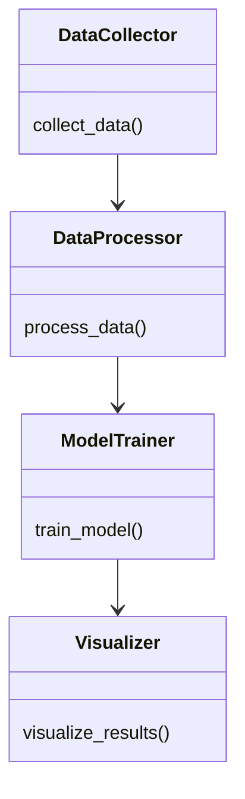
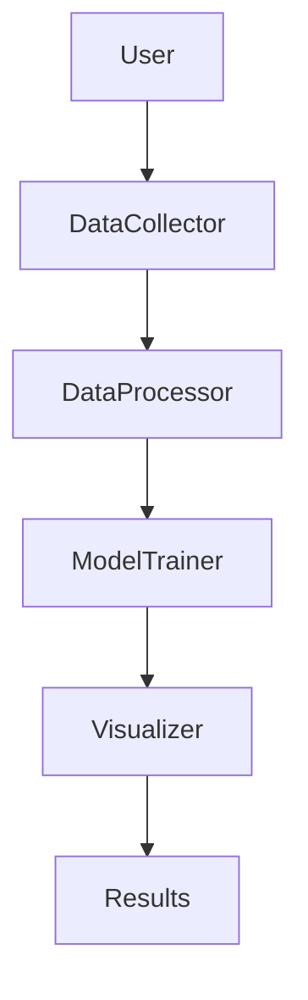

                 


# 特价股票投资中的跨境数据流动与数字资产价值评估策略

> 关键词：特价股票，跨境数据流动，数字资产，价值评估，算法策略

> 摘要：本文探讨了特价股票投资中跨境数据流动对数字资产价值评估的影响，通过分析数据流动机制、数字资产评估策略，结合具体算法实现和系统架构设计，为投资者提供科学的决策支持。

---

## 第一部分: 背景介绍

### # 第1章: 特价股票投资的基本概念

#### 1.1 问题背景与问题描述
- **特价股票**：指价格相对较低的股票，通常具有较高的增长潜力。
- **跨境数据流动**：数据在不同国家之间的传输，涉及技术、法律和隐私问题。
- **数字资产**：包括比特币、以太坊等加密货币，以及其他数字化资产。

#### 1.2 问题解决
- 通过分析跨境数据流动，优化数字资产评估，提升特价股票投资决策的准确性。

#### 1.3 边界与外延
- **数据流动边界**：仅限于合法、合规的数据传输。
- **数字资产评估外延**：涵盖市场波动、政策影响等多因素。

#### 1.4 核心概念
- 数据流动驱动数字资产评估，特价股票投资基于此优化。

---

## 第二部分: 核心概念与联系

### # 第2章: 跨境数据流动的机制与影响

#### 2.1 数据流动机制
- **路径与模式**：通过互联网进行，需遵守各国法律。
- **驱动因素**：市场需求、技术进步、政策影响。

#### 2.2 对数字资产的影响
- 数据流动增加信息透明度，影响资产价格。

---

## 第三部分: 算法原理

### # 第3章: 数字资产评估算法

#### 3.1 线性回归模型
- **数学模型**：$y = \beta x + \epsilon$
- **流程图**：使用Mermaid展示数据清洗、特征选择、模型训练和评估。

#### 3.2 Python实现
```python
import pandas as pd
from sklearn.linear_model import LinearRegression

# 数据处理
data = pd.read_csv('stock_data.csv')
X = data[['volume', 'market_sentiment']]
y = data['price']

# 模型训练
model = LinearRegression()
model.fit(X, y)

# 预测与评估
predictions = model.predict(X)
print('R²:', model.score(X, y))
```

---

## 第四部分: 系统架构设计

### # 第4章: 系统设计

#### 4.1 领域模型


#### 4.2 系统架构


---

## 第五部分: 项目实战

### # 第5章: 实战案例

#### 5.1 环境搭建
- 安装Python、Pandas、Scikit-learn等库。

#### 5.2 核心代码
```python
import pandas as pd
from sklearn.model_selection import train_test_split
from sklearn.metrics import mean_squared_error

# 数据加载与分割
data = pd.read_csv('stocks.csv')
X = data[['feature1', 'feature2']]
y = data['target']

# 数据分割
X_train, X_test, y_train, y_test = train_test_split(X, y, test_size=0.2)

# 模型训练与评估
model = LinearRegression()
model.fit(X_train, y_train)
y_pred = model.predict(X_test)
print('MSE:', mean_squared_error(y_test, y_pred))
```

#### 5.3 案例分析
- 分析数据特征，调整模型参数，优化预测结果。

---

## 第六部分: 最佳实践

### # 第6章: 总结与展望

#### 6.1 总结
- 数据流动影响数字资产评估，算法优化投资决策。

#### 6.2 注意事项
- 注意数据隐私和法律合规。

#### 6.3 未来趋势
- AI和大数据在投资中的应用将更加广泛。

#### 6.4 扩展阅读
- 推荐相关书籍和资源，鼓励深入学习。

---

以上是文章的详细目录和内容结构，确保每个部分都覆盖必要的知识点，并提供实际操作指导。

