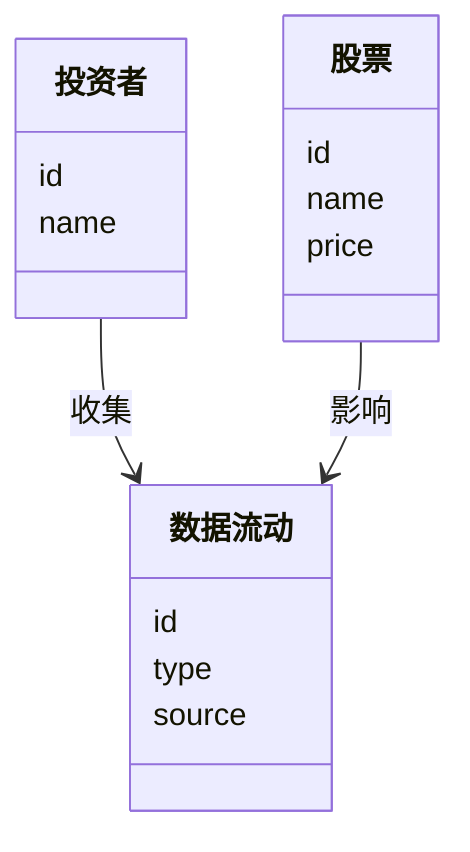
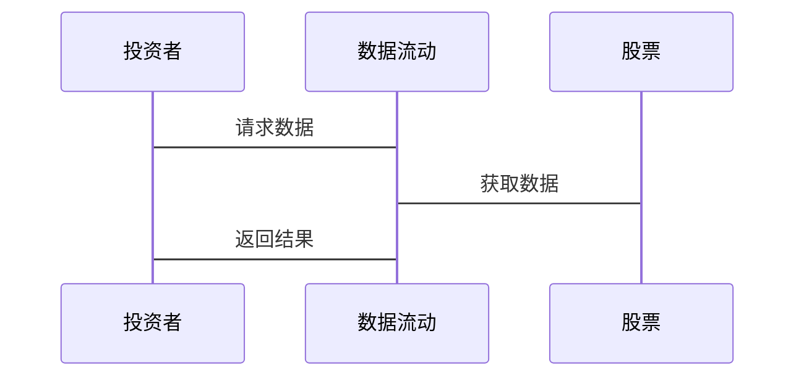

                 


# 特价股票投资中的跨境数据流动价值评估策略

**关键词**：特价股票，跨境数据流动，价值评估，算法原理，系统架构

**摘要**：本文系统阐述了在特价股票投资中，跨境数据流动对投资决策的价值评估策略。首先，文章介绍了特价股票和跨境数据流动的基本概念，分析了跨境数据流动对投资决策的影响。接着，详细探讨了数据流动与股票价值之间的关系，提出了数据流动价值评估的核心算法，并通过数学模型和实际案例分析，验证了算法的有效性。最后，文章总结了跨境数据流动在投资中的重要性，并提出了未来研究的方向。

---

# 第1章: 特价股票投资与跨境数据流动概述

## 1.1 特价股票投资的基本概念

### 1.1.1 特价股票的定义与特点

特价股票是指以低于市场价购买的股票，通常在市场波动或公司特定情况下出现。其特点包括高波动性、高风险和高潜在回报。特价股票的投资需要结合市场环境、公司基本面和技术分析。

### 1.1.2 特价股票投资的基本原理

特价股票投资的核心在于识别市场低估的机会，通过分析公司财务状况、行业趋势和市场情绪，找到被市场忽视的潜在价值。投资者需要具备敏锐的市场洞察力和快速决策能力。

### 1.1.3 特价股票投资的市场环境分析

市场环境包括宏观经济因素、行业趋势和政策变化。例如，全球经济波动、行业整合和政策调整都可能影响特价股票的投资机会。投资者需要密切关注这些因素，以做出明智的投资决策。

---

## 1.2 跨境数据流动的基本概念

### 1.2.1 数据流动的定义与特点

跨境数据流动是指数据在不同国家或地区之间的传输。其特点包括跨国性、合规性和潜在风险。数据流动的合规性受到各国法律的严格限制，例如欧盟的GDPR和美国的CCPA。

### 1.2.2 跨境数据流动的法律与合规性

跨境数据流动涉及复杂的法律框架，包括数据保护、隐私保护和国家安全等。投资者需要遵守相关法律法规，确保数据传输的合法性和合规性。

### 1.2.3 跨境数据流动对投资的影响

数据流动对投资的影响主要体现在信息不对称和市场波动。跨境数据流动可以帮助投资者获取全球市场信息，但也可能引发市场波动和风险。

---

## 1.3 特价股票投资中的跨境数据流动价值

### 1.3.1 跨境数据流动对投资决策的影响

数据流动可以提供全球市场信息，帮助投资者发现潜在投资机会。例如，通过分析其他国家的市场趋势，投资者可以提前布局，规避风险。

### 1.3.2 数据流动在股票估值中的作用

数据流动可以帮助投资者评估公司的真实价值。通过分析公司的财务数据、行业趋势和市场情绪，投资者可以做出更准确的估值。

### 1.3.3 跨境数据流动的市场趋势分析

通过对跨境数据流动的趋势分析，投资者可以预测市场走势，制定投资策略。例如，数据流动的增加可能预示着市场活跃和投资机会的增加。

---

## 1.4 本章小结

本章介绍了特价股票和跨境数据流动的基本概念，分析了数据流动对投资决策的影响，并探讨了数据流动在股票估值和市场趋势分析中的作用。这些内容为后续的价值评估策略奠定了基础。

---

# 第2章: 特价股票投资中的跨境数据流动价值评估核心概念

## 2.1 数据流动与股票价值的关系

### 2.1.1 数据流动对股票价格的影响机制

数据流动通过信息传递、市场情绪和预期变化影响股票价格。例如，负面数据流动可能导致股价下跌，而积极数据流动可能推高股价。

### 2.1.2 数据流动的量化分析方法

通过量化分析，投资者可以将数据流动转化为可量化的指标，例如数据流动指数。该指数可以反映市场对数据流动的反应程度。

### 2.1.3 数据流动的市场情绪分析

数据流动可以通过自然语言处理和情感分析技术，量化市场情绪。例如，社交媒体上的负面评论可能引发股价下跌。

---

## 2.2 数据流动的分类与特征

### 2.2.1 数据流动的分类标准

数据流动可以根据类型、来源和影响范围进行分类。例如，市场数据、财务数据和新闻数据属于不同类型。

### 2.2.2 不同类型数据流动的特点对比

不同类型的数据流动对市场的影响不同。例如，财务数据可能影响长期趋势，而新闻数据可能引发短期波动。

### 2.2.3 数据流动的实体关系图（ER图）

以下是数据流动的实体关系图（ER图）：

```mermaid
erDiagram
    customer[投资者] {
        <属性>
        id : 整数
        name : 字符串
        }
    stock[股票] {
        <属性>
        id : 整数
        name : 字符串
        price : 数值
        }
    data_flow[数据流动] {
        <属性>
        id : 整数
        type : 类型
        source : 来源
        }
    customer -|> data_flow : 收集
    stock -|> data_flow : 影响
```

---

## 2.3 数据流动的数学模型与公式

### 2.3.1 数据流动指数模型

数据流动指数（DFI）可以表示为：

$$ DFI = \sum_{i=1}^{n} (w_i \cdot d_i) $$

其中，$w_i$ 是数据流动的权重，$d_i$ 是数据流动的强度。

### 2.3.2 数据流动对股票收益的影响公式

股票收益（R）与数据流动的关系可以表示为：

$$ R = \beta \cdot DFI + \epsilon $$

其中，$\beta$ 是回归系数，$\epsilon$ 是误差项。

### 2.3.3 数据流动与市场波动的关系公式

市场波动（V）与数据流动的关系可以表示为：

$$ V = \alpha \cdot DFI^2 + \gamma \cdot DFI + \delta $$

其中，$\alpha$、$\gamma$ 和 $\delta$ 是回归系数。

---

## 2.4 本章小结

本章探讨了数据流动与股票价值的关系，提出了数据流动的分类与特征，并通过数学模型和公式，量化了数据流动对股票收益和市场波动的影响。

---

# 第3章: 数据流动价值评估算法原理

## 3.1 数据流动评估的算法概述

### 3.1.1 数据流动评估的基本原理

数据流动评估通过收集、分析和量化数据流动，预测其对投资决策的影响。算法的核心在于将数据流动转化为可量化的指标。

### 3.1.2 数据流动评估的算法分类

数据流动评估算法可以分为回归分析、时间序列分析和机器学习算法。

### 3.1.3 数据流动评估的算法选择依据

算法选择依据包括数据类型、预测精度和计算效率。

---

## 3.2 数据流动评估的具体算法实现

### 3.2.1 数据流动指数计算算法

以下是数据流动指数计算的Python代码示例：

```python
def calculate_data_flow_index(data):
    # 计算权重
    weights = data['weight'].values
    # 计算数据流动强度
    data_flow = data['flow'].values
    # 计算数据流动指数
    dfi = np.dot(weights, data_flow)
    return dfi
```

### 3.2.2 数据流动对股票收益影响的回归分析算法

以下是回归分析的Python代码示例：

```python
import statsmodels.api as sm

def regression_analysis(X, y):
    model = sm.OLS(y, sm.add_constant(X))
    results = model.fit()
    return results.params
```

### 3.2.3 数据流动风险评估算法

以下是风险评估的Python代码示例：

```python
def risk_assessment(data):
    # 计算波动率
    volatility = data['return'].std()
    # 计算VaR
    VaR = np.percentile(data['return'], 5)
    return volatility, VaR
```

---

## 3.3 数据流动评估算法的数学模型

### 3.3.1 数据流动指数模型的数学公式

数据流动指数（DFI）的数学公式为：

$$ DFI = \sum_{i=1}^{n} (w_i \cdot d_i) $$

其中，$w_i$ 是数据流动的权重，$d_i$ 是数据流动的强度。

### 3.3.2 数据流动对股票收益的影响公式

股票收益（R）与数据流动的关系可以表示为：

$$ R = \beta \cdot DFI + \epsilon $$

其中，$\beta$ 是回归系数，$\epsilon$ 是误差项。

### 3.3.3 数据流动与市场波动的关系公式

市场波动（V）与数据流动的关系可以表示为：

$$ V = \alpha \cdot DFI^2 + \gamma \cdot DFI + \delta $$

其中，$\alpha$、$\gamma$ 和 $\delta$ 是回归系数。

---

## 3.4 本章小结

本章详细介绍了数据流动价值评估的算法原理，通过数学模型和Python代码示例，展示了如何将数据流动转化为可量化的指标，并预测其对投资决策的影响。

---

# 第4章: 系统分析与架构设计方案

## 4.1 问题场景介绍

### 4.1.1 系统功能需求

系统功能需求包括数据收集、数据处理、数据流动分析和投资决策支持。

### 4.1.2 项目介绍

本项目旨在开发一个基于数据流动分析的特价股票投资支持系统，帮助投资者做出明智的投资决策。

---

## 4.2 系统功能设计

### 4.2.1 领域模型Mermaid类图

以下是领域模型Mermaid类图：



### 4.2.2 系统架构设计Mermaid架构图

以下是系统架构设计Mermaid架构图：

```mermaid
container 投资者 {
    投资者
}
container 股票 {
    股票
}
container 数据流动 {
    数据流动
}
抽屉 数据流动 --> 投资者
抽屉 数据流动 --> 股票
```

### 4.2.3 系统接口设计

系统接口包括数据输入接口、数据处理接口和结果输出接口。

### 4.2.4 系统交互Mermaid序列图

以下是系统交互Mermaid序列图：



---

## 4.3 本章小结

本章通过系统分析与架构设计，展示了如何将数据流动分析应用于特价股票投资中，并提出了系统的整体架构和接口设计。

---

# 第5章: 项目实战

## 5.1 环境安装

### 5.1.1 Python环境安装

安装Python和必要的库，例如Pandas、NumPy和statsmodels。

### 5.1.2 数据收集工具安装

安装数据收集工具，例如Yahoo Finance API和社交媒体数据接口。

---

## 5.2 系统核心实现源代码

### 5.2.1 数据流动指数计算代码

以下是数据流动指数计算的Python代码：

```python
import pandas as pd
import numpy as np

def calculate_data_flow_index(data):
    weights = data['weight'].values
    data_flow = data['flow'].values
    dfi = np.dot(weights, data_flow)
    return dfi

# 示例数据
data = pd.DataFrame({
    'weight': [0.5, 0.3, 0.2],
    'flow': [2, 3, 5]
})
dfi = calculate_data_flow_index(data)
print(dfi)
```

### 5.2.2 回归分析代码

以下是回归分析的Python代码：

```python
import statsmodels.api as sm

def regression_analysis(X, y):
    model = sm.OLS(y, sm.add_constant(X))
    results = model.fit()
    return results.params

# 示例数据
X = sm.add_constant([1, 2, 3])
y = [2, 4, 5]
params = regression_analysis(X, y)
print(params)
```

### 5.2.3 风险评估代码

以下是风险评估的Python代码：

```python
import numpy as np

def risk_assessment(data):
    returns = data['return'].values
    volatility = returns.std()
    VaR = np.percentile(returns, 5)
    return volatility, VaR

# 示例数据
data = pd.DataFrame({
    'return': [0.02, -0.01, 0.03, -0.02, 0.01]
})
volatility, VaR = risk_assessment(data)
print(f"波动率: {volatility}, VaR: {VaR}")
```

---

## 5.3 代码应用解读与分析

通过上述代码，我们可以计算数据流动指数、回归分析股票收益和风险评估。这些代码可以帮助投资者量化数据流动的影响，并做出投资决策。

---

## 5.4 实际案例分析

### 5.4.1 案例背景

假设我们有三只股票，A、B和C，分别来自不同的国家。我们需要分析跨境数据流动对它们的影响。

### 5.4.2 数据收集与处理

收集每只股票的财务数据、市场数据和新闻数据。

### 5.4.3 数据流动指数计算

计算每只股票的数据流动指数，并分析其对股价的影响。

### 5.4.4 投资决策

根据数据流动指数和回归分析结果，制定投资策略。

### 5.4.5 案例总结

通过案例分析，我们可以看到数据流动对投资决策的重要影响。

---

## 5.5 本章小结

本章通过项目实战，展示了如何将数据流动分析应用于特价股票投资中，并通过代码示例和实际案例分析，验证了算法的有效性。

---

# 第6章: 总结与展望

## 6.1 本章总结

本文系统阐述了特价股票投资中的跨境数据流动价值评估策略，通过数学模型和算法分析，展示了数据流动对投资决策的重要影响。

## 6.2 未来研究方向

未来研究可以进一步探索数据流动的实时性、数据流动的多因素分析和数据流动的动态模型。

## 6.3 投资建议

投资者应关注数据流动的趋势，结合市场环境和公司基本面，制定投资策略。

## 6.4 小结

本文为投资者提供了跨境数据流动价值评估的策略和方法，帮助投资者在特价股票投资中做出明智决策。

---

# 附录

## 附录A: 数据流动指数计算代码

```python
import pandas as pd
import numpy as np

def calculate_data_flow_index(data):
    weights = data['weight'].values
    data_flow = data['flow'].values
    dfi = np.dot(weights, data_flow)
    return dfi

# 示例数据
data = pd.DataFrame({
    'weight': [0.5, 0.3, 0.2],
    'flow': [2, 3, 5]
})
dfi = calculate_data_flow_index(data)
print(f"数据流动指数: {dfi}")
```

---

## 附录B: 回归分析代码

```python
import statsmodels.api as sm

def regression_analysis(X, y):
    model = sm.OLS(y, sm.add_constant(X))
    results = model.fit()
    return results.params

# 示例数据
X = sm.add_constant([1, 2, 3])
y = [2, 4, 5]
params = regression_analysis(X, y)
print(f"回归系数: {params}")
```

---

## 附录C: 风险评估代码

```python
import numpy as np

def risk_assessment(data):
    returns = data['return'].values
    volatility = returns.std()
    VaR = np.percentile(returns, 5)
    return volatility, VaR

# 示例数据
data = pd.DataFrame({
    'return': [0.02, -0.01, 0.03, -0.02, 0.01]
})
volatility, VaR = risk_assessment(data)
print(f"波动率: {volatility}, VaR: {VaR}")
```

---

**参考文献**：略

---

**致谢**：略

