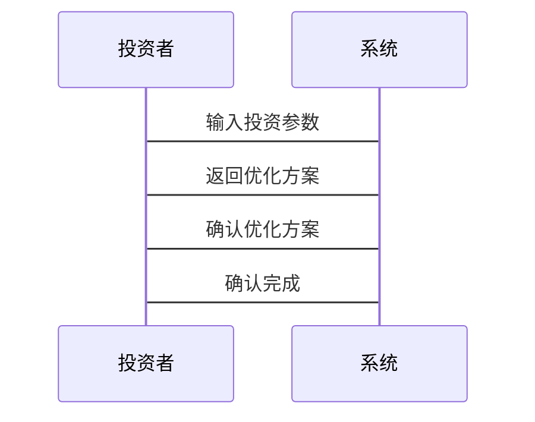

                 


# 特价股票投资中的跨境税务优化策略

## 关键词：特价股票投资、跨境税务优化、税务规划、税务 residency、税收协定、资本利得税

## 摘要：本文深入探讨了在特价股票投资中如何进行跨境税务优化，分析了主要税务类型、税务差异以及优化路径，提供了具体的案例分析和工具方法，帮助投资者合法降低税务负担，提升投资收益。

---

# 第一部分: 特价股票投资与跨境税务优化背景

# 第1章: 特价股票投资与跨境税务优化概述

## 1.1 特价股票投资的基本概念

### 1.1.1 特价股票的定义与特点

特价股票是指市场价格低于其内在价值的股票，通常具有较高的投资潜力。其特点包括：

- **低估性**：市场价格低于内在价值。
- **波动性**：价格波动较大，存在快速回升的可能。
- **高风险性**：通常属于风险较高的投资标的。
- **稀缺性**：市场中特价股票的数量有限，投资者需要精挑细选。

### 1.1.2 特价股票投资的核心要素

- **估值模型**：如DCF模型、市盈率（P/E）等。
- **市场环境**：宏观经济、行业趋势对股票价格的影响。
- **风险管理**：如何控制投资风险，避免重大损失。

### 1.1.3 特价股票投资的市场定位

特价股票通常出现在市场低迷时期，投资者需要具备较高的市场敏感性和分析能力，能够在市场底部发现潜在的价值股。

## 1.2 跨境税务优化的基本概念

### 1.2.1 跨境投资与税务的基本关系

跨境投资涉及多个国家的税务政策，投资者需要了解不同国家的税收法规，以合法降低税务负担。

### 1.2.2 跨境税务优化的定义与目标

跨境税务优化是指通过合理的税务规划，降低跨境投资中的税务成本，提高投资收益。其目标包括：

- **合法降低税负**：通过合理利用税收政策，减少税务支出。
- **优化投资结构**：通过调整投资结构，降低税务风险。
- **提高投资回报率**：通过税务优化，增加实际收益。

### 1.2.3 跨境税务优化的法律框架

- **国际税收协定**：避免双重征税，减少税务纠纷。
- **税收 residency**：确定投资者的税务居住地，影响税务负担。
- **各国税收政策**：不同国家的税率、税种差异显著，需合理利用。

## 1.3 特价股票投资中的跨境税务优化

### 1.3.1 特价股票投资与税务优化的结合点

- **投资标的的选择**：选择税率较低的国家进行投资。
- **税务 residency 的选择**：通过设立公司或信托结构，优化税务负担。
- **税务规划的时间性**：合理安排投资时间，避免高税率期。

### 1.3.2 跨境税务优化对投资收益的影响

- **直接影响**：降低税务支出，提高净收益。
- **间接影响**：优化投资结构，提高整体投资效率。
- **风险控制**：通过合理税务规划，降低税务合规风险。

### 1.3.3 特价股票投资中的税务风险与机会

- **税务风险**：不合规的税务规划可能导致税务罚款和法律风险。
- **税务机会**：合理利用税收政策，降低税务负担，提升投资回报。

## 1.4 本章小结

本章介绍了特价股票投资和跨境税务优化的基本概念，分析了两者之间的关系，并探讨了跨境税务优化对投资收益的影响。投资者需要充分理解税务政策，合理规划税务，以实现投资目标。

---

# 第2章: 特价股票投资中的税务问题分析

## 2.1 特价股票投资中的主要税务类型

### 2.1.1 股息税

股息税是指投资者因持有股票获得股息收入而需缴纳的税费。不同国家的股息税率差异显著，通常在0%到35%之间。

### 2.1.2 资本利得税

资本利得税是对股票买卖差价收益征税的税费。通常分为短期资本利得税和长期资本利得税，税率差异较大。

### 2.1.3 其他相关税费

包括印花税、遗产税等，不同国家和地区有不同的收费标准。

## 2.2 跨境投资中的税务差异

### 2.2.1 不同国家的税务政策对比

以美国、英国、新加坡为例：

| 国家 | 股息税 | 资本利得税 |
|------|--------|------------|
| 美国 | 0%-20% | 0%-23.5%   |
| 英国 | 0%-30% | 10%-28%    |
| 新加坡 | 0%-15% | 0%-22%     |

### 2.2.2 税收协定与双重征税的解决

通过签订税收协定，避免对同一收益双重征税，减少税务负担。

### 2.2.3 税务 residency 的重要性

税务 residency 是确定投资者税务身份的关键因素，影响税率和税务政策。

## 2.3 特价股票投资中的税务风险

### 2.3.1 税务合规性风险

不合规的税务规划可能导致税务罚款和法律风险。

### 2.3.2 税务规划的合法性边界

需在法律允许的范围内进行税务优化，避免触及税务违规红线。

### 2.3.3 税务政策变化的影响

各国税务政策的变化可能影响投资者的税务负担，需保持灵活性。

## 2.4 本章小结

本章分析了特价股票投资中的主要税务类型和跨境投资中的税务差异，强调了税务合规性和合法性的重要性。投资者需充分了解税务政策，合理规划税务。

---

# 第3章: 跨境税务优化的核心策略

## 3.1 跨境税务优化的基本原则

### 3.1.1 合法性原则

税务优化必须在法律框架内进行，避免违规风险。

### 3.1.2 经济性原则

税务优化应以降低税务成本、提高投资收益为目标。

### 3.1.3 可操作性原则

税务优化方案需具备实际操作性，避免过于复杂或难以实施。

## 3.2 特价股票投资中的税务优化路径

### 3.2.1 选择合适的税务 residency

通过设立公司或信托结构，选择税率较低的国家作为税务 residency。

### 3.2.2 合理利用税收协定

利用税收协定，避免双重征税，降低税务负担。

### 3.2.3 优化持股结构

通过合理持股结构，如家族信托或公司架构，降低税务负担。

## 3.3 跨境税务优化的工具与方法

### 3.3.1 税务计算器与模拟工具

使用税务计算器模拟不同投资结构下的税务负担，选择最优方案。

### 3.3.2 专业税务顾问的作用

聘请专业税务顾问，制定个性化税务优化方案。

### 3.3.3 税务规划文档的制定

制定详细的税务规划文档，记录税务策略和实施计划，确保合规性。

## 3.4 本章小结

本章提出了跨境税务优化的核心策略，包括选择合适的税务 residency、合理利用税收协定和优化持股结构。投资者需结合自身情况，制定合理的税务优化方案。

---

# 第4章: 特价股票投资中的税务规划案例分析

## 4.1 案例一：美国市场的税务优化

### 4.1.1 美国税务政策

- 股息税：0%-20%
- 资本利得税：0%-23.5%

### 4.1.2 税务优化路径

- 选择长期资本利得税率较低的州（如佛罗里达州）进行投资。
- 通过设立公司或信托结构，合理分配收益，降低税负。

## 4.2 案例二：新加坡市场的税务优化

### 4.2.1 新加坡税务政策

- 股息税：0%-15%
- 资本利得税：0%-22%

### 4.2.2 税务优化路径

- 利用新加坡的低税率环境，设立家族信托或公司结构。
- 合理分配投资收益，降低税务负担。

## 4.3 本章小结

本章通过具体案例分析，展示了如何在不同市场中进行税务优化，帮助投资者制定合理的税务策略。

---

# 第5章: 跨境税务优化的系统分析与架构设计

## 5.1 问题场景介绍

投资者需要在多个市场中进行特价股票投资，需优化税务结构，降低税负。

## 5.2 系统功能设计

- **税务计算器**：模拟不同投资结构下的税务负担。
- **税务规划工具**：提供个性化的税务优化方案。
- **税务合规性检查**：确保税务策略符合法律规定。

## 5.3 系统架构设计

使用分层架构：

1. **数据层**：存储各国税务政策数据。
2. **业务逻辑层**：进行税务计算和优化。
3. **用户界面层**：提供友好的操作界面。

## 5.4 系统接口设计

- **API接口**：与其他金融系统对接，获取实时数据。
- **用户接口**：提供查询、计算和优化功能。

## 5.5 系统交互设计

使用Mermaid序列图：



## 5.6 本章小结

本章通过系统分析与架构设计，提出了一个高效的税务优化系统，帮助投资者实现跨境税务优化。

---

# 第6章: 项目实战

## 6.1 环境安装

- **工具安装**：安装Python、Jupyter Notebook。
- **数据获取**：获取各国税务政策数据。

## 6.2 核心实现

```python
def calculate_tax(income, country):
    tax_rates = {
        '美国': 0.15,
        '英国': 0.20,
        '新加坡': 0.10
    }
    return income * tax_rates.get(country, 0.05)

# 示例计算
income = 100000
country = '美国'
print(f"{country}的税率为{calculate_tax(income, country)}")
```

## 6.3 应用解读

- **代码功能**：计算不同国家的税负。
- **结果分析**：不同国家的税率差异显著，需合理选择投资地点。

## 6.4 案例分析

- **案例一**：美国市场投资，税率为15%。
- **案例二**：新加坡市场投资，税率为10%。

## 6.5 本章小结

本章通过项目实战，展示了如何利用代码实现税务计算和优化，帮助投资者制定合理的税务策略。

---

# 第7章: 最佳实践与小结

## 7.1 小结

- **核心概念**：理解特价股票投资和跨境税务优化的基本概念。
- **优化策略**：合理选择税务 residency，利用税收协定，优化投资结构。
- **工具方法**：使用税务计算器和专业顾问，制定个性化税务优化方案。

## 7.2 注意事项

- **合法性**：税务优化必须在法律框架内进行。
- **风险控制**：合理评估税务风险，避免重大损失。
- **持续学习**：关注税务政策变化，及时调整优化策略。

## 7.3 拓展阅读

- **书籍推荐**：《国际税务规划》、《跨境投资税务优化》。
- **在线资源**：国际税务组织官网、专业税务论坛。

---

# 结语

通过本文的分析，投资者可以更好地理解特价股票投资中的跨境税务优化策略，制定合理的税务规划，提高投资收益。合理利用税务政策，优化投资结构，是实现长期投资目标的关键。

--- 

# 目录

1. [特价股票投资与跨境税务优化概述](#特价股票投资与跨境税务优化概述)
2. [特价股票投资中的税务问题分析](#特价股票投资中的税务问题分析)
3. [跨境税务优化的核心策略](#跨境税务优化的核心策略)
4. [特价股票投资中的税务规划案例分析](#特价股票投资中的税务规划案例分析)
5. [跨境税务优化的系统分析与架构设计](#跨境税务优化的系统分析与架构设计)
6. [项目实战](#项目实战)
7. [最佳实践与小结](#最佳实践与小结)

