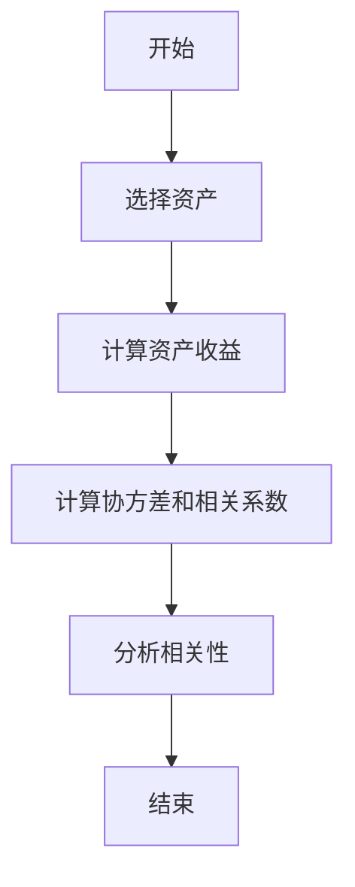
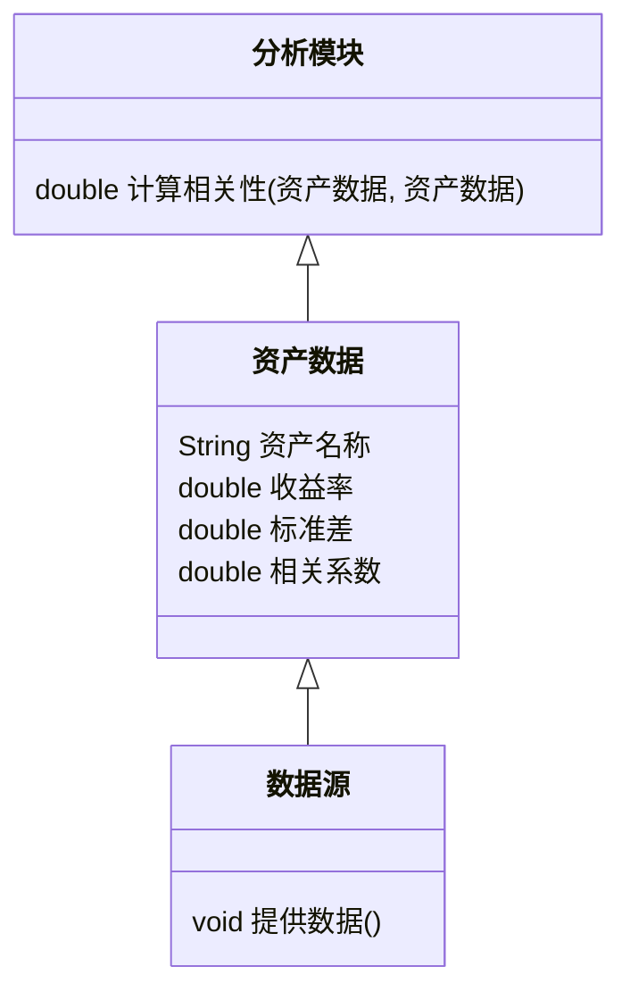
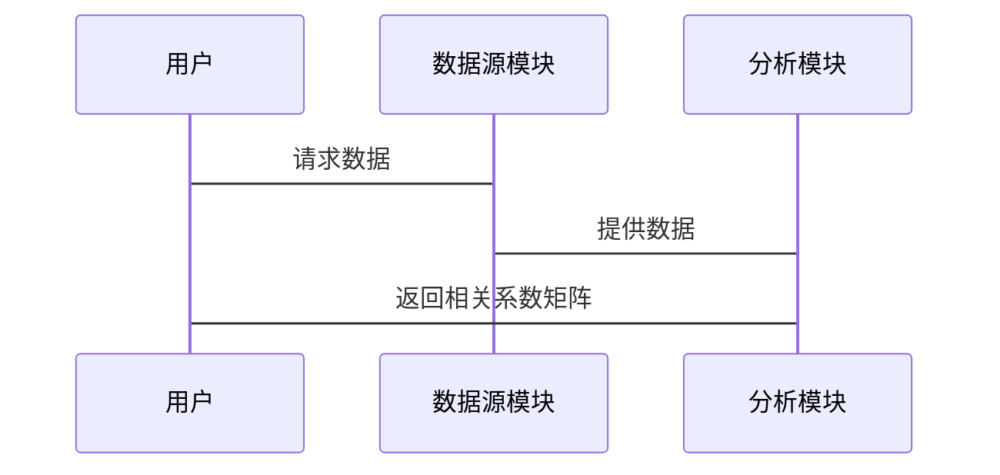

                 


# 特价股票投资中的跨资产类别相关性分析

## 关键词
特价股票，跨资产相关性，投资组合，风险控制，收益优化，资产配置

## 摘要
本文将深入探讨特价股票投资中的跨资产类别相关性分析，从背景介绍、核心概念、算法原理、系统设计、项目实战到最佳实践，全面解析如何通过跨资产相关性分析优化投资组合，降低风险，提升收益。通过本文的学习，读者将能够掌握跨资产相关性分析的核心原理和实际应用，为特价股票投资提供有力支持。

---

# 第一部分: 特价股票投资与跨资产相关性分析的背景

## 第1章: 特价股票投资的背景与概念

### 1.1 特价股票投资的定义与特点
#### 1.1.1 特价股票的定义
- 特价股票是指市场价格低于其内在价值的股票，通常被认为被市场低估。
- 特价股票的核心特点包括低估值、高潜在回报和较高的安全边际。

#### 1.1.2 特价股票投资的核心特点
- **低估值**：市场价格低于内在价值。
- **高潜在回报**：长期来看，低估资产有较大的上涨空间。
- **安全边际**：通过买入低于合理价值的资产，降低投资风险。

#### 1.1.3 特价股票与普通股票的区别
| 特性 | 特价股票 | 普通股票 |
|------|----------|----------|
| 价格 | 低于内在价值 | 接近或高于内在价值 |
| 风险 | 较低（由于安全边际） | 较高（市场波动较大） |
| 投资策略 | 价值投资为主 | 技术分析和短期交易为主 |

### 1.2 股票市场的基本概念
#### 1.2.1 股票市场的运作机制
- 股票市场是买卖股票的场所，包括一级市场和二级市场。
- 主要参与者包括投资者、上市公司、券商、交易所等。

#### 1.2.2 股票价格的波动规律
- 股票价格受多种因素影响，包括宏观经济、公司业绩、市场情绪等。
- 价格波动具有周期性，可以通过技术分析和基本面分析进行预测。

#### 1.2.3 投资者类型与市场角色
- **机构投资者**：如基金、保险公司，资金规模大，影响力强。
- **个人投资者**：数量众多，交易活跃，影响市场短期波动。
- **券商和交易所**：提供交易服务和市场流动性。

### 1.3 特价股票投资的背景与现状
#### 1.3.1 特价股票投资的兴起
- 价值投资理念的普及，尤其是受 Warren Buffett 等投资大师的影响。
- 经济周期波动导致部分股票价格被低估，为特价股票投资提供了机会。

#### 1.3.2 当前市场中的特价股票机会
- 经济下行周期中，部分行业和公司股票可能被市场过度抛售，出现低估。
- 特定行业（如金融、能源）在特定市场环境下可能出现特价股票。

#### 1.3.3 特价股票投资的挑战与风险
- 市场波动可能导致短期亏损。
- 识别真正低估的股票需要深入的分析和研究。
- 市场情绪的影响可能导致长期持有成本较高。

---

## 第2章: 跨资产类别相关性分析的必要性

### 2.1 资产类别概述
#### 2.1.1 股票、债券、基金等主要资产类别
- **股票**：代表公司所有权，风险较高，收益潜力大。
- **债券**：债务证券，收益相对稳定，风险较低。
- **基金**：通过集合资金投资多种资产，分散风险。

#### 2.1.2 不同资产类别的风险与收益特征
| 资产类别 | 风险 | 收益 |
|----------|------|------|
| 股票     | 高   | 高   |
| 债券     | 中   | 中   |
| 基金     | 低到中 | 中到高 |

#### 2.1.3 资产类别之间的相互影响
- 股票市场的波动会影响债券市场的收益率。
- 经济周期变化会导致不同资产类别的表现差异。

### 2.2 相关性分析的重要性
#### 2.2.1 相关性分析在投资组合中的作用
- 通过分析不同资产类别的相关性，可以优化投资组合的风险和收益。
- 相关性低的资产可以分散投资风险。

#### 2.2.2 跨资产相关性对风险控制的意义
- 通过跨资产相关性分析，可以避免过度集中于某一资产类别，降低整体风险。
- 相关性较低的资产组合能够更好地应对市场波动。

#### 2.2.3 跨资产相关性对收益优化的影响
- 相关性较高的资产组合在收益增长时可能同时面临较大的风险。
- 相关性较低的资产组合能够在不同市场环境下提供更稳定的收益。

### 2.3 特价股票与跨资产相关性的结合
#### 2.3.1 特价股票在跨资产相关性中的位置
- 特价股票作为股票市场的一部分，与其他资产类别（如债券、基金）的相关性较低。
- 在投资组合中加入特价股票可以降低整体风险。

#### 2.3.2 跨资产相关性对特价股票投资的启示
- 通过分析不同资产类别的相关性，可以在市场波动时调整投资策略。
- 在经济下行周期，债券和现金等低风险资产与股票的相关性较低，可以作为对冲工具。

#### 2.3.3 跨资产相关性分析的未来发展趋势
- 随着全球市场的互联互通，不同资产类别的相关性可能增加。
- 数据分析技术的进步将推动跨资产相关性分析的深度和广度。

---

# 第二部分: 跨资产类别相关性分析的核心概念与联系

## 第3章: 跨资产相关性分析的核心概念

### 3.1 资产相关性的基本原理
#### 3.1.1 资产相关性的定义
- 资产相关性是指不同资产价格变动之间的关系，通常用相关系数衡量。

#### 3.1.2 资产相关性的分类
- 正相关：资产价格变动方向相同。
- 负相关：资产价格变动方向相反。
- 零相关：资产价格变动无明显关系。

#### 3.1.3 资产相关性与投资组合风险的关系
- 正相关的资产组合风险较高。
- 负相关的资产组合风险较低。

### 3.2 资产相关性分析的数学模型
#### 3.2.1 协方差与相关系数的定义
- 协方差衡量两个资产收益变动的相似程度。
- 相关系数是标准化的协方差，取值范围在 -1 到 1 之间。

#### 3.2.2 协方差与相关系数的计算公式
协方差公式：
$$ \text{Cov}(X, Y) = E[(X - E[X])(Y - E[Y])] $$

相关系数公式：
$$ \rho_{X,Y} = \frac{\text{Cov}(X, Y)}{\sigma_X \sigma_Y} $$

其中，$\sigma_X$ 和 $\sigma_Y$ 分别是资产 $X$ 和 $Y$ 的标准差。

#### 3.2.3 相关系数的范围与意义
- 当 $\rho = 1$，完全正相关。
- 当 $\rho = -1$，完全负相关。
- 当 $\rho = 0$，无相关性。

### 3.3 资产相关性分析的流程图


### 3.4 资产类别相关性对比表格
| 资产类别 | 股票 | 债券 | 基金 |
|----------|------|------|------|
| 股票     | 1    | 0.2  | 0.7  |
| 债券     | 0.2  | 1    | 0.3  |
| 基金     | 0.7  | 0.3  | 1    |

---

## 第4章: 跨资产相关性分析的系统架构

### 4.1 系统功能设计
#### 4.1.1 领域模型（Mermaid 类图）


#### 4.1.2 系统架构设计（Mermaid 架构图）
```mermaid
container 资产相关性分析系统 {
    数据源模块
    分析模块
    展示模块
}
```

#### 4.1.3 接口设计
- 数据输入接口：接收不同资产类别的历史数据。
- 分析接口：调用相关性分析算法，返回相关系数矩阵。
- 展示接口：将分析结果以图形化方式展示。

#### 4.1.4 交互流程图


---

## 第5章: 项目实战与分析

### 5.1 项目实战
#### 5.1.1 环境安装
- 安装 Python 和相关库（如 numpy、pandas、matplotlib）。
- 安装 Jupyter Notebook 用于数据可视化。

#### 5.1.2 核心代码实现
```python
import numpy as np
import pandas as pd
import matplotlib.pyplot as plt

# 示例数据：不同资产的收益率
data = {
    '股票': [0.1, -0.02, 0.05, 0.02, -0.01],
    '债券': [0.02, 0.01, 0.0, -0.03, 0.0],
    '基金': [0.08, 0.0, 0.02, 0.05, -0.02]
}

df = pd.DataFrame(data)

# 计算相关系数矩阵
correlation_matrix = df.corr()

print("相关系数矩阵：")
print(correlation_matrix)

# 绘制相关性热力图
plt.figure(figsize=(8, 6))
plt.title('资产相关性热力图')
sns.heatmap(correlation_matrix, annot=True, cmap='coolwarm')
plt.show()
```

#### 5.1.3 代码解读与分析
- 使用 `pandas` 计算相关系数矩阵。
- 使用 `seaborn` 绘制热力图，直观展示相关性。

#### 5.1.4 实际案例分析
假设我们有一个包含股票、债券和基金的投资组合，通过计算它们的相关系数矩阵，可以发现：
- 股票和基金的相关性较高（0.7）。
- 债券与其他资产的相关性较低，适合作为对冲工具。

### 5.2 项目小结
- 通过实际案例分析，验证了跨资产相关性分析的有效性。
- 投资组合中加入低相关的资产可以有效降低整体风险。

---

## 第6章: 最佳实践与总结

### 6.1 小结
- 跨资产相关性分析是优化投资组合的重要工具。
- 通过合理配置不同资产类别，可以有效降低风险并提高收益。

### 6.2 注意事项
- 特价股票投资需要长期关注市场变化，避免短期波动影响判断。
- 相关性分析结果可能随市场环境变化而变化，需要定期更新数据。

### 6.3 拓展阅读
- 推荐阅读《投资学》（书籍）和《投资组合管理》（书籍）。
- 关注相关性分析的最新研究成果和市场应用。

---

通过以上内容，读者将能够全面理解特价股票投资中的跨资产类别相关性分析，并能够将其应用于实际投资中，优化投资组合，降低风险，实现收益最大化。

