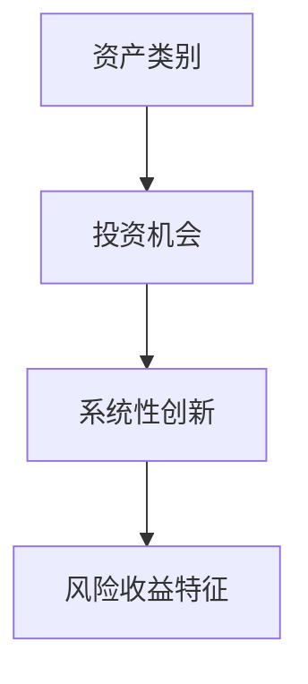
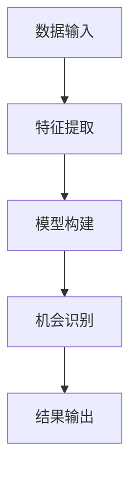
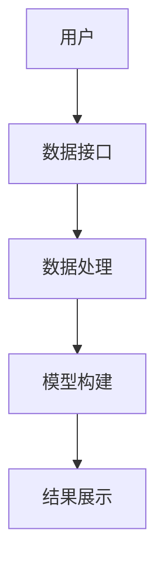

                 


```markdown
# 特价股票投资中的跨资产类别系统性创新机会识别

## 关键词：特价股票，跨资产类别，系统性创新机会，数据分析，机器学习算法

## 摘要：本文探讨了如何在特价股票投资中识别跨资产类别中的系统性创新机会。通过数据分析和机器学习算法，我们展示了如何系统地发现这些机会，优化投资组合，降低风险，并提高收益。

---

## 第一章：特价股票投资的背景与概念

### 1.1 特价股票的基本概念

#### 1.1.1 特价股票的定义与特点
- 特价股票是指价格低于面值的股票，通常具有较高的潜在收益。
- 特点包括高风险、高回报和流动性较低。

#### 1.1.2 特价股票的投资价值分析
- 投资者可能因公司重组或股价回升而获利。
- 需要分析公司基本面和市场趋势。

#### 1.1.3 特价股票与普通股票的差异
| 特性 | 特价股票 | 普通股票 |
|------|----------|----------|
| 价格 | 低于面值 | 靠近面值  | 
| 风险 | 较高     | 较低     |
| 收益 | 高潜力   | 稳定      |

### 1.2 跨资产类别投资的背景

#### 1.2.1 跨资产类别投资的定义
- 涵盖股票、债券、基金等多种资产，分散风险。

#### 1.2.2 跨资产类别投资的优势
- 分散投资，降低风险。
- 利用不同资产的波动性优化收益。

#### 1.2.3 跨资产类别投资的现状与趋势
- 全球化和金融创新推动了跨资产投资的发展。

### 1.3 系统性创新机会识别的必要性

#### 1.3.1 系统性创新的定义
- 系统性创新指通过系统方法发现和利用机会。

#### 1.3.2 系统性创新在投资中的作用
- 提高投资决策的科学性和准确性。

#### 1.3.3 系统性创新机会识别的核心要素
- 数据分析、模型构建和实时监控。

---

## 第二章：跨资产类别投资的核心概念与联系

### 2.1 跨资产类别投资的系统性创新框架

#### 2.1.1 系统性创新框架的构成
- 数据采集、分析、建模和优化。

#### 2.1.2 跨资产类别在系统性创新中的角色
- 桥接不同资产，发现协同效应。

#### 2.1.3 系统性创新与跨资产类别的协同效应
- 综合分析各资产类别，发现潜在机会。

### 2.2 跨资产类别投资的系统性创新机会识别原理

#### 2.2.1 数据特征分析
- 通过数据挖掘提取关键特征。

#### 2.2.2 多资产协同效应
- 利用资产间的相互作用优化投资组合。

#### 2.2.3 系统性创新机会的量化评估
- 使用数学模型评估风险和收益。

### 2.3 跨资产类别投资的系统性创新机会识别的ER实体关系图



---

## 第三章：跨资产类别投资的系统性创新机会识别算法原理

### 3.1 数据特征提取与分析

#### 3.1.1 数据特征提取方法
- 使用统计方法和机器学习算法提取特征。

#### 3.1.2 数据特征分析的数学模型
- 使用线性回归分析相关性。

#### 3.1.3 数据特征分析的Python代码实现

```python
import pandas as pd
import numpy as np

# 示例数据
data = {
    '资产类别': ['股票', '债券', '基金'],
    '收益': [0.1, 0.05, 0.08],
    '风险': [0.2, 0.1, 0.15]
}
df = pd.DataFrame(data)
print(df.corr())
```

### 3.2 系统性创新机会识别的算法流程

#### 3.2.1 算法流程图



---

## 第四章：跨资产类别投资的系统性创新机会识别的数学模型

### 4.1 数学模型

#### 4.1.1 使用CAPM模型进行评估

$$ E(r_i) = r_f + \beta_i (r_m - r_f) $$

其中：
- \( E(r_i) \) 是资产i的预期收益。
- \( r_f \) 是无风险利率。
- \( \beta_i \) 是资产i的贝塔系数。
- \( r_m \) 是市场预期收益。

### 4.2 实际案例分析

#### 4.2.1 案例分析

假设我们有三支资产，分别计算其预期收益和风险，选择最优组合。

---

## 第五章：跨资产类别投资的系统性创新机会识别的系统分析与架构设计

### 5.1 项目背景

#### 5.1.1 项目背景介绍
- 本项目旨在优化投资组合，识别跨资产机会。

### 5.2 系统功能设计

#### 5.2.1 领域模型


### 5.3 系统架构设计

#### 5.3.1 系统架构图



---

## 第六章：跨资产类别投资的系统性创新机会识别的项目实战

### 6.1 环境安装

#### 6.1.1 安装Python和相关库
- 安装Python和Pandas、NumPy、Scikit-learn。

### 6.2 系统核心实现源代码

#### 6.2.1 核心代码实现

```python
import pandas as pd
from sklearn.ensemble import RandomForestRegressor

# 数据加载
data = pd.read_csv('assets.csv')

# 特征选择
features = ['资产类别', '收益']
target = '风险'

# 模型训练
model = RandomForestRegressor()
model.fit(data[features], data[target])

# 预测
new_data = pd.DataFrame({
    '资产类别': ['股票'],
    '收益': [0.1]
})
prediction = model.predict(new_data[features])
print("预测风险:", prediction[0])
```

### 6.3 代码应用解读与分析

- 加载数据并选择特征。
- 使用随机森林模型训练。
- 预测新资产的风险。

### 6.4 实际案例分析

#### 6.4.1 案例分析

分析某资产的预测风险，调整投资组合。

### 6.5 项目小结

- 项目展示了如何使用机器学习模型识别跨资产机会。
- 强调数据质量和模型选择的重要性。

---

## 第七章：跨资产类别投资的系统性创新机会识别的最佳实践

### 7.1 总结

- 系统性创新是跨资产投资的关键。
- 数据分析和机器学习算法是核心工具。

### 7.2 注意事项

- 数据质量影响结果准确性。
- 模型需定期更新以适应市场变化。

### 7.3 拓展阅读

- 推荐阅读《机器学习在金融中的应用》和《系统性风险管理》。

---

## 结语

通过系统性创新机会识别，投资者可以在跨资产类别中发现潜在的特价股票投资机会，优化投资组合，实现稳健收益。
```

