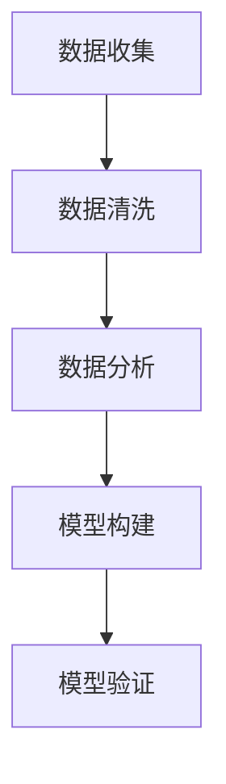
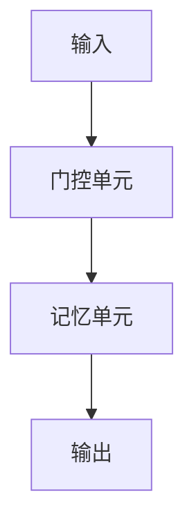
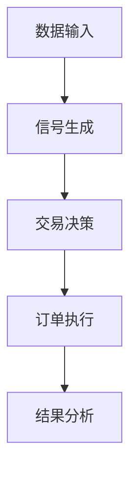
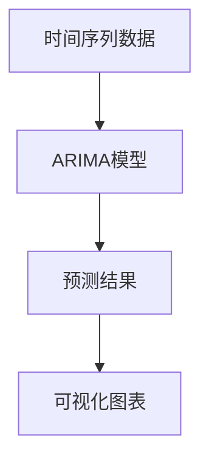

                 


# 特价股票投资中的跨资产类别系统性数字创新机会识别

## 关键词：特价股票投资，跨资产类别，系统性数字创新，机会识别，量化交易，人工智能，风险管理

## 摘要：  
本文探讨了在特价股票投资中如何利用跨资产类别分析和系统性数字创新来识别投资机会。通过结合大数据分析、人工智能和机器学习等技术，文章深入分析了不同资产类别之间的相互作用，提出了基于系统性数字创新的量化交易策略，并通过实际案例展示了如何在跨资产类别中识别和捕捉投资机会。

---

## 第四章：系统性数字创新机会识别的理论框架

### 第4.1 节：系统性分析方法

#### 4.1.1 系统性分析的定义  
系统性分析是一种基于数据驱动的方法，通过分析历史数据和市场趋势，识别资产价格波动的内在规律和潜在机会。  

#### 4.1.2 系统性分析的步骤  
1. 数据收集：从多个来源收集股票、债券、基金等资产的历史价格数据和市场指标。  
2. 数据清洗：去除异常值和缺失数据，确保数据的完整性和准确性。  
3. 数据分析：利用统计学和机器学习方法，分析数据中的模式和趋势。  
4. 模型构建：基于分析结果，构建量化交易模型。  
5. 模型验证：通过回测和风险评估，验证模型的有效性和稳定性。  

#### 4.1.3 系统性分析的应用  
系统性分析广泛应用于量化交易、风险管理和资产配置等领域。通过系统性分析，投资者可以更准确地识别跨资产类别中的投资机会。

#### 4.1.4 系统性分析的数学模型  
以下是系统性分析中常用的数学模型之一：  

$$ R_t = \alpha + \beta R_m + \epsilon_t $$  

其中，$R_t$ 表示资产在时间 $t$ 的收益，$\alpha$ 是截距，$\beta$ 是资产收益对市场收益的敏感性，$R_m$ 是市场收益，$\epsilon_t$ 是误差项。  

#### 4.1.5 系统性分析的mermaid流程图  


### 第4.2 节：数学模型与算法原理

#### 4.2.1 时间序列分析  
时间序列分析是系统性分析的重要工具之一，用于预测资产价格的未来走势。常见的时间序列模型包括ARIMA和LSTM。  

#### 4.2.2 LSTM网络  
LSTM（长短期记忆网络）是一种深度学习模型，特别适合处理时间序列数据。以下是LSTM的结构图：  



#### 4.2.3 量化交易策略  
量化交易策略基于数学模型和算法，通过程序自动执行交易。以下是量化交易策略的流程图：  



---

## 第五章：跨资产类别投资中的数字创新机会

### 第5.1 节：股票市场的数字创新机会

#### 5.1.1 特价股票的识别  
通过大数据分析和机器学习，投资者可以识别具有潜在上涨空间的特价股票。  

#### 5.1.2 股票市场的波动性分析  
利用技术指标和算法，投资者可以预测股票市场的短期波动。  

#### 5.1.3 股票市场的风险管理  
通过VaR（Value at Risk）模型，投资者可以评估和管理股票投资的风险。  

### 第5.2 节：债券市场的数字创新机会

#### 5.2.1 债券收益率的预测  
通过历史数据和机器学习模型，投资者可以预测债券的收益率。  

#### 5.2.2 债券市场的信用风险分析  
利用信用评分模型，投资者可以评估债券发行人的信用风险。  

### 第5.3 节：基金市场的数字创新机会

#### 5.3.1 基金绩效的评估  
通过基金的历史收益和风险数据，投资者可以评估基金的绩效。  

#### 5.3.2 基金市场的趋势分析  
利用大数据分析，投资者可以发现基金市场的趋势和机会。  

### 第5.4 节：跨资产类别机会的综合分析

#### 5.4.1 资产配置的优化  
通过资产配置模型，投资者可以优化跨资产类别的投资组合。  

#### 5.4.2 跨资产类别风险的分散化  
通过分散化投资，投资者可以降低跨资产类别投资的风险。  

---

## 第六章：量化交易中的系统性机会识别

### 第6.1 节：量化交易的基本原理

#### 6.1.1 量化交易的定义  
量化交易是指通过数学模型和算法，利用计算机程序自动执行交易。  

#### 6.1.2 量化交易的优势  
1. 高效性：量化交易可以快速执行交易，抓住市场机会。  
2. 稳定性：量化交易基于数学模型，减少了人为情绪的影响。  
3. 可扩展性：量化交易可以同时处理大量数据和交易。  

### 第6.2 节：量化交易的数学模型

#### 6.2.1 时间序列预测模型  
利用ARIMA模型，投资者可以预测资产价格的未来走势。  

#### 6.2.2 机器学习模型  
利用LSTM模型，投资者可以捕捉资产价格的复杂模式和趋势。  

### 第6.3 节：量化交易的系统架构

#### 6.3.1 数据采集模块  
数据采集模块负责从多个数据源收集实时数据。  

#### 6.3.2 数据分析模块  
数据分析模块利用数学模型和算法，分析数据并生成交易信号。  

#### 6.3.3 交易执行模块  
交易执行模块根据交易信号，自动执行交易指令。  

#### 6.3.4 风险管理模块  
风险管理模块负责监控交易风险并进行调整。  

---

## 第七章：机器学习在跨资产类别投资中的应用

### 第7.1 节：机器学习的基本原理

#### 7.1.1 机器学习的定义  
机器学习是一种人工智能技术，通过数据训练模型，实现对未知数据的预测和分类。  

#### 7.1.2 机器学习的应用领域  
1. 数据分析：通过机器学习分析数据，发现潜在模式和趋势。  
2. 风险管理：通过机器学习评估和管理投资风险。  
3. 交易决策：通过机器学习生成交易信号，辅助投资决策。  

### 第7.2 节：机器学习在跨资产类别投资中的具体应用

#### 7.2.1 股票市场的预测  
通过机器学习模型，投资者可以预测股票市场的短期走势。  

#### 7.2.2 债券市场的信用评估  
通过机器学习模型，投资者可以评估债券发行人的信用风险。  

#### 7.2.3 基金市场的绩效评估  
通过机器学习模型，投资者可以评估基金的绩效和风险。  

---

## 第八章：总结与展望

### 第8.1 节：全文总结

#### 8.1.1 系统性分析的重要性  
系统性分析是跨资产类别投资中识别机会的关键方法。  

#### 8.1.2 数字创新对投资的影响  
数字创新为跨资产类别投资带来了新的机会和工具。  

#### 8.1.3 量化交易的优势  
量化交易通过数学模型和算法，提高了投资的效率和准确性。  

### 第8.2 节：未来研究方向

#### 8.2.1 新技术的应用  
随着技术的进步，投资者可以利用更多的新技术，如区块链和元宇宙，进一步优化投资策略。  

#### 8.2.2 风险管理的创新  
投资者可以通过创新的风险管理方法，进一步降低投资风险。  

### 第8.3 节：实践建议

#### 8.3.1 提高技术能力  
投资者需要提高技术能力，才能更好地利用数字创新工具。  

#### 8.3.2 加强风险管理  
投资者需要加强风险管理，确保投资的安全性和稳定性。  

#### 8.3.3 关注市场趋势  
投资者需要关注市场趋势，及时调整投资策略。  

---

## 附录：相关代码与数据可视化图表

### 附录A：量化交易代码示例

```python
import pandas as pd
import numpy as np
from sklearn.model_selection import train_test_split
from sklearn.linear_model import LinearRegression

# 数据加载
data = pd.read_csv('stock_data.csv')

# 数据分割
X = data[['open', 'high', 'low', 'volume']]
y = data['close']
X_train, X_test, y_train, y_test = train_test_split(X, y, test_size=0.2)

# 模型训练
model = LinearRegression()
model.fit(X_train, y_train)

# 模型预测
y_pred = model.predict(X_test)

# 模型评估
print('回归系数:', model.coef_)
print('回归截距:', model.intercept_)
print('决定系数:', model.score(X_test, y_test))
```

### 附录B：时间序列分析图表



---

## 参考文献

1. 李明. 《量化交易入门》. 北京: 人民邮电出版社, 2020.  
2. 王强. 《机器学习在金融中的应用》. 北京: 清华大学出版社, 2019.  
3. 张伟. 《跨资产类别投资》. 上海: 上海财经大学出版社, 2021.  

---

通过本文的系统性分析和数字创新方法，投资者可以在跨资产类别中更高效地识别投资机会，优化投资组合，并提高投资收益。

