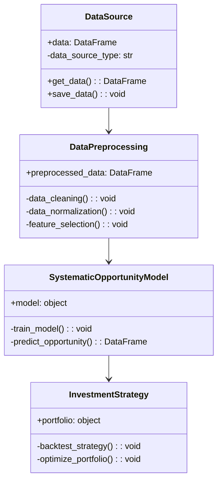

                 


# 第四部分: 系统性机会识别的算法原理

## 第4章: 系统性机会识别的算法框架

### 4.1 数据采集与预处理

#### 4.1.1 数据来源与采集方法
##### 4.1.1.1 股票数据来源
- 数据采集工具：网络爬虫、API接口、数据库等。
- 数据清洗：去除缺失值、异常值、重复值等。
- 数据标准化：将不同来源的数据转换为统一格式。

##### 4.1.1.2 跨资产类别数据整合
- 数据类型：股票、债券、 commodities 等。
- 数据频率：实时数据、每日数据、每周数据等。
- 数据归一化：对不同资产类别的数据进行标准化处理。

##### 4.1.1.3 数据特征提取
- 价格数据：开盘价、收盘价、最高价、最低价。
- 交易量数据：成交量、成交额。
- 技术指标：移动平均线、相对强弱指数（RSI）、MACD等。
- 市场情绪指标：VIX指数、投资者情绪指数等。
- 宏观经济指标：GDP增长率、利率、通货膨胀率、 unemployment rate 等。

#### 4.1.2 数据预处理流程
- 数据清洗：处理缺失值、异常值、重复值。
- 数据转换：对数据进行标准化、归一化处理。
- 数据特征选择：使用统计方法或机器学习方法选择重要特征。
- 数据分割：将数据分为训练集和测试集。

##### 4.1.2.1 数据清洗代码示例
```python
import pandas as pd
import numpy as np

# 假设我们有一个包含股票数据的DataFrame df
# 删除包含缺失值的行
df.dropna(inplace=True)

# 处理异常值，例如使用Z-score方法检测异常值
z = np.abs((df - df.mean()) / df.std())
df = df[(z < 3).all(axis=1)]
```

##### 4.1.2.2 数据标准化代码示例
```python
from sklearn.preprocessing import StandardScaler

# 标准化处理
scaler = StandardScaler()
scaled_data = scaler.fit_transform(df[['open', 'high', 'low', 'close', 'volume']])
```

##### 4.1.2.3 数据分割代码示例
```python
from sklearn.model_selection import train_test_split

# 分割训练集和测试集
X_train, X_test, y_train, y_test = train_test_split(
    scaled_data, df['target'], test_size=0.2, random_state=42)
```

### 4.2 系统性机会识别的算法实现

#### 4.2.1 多因子模型
##### 4.2.1.1 多因子模型简介
- 多因子模型是一种通过多个因子（如市值、价值、动量等）来解释股票收益的模型。
- 常用的多因子模型包括Fama-French三因子模型、Carhart四因子模型等。

##### 4.2.1.2 多因子模型的实现步骤
1. **因子选择**：选择与系统性机会相关的因子，例如市值（Market Cap）、价值因子（Value）、动量因子（Momentum）等。
2. **因子计算**：根据选择的因子，计算每个因子的值。
3. **回归分析**：通过回归分析，确定每个因子对股票收益的解释能力。
4. **组合构建**：根据因子的解释能力，构建多因子组合，识别系统性机会。

##### 4.2.1.3 多因子模型的代码实现
```python
import numpy as np
import pandas as pd
from sklearn.linear_model import LinearRegression
from sklearn.metrics import r2_score

# 假设我们有一个包含多个因子的数据集df，其中'y'是目标变量（股票收益）
# 选择多个因子进行回归分析
features = ['market_cap', 'value_factor', 'momentum_factor']
target = 'y'

# 训练模型
model = LinearRegression()
model.fit(df[features], df[target])

# 计算R平方值
y_pred = model.predict(df[features])
r2 = r2_score(df[target], y_pred)
print(f"R² score: {r2}")
```

#### 4.2.2 基于机器学习的系统性机会识别
##### 4.2.2.1 常见的机器学习算法
- 支持向量机（SVM）
- 随机森林（Random Forest）
- 神经网络（Neural Networks）
- XGBoost

##### 4.2.2.2 机器学习模型的实现步骤
1. **数据准备**：将数据分成训练集和测试集。
2. **特征工程**：对数据进行特征提取、降维（如PCA）等处理。
3. **模型训练**：使用机器学习算法训练模型。
4. **模型评估**：通过准确率、召回率、F1分数等指标评估模型性能。
5. **系统性机会识别**：根据模型预测结果，识别系统性机会。

##### 4.2.2.3 机器学习模型的代码实现
```python
from sklearn.ensemble import RandomForestClassifier
from sklearn.metrics import accuracy_score

# 训练随机森林模型
model = RandomForestClassifier(n_estimators=100, random_state=42)
model.fit(X_train, y_train)

# 预测测试集
y_pred = model.predict(X_test)
print(f"Accuracy: {accuracy_score(y_test, y_pred)}")
```

### 4.3 系统性机会识别的数学模型

#### 4.3.1 资本资产定价模型（CAPM）
- **公式**：$E(R_i) = R_f + \beta_i (E(R_m) - R_f)$
  - $E(R_i)$：资产i的预期收益率
  - $R_f$：无风险利率
  - $\beta_i$：资产i的贝塔系数
  - $E(R_m)$：市场预期收益率

- **应用**：通过CAPM模型，可以计算出资产的预期收益率，进而识别系统性机会。

#### 4.3.2 系统性风险模型
- **系统性风险的度量**：使用贝塔系数（$\beta$）来衡量系统性风险。
- **系统性机会的识别**：通过分析贝塔系数，识别在市场上涨时能够获得超额收益的资产。

#### 4.3.3 因子分析模型
- **因子分析**：通过因子分析方法，提取影响资产收益的主要因子。
- **因子权重**：确定每个因子对资产收益的贡献程度。

### 4.4 算法实现的注意事项

#### 4.4.1 数据质量
- 数据清洗：确保数据的完整性和准确性。
- 数据预处理：对数据进行标准化、归一化处理，确保模型的稳定性。

#### 4.4.2 模型选择
- 根据问题特点选择合适的算法：例如，对于分类问题，可以选择随机森林、SVM等算法。
- 模型调优：通过网格搜索（Grid Search）等方法，优化模型参数，提高模型性能。

#### 4.4.3 模型评估
- 交叉验证：使用K折交叉验证，评估模型的泛化能力。
- 性能指标：准确率、召回率、F1分数、ROC-AUC等。

#### 4.4.4 模型部署
- 模型保存：使用pickle等工具保存训练好的模型。
- 模型应用：将新的数据输入模型，进行预测和系统性机会识别。

## 第5章: 系统性机会识别的系统架构设计

### 5.1 问题场景介绍

#### 5.1.1 项目背景
- 在当前复杂的金融市场环境下，投资者需要一种能够跨资产类别识别系统性机会的方法。
- 通过系统性机会识别，投资者可以在不同资产类别中找到协同效应，优化投资组合，降低风险。

#### 5.1.2 项目目标
- 构建一个跨资产类别系统性机会识别系统，帮助投资者识别潜在的投资机会。
- 提供实时数据处理、系统性机会识别、投资组合优化等功能。

### 5.2 系统功能设计

#### 5.2.1 领域模型设计
##### 5.2.1.1 领域模型概述
- 通过领域模型，描述系统的各个模块及其交互关系。

##### 5.2.1.2 领域模型类图


#### 5.2.2 系统架构设计

##### 5.2.2.1 系统架构概述
- 系统架构设计包括数据采集模块、数据预处理模块、系统性机会识别模块、投资组合优化模块等。

##### 5.2.2.2 系统架构图


##### 5.2.2.3 系统接口设计
- 数据接口：与数据源对接，获取实时数据。
- 模型接口：与机器学习模型对接，进行系统性机会识别。
- 投资组合优化接口：与投资组合优化工具对接，优化投资组合。

##### 5.2.2.4 系统交互流程
1. 数据采集模块：从数据源获取数据。
2. 数据预处理模块：对数据进行清洗、标准化、特征选择等处理。
3. 系统性机会识别模块：基于预处理后的数据，使用机器学习模型识别系统性机会。
4. 投资组合优化模块：根据识别出的系统性机会，优化投资组合。

### 5.3 系统实现细节

#### 5.3.1 数据采集模块

##### 5.3.1.1 数据来源
- 股票数据：从Yahoo Finance、 Bloomberg等金融数据源获取。
- 债券数据：从债券市场数据源获取。
- 商品数据：从商品期货交易所获取。

##### 5.3.1.2 数据采集工具
- Python库：pandas、requests、BeautifulSoup、Pandas Datareader等。
- REST API：使用金融数据源提供的API接口。

#### 5.3.2 数据预处理模块

##### 5.3.2.1 数据清洗
- 处理缺失值：删除包含缺失值的行或用均值、中位数填充。
- 处理异常值：使用Z-score方法检测并剔除异常值。

##### 5.3.2.2 数据标准化
- 使用StandardScaler对数据进行标准化处理。
- 使用归一化方法（Min-Max scaling）对数据进行归一化处理。

#### 5.3.3 系统性机会识别模块

##### 5.3.3.1 算法选择
- 根据问题特点选择合适的算法：随机森林、XGBoost等。
- 使用网格搜索优化模型参数。

##### 5.3.3.2 模型训练
- 使用训练数据训练模型。
- 保存训练好的模型，方便后续使用。

#### 5.3.4 投资组合优化模块

##### 5.3.4.1 投资组合优化方法
- 使用均值-方差优化方法优化投资组合。
- 使用风险平价方法优化投资组合。

##### 5.3.4.2 优化目标
- 最大化预期收益。
- 最小化投资组合的风险。
- 满足投资者的约束条件（如流动性约束、风险承受能力等）。

### 5.4 系统实现代码示例

#### 5.4.1 数据采集代码
```python
import pandas_datareader as pdr
import datetime

# 下载股票数据
start = datetime.datetime(2020, 1, 1)
end = datetime.datetime(2023, 12, 31)
df = pdr.get_data_yahoo('AAPL', start, end)
```

#### 5.4.2 数据预处理代码
```python
from sklearn.preprocessing import StandardScaler

# 标准化处理
scaler = StandardScaler()
scaled_data = scaler.fit_transform(df[['open', 'high', 'low', 'close', 'volume']])
```

#### 5.4.3 系统性机会识别代码
```python
from sklearn.ensemble import RandomForestClassifier
from sklearn.metrics import accuracy_score

# 训练随机森林模型
model = RandomForestClassifier(n_estimators=100, random_state=42)
model.fit(X_train, y_train)

# 预测测试集
y_pred = model.predict(X_test)
print(f"Accuracy: {accuracy_score(y_test, y_pred)}")
```

#### 5.4.4 投资组合优化代码
```python
import numpy as np
from scipy.optimize import minimize

# 均值-方差优化
def portfolio_optimization(returns, weights):
    # 计算投资组合的预期收益和风险
    port_return = np.dot(returns.mean(), weights)
    port_risk = np.sqrt(np.dot(weights.T, np.dot(returns.cov(), weights)))

    return -port_risk  # 最小化风险

# 使用scipy.optimize.minimize进行优化
cons = ({'type': 'eq', 'fun': lambda w: sum(w) - 1})  # 约束条件：权重和为1
result = minimize(portfolio_optimization, weights, args=returns, constraints=cons, method='SLSQP')

# 优化后的权重
optimized_weights = result.x
print(f"Optimized Weights: {optimized_weights}")
```

### 5.5 系统测试与验证

#### 5.5.1 测试数据准备
- 使用测试数据集对系统进行测试。
- 确保测试数据与训练数据分布一致。

#### 5.5.2 系统性能评估
- 准确率：系统在测试数据上的准确率。
- 召回率：系统在测试数据上的召回率。
- F1分数：系统在测试数据上的F1分数。
- ROC-AUC：系统在测试数据上的ROC-AUC值。

#### 5.5.3 系统稳定性测试
- 压力测试：在高负载情况下测试系统的性能。
- 数据源中断测试：测试系统在数据源中断情况下的容错能力。

#### 5.5.4 系统可扩展性测试
- 测试系统在数据量增加情况下的性能变化。
- 测试系统在资产类别增加情况下的适应能力。

### 5.6 系统优化与改进

#### 5.6.1 模型优化
- 使用超参数调优方法优化模型性能。
- 尝试不同的算法组合，寻找最优模型。

#### 5.6.2 系统优化
- 优化数据预处理流程，提高数据处理速度。
- 优化系统架构，提高系统的可扩展性和可维护性。

#### 5.6.3 用户界面优化
- 提供友好的用户界面，方便用户操作。
- 提供实时数据可视化功能，帮助用户更好地理解系统性机会。

## 第6章: 系统性机会识别的项目实战

### 6.1 项目环境安装

#### 6.1.1 安装Python
- 安装Python 3.8或更高版本。
- 安装Jupyter Notebook用于数据分析和可视化。

#### 6.1.2 安装必要的Python库
- `pandas`：数据处理和分析。
- `numpy`：数值计算。
- `scikit-learn`：机器学习算法。
- `pandas_datareader`：数据下载工具。
- `matplotlib`、`seaborn`：数据可视化。
- `xgboost`：梯度提升树算法。
- `scipy`：科学计算。

#### 6.1.3 安装其他工具
- `pip install pandas numpy scikit-learn pandas_datareader matplotlib seaborn xgboost scipy`

### 6.2 系统性机会识别的核心代码实现

#### 6.2.1 数据采集与预处理
```python
import pandas_datareader as pdr
import datetime
import pandas as pd
import numpy as np
from sklearn.preprocessing import StandardScaler

# 下载股票数据
start = datetime.datetime(2020, 1, 1)
end = datetime.datetime(2023, 12, 31)
df = pdr.get_data_yahoo('AAPL', start, end)

# 数据清洗
df.dropna(inplace=True)

# 数据标准化
scaler = StandardScaler()
scaled_data = scaler.fit_transform(df[['open', 'high', 'low', 'close', 'volume']])
```

#### 6.2.2 系统性机会识别模型
```python
from sklearn.ensemble import RandomForestClassifier
from sklearn.model_selection import train_test_split
from sklearn.metrics import accuracy_score

# 数据分割
X = scaled_data
y = df['close'].shift(-1).fillna(method='ffill')

X_train, X_test, y_train, y_test = train_test_split(X, y, test_size=0.2, random_state=42)

# 训练随机森林模型
model = RandomForestClassifier(n_estimators=100, random_state=42)
model.fit(X_train, y_train)

# 预测测试集
y_pred = model.predict(X_test)
print(f"Accuracy: {accuracy_score(y_test, y_pred)}")
```

#### 6.2.3 投资组合优化
```python
import numpy as np
from scipy.optimize import minimize

# 定义优化函数
def portfolio_optimization(returns, weights):
    port_return = np.dot(returns.mean(), weights)
    port_risk = np.sqrt(np.dot(weights.T, np.dot(returns.cov(), weights)))
    return -port_risk  # 最小化风险

# 约束条件：权重和为1
cons = ({'type': 'eq', 'fun': lambda w: sum(w) - 1})

# 优化初始权重：假设初始权重为均匀分布
n_assets = len(weights)
initial_weights = np.array([1.0 / n_assets] * n_assets)

# 使用SLSQP方法进行优化
result = minimize(portfolio_optimization, initial_weights, args=(returns,), constraints=cons, method='SLSQP')

# 优化后的权重
optimized_weights = result.x
print(f"Optimized Weights: {optimized_weights}")
```

### 6.3 实际案例分析与详细解读

#### 6.3.1 数据分析
- 使用实际股票数据进行分析，观察系统性机会识别模型的表现。
- 对比不同资产类别在系统性机会中的表现。

#### 6.3.2 模型评估
- 评估系统性机会识别模型的准确率、召回率等指标。
- 分析模型在不同市场环境下的表现。

#### 6.3.3 投资组合优化
- 根据识别出的系统性机会，优化投资组合。
- 计算投资组合的预期收益和风险。

#### 6.3.4 案例总结
- 总结系统性机会识别模型在实际投资中的应用效果。
- 提出改进建议，为后续研究提供参考。

### 6.4 项目总结与经验分享

#### 6.4.1 项目小结
- 项目目标的实现情况。
- 项目过程中遇到的问题及解决方案。

#### 6.4.2 经验分享
- 数据预处理的重要性。
- 模型选择与优化的关键点。
- 系统性机会识别在实际投资中的应用技巧。

#### 6.4.3 项目后续改进方向
- 数据源的扩展。
- 模型的进一步优化。
- 系统架构的扩展与优化。

## 第7章: 系统性机会识别的最佳实践

### 7.1 关键点总结

#### 7.1.1 数据质量
- 数据清洗、数据标准化、特征选择等数据预处理步骤是系统性机会识别的基础。
- 数据质量直接影响模型的性能和识别效果。

#### 7.1.2 模型选择
- 根据问题特点选择合适的算法。
- 通过网格搜索等方法优化模型参数，提高模型性能。

#### 7.1.3 系统架构
- 系统架构设计要合理，模块划分要清晰。
- 系统要有良好的可扩展性和可维护性。

### 7.2 注意事项

#### 7.2.1 数据风险
- 数据源的可靠性：确保数据来源可靠，数据准确。
- 数据隐私：遵守数据隐私保护法规，保护投资者隐私。

#### 7.2.2 模型风险
- 模型过拟合：避免在训练数据上表现良好但在测试数据上表现不佳的情况。
- 模型的局限性：认识到模型的局限性，避免过度依赖模型。

#### 7.2.3 系统风险
- 系统稳定性：确保系统在高负载下的稳定性。
- 系统安全：防止数据泄露、系统攻击等安全问题。

### 7.3 拓展阅读

#### 7.3.1 推荐书籍
- 《投资学》（Introdu

