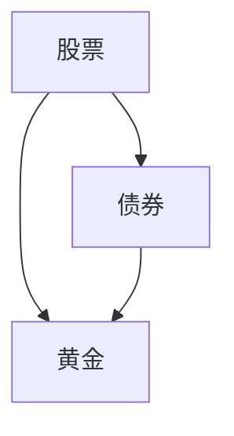
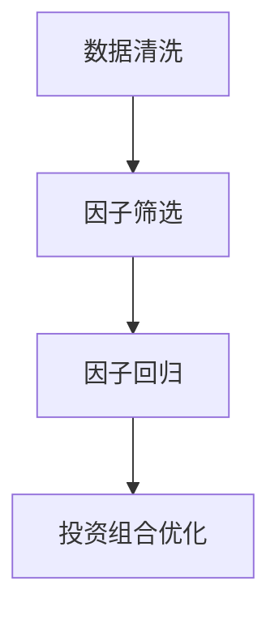
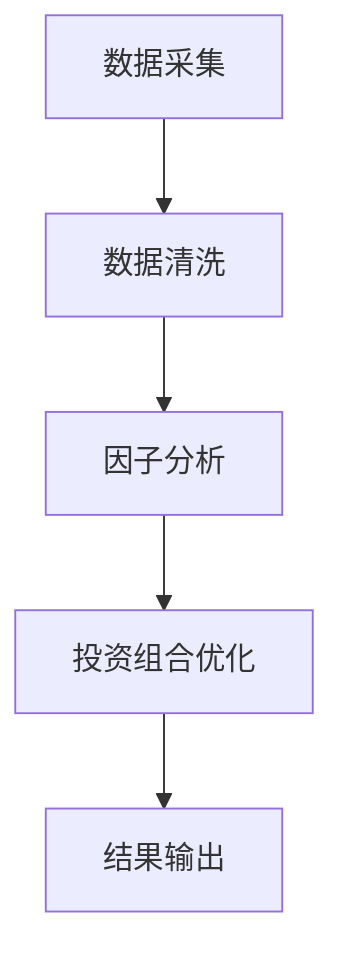
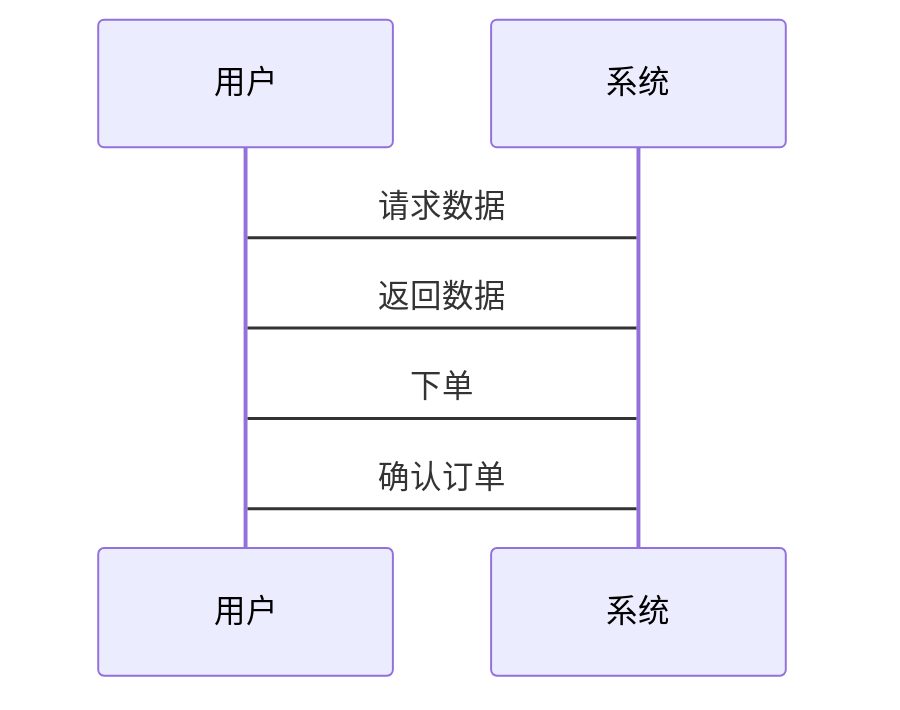

                 


# 特价股票投资中的跨资产类别配置

> 关键词：特价股票、跨资产配置、量化分析、投资组合优化、风险管理

> 摘要：本文系统地探讨了特价股票投资中的跨资产类别配置策略，从理论基础到实践应用，结合量化分析方法和系统架构设计，全面解析了如何通过跨资产配置优化投资组合，降低风险，实现收益最大化。

---

# 第1章: 特价股票投资的背景与概念

## 1.1 特价股票的定义与特点
### 1.1.1 特价股票的定义
特价股票是指在特定市场条件下，价格被低估的股票。这些股票通常具有较高的潜在回报，但由于市场认知不足或短期市场波动，其价格未能反映其真实价值。

### 1.1.2 特价股票的核心特点
- **低估性**：市场价格低于内在价值。
- **波动性**：价格波动较大，存在快速反弹的可能。
- **周期性**：通常出现在市场低迷或特定行业周期中。

### 1.1.3 特价股票与其他股票的区别
| 特点 | 特价股票 | 其他股票 |
|------|----------|----------|
| 价格 | 低于内在价值 | 接近或高于内在价值 |
| 风险 | 较高 | 较低 |
| 收益 | 潜在回报高 | 稳定回报 |

## 1.2 跨资产类别配置的背景
### 1.2.1 跨资产配置的定义
跨资产配置是指将资金分配到不同的资产类别（如股票、债券、黄金、房地产等）中，以分散风险并优化整体投资组合的回报。

### 1.2.2 跨资产配置的必要性
- **风险分散**：通过投资不同资产类别，降低单一资产带来的风险。
- **收益增强**：不同资产类别的收益周期不同，通过组合投资可以平滑收益波动。

### 1.2.3 跨资产配置的理论基础
现代投资组合理论（MPT）是跨资产配置的理论基础，强调通过合理配置资产来优化风险与收益的平衡。

## 1.3 特价股票投资的现状与趋势
### 1.3.1 特价股票市场的现状
当前市场中，特价股票主要集中在周期性行业和中小型企业中。

### 1.3.2 跨资产配置在特价股票中的应用
越来越多的投资者开始关注通过跨资产配置来捕捉特价股票的投资机会。

### 1.3.3 未来发展趋势
随着市场波动加剧，跨资产配置将成为投资策略的重要组成部分。

## 1.4 本章小结
本章介绍了特价股票的基本概念和特点，并探讨了跨资产配置的背景和必要性。

---

# 第2章: 跨资产类别配置的理论与方法

## 2.1 资产类别分析
### 2.1.1 股票、债券、基金等资产的分类
- **股票**：权益类资产，风险高，收益潜力大。
- **债券**：固定收益类资产，风险较低，收益稳定。
- **基金**：通过分散投资降低风险。

### 2.1.2 不同资产类别的风险与收益特征
| 资产类别 | 风险 | 收益 |
|----------|------|------|
| 股票     | 高   | 高   |
| 债券     | 中   | 中   |
| 黄金     | 低   | 低   |

### 2.1.3 资产类别间的相关性分析
相关性分析是跨资产配置的重要步骤，通过协方差矩阵计算不同资产之间的相关性。

## 2.2 跨资产配置的核心方法
### 2.2.1 基于现代投资组合理论的配置方法
根据MPT，投资者可以通过优化算法找到最优资产配置比例。

### 2.2.2 基于风险收益平衡的配置策略
在给定风险承受能力下，选择收益最大的资产组合。

### 2.2.3 动态调整的配置方法
根据市场变化，定期调整资产配置比例。

## 2.3 跨资产配置的数学模型
### 2.3.1 投资组合理论的数学公式
$$ E(r_p) = \sum w_i E(r_i) $$

### 2.3.2 风险最小化与收益最大化的优化模型
$$ \min w^T \Sigma w $$
$$ \text{subject to} \quad E(r_p) \geq \text{目标收益} $$

### 2.3.3 资产相关性矩阵的构建与应用
使用mermaid绘制相关性矩阵：


## 2.4 本章小结
本章从理论角度探讨了跨资产配置的方法和数学模型。

---

# 第3章: 特价股票投资中的量化分析方法

## 3.1 量化分析的核心概念
### 3.1.1 量化投资的定义与特点
量化投资是通过数学模型和算法进行投资决策。

### 3.1.2 数据驱动的投资决策
依赖历史数据和统计分析，而非主观判断。

### 3.1.3 量化分析与传统投资的区别
| 方面 | 量化分析 | 传统投资 |
|------|----------|----------|
| 决策依据 | 数据驱动 | 经验驱动 |
| 持股周期 | 短期 | 长期 |

## 3.2 特价股票的因子模型
### 3.2.1 常见因子模型介绍
- **CAPM模型**：单因子模型。
- **Fama-French三因子模型**：包含市值、价值和动量因子。

### 3.2.2 特价股票因子的筛选与构建
通过因子筛选，识别具有低估特性的股票。

### 3.2.3 因子模型在投资决策中的应用
使用因子模型筛选出具有超额收益潜力的股票。

## 3.3 量化分析的算法实现
### 3.3.1 数据清洗与预处理
- 数据清洗：去除缺失值和异常值。
- 数据标准化：统一数据格式。

### 3.3.2 因子回归模型的构建
$$ y = \beta_1 x_1 + \beta_2 x_2 + \epsilon $$

### 3.3.3 算法流程图（使用mermaid）


## 3.4 本章小结
本章介绍了量化分析在特价股票投资中的应用，重点讲解了因子模型和算法实现。

---

# 第4章: 跨资产配置的系统设计与实现

## 4.1 系统设计概述
### 4.1.1 系统目标与功能需求
- 系统目标：实现跨资产配置的量化分析。
- 功能需求：数据采集、分析、优化、回测。

### 4.1.2 系统架构设计
使用分层架构：数据层、业务逻辑层、用户界面层。

### 4.1.3 系统模块划分
- 数据采集模块：负责获取实时数据。
- 数据分析模块：进行因子筛选和模型构建。
- 投资组合优化模块：生成最优配置方案。

## 4.2 系统架构设计
### 4.2.1 数据采集模块
- 数据来源：股票、债券、基金等市场数据。
- 数据接口：使用API获取实时数据。

### 4.2.2 数据分析模块
- 数据清洗：去除无效数据。
- 因子分析：筛选关键因子。

### 4.2.3 投资组合优化模块
- 使用优化算法计算最优配置比例。
- 输出配置建议。

### 4.2.4 系统架构图（使用mermaid）


## 4.3 系统交互设计
### 4.3.1 用户需求分析
- 用户角色：投资者、数据分析师。
- 用户场景：实时监控、策略回测。

### 4.3.2 系统交互流程


## 4.4 本章小结
本章详细设计了跨资产配置系统的架构和交互流程。

---

# 第5章: 实战案例与项目实现

## 5.1 实战案例分析
### 5.1.1 案例背景
假设当前市场中有多只特价股票，需要通过跨资产配置优化投资组合。

### 5.1.2 数据准备
收集相关股票、债券等资产的历史数据。

### 5.1.3 因子筛选
筛选出具有低估特性的股票。

### 5.1.4 投资组合优化
使用优化算法计算最优配置比例。

## 5.2 项目实现
### 5.2.1 环境搭建
- 安装Python、Pandas、NumPy等工具。

### 5.2.2 核心代码实现
```python
import pandas as pd
import numpy as np

# 数据预处理
data = pd.read_csv('data.csv')
data = data.dropna()

# 因子筛选
selected_factors = ['市盈率', '市净率', '股息率']
data = data[selected_factors]

# 投资组合优化
from scipy.optimize import minimize

def portfolio_optimization(weights, returns, cov_matrix):
    # 定义目标函数
    def objective(weight):
        return np.dot(weight.T, np.dot(cov_matrix, weight))  # 最小化风险

    # 约束条件
    constraints = [{'type': 'eq', 'fun': lambda w: np.sum(w) - 1}]

    result = minimize(objective, weights, constraints)
    return result.x

# 计算并输出最优权重
weights = np.array([0.3, 0.3, 0.4])
returns = [0.1, 0.08, 0.15]
cov_matrix = np.array([[0.16, 0.05, 0.07],
                        [0.05, 0.20, 0.02],
                        [0.07, 0.02, 0.18]])

optimal_weights = portfolio_optimization(weights, returns, cov_matrix)
print(optimal_weights)
```

### 5.2.3 实验结果分析
- 计算投资组合的预期收益和风险。
- 比较不同配置方案的收益-风险比。

## 5.3 本章小结
本章通过实战案例展示了跨资产配置的具体实现过程，包括数据准备、因子筛选和投资组合优化。

---

# 第6章: 风险管理与优化策略

## 6.1 风险管理的核心策略
### 6.1.1 风险来源分析
- 市场风险
- 利率风险
- 汇率风险

### 6.1.2 风险对冲方法
- 通过衍生品对冲市场风险。
- 通过分散投资降低特定风险。

## 6.2 优化策略的实施
### 6.2.1 动态再平衡
定期调整投资组合，以适应市场变化。

### 6.2.2 风险承受能力评估
根据投资者的风险偏好调整资产配置比例。

## 6.3 压力测试与情景分析
### 6.3.1 压力测试
评估投资组合在极端市场条件下的表现。

### 6.3.2 情景分析
模拟不同经济周期下的投资组合表现。

## 6.4 本章小结
本章重点讨论了风险管理在跨资产配置中的重要性，并提出了优化策略。

---

# 第7章: 未来趋势与投资机会

## 7.1 量化投资的未来发展
### 7.1.1 技术进步对量化投资的影响
人工智能和大数据技术的应用将推动量化投资的发展。

### 7.1.2 新兴市场的投资机会
新兴市场中可能存在更多的特价股票投资机会。

## 7.2 跨资产配置的创新模式
### 7.2.1 多资产类别结合
将股票、债券、加密货币等多种资产结合。

### 7.2.2 场外市场的拓展
利用场外市场获取更多的投资机会。

## 7.3 本章小结
本章展望了量化投资和跨资产配置的未来发展趋势。

---

# 第8章: 结论与展望

## 8.1 全文总结
本文系统地探讨了特价股票投资中的跨资产类别配置策略，结合量化分析方法和系统架构设计，全面解析了如何通过跨资产配置优化投资组合。

## 8.2 未来展望
随着市场的发展和技术的进步，跨资产配置将在投资领域发挥越来越重要的作用。

---

# 参考文献

（此处列出相关文献和资料）

