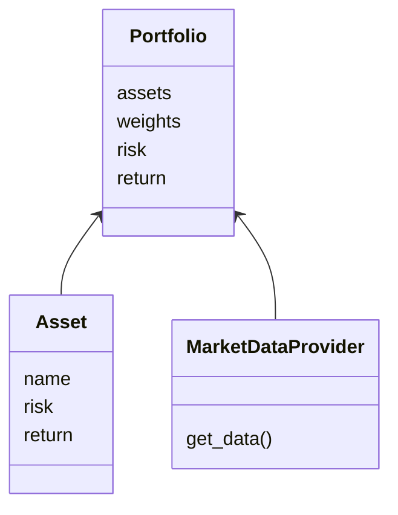

                 


# 特价股票投资中的跨资产类别配置方法

## 关键词：特价股票，跨资产配置，投资组合优化，风险管理，数学模型，Python实现

## 摘要：
本文深入探讨了在特价股票投资中进行跨资产类别配置的方法。首先介绍了特价股票投资的基本概念和跨资产配置的重要性，然后详细分析了跨资产配置的理论基础，包括现代投资组合理论（MPT）和资产相关性分析。接着，通过数学模型和Python代码实现，详细讲解了投资组合优化和风险平价配置的算法原理。最后，结合实际案例，分析了跨资产配置在特价股票投资中的应用，并提供了风险管理策略和最佳实践建议。

---

## 第一部分：背景介绍

### 第1章：特价股票投资概述

#### 1.1 特价股票投资的定义与特点
- 1.1.1 特价股票的定义：特价股票通常指在特定市场条件下，价格被低估的股票，具有较高的投资潜力。
- 1.1.2 特价股票投资的优势：高收益潜力、低买入成本、市场波动中的套利机会。
- 1.1.3 特价股票投资的挑战：市场波动风险、信息不对称、短期流动性问题。

#### 1.2 跨资产配置的基本概念
- 1.2.1 跨资产配置的定义：将资金分配到多种资产类别（如股票、债券、基金、 commodities 等）以分散风险。
- 1.2.2 跨资产配置的重要性：降低投资组合的整体风险，提高收益稳定性。
- 1.2.3 跨资产配置的核心要素：资产类别选择、权重分配、动态调整。

---

### 第2章：跨资产配置的理论基础

#### 2.1 投资组合理论
- 2.1.1 现代投资组合理论（MPT）：通过优化资产组合的收益-风险比，实现最优配置。
- 2.1.2 风险与收益的平衡：在给定风险下最大化收益，或在给定收益下最小化风险。
- 2.1.3 资产相关性分析：分析不同资产类别之间的相关性，降低组合风险。

#### 2.2 资产类别与风险特征
- 2.2.1 股票、债券、基金等资产类别的特点：股票高风险高收益，债券低风险稳定收益，基金多样化投资。
- 2.2.2 不同资产类别的风险与收益对比：通过历史数据分析和统计模型进行评估。
- 2.2.3 资产类别间的相关性分析：利用协方差矩阵和相关系数矩阵进行量化分析。

---

## 第二部分：跨资产配置的策略与方法

### 第3章：跨资产配置的策略设计

#### 3.1 资产配置的步骤与流程
- 3.1.1 确定投资目标与风险承受能力：根据投资者的风险偏好和财务目标制定策略。
- 3.1.2 选择合适的资产类别：基于市场环境和投资目标选择资产。
- 3.1.3 确定各资产类别的权重：通过数学模型计算各资产的配置比例。

#### 3.2 资产配置的数学模型
- 3.2.1 投资组合优化的数学公式：均值-方差优化模型。
  $$ \text{目标函数：} \min \sigma^2 $$
  $$ \text{约束条件：} \sum w_i = 1, \sum w_i r_i = \text{目标收益} $$
- 3.2.2 风险调整后的收益计算：夏普比率、特雷纳比率等。
- 3.2.3 资产相关性的矩阵分析：利用协方差矩阵进行风险评估。

### 第4章：跨资产配置的实战技巧

#### 4.1 特价股票的筛选与评估
- 4.1.1 市盈率、市净率等估值指标的应用：通过PE、PB等指标筛选低估股票。
- 4.1.2 公司基本面分析：盈利能力、财务状况、行业地位等。
- 4.1.3 市场情绪与技术分析：利用K线图、均线、MACD等技术指标判断市场趋势。

#### 4.2 资产配置的动态调整
- 4.2.1 定期评估与再平衡：根据市场变化和个人财务状况调整投资组合。
- 4.2.2 根据市场变化调整配置比例：在市场下跌时增加债券配置，上涨时增加股票配置。
- 4.2.3 应急调整策略：应对突发事件（如金融危机）时的快速调整。

---

## 第三部分：风险管理与监控

### 第5章：跨资产配置中的风险管理

#### 5.1 风险识别与评估
- 5.1.1 市场风险：资产价格波动带来的损失。
- 5.1.2 利率风险：利率变动对债券价格的影响。
- 5.1.3 汇率风险：外汇波动对跨国投资的影响。

#### 5.2 风险控制策略
- 5.2.1 多元化投资：通过分散投资降低风险。
- 5.2.2 设置止损点：在投资组合中设定止损比例。
- 5.2.3 定期风险评估：根据市场变化调整风险敞口。

---

## 第四部分：数学模型与算法实现

### 第6章：投资组合优化的数学模型

#### 6.1 均值-方差优化模型
- 6.1.1 模型公式：
  $$ \min \sigma^2 = w^T \Sigma w $$
  $$ \text{约束条件：} \sum w_i = 1, \sum w_i r_i = \text{目标收益} $$
- 6.1.2 应用案例：假设三个资产类别（股票、债券、基金），通过Python优化求解最优权重。

#### 6.2 风险平价配置
- 6.2.1 风险平价定义：每个资产的风险贡献相等。
- 6.2.2 实现步骤：计算各资产的风险贡献，调整权重以实现风险平价。

### 第7章：Python实现与代码分析

#### 7.1 环境安装与库导入
- 7.1.1 安装Python和相关库（如numpy、pandas、scipy）。

#### 7.2 投资组合优化代码
```python
import numpy as np
import pandas as pd
from scipy.optimize import minimize

def portfolio_optimization(returns, cov_matrix, target_return=0.05):
    n = len(cov_matrix)
    # 定义目标函数
    def objective(weights):
        return np.dot(weights.T, np.dot(cov_matrix, weights))
    # 定义约束条件
    constraints = []
    # 总和为1
    constraints.append({'type': 'eq', 'fun': lambda w: sum(w) - 1})
    # 达到目标收益
    constraints.append({'type': 'eq', 'fun': lambda w: np.dot(returns.T, w) - target_return})
    # 初始权重
    initial_weights = np.array([1/n]*n)
    # 使用SLSQP求解器
    result = minimize(objective, initial_weights, constraints=constraints, method='SLSQP')
    return result.x
```

---

## 第五部分：系统分析与架构设计

### 第8章：系统功能设计

#### 8.1 领域模型（Mermaid 类图）


#### 8.2 系统架构设计（Mermaid 架构图）


---

## 第六部分：项目实战与案例分析

### 第9章：项目实战

#### 9.1 环境安装与代码实现
- 9.1.1 安装环境：安装Python和相关库。
- 9.1.2 数据采集：获取历史价格数据。
- 9.1.3 数据分析：计算收益和风险指标。

#### 9.2 案例分析
- 9.2.1 实际案例：某投资者在2020年市场下跌时通过跨资产配置实现收益最大化。
- 9.2.2 数据分析：通过Python代码计算不同资产配置下的收益和风险。

---

## 第七部分：总结与展望

### 第10章：总结与展望

#### 10.1 总结
- 跨资产配置的重要性：通过分散投资降低风险，提高收益稳定性。
- 数学模型的应用：利用均值-方差优化和风险平价模型实现投资组合优化。

#### 10.2 展望
- 结合人工智能技术：利用机器学习算法预测市场趋势，优化资产配置。
- 风险管理的未来方向：开发更复杂的风控模型，应对复杂市场环境。

---

## 附录：代码与参考文献

### 附录A：投资组合优化代码
```python
# 示例代码：计算最优资产配置
import numpy as np
import pandas as pd
from scipy.optimize import minimize

def portfolio_optimization(returns, cov_matrix, target_return=0.05):
    n = len(cov_matrix)
    initial_weights = np.array([1/n]*n)
    # 目标函数：最小化方差
    def objective(weights):
        return np.dot(weights.T, np.dot(cov_matrix, weights))
    # 约束条件
    constraints = []
    constraints.append({'type': 'eq', 'fun': lambda w: sum(w) - 1})
    constraints.append({'type': 'eq', 'fun': lambda w: np.dot(returns.T, w) - target_return})
    result = minimize(objective, initial_weights, constraints=constraints, method='SLSQP')
    return result.x

# 示例数据
returns = np.array([0.1, 0.05, 0.08])
cov_matrix = np.array([
    [0.04, 0.02, 0.01],
    [0.02, 0.03, 0.01],
    [0.01, 0.01, 0.02]
])
weights = portfolio_optimization(returns, cov_matrix)
print(weights)
```

### 附录B：参考文献
- 现代投资组合理论（MPT）的相关文献。
- 资产配置与风险管理的经典书籍。

---

通过以上目录结构，文章将详细讲解特价股票投资中的跨资产类别配置方法，从理论到实践，从数学模型到代码实现，帮助读者全面掌握相关知识。

