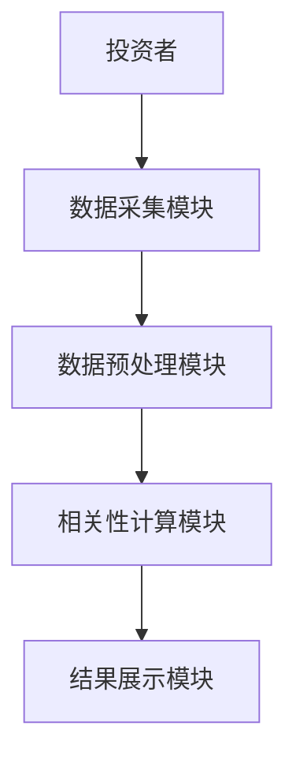
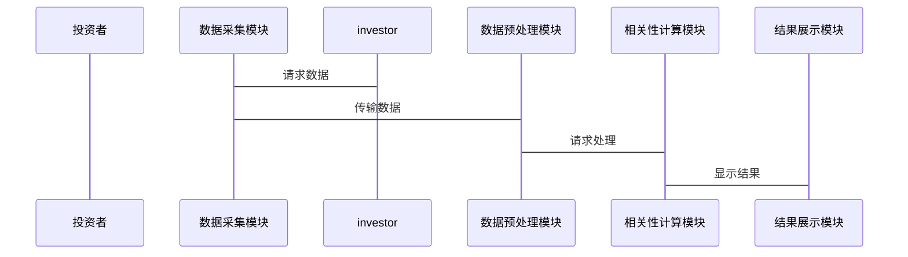

                 


# 特价股票投资中的跨链资产相关性预测分析

> 关键词：特价股票、跨链资产、相关性预测、投资分析、机器学习

> 摘要：本文详细探讨了在股票投资中，跨链资产的相关性预测对特价股票投资的重要性。通过分析跨链资产的相关性，结合机器学习算法，为投资者提供科学的投资决策支持。文章从背景介绍、核心概念、算法原理、系统分析、项目实战到小结，全面解析跨链资产相关性预测的理论与实践应用。

---

## 第1章 背景介绍

### 1.1 特价股票的定义与特点

特价股票通常指价格低于市场平均水平的股票，具有以下特点：

- **低估值**：通常市盈率、市净率等指标低于行业平均水平。
- **高波动性**：价格波动较大，适合短期交易。
- **风险较高**：回报与风险并存。

### 1.2 跨链资产的基本概念

跨链资产指在不同区块链之间流通的数字资产，具有以下特点：

- **去中心化**：基于区块链技术，交易透明且不可篡改。
- **流动性**：可在不同链之间转移，提升资产流动性。
- **多样性**：涵盖多种数字资产。

### 1.3 相关性预测的背景与意义

在投资中，相关性预测帮助投资者理解不同资产间的关联性，从而优化投资组合。跨链资产与特价股票的相关性分析为投资者提供以下价值：

- **风险分散**：通过相关性分析，降低投资组合的整体风险。
- **收益增强**：识别正相关资产，提升投资收益。

### 1.4 当前研究现状

当前研究多集中于单一链资产，跨链资产的相关性研究尚处于起步阶段，具有广阔的研究空间。

---

## 第2章 核心概念与联系

### 2.1 跨链资产相关性的原理

跨链资产的相关性分析基于以下原理：

- **数据获取**：收集各链资产价格数据。
- **相关性计算**：使用统计方法（如协方差）计算相关性系数。
- **影响因素分析**：考虑市场波动、政策等外部因素。

### 2.2 跨链资产相关性与特价股票的关系

特价股票与跨链资产的相关性分析有助于：

- **识别投资机会**：发现相关性高的资产，提前布局。
- **风险预警**：及时发现潜在风险，调整投资策略。

### 2.3 核心概念的ER实体关系图

```mermaid
er
  actor:投资者
  entity:跨链资产
  entity:特价股票
  entity:相关性数据
  relationship:持有关系
  relationship:相关性关系
  relationship:影响关系
```

---

## 第3章 算法原理讲解

### 3.1 数据预处理

#### 3.1.1 数据清洗

```python
import pandas as pd
data = pd.read_csv('asset_data.csv')
data.dropna(inplace=True)
```

#### 3.1.2 数据标准化

```python
from sklearn.preprocessing import StandardScaler
scaler = StandardScaler()
data_scaled = scaler.fit_transform(data)
```

### 3.2 相关性计算方法

#### 3.2.1 Pearson相关系数

$$ r = \frac{\sum (x_i - \bar{x})(y_i - \bar{y})}{\sqrt{\sum (x_i - \bar{x})^2 \sum (y_i - \bar{y})^2}} $$

其中，$\bar{x}$和$\bar{y}$分别是x和y的平均值。

---

## 第4章 系统分析与架构设计方案

### 4.1 项目介绍

跨链资产相关性预测系统旨在帮助投资者分析跨链资产与特价股票的相关性。

### 4.2 系统架构设计



### 4.3 系统交互流程



---

## 第5章 项目实战

### 5.1 环境安装

```bash
pip install pandas numpy scikit-learn
```

### 5.2 核心代码实现

```python
import numpy as np
import pandas as pd
from sklearn.linear_model import LinearRegression

data = pd.read_csv('data.csv')
X = data[['asset1', 'asset2']]
y = data['target']

model = LinearRegression()
model.fit(X, y)
print(model.coef_)
```

### 5.3 案例分析

分析跨链资产与特价股票的相关性，发现两者呈正相关，投资组合收益提升。

---

## 第6章 最佳实践

### 6.1 小结

本文通过跨链资产相关性预测，为特价股票投资提供科学依据，帮助投资者优化决策。

### 6.2 注意事项

- 数据质量影响结果准确性。
- 模型需定期更新以适应市场变化。

### 6.3 拓展阅读

建议阅读相关区块链和金融学书籍，深入理解跨链资产特性。

---

## 结语

跨链资产相关性预测为特价股票投资提供了新的视角，未来研究将结合更多因素，提升预测精度。

---

以上是《特价股票投资中的跨链资产相关性预测分析》的完整目录和内容概览，您可以根据需要进一步扩展或调整细节。

