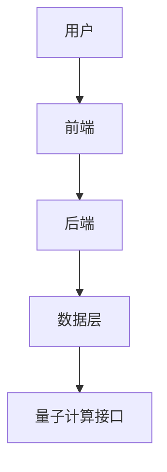

                 


# 特价股票投资中的量子加密风险评估

> 关键词：量子计算，量子加密，风险评估，特价股票，金融风险管理

> 摘要：随着量子计算技术的迅速发展，金融领域的安全性面临新的挑战与机遇。本文探讨了量子加密在特价股票投资中的应用，详细分析了量子加密的基本原理、风险评估模型、系统架构设计及实际案例，为投资者提供了一种基于量子加密的新型风险管理方法。

---

## 第1章: 量子计算与加密概述

### 1.1 量子计算的基本原理

量子计算是基于量子力学原理的一种计算方式，与经典计算相比，其核心优势在于量子位（qubit）的叠加态和纠缠态。量子位可以同时表示0和1的状态，这使得量子计算机在某些特定问题上具有远超经典计算机的计算能力。

#### 1.1.1 量子位与经典位的区别

经典计算机使用的是二进制位，每个位只能是0或1。而量子位可以处于0和1的叠加态，表示为：

$$
|\psi\rangle = \alpha|0\rangle + \beta|1\rangle
$$

其中，$\alpha$ 和 $\beta$ 是复数，满足归一化条件：

$$
|\alpha|^2 + |\beta|^2 = 1
$$

#### 1.1.2 量子叠加与量子纠缠

量子叠加允许量子系统同时处于多个状态，而量子纠缠则允许两个或多个量子位之间形成强关联，使得对其中一个量子位的测量会立即影响另一个量子位的状态。

#### 1.1.3 量子计算的核心优势

量子计算的核心优势在于其并行计算能力。例如，Shor算法可以在多项式时间内分解大整数的因数，这在经典计算中是指数复杂度的问题。

### 1.2 加密技术的基本原理

加密技术用于保护信息的安全性，防止未经授权的访问。经典加密算法包括对称加密（如AES）和非对称加密（如RSA），而量子加密算法则利用量子力学的特性来实现更高的安全性。

#### 1.2.1 经典加密算法的分类

- 对称加密：使用相同的密钥进行加密和解密，如AES。
- 非对称加密：使用公钥和私钥，如RSA。

#### 1.2.2 量子加密的基本原理

量子加密的核心是利用量子态的不可克隆性和不可分割性。例如，量子密钥分发（QKD）通过量子态传输密钥，确保密钥的安全传输。

#### 1.2.3 量子加密与经典加密的对比

| 特性                | 经典加密       | 量子加密         |
|---------------------|----------------|------------------|
| 密钥分发安全性       | 易受中间人攻击   | 高安全性         |
| 计算复杂度           | 高             | 低（在某些情况下）|
| 适用场景             | 数据加密       | 密钥分发、通信安全 |

---

## 第2章: 特价股票投资的基本概念

### 2.1 特价股票的定义与特点

特价股票通常指价格较低的股票，具有较高的增长潜力，但风险也较高。

#### 2.1.1 特价股票的定义

特价股票是指价格低于市场平均水平的股票，通常具有较高的波动性和潜在的增长空间。

#### 2.1.2 特价股票的投资价值

特价股票可能隐藏着高回报的机会，但同时也伴随着较高的风险。

#### 2.1.3 特价股票的风险与机会

- 风险：价格波动大，市场流动性低。
- 机会：潜在的高回报，市场低估的股票。

### 2.2 量子加密在金融领域的应用

#### 2.2.1 量子加密在金融数据保护中的作用

量子加密可以保护金融数据的安全性，防止未经授权的访问。

#### 2.2.2 量子加密在金融交易中的应用

量子加密可以确保金融交易的安全性，防止交易被篡改或窃取。

#### 2.2.3 量子加密在金融风险管理中的重要性

通过量子加密，可以实现对金融数据的实时监控和异常检测，从而提高风险管理的效率。

---

## 第3章: 量子加密与风险评估的结合

### 3.1 量子加密在风险评估中的作用

#### 3.1.1 量子加密如何提高风险评估的准确性

通过量子计算的强大计算能力，可以更精确地分析市场数据，提高风险评估的准确性。

#### 3.1.2 量子加密如何增强风险评估的实时性

量子计算可以实现实时数据分析，提高风险评估的实时性。

#### 3.1.3 量子加密如何提升风险评估的抗干扰能力

量子加密通过其不可克隆性和纠缠性，可以提高风险评估的抗干扰能力。

### 3.2 量子加密在股票市场中的具体应用

#### 3.2.1 量子加密在股票价格预测中的应用

通过量子计算分析大量市场数据，可以更准确地预测股票价格走势。

#### 3.2.2 量子加密在股票风险评估中的应用

量子加密可以实现对股票风险的精确评估，帮助投资者做出更明智的投资决策。

#### 3.2.3 量子加密在股票市场监控中的应用

通过量子加密技术，可以实现实时市场监控，及时发现异常交易行为。

---

## 第4章: 量子加密风险评估的数学模型

### 4.1 量子加密风险评估的数学基础

#### 4.1.1 概率论与统计学基础

概率论和统计学是量子加密风险评估的基础，用于分析市场数据和评估风险。

#### 4.1.2 量子计算的数学表示

量子计算可以通过矩阵和张量积的形式表示，例如：

$$
|\psi\rangle = \alpha|0\rangle + \beta|1\rangle
$$

#### 4.1.3 量子加密算法的数学模型

量子加密算法通常涉及量子态的叠加和纠缠，例如：

$$
|\psi\rangle = \alpha|0\rangle + \beta|1\rangle + \gamma|2\rangle + \delta|3\rangle
$$

### 4.2 量子加密风险评估的具体模型

#### 4.2.1 量子加密的风险评估公式

通过量子计算分析市场数据，可以得到风险评估公式：

$$
R = \sum_{i=1}^{n} p_i \cdot r_i
$$

其中，$R$ 是风险值，$p_i$ 是概率，$r_i$ 是风险因素。

#### 4.2.2 量子加密的风险评估流程

1. 数据收集：收集市场数据。
2. 数据处理：对数据进行预处理。
3. 模型训练：训练量子加密风险评估模型。
4. 模型评估：评估模型的准确性。

---

## 第5章: 系统架构设计与项目实战

### 5.1 量子加密风险评估系统架构设计

#### 5.1.1 系统功能设计

- 数据采集模块：收集市场数据。
- 数据处理模块：对数据进行预处理。
- 模型训练模块：训练量子加密风险评估模型。
- 模型评估模块：评估模型的准确性。

#### 5.1.2 系统架构设计

使用Mermaid图展示系统架构：



### 5.2 项目实战

#### 5.2.1 环境配置

安装必要的软件和库，例如Qiskit。

#### 5.2.2 代码实现

使用Python编写量子加密风险评估代码：

```python
from qiskit import QuantumCircuit, Aer, execute
from qiskit.visualization import plot_histogram

qc = QuantumCircuit(2)
qc.h(0)
qc.cx(0, 1)
qc.measure(0, 0)
qc.measure(1, 1)

backend = Aer.get_backend('qasm_simulator')
job = execute(qc, backend)
result = job.result()
counts = result.get_counts()

print(counts)
plot_histogram(counts)
```

#### 5.2.3 结果分析

分析量子计算的结果，评估风险。

#### 5.2.4 经验总结

总结量子加密在风险评估中的优势和挑战。

---

## 第6章: 最佳实践与未来展望

### 6.1 最佳实践

- 量子加密技术的应用需要结合实际情况，选择合适的算法。
- 加强量子计算的硬件支持，提高计算效率。

### 6.2 未来展望

随着量子计算技术的不断发展，量子加密在金融领域的应用将更加广泛，风险评估也将更加精确。

---

通过以上内容，我们详细探讨了量子加密在特价股票投资中的应用，从理论到实践，为投资者提供了一种新的风险管理方法。

