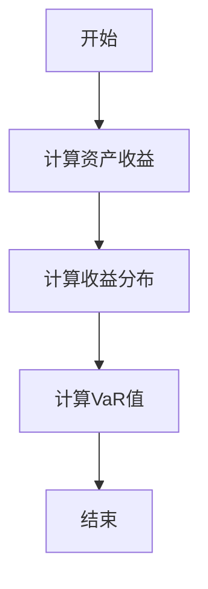
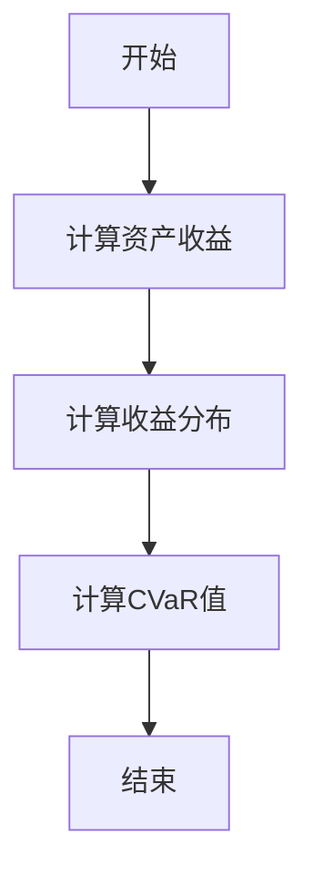
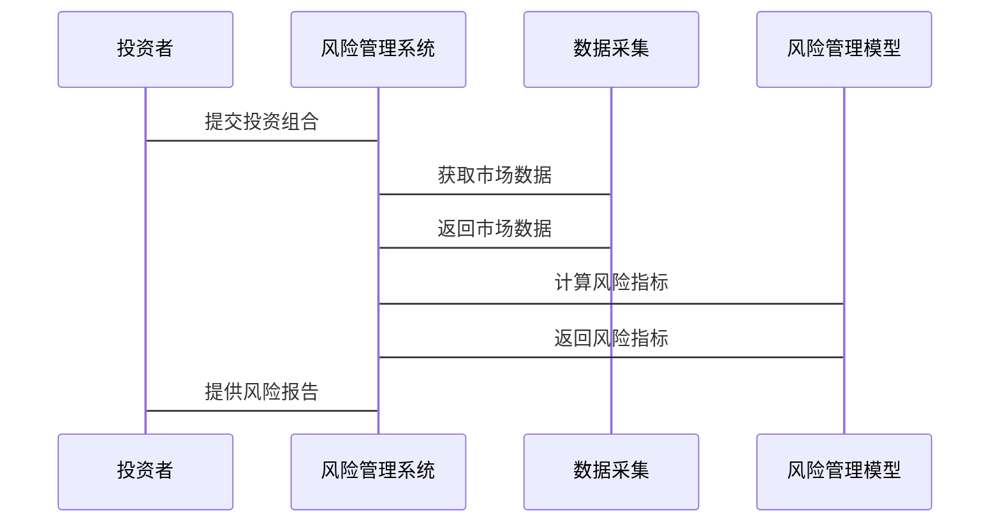

                 


# 特价股票投资中的风险管理

> 关键词：特价股票，风险管理，投资策略，VaR，CVaR，数学模型

> 摘要：本文深入探讨了特价股票投资中的风险管理，分析了风险管理在特价股票投资中的重要性，介绍了风险管理的核心概念、数学模型和算法，通过系统架构设计和项目实战，展示了如何在特价股票投资中有效地进行风险管理。

---

## 第1章: 特价股票投资的背景与风险管理的重要性

### 1.1 特价股票投资的背景

#### 1.1.1 特价股票的定义与特点
特价股票通常指的是市价低于其内在价值的股票。其特点包括低估值、高潜在回报和较高的波动性。

#### 1.1.2 特价股票投资的动机与目标
投资者购买特价股票的动机包括追求高回报、市场波动带来的机会以及长期价值投资的理念。目标通常是在市场恢复时获得超额收益。

#### 1.1.3 特价股票投资的市场环境分析
市场环境分析包括宏观经济指标、行业趋势和公司基本面。这些因素影响特价股票的投资决策。

### 1.2 风险管理的重要性

#### 1.2.1 风险管理的基本概念
风险管理是指识别、评估和控制风险的过程，旨在减少损失并提高投资回报。

#### 1.2.2 风险管理在投资中的作用
风险管理在投资中起到保护资本、提高投资组合稳定性的作用，帮助投资者在波动的市场中保持稳健。

#### 1.2.3 风险管理与投资回报的关系
有效的风险管理能够平衡风险与收益，避免过度冒险，从而实现可持续的投资回报。

### 1.3 特价股票投资中的风险管理必要性

#### 1.3.1 特价股票投资中的风险类型
包括市场风险、流动性风险、公司特定风险和估值风险。

#### 1.3.2 风险管理在特价股票投资中的独特性
特价股票的高波动性和低流动性增加了风险管理的复杂性，需要采用特殊的策略和模型。

#### 1.3.3 风险管理与投资决策的结合
通过风险管理，投资者可以在特价股票投资中做出更明智的决策，优化投资组合。

---

## 第2章: 特价股票投资与风险管理的核心概念

### 2.1 特价股票投资的核心概念

#### 2.1.1 特价股票的市场定位
特价股票通常处于低估状态，可能因市场忽视或负面消息而被低估。

#### 2.1.2 特价股票的投资策略
包括价值投资、事件驱动策略和逆向投资策略，强调长期持有和市场反转。

#### 2.1.3 特价股票的估值方法
使用市盈率、市净率等指标评估股票的内在价值，识别低估机会。

### 2.2 风险管理的核心概念

#### 2.2.1 风险的定义与分类
风险是投资回报的不确定性，分为市场风险、信用风险、流动性风险等。

#### 2.2.2 风险评估的方法
包括定性和定量分析，定性分析评估风险因素，定量分析计算风险数值。

#### 2.2.3 风险控制的策略
分散投资、设定止损点和风险调整后的投资决策。

### 2.3 特价股票投资与风险管理的关联性

#### 2.3.1 风险管理在特价股票投资中的关键作用
通过风险管理，投资者可以降低市场波动带来的风险，提高投资组合的稳定性。

#### 2.3.2 风险与收益的平衡
在追求高收益的同时，风险管理确保投资者不会承担过高的风险。

#### 2.3.3 风险管理在投资组合中的应用
通过合理分配资产和控制风险，投资者可以在特价股票投资中实现风险与收益的平衡。

---

## 第3章: 风险管理的数学模型与算法原理

### 3.1 风险管理的数学模型

#### 3.1.1 价值-at-风险（VaR）
VaR是衡量投资组合在给定置信水平下的潜在损失的指标。公式为：
$$ VaR = \mu + z \cdot \sigma $$
其中，$\mu$是平均回报，$z$是标准正态分布的分位数，$\sigma$是标准差。

#### 3.1.2 置信区间风险度量（CVaR）
CVaR是在VaR的基础上，考虑超过VaR的潜在损失。公式为：
$$ CVaR = \frac{1}{\alpha} \int_{-\infty}^{VaR} (x - VaR) dF(x) $$

#### 3.1.3 方差-协方差矩阵
用于计算资产之间的相关性，公式为：
$$ \text{协方差}(i, j) = \frac{1}{n-1} \sum_{t=1}^{n} (x_{it} - \bar{x}_i)(x_{jt} - \bar{x}_j) $$

### 3.2 风险管理算法的实现

#### 3.2.1 VaR算法的流程图


#### 3.2.2 CVaR算法的流程图


#### 3.2.3 方差-协方差矩阵的实现
```python
import numpy as np

def calculate_covariance_matrix(returns):
    n_assets = returns.shape[1]
    covariance_matrix = np.zeros((n_assets, n_assets))
    for i in range(n_assets):
        for j in range(n_assets):
            covariance_matrix[i, j] = np.cov(returns.iloc[:, i], returns.iloc[:, j])
    return covariance_matrix
```

---

## 第4章: 系统分析与架构设计

### 4.1 问题场景介绍
投资者需要在特价股票投资中进行风险管理，确保投资组合的安全性。

### 4.2 系统功能设计
系统功能包括风险评估、风险监控和风险报告。

### 4.3 系统架构设计


### 4.4 系统接口设计
接口包括数据输入接口、风险评估接口和报告生成接口。

### 4.5 系统交互流程


---

## 第5章: 项目实战

### 5.1 环境安装
安装Python、NumPy、Pandas、Matplotlib和Scikit-learn。

### 5.2 系统核心实现源代码

#### 5.2.1 风险管理模块
```python
import numpy as np
from sklearn.covariance import LedoitWolf

def calculate VaR(returns, confidence_level=0.95):
    # 排序收益并计算VaR
    sorted_returns = np.sort(returns)
    index = int(len(sorted_returns) * (1 - confidence_level))
    VaR = sorted_returns[index]
    return VaR
```

#### 5.2.2 风险报告生成模块
```python
import pandas as pd
import matplotlib.pyplot as plt

def generate_report(risk_metrics):
    df = pd.DataFrame(risk_metrics)
    df.to_csv('risk_report.csv')
    # 生成图表
    plt.hist(df['VaR'], bins=10)
    plt.xlabel('VaR Value')
    plt.ylabel('Frequency')
    plt.savefig('VaR_Distribution.png')
    plt.close()
```

### 5.3 代码应用解读与分析
通过代码实现VaR和CVaR的计算，评估投资组合的风险。

### 5.4 实际案例分析和详细讲解剖析
以某只特价股票为例，计算其VaR和CVaR，生成风险报告并提出风险管理建议。

### 5.5 项目小结
总结项目实现的过程，强调风险管理在特价股票投资中的重要性。

---

## 第6章: 最佳实践、小结、注意事项和拓展阅读

### 6.1 最佳实践
- 定期评估投资组合的风险。
- 采用多种风险管理工具和策略。
- 结合市场环境调整风险管理策略。

### 6.2 小结
本文详细探讨了风险管理在特价股票投资中的应用，通过数学模型和系统设计提供了实用的解决方案。

### 6.3 注意事项
- 风险管理需要持续关注市场变化。
- 风险模型需要定期更新和校准。

### 6.4 拓展阅读
建议阅读关于VaR、CVaR和投资组合管理的经典文献，进一步学习风险管理的高级技术。

---

通过以上结构，读者可以系统地了解特价股票投资中的风险管理，并能够实际应用相关的数学模型和系统设计进行投资决策。

