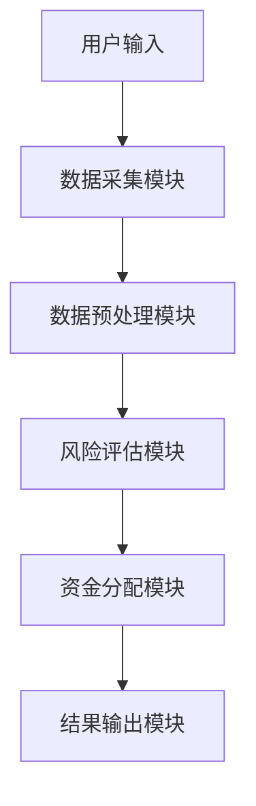

                 


# 特价股票投资的资金分配策略

> 关键词：资金分配策略、特价股票投资、投资组合优化、风险管理、数学模型、算法实现

> 摘要：本文详细探讨了特价股票投资中的资金分配策略，从理论基础到实际应用，结合数学模型和算法实现，分析了如何通过科学的资金分配策略最大化投资收益并降低风险。文章首先介绍了特价股票投资的背景与概念，随后深入解析了资金分配策略的核心原理，详细推导了投资组合优化的数学模型，并通过具体案例展示了算法的实现与应用。最后，本文总结了资金分配策略的最佳实践，为投资者提供了实用的指导。

---

# 第一部分：特价股票投资的背景与概念

## 第1章：特价股票投资的背景与概念

### 1.1 特价股票投资的定义与特点
#### 1.1.1 什么是特价股票投资
特价股票投资是指在市场低迷或股票价格被低估时，投资者以低于市场价的策略购买股票，并在价格回升时卖出以获取利润。这种投资策略的核心在于识别市场中的低价股票，并通过合理的资金分配策略最大化收益。

#### 1.1.2 特价股票投资的核心特点
- **逆向投资**：在市场恐慌时买入，市场乐观时卖出。
- **价值发现**：寻找被市场低估的股票。
- **长期视角**：注重股票的长期增值潜力。

#### 1.1.3 特价股票投资的市场环境分析
- **市场周期**：分析市场的牛熊周期，确定投资时机。
- **宏观经济因素**：关注利率、通货膨胀等宏观经济指标对股票价格的影响。
- **行业趋势**：研究行业景气度和未来增长潜力。

---

### 1.2 资金分配策略的重要性
#### 1.2.1 资金分配在投资中的作用
- **分散风险**：通过合理的资金分配，降低单一投资的风险。
- **最大化收益**：通过优化资金分配，提高整体投资回报率。
- **动态调整**：根据市场变化及时调整资金分配比例。

#### 1.2.2 资金分配策略对投资收益的影响
- **收益增强**：通过科学的资金分配，可以在不同资产之间实现收益的均衡。
- **风险控制**：避免过度集中于某一种资产或行业，降低整体投资风险。

#### 1.2.3 资金分配策略的多样性
- **固定比例策略**：按固定比例分配资金到不同资产类别。
- **动态调整策略**：根据市场变化实时调整资金分配比例。
- **基于价值的策略**：根据股票的内在价值调整资金分配。

---

### 1.3 特价股票投资与传统投资的区别
#### 1.3.1 传统股票投资的局限性
- **市场波动风险高**：传统投资容易受到市场情绪的影响。
- **缺乏系统性**：传统投资往往依赖个人经验和直觉，缺乏科学的策略支持。

#### 1.3.2 特价股票投资的独特优势
- **逆向投资机会**：能够在市场低谷时买入，获得超额收益。
- **价值导向**：注重股票的内在价值，而非短期市场波动。

#### 1.3.3 资金分配策略在特价股票投资中的特殊性
- **逆周期分配**：在市场低迷时增加资金配置，市场繁荣时减少配置。
- **行业精选**：根据行业景气度和个股价值，动态调整资金分配。

---

### 1.4 本章小结
本章主要介绍了特价股票投资的基本概念、核心特点以及资金分配策略的重要性。通过分析市场环境和投资策略的差异，为后续的资金分配策略分析奠定了基础。

---

# 第二部分：资金分配策略的核心概念与原理

## 第2章：资金分配策略的理论基础

### 2.1 投资组合理论
#### 2.1.1 马科维茨投资组合理论
马科维茨投资组合理论是现代投资组合理论的核心，强调通过分散投资降低风险。其核心思想是通过合理的资产配置，实现收益与风险的最佳平衡。

#### 2.1.2 现代投资组合理论的核心思想
现代投资组合理论认为，投资组合的风险不仅取决于单个资产的风险，还取决于资产之间的相关性。通过科学的资金分配，可以有效降低组合的整体风险。

#### 2.1.3 投资组合的有效前沿与风险收益平衡
投资组合的有效前沿是指在给定风险下，收益最高的组合，或者在给定收益下，风险最低的组合。资金分配策略的目标是找到位于有效前沿上的组合。

---

### 2.2 资金分配策略的数学模型
#### 2.2.1 投资组合的数学表达式
投资组合的收益和风险可以用数学公式表示：
- 收益：$$ E[r_p] = \sum w_i E[r_i] $$
- 风险：$$ \sigma_p^2 = \sum \sum w_i w_j \sigma_{ij} $$

其中，\( w_i \) 是资产 \( i \) 的权重，\( E[r_i] \) 是资产 \( i \) 的期望收益，\( \sigma_{ij} \) 是资产 \( i \) 和资产 \( j \) 的协方差。

#### 2.2.2 资金分配的优化问题
资金分配的优化问题可以表示为：
$$ \min_{w} \sigma_p^2 $$
$$ \text{subject to } \sum w_i = 1 $$

#### 2.2.3 资金分配的约束条件与目标函数
- 约束条件：
  - 资金总和为1：$$ \sum w_i = 1 $$
  - 最小化风险：$$ \min \sigma_p^2 $$

---

### 2.3 资金分配策略的分类
#### 2.3.1 均衡分配策略
将资金均匀分配到不同的资产或行业中，以分散风险。

#### 2.3.2 集中分配策略
将大部分资金集中于少数高收益资产，其余用于分散配置。

#### 2.3.3 动态分配策略
根据市场变化实时调整资金分配比例。

#### 2.3.4 逆向分配策略
在市场低迷时增加配置，市场繁荣时减少配置。

---

## 第3章：资金分配策略的数学模型与算法

### 3.1 投资组合优化的数学公式
#### 3.1.1 投资组合优化的核心公式
投资组合优化的目标是最小化风险或最大化收益：
$$ \min_{w} \sigma_p^2 $$
$$ \text{subject to } \sum w_i = 1 $$

#### 3.1.2 基于均值-方差模型的公式
均值-方差模型通过优化期望收益和方差，找到最优的资金分配方案。

#### 3.1.3 资金分配的约束条件
- 非负约束：$$ w_i \geq 0 $$
- 总和约束：$$ \sum w_i = 1 $$

---

### 3.2 资金分配策略的算法实现
#### 3.2.1 基于均值-方差模型的算法
```python
import numpy as np
import pandas as pd
from scipy.optimize import minimize

def portfolio_optimization(returns):
    # 定义目标函数
    def objective(w):
        return np.dot(w.T, np.dot(returns.cov(), w))
    
    # 定义约束条件
    constraints = [
        ('sum', w.sum() == 1),
        ('non-negativity', w[i] >= 0 for i in range(len(w)))
    ]
    
    # 求解优化问题
    result = minimize(objective, initial_guess, constraints)
    return result.x
```

#### 3.2.2 基于风险承受能力的资金分配算法
根据投资者的风险承受能力，调整资金分配比例。

#### 3.2.3 基于市场波动的资金分配算法
根据市场波动率调整资金分配比例。

---

### 3.3 算法的数学推导与实例分析
#### 3.3.1 投资组合优化的数学推导
通过拉格朗日乘数法，推导出投资组合优化的解。

#### 3.3.2 算法的实例分析与结果解读
通过具体案例，分析算法的实现过程和结果。

---

# 第三部分：系统架构与项目实战

## 第4章：系统架构与项目实战

### 4.1 系统功能设计
- **数据采集**：收集股票价格、市场数据等信息。
- **风险评估**：计算股票的波动率和相关性。
- **资金分配**：根据模型计算最优资金分配方案。
- **实时监控**：监控市场变化，动态调整资金分配。

### 4.2 系统架构设计


---

## 第5章：项目实战

### 5.1 环境配置
- **工具安装**：安装必要的数据分析工具和编程语言。
- **数据源**：选择合适的数据源，如Yahoo Finance。

### 5.2 核心代码实现
```python
import numpy as np
import pandas as pd
from scipy.optimize import minimize

def calculate_weights(cov_matrix, returns):
    # 定义目标函数
    def objective(weights):
        return np.dot(weights.T, np.dot(cov_matrix, weights))
    
    # 初始猜测
    initial_guess = np.array([1.0 / len(weights)] * len(weights))
    
    # 定义约束条件
    constraints = [{'type': 'eq', 'fun': lambda w: sum(w) - 1},
                   {'type': 'ineq', 'fun': lambda w: w[i] >= 0 for i in range(len(weights))}]
    
    # 求解优化问题
    result = minimize(objective, initial_guess, constraints)
    return result.x
```

---

### 5.3 案例分析与结果解读
通过具体案例，展示资金分配策略的实际应用效果。

---

## 第6章：最佳实践与总结

### 6.1 最佳实践
- **分散投资**：避免过度集中。
- **动态调整**：根据市场变化及时调整。
- **风险管理**：设定止损点，控制风险敞口。

### 6.2 小结
本文详细介绍了特价股票投资中的资金分配策略，从理论到实践，为投资者提供了科学的指导。

---

通过以上结构，文章系统地介绍了特价股票投资的资金分配策略，从理论基础到实际应用，为投资者提供了全面的指导。

