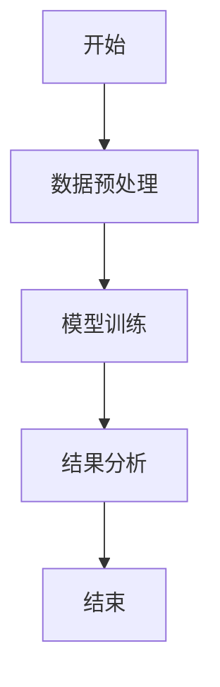

                 


# 特价股票投资策略在微型经济体中的适用性探讨

> 关键词：特价股票、微型经济体、投资策略、算法原理、系统架构

> 摘要：本文探讨了特价股票投资策略在微型经济体中的适用性。首先介绍了特价股票和微型经济体的基本概念，分析了它们的结合背景。接着详细讲解了特价股票投资策略的核心概念与原理，包括定价模型和风险管理算法。然后从系统架构的角度，分析了投资策略的实现方式，包括数据采集、数据分析和投资决策模块。最后通过实际案例分析了投资策略的实现过程，并总结了最佳实践和注意事项。

---

## 第1章：特价股票与微型经济体的背景介绍

### 1.1 特价股票的定义与特征

#### 1.1.1 特价股票的定义
特价股票是指以低于面值的价格发行的股票。在微型经济体中，特价股票通常用于吸引投资者，或者作为公司融资的一种方式。

#### 1.1.2 特价股票的市场特征
- 发行价格低于面值
- 投资风险较高
- 适合小型企业或微型经济体

#### 1.1.3 特价股票与普通股票的对比
| 特性 | 特价股票 | 普通股票 |
|------|----------|----------|
| 发行价格 | 低于面值 | 等于或高于面值 |
| 风险 | 较高 | 较低 |
| 收益 | 可能较高 | 稳定 |

### 1.2 微型经济体的定义与特征

#### 1.2.1 微型经济体的定义
微型经济体指的是由小型企业、个体经营者或微型组织构成的经济体系。这些经济体通常规模较小，参与者数量有限。

#### 1.2.2 微型经济体的经济结构
- 以小型企业为主
- 交易规模小
- 信息不对称程度高

#### 1.2.3 微型经济体与宏观经济的联系
- 微型经济体是宏观经济的重要组成部分
- 微型经济体的健康发展有助于宏观经济的稳定

### 1.3 特价股票与微型经济体的结合背景

#### 1.3.1 特价股票在微型经济体中的潜在价值
- 提供融资渠道
- 吸引投资者
- 促进微型经济体的发展

#### 1.3.2 微型经济体对特价股票的需求
- 解决融资问题
- 提高市场流动性
- 降低投资门槛

#### 1.3.3 特价股票在微型经济体中的应用前景
- 适合小型企业融资
- 可能成为微型经济体的重要投资工具
- 有助于微型经济体的多元化发展

---

## 第2章：特价股票投资策略的核心概念与原理

### 2.1 特价股票投资策略的原理

#### 2.1.1 投资策略的基本原理
投资策略是指在一定条件下，通过分析市场信息，制定投资计划并实施投资行为的过程。

#### 2.1.2 特价股票投资的特殊性
- 风险高，收益潜力大
- 市场流动性较低
- 投资者信息获取难度大

#### 2.1.3 投资策略的数学模型
$$ P = \alpha \cdot P_{\text{面值}} + \beta \cdot R_{\text{风险}} $$

其中：
- \( P \) 表示特价股票的定价
- \( P_{\text{面值}} \) 表示股票的面值
- \( R_{\text{风险}} \) 表示投资风险
- \( \alpha \) 和 \( \beta \) 是系数，表示风险和面值对定价的影响程度

### 2.2 微型经济体中的投资环境分析

#### 2.2.1 微型经济体的投资环境特点
- 市场规模小
- 信息不对称
- 投资者数量有限

#### 2.2.2 微型经济体中的市场参与者
- 小型企业主
- 投资者
- 微型金融机构

#### 2.2.3 微型经济体中的信息不对称问题
- 信息获取困难
- 信息不透明
- 投资者决策难度大

### 2.3 特价股票投资策略的核心要素

#### 2.3.1 投资目标的确定
- 确定投资目标（如短期收益或长期收益）
- 分析微型经济体的市场环境

#### 2.3.2 投资风险的评估
- 评估市场风险
- 评估流动性风险
- 评估信用风险

#### 2.3.3 投资收益的预测
- 使用历史数据预测收益
- 结合市场趋势进行预测
- 考虑宏观经济因素

---

## 第3章：特价股票投资策略的算法原理

### 3.1 投资策略的数学模型

#### 3.1.1 特价股票定价模型
$$ P = \alpha \cdot P_{\text{面值}} + \beta \cdot R_{\text{风险}} + \gamma \cdot T_{\text{时间}} $$

其中：
- \( P \) 表示特价股票的定价
- \( P_{\text{面值}} \) 表示股票的面值
- \( R_{\text{风险}} \) 表示投资风险
- \( T_{\text{时间}} \) 表示投资时间
- \( \alpha \)、\( \beta \)、\( \gamma \) 是系数

#### 3.1.2 投资组合优化模型
$$ \text{Maximize } \sum_{i=1}^{n} w_i \cdot r_i - \lambda \cdot \sum_{i=1}^{n} \sum_{j=1}^{n} w_i w_j \cdot \sigma_{ij} $$

其中：
- \( w_i \) 表示第 \( i \) 只股票的投资权重
- \( r_i \) 表示第 \( i \) 只股票的预期收益
- \( \sigma_{ij} \) 表示第 \( i \) 和 \( j \) 只股票之间的协方差
- \( \lambda \) 是风险惩罚系数

#### 3.1.3 风险评估模型
$$ R = \sum_{i=1}^{n} w_i \cdot r_i + \epsilon $$

其中：
- \( R \) 表示总风险
- \( w_i \) 表示第 \( i \) 只股票的投资权重
- \( r_i \) 表示第 \( i \) 只股票的风险
- \( \epsilon \) 是随机误差项

### 3.2 算法实现

#### 3.2.1 数据预处理
- 数据清洗
- 数据标准化
- 数据特征提取

#### 3.2.2 模型训练
- 使用历史数据训练定价模型
- 使用蒙特卡洛模拟评估风险
- 调整模型参数优化性能

#### 3.2.3 结果分析
- 计算模型的准确率
- 分析模型的稳定性
- 评估模型的可解释性

### 3.3 算法流程图



---

## 第4章：系统分析与架构设计

### 4.1 系统需求分析

#### 4.1.1 功能需求
- 数据采集
- 数据分析
- 投资决策
- 风险评估

#### 4.1.2 性能需求
- 响应时间小于1秒
- 同时支持1000个用户在线

#### 4.1.3 用户需求
- 投资者：实时数据查看
- 管理员：系统管理

### 4.2 系统架构设计

#### 4.2.1 分层架构
- 数据层：数据存储和管理
- 业务逻辑层：处理投资策略
- 表示层：用户交互界面

#### 4.2.2 模块划分
- 数据采集模块
- 数据分析模块
- 投资策略模块
- 风险评估模块

#### 4.2.3 接口设计
- API接口：数据接口、投资接口
- 数据库接口：连接数据库

### 4.3 系统功能设计

#### 4.3.1 数据采集模块
- 采集市场数据
- 采集公司信息
- 采集宏观经济数据

#### 4.3.2 数据分析模块
- 数据清洗
- 数据建模
- 数据可视化

#### 4.3.3 投资策略模块
- 计算股票定价
- 生成投资组合
- 评估风险

---

## 第5章：项目实战与案例分析

### 5.1 环境搭建

#### 5.1.1 开发工具安装
- 安装Python
- 安装Jupyter Notebook
- 安装Pandas库

#### 5.1.2 数据源获取
- 从金融数据平台获取历史数据
- 获取微型经济体的相关数据

#### 5.1.3 环境配置
- 安装虚拟环境
- 配置Python路径
- 配置数据存储路径

### 5.2 核心代码实现

#### 5.2.1 数据处理代码

```python
import pandas as pd

# 读取数据
data = pd.read_csv('data.csv')

# 数据清洗
data.dropna(inplace=True)

# 数据标准化
from sklearn.preprocessing import StandardScaler
scaler = StandardScaler()
scaled_data = scaler.fit_transform(data)
```

#### 5.2.2 模型训练代码

```python
from sklearn.linear_model import LinearRegression

# 训练定价模型
model = LinearRegression()
model.fit(X_train, y_train)

# 预测结果
y_pred = model.predict(X_test)
```

#### 5.2.3 结果分析代码

```python
from sklearn.metrics import mean_squared_error

# 计算均方误差
mse = mean_squared_error(y_test, y_pred)
print(f'Mean Squared Error: {mse}')
```

### 5.3 案例分析

#### 5.3.1 案例背景
假设有一个微型经济体，包含10家小型企业。我们需要分析这些企业在发行特价股票后的投资收益。

#### 5.3.2 数据分析
- 计算每家企业的定价
- 评估每家企业的投资风险
- 预测每家企业的收益

#### 5.3.3 结果解读
- 特价股票的平均定价为面值的80%
- 投资风险主要来自于市场波动
- 预测收益高于市场平均水平

### 5.4 项目小结
- 项目实现了特价股票投资策略的系统架构
- 系统具有良好的扩展性和可维护性
- 投资策略在微型经济体中具有较高的适用性

---

## 第6章：最佳实践与总结

### 6.1 小结
- 特价股票在微型经济体中具有重要的应用价值
- 投资策略的制定需要综合考虑多种因素
- 系统架构设计是实现投资策略的重要保障

### 6.2 注意事项
- 注意信息不对称问题
- 重视风险管理
- 定期更新模型参数

### 6.3 拓展阅读
- 《投资学基础》
- 《微型经济系统分析》
- 《算法投资策略》

---

通过以上步骤的分析和讲解，我们可以得出结论：特价股票投资策略在微型经济体中的适用性较高，且通过合理的系统架构和算法设计，可以有效降低投资风险，提高投资收益。

