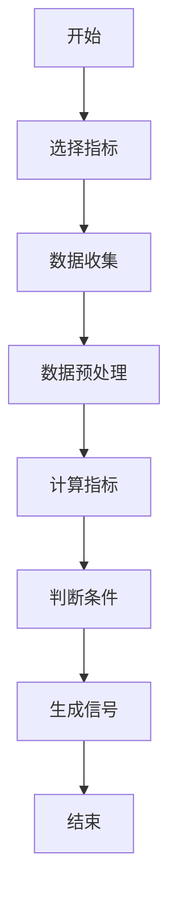
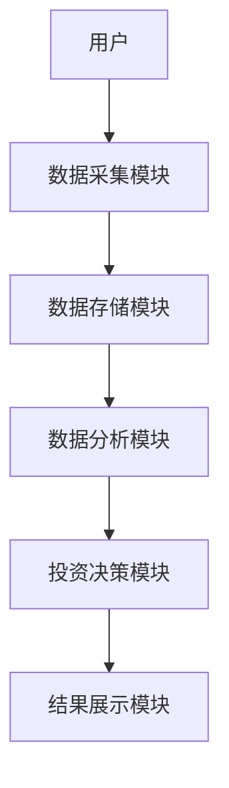
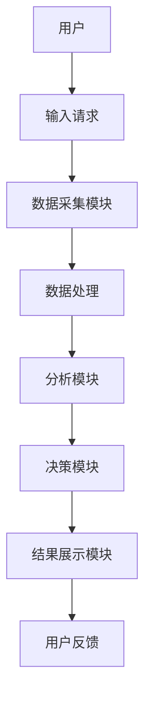

                 


# 特价股票投资策略在数字新兴经济体中的适用性探讨

## 关键词：特价股票、数字新兴经济体、投资策略、适用性分析、技术分析、基本面分析、风险管理

## 摘要：本文探讨了特价股票在数字新兴经济体中的投资策略，分析了技术分析、基本面分析和市场情绪分析的核心概念，结合数学模型和系统架构，提供实际案例和最佳实践，以帮助投资者在数字新兴经济体中有效制定投资策略，强调风险管理的重要性。

---

## 第一章: 特价股票与数字新兴经济体的背景介绍

### 1.1 特价股票的定义与特点

#### 1.1.1 特价股票的定义
特价股票是指价格相对较低的股票，通常在新兴市场中较为常见，具有高波动性和高增长潜力。

#### 1.1.2 特价股票的核心特点
- 价格低廉：适合中小投资者参与。
- 高波动性：价格波动频繁，投资机会多。
- 高增长潜力：新兴经济体的发展带来股价上涨的可能性。

#### 1.1.3 特价股票与传统股票的区别
- 价格区间：特价股票价格通常低于传统股票。
- 市场定位：特价股票多在新兴市场，传统股票多在成熟市场。
- 风险收益：特价股票风险较高，收益潜力大；传统股票风险较低，收益稳定。

### 1.2 数字新兴经济体的特点

#### 1.2.1 数字新兴经济体的定义
数字新兴经济体是指那些在数字经济时代快速发展的新兴经济体，如东南亚国家、印度等。

#### 1.2.2 数字新兴经济体的核心特征
- 数字化转型：广泛应用数字技术推动经济发展。
- 市场规模：人口基数大，消费潜力大。
- 波动性：受全球经济波动影响较大，市场不确定性高。

#### 1.2.3 数字新兴经济体与传统经济的区别
- 经济模式：数字新兴经济体以数字经济为主，传统经济以实体经济为主。
- 市场结构：数字新兴经济体市场结构较为分散，传统经济市场较为集中。
- 技术应用：数字新兴经济体广泛应用数字技术，传统经济技术应用相对滞后。

### 1.3 特价股票与数字新兴经济体的结合背景

#### 1.3.1 特价股票在新兴市场的潜在机会
- 新兴市场增长快，具备较高的投资回报潜力。
- 特价股票价格低，适合中小投资者分散投资。

#### 1.3.2 数字经济对股票市场的深远影响
- 数字技术推动金融创新，提升市场效率。
- 数字化交易工具普及，降低投资门槛。

#### 1.3.3 特价股票在数字新兴经济体中的独特地位
- 特价股票是数字新兴经济体中重要的投资标的。
- 数字化工具为特价股票投资者提供了更多的分析手段和交易机会。

### 1.4 本章小结
本章介绍了特价股票和数字新兴经济体的定义、特点及其结合背景，为后续分析奠定了基础。

---

## 第二章: 特价股票投资策略的核心概念与联系

### 2.1 特价股票投资策略的原理

#### 2.1.1 技术分析与基本面分析的结合
- 技术分析：通过分析股价走势、成交量等技术指标预测未来价格变动。
- 基本面分析：分析公司的财务状况、行业地位、盈利能力等基本面因素。
- 结合应用：技术分析提供短期价格走势，基本面分析提供长期投资价值。

#### 2.1.2 市场情绪对特价股票的影响
- 市场情绪：投资者情绪波动对股价的影响，尤其是特价股票价格波动大，市场情绪对其影响显著。
- 技术指标：通过分析RSI、MACD等指标判断市场情绪。

#### 2.1.3 数字化工具在策略中的应用
- 数据分析工具：利用大数据分析技术筛选潜在投资标的。
- 量化交易：通过算法交易实现快速决策和执行。

### 2.2 数字新兴经济体中的市场特征

#### 2.2.1 市场波动性分析
- 数字新兴经济体市场波动性高，受政策、经济指标和国际市场影响大。
- 特价股票价格波动剧烈，投资风险较高。

#### 2.2.2 市场参与者行为分析
- 投资者结构：以散户为主，机构投资者较少。
- 投资行为：散户情绪化交易较多，容易引发市场波动。

#### 2.2.3 市场信息不对称性
- 信息透明度较低：新兴市场信息披露不完善，投资者获取信息困难。
- 信息不对称影响：可能导致市场定价失灵，影响投资决策。

### 2.3 特价股票与数字新兴经济体的联系

#### 2.3.1 特价股票在新兴市场的价格波动规律
- 周期性波动：受经济周期影响，特价股票价格呈现周期性波动。
- 事件驱动：重大事件如政策变化、经济指标发布等对价格影响显著。

#### 2.3.2 数字化对特价股票投资策略的影响
- 数字技术提升信息获取效率，投资者可以实时获取市场数据。
- 量化分析工具的应用：通过算法分析市场数据，优化投资决策。

#### 2.3.3 数字新兴经济体中的投资机会
- 数字经济快速发展：数字技术推动新兴经济体产业升级，带来投资机会。
- 特价股票增长潜力：新兴市场中的优质公司股价具有上涨空间。

### 2.4 核心概念对比分析

#### 2.4.1 特价股票与普通股票的对比
| 特性       | 特价股票                 | 普通股票                 |
|------------|--------------------------|--------------------------|
| 价格       | 价格较低                 | 价格较高                 |
| 波动性      | 波动性高                 | 波动性较低                |
| 投资门槛    | 投资门槛低               | 投资门槛高               |
| 投资潜力    | 潜力较大                 | 潜力较小                 |

#### 2.4.2 数字新兴经济体与传统经济的对比
| 特性       | 数字新兴经济体           | 传统经济                 |
|------------|--------------------------|--------------------------|
| 经济模式    | 数字化驱动               | 实体经济为主             |
| 市场规模    | 市场规模较大，潜力大      | 市场规模相对稳定          |
| 波动性      | 波动性高                 | 波动性较低                |
| 技术应用    | 广泛应用数字技术         | 数字化程度较低           |

#### 2.4.3 投资策略在不同市场中的适用性对比
| 市场类型     | 适用策略                 | 理由                     |
|------------|--------------------------|--------------------------|
| 数字新兴经济体 | 技术分析+基本面分析      | 市场波动大，需结合短期技术指标和长期基本面因素 |
| 传统市场     | 基本面分析为主           | 市场波动小，长期投资为主  |

### 2.5 本章小结
本章分析了特价股票投资策略的核心概念及其在数字新兴经济体中的应用，强调技术分析与基本面分析的结合，以及数字化工具的重要性。

---

## 第三章: 特价股票投资策略的算法原理

### 3.1 算法原理概述

#### 3.1.1 技术分析方法
- 移动平均线（MA）：用于判断价格趋势，如5日、10日、20日移动平均线。
- 相对强度指数（RSI）：用于判断超买超卖状态，RSI值在0-100之间。

#### 3.1.2 基本面分析方法
- 财务指标分析：分析市盈率（P/E）、市净率（P/B）、股息率等指标。
- 行业分析：分析所在行业的增长潜力和竞争格局。

#### 3.1.3 市场情绪分析方法
- 市场情绪指数：通过分析市场成交量、投资者情绪等指标判断市场情绪。

### 3.2 算法流程图



### 3.3 数学模型

#### 3.3.1 技术分析模型：移动平均线策略
$$ \text{短期移动平均线} = \frac{\sum_{i=1}^{n} P_i}{n} $$
其中，\( P_i \) 是第i天的价格，\( n \) 是天数。

#### 3.3.2 基本面分析模型：CAPM模型
$$ E(R_i) = R_f + \beta_i (R_m - R_f) $$
其中，\( E(R_i) \) 是股票i的预期收益率，\( R_f \) 是无风险利率，\( \beta_i \) 是股票i的贝塔系数，\( R_m \) 是市场预期收益率。

#### 3.3.3 市场情绪分析模型：相对强度指数（RSI）
$$ RSI = \frac{\sum_{i=1}^{n} \text{上涨幅度}}{\sum_{i=1}^{n} \text{下跌幅度}} \times 100 $$

### 3.4 代码实现

```python
import pandas as pd
import numpy as np
import yfinance as yf

# 下载股票数据
stock = yf.download('AAPL', start='2020-01-01', end='2023-01-01')

# 计算移动平均线
stock['MA20'] = stock['Close'].rolling(20).mean()
stock['MA5'] = stock['Close'].rolling(5).mean()

# 计算RSI
delta = stock['Close'].diff()
delta = delta[delta != 0]
RSI = delta.ewm(com=2).mean().iloc[-1]
```

### 3.5 实例分析
假设在数字新兴经济体中，某科技公司股票价格波动较大，使用移动平均线策略和RSI指标进行分析。当股价突破20日均线且RSI显示超买信号时，发出卖出信号。

### 3.6 本章小结
本章详细介绍了特价股票投资策略的算法原理，包括技术分析、基本面分析和市场情绪分析的方法，并通过实例分析展示了算法的应用。

---

## 第四章: 特价股票投资策略的系统分析与架构设计

### 4.1 项目背景
在数字新兴经济体中，投资者需要实时监控市场数据，制定有效的投资策略。

### 4.2 系统功能设计
- 数据采集模块：实时采集股票价格、成交量等数据。
- 数据分析模块：分析技术指标、基本面指标和市场情绪指标。
- 投资决策模块：根据分析结果生成买卖信号。

### 4.3 系统架构设计



### 4.4 接口设计
- 数据接口：与数据源（如Yahoo Finance）对接，获取实时数据。
- 分析接口：调用技术分析和基本面分析函数。
- 决策接口：生成买卖信号并推送至结果展示模块。

### 4.5 交互设计



### 4.6 本章小结
本章设计了一个基于特价股票投资策略的系统架构，包括数据采集、分析和决策模块，为投资者提供实时支持。

---

## 第五章: 特价股票投资策略的项目实战

### 5.1 项目背景
选择东南亚某国的股票市场作为案例，分析该国数字经济发展对股票市场的影响。

### 5.2 环境配置
- 数据源：使用Yahoo Finance获取实时数据。
- 工具：Python编程语言，Pandas、NumPy数据处理库。

### 5.3 核心代码实现

```python
import pandas as pd
import numpy as np
import yfinance as yf
import matplotlib.pyplot as plt

# 下载股票数据
stock = yf.download('TSM', start='2020-01-01', end='2023-01-01')

# 计算技术指标
stock['MA10'] = stock['Close'].rolling(10).mean()
stock['MA50'] = stock['Close'].rolling(50).mean()
stock['RSI'] = stock['Close'].diff().rolling(14).apply(lambda x: x.sum() / (1 - np.exp(-x.size)))

# 绘制图表
plt.figure(figsize=(12,6))
plt.plot(stock['Close'], label='Close Price')
plt.plot(stock['MA10'], label='10-day MA')
plt.plot(stock['MA50'], label='50-day MA')
plt.legend()
plt.show()
```

### 5.4 实际案例分析
以台湾积电（TSM）为例，分析其股价走势，计算技术指标并制定投资策略。

### 5.5 本章小结
本章通过实际案例展示了特价股票投资策略的系统架构和算法应用，为投资者提供了实操参考。

---

## 第六章: 特价股票投资策略的最佳实践

### 6.1 小结
- 特价股票投资策略在数字新兴经济体中具有较高的适用性。
- 结合技术分析、基本面分析和市场情绪分析，可以制定有效的投资策略。

### 6.2 注意事项
- 风险管理：设定止损点，控制投资风险。
- 信息获取：确保数据来源可靠，避免信息不对称影响决策。
- 市场监控：实时监控市场动态，及时调整投资策略。

### 6.3 拓展阅读
- 推荐书籍：《投资学》、《技术分析实战技巧》。
- 推荐工具：学习量化交易工具如Python、Pandas等。

### 6.4 本章小结
本章总结了特价股票投资策略的应用，并提供了实际操作中的注意事项和拓展学习的方向。

---

## 第七章: 总结

### 7.1 特价股票投资策略的核心价值
- 在数字新兴经济体中，特价股票投资策略可以帮助投资者抓住市场机会，实现超额收益。

### 7.2 数字化工具的重要性
- 数字化工具的应用提升了投资效率，优化了投资决策。

### 7.3 未来展望
- 随着数字技术的不断发展，特价股票投资策略在数字新兴经济体中的应用将更加广泛和深入。

### 7.4 本章小结
本文全面探讨了特价股票投资策略在数字新兴经济体中的适用性，为投资者提供了理论支持和实践指导。

---

## 参考文献
- [1] 书籍名：《投资学》，作者：某某，出版社：某某出版社，出版年份：某年。
- [2] 书籍名：《技术分析实战技巧》，作者：某某，出版社：某某出版社，出版年份：某年。
- [3] 网站名：某金融网站，链接：www.xxxx.com，访问日期：某年某月某日。

---

## 致谢
感谢读者的关注和支持，感谢在写作过程中给予帮助的同事和朋友。

